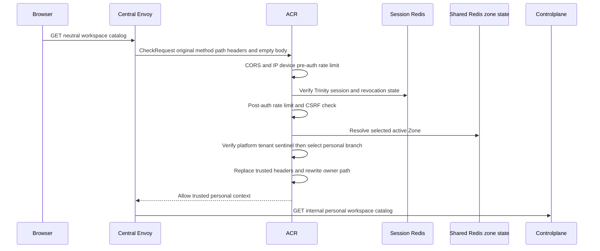
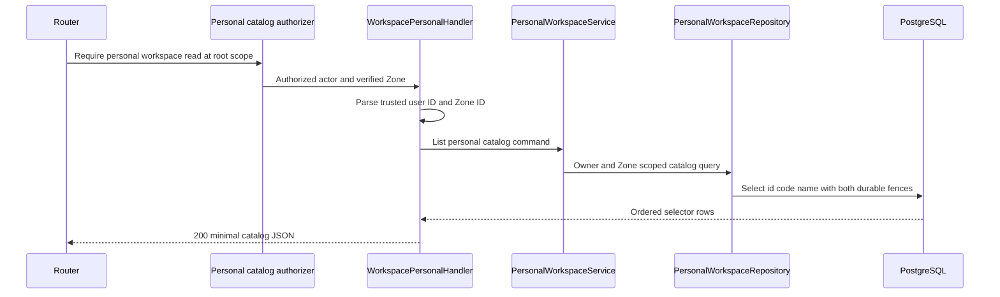

# Personal Workspace Catalog — God View

This workflow supplies the small workspace selector for a personal context.
It returns only workspaces owned by the actor in the currently verified Zone;
it is not the full personal management list.

## API and authority contract

| Item | Contract |
|---|---|
| Browser API | `GET /api/v1/hierarchy/workspaces/catalog` |
| Internal target | `GET /api/v1/personal/hierarchy/workspaces/catalog` |
| Authority | personal `hierarchy:workspace:read` at level `*` |
| Request payload | none |
| Durable read | `hierarchy.personal_workspaces`, fenced by verified owner and Zone |
| Result | minimal `id`, `code`, and `name` selector rows |

The selected Zone is security context, not a browser query parameter. The
browser always calls the neutral route; personal path selection is an ACR-only
rewrite after verified session and personal-context resolution.

## Key contracts

| Record / key | Owner | Rule |
|---|---|---|
| `hierarchy.personal_workspaces` | PostgreSQL | catalog filters `owner_id` and `zone_id` together |
| `user_role:{user_id}` | IAM cache loader | rebuildable personal permission projection; never browser input |
| `zone_code` session context | ACR / Shared Redis | selected Zone must be resolved and injected by ACR |

## Phase 1 — Client → Envoy → ACR



### Client input

| Payload | Value |
|---|---|
| Body | none |

| Header / cookie | Use |
|---|---|
| Trinity cookies | provide JWT, access key, and access secret for ACR session verification |
| `Cookie: zone_code` | Zone proposal verified by ACR; no `zone_id` request field exists |
| `x-csrf-token` | processed by ACR request protection; no critical proof applies |

### ACR processing and upstream headers

| Step | Behavior |
|---|---|
| Envoy input | original neutral path, authority, request headers, and empty body enter `CheckRequest`. |
| Verification order | CORS → pre-auth IP/device limit → Trinity plus Session Redis → post-auth user/device limit → CSRF → Zone resolution → tenant-context equality. |
| Owner selection | verified `platform` sentinel rewrites this request to personal; a concrete verified Tenant uses the tenant catalog workflow instead. |
| Remove / overwrite | remove proof headers and markers; overwrite identity, tenant, Zone, device, session-proof marker, and original-path headers before the upstream forward. |
| Path | set `x-original-path: /api/v1/hierarchy/workspaces/catalog` and replace `:path` with `/api/v1/personal/hierarchy/workspaces/catalog`. |
| Local failure | no upstream request is made for a CORS, rate, session, CSRF, Zone, or owner-context denial. |

| Forwarded trusted header | Meaning |
|---|---|
| `x-user-id` | sole personal owner selector |
| `x-tenant-id: platform` | verified personal branch marker |
| `x-zone-id` | sole Zone selector |
| `x-user-name`, `x-user-level`, `x-client-device-id` | verified actor context for authorization, audit, and rate attribution |
| `x-session-proof-verified: false`, `x-original-path` | non-critical marker and neutral-route audit value |

## Phase 2 — Controlplane selector read



### REST output

| Payload field | Source |
|---|---|
| `data[].id`, `code`, `name` | personal workspace row filtered by owner and Zone |
| message | `workspace catalog success` |

| Response header | Use |
|---|---|
| standard response headers only | no workflow-specific response header is emitted |

The controlplane still returns `200` with an empty `data` array when the durable
catalog is empty. That response is not a valid authenticated Console context:
account activation guarantees at least one workspace per active Zone. The
Console therefore does not mount any owner workflow for an empty catalog (or a
missing `workspace_id`); it performs a best-effort session logout, clears the
workspace cookie and client session, then returns to sign-in. This terminates
the invalid-context retry loop instead of repeatedly sending owner requests
that can only receive `403 missing workspace context`.

Missing or malformed trusted actor/Zone context fails before the query;
authorization failure is `403`; database or unexpected service failure is
`500`, and remains retryable without forced logout. This read has no outbox,
job, or retry settlement phase because PostgreSQL is the only durable owner.

## Invalid-context recovery (Console boundary)

```mermaid
sequenceDiagram
    participant CP as Controlplane
    participant B as Browser Console
    participant A as ACR
    participant S as Session service

    CP-->>B: 200 catalog with data=[]
    B->>B: Keep owner shell closed; do not mount owner queries
    B->>A: POST /api/v1/auth/logout (best effort)
    A->>S: Revoke runtime session and refresh token
    S-->>A: Logout result (success or already expired)
    A-->>B: Logout response
    B->>B: Clear workspace_id, session cache, and redirect /signin
```

When the catalog request itself fails, the Console shows a retry boundary and
does not log out; the failure may be transient. When `zone_code` is absent
before catalog initialization, the same logout/clear-session path runs locally
without issuing the personal catalog request.

## Current implementation discrepancies

1. This personal route currently has no `middleware.Authorize`, so the required
   `hierarchy:workspace:read` personal permission/level check is missing.
2. If this route is attached to the generic authorizer, its active workspace
   only composes the five-level key; the nil-UUID grant normalized to `*`
   intentionally authorizes the catalog from any active workspace.
