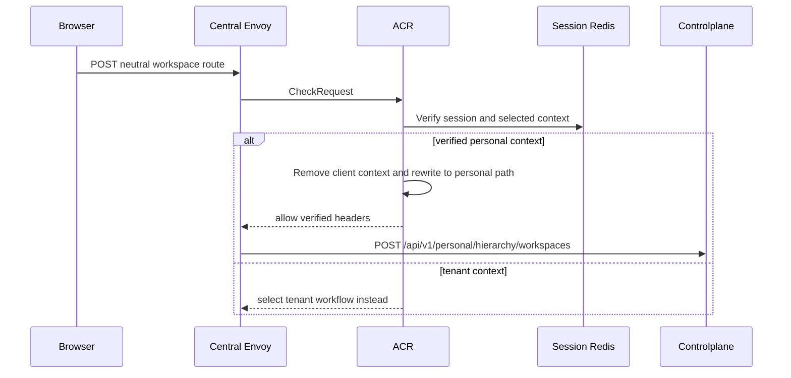
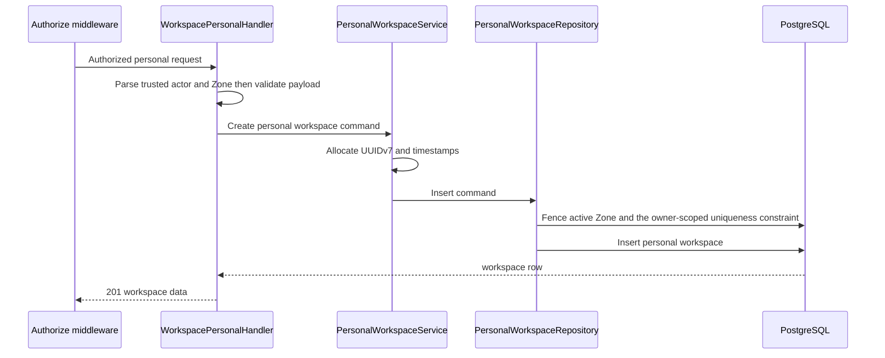

# Personal Workspace Create — God View

This is the personal branch of workspace creation. It never reads a Tenant
membership and never creates a Tenant-owned workspace.

## API and authority contract

| Item | Contract |
|---|---|
| Browser API | `POST /api/v1/critical/hierarchy/workspaces` |
| Internal target | `POST /api/v1/personal/critical/hierarchy/workspaces` |
| Authority | personal `hierarchy:workspace:create` at level `*` |
| Zone | selected verified Zone injected by ACR |
| Durable SoT | `hierarchy.personal_workspaces` |

Payload is `{name, code, description?}`. `owner_id`, `tenant_id`, and
`zone_id` in headers or payload never select authority; trusted values come
only from ACR. ACR consumes a session proof bound to the exact request before
the rewrite, and Controlplane runs `RequireSessionProof` before `Authorize`.

## Key contracts

| Record | Owner | Invariant |
|---|---|---|
| `hierarchy.personal_workspaces` | PostgreSQL | one direct user owner, no tenant column |
| `hierarchy.zones` | PostgreSQL | selected Zone must be active |
| `iam.user_role` | IAM | personal authorization source |

## Phase 1 — Client → Envoy → ACR

For this branch ACR overwrites identity and Zone headers, retains the personal
sentinel as the verified context, sets `x-original-path`, and forwards the JSON
body unchanged.

### ACR request, local state, and upstream mutation

| Boundary | Exact contract |
|---|---|
| Client headers and payload | `Content-Type: application/json`, Trinity/device cookies, and valid CSRF header; JSON only contains `name`, `code`, `description?`. Browser context headers cannot select owner or Zone. |
| Envoy `CheckRequest` | the original neutral method/path, authority, all headers, and raw body. |
| ACR local order | CORS allowlist → IP/device pre-auth limit → JWT plus access-key/access-secret and Redis session verification → user/device post-auth limit → CSRF → verified Zone and Tenant-context resolution. |
| Local state | Redis session/revocation state is authoritative at ACR; Shared Redis Zone resolution is rebuildable. Expired/revoked/unavailable session never falls back to client claims. |
| Remove / overwrite | remove client proof headers/markers; overwrite `x-user-id`, `x-user-name`, `x-user-level`, personal `x-tenant-id`, `x-zone-id`, `x-client-device-id`, and `x-original-path`. |
| Inject / forward | inject verified context plus `x-session-proof-verified: false`; set `x-original-path: /api/v1/hierarchy/workspaces`; replace `:path` with `/api/v1/personal/hierarchy/workspaces`; forward raw JSON unchanged. |
| Local response | CORS/rate/Trinity/CSRF/context rejection returns through Envoy without an upstream call. |

## Phase 2 — Controlplane create

No outbox or Zone runtime command is created by this workflow. A workspace is
logical hierarchy state; resource provisioning has its own workflow.

## Active-workspace authorization

The generic authorizer uses the active `x-workspace-id` only to compose the
five-level permission key. A workspace-create grant compiled with the nil UUID
is normalized to `*`, so it authorizes creation from any active workspace;
that selection is not the workspace being created. A missing active context
still fails closed, which is the session-context invariant.

ACR removes every browser `x-workspace-id` header and conditionally injects
only the value read from the `workspace_id` cookie.
