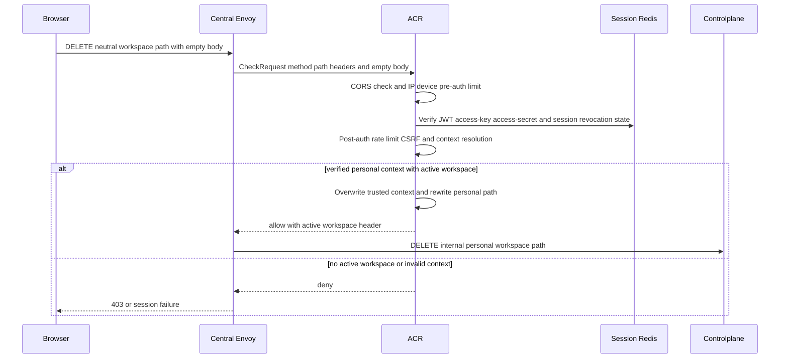
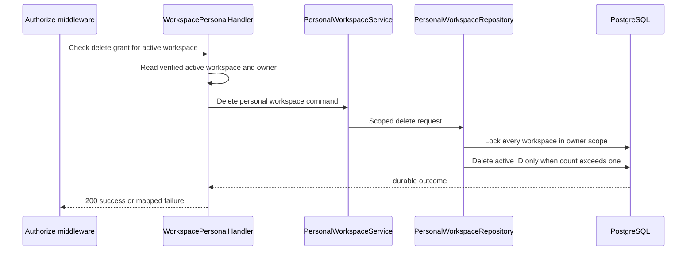
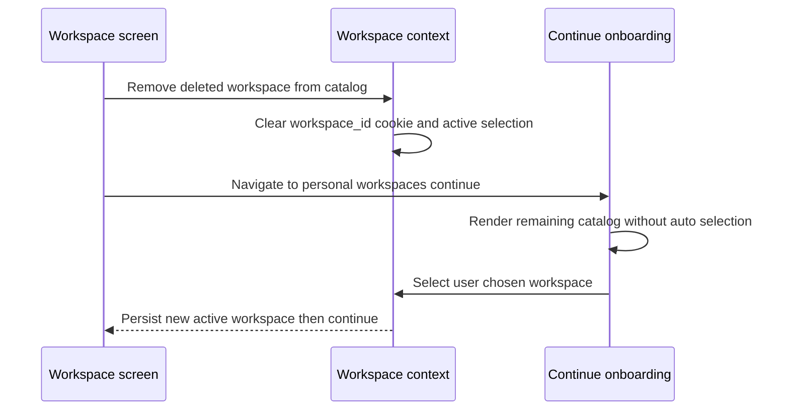

# Personal Workspace Delete — God View

This workflow deletes the workspace currently open in a personal context. The
browser cannot select an arbitrary workspace for deletion.

## API and authority contract

| Item | Contract |
|---|---|
| Browser API | `DELETE /api/v1/critical/hierarchy/workspaces` |
| Internal target | `DELETE /api/v1/personal/critical/hierarchy/workspaces` |
| Target | verified active `x-workspace-id` only |
| Authority | personal `hierarchy:workspace:delete` at level `*` |
| Durable action | hard delete from `hierarchy.personal_workspaces` scoped to verified owner |
| Guard | owner must retain at least one workspace |

The Console exposes Delete only on the workspace marked Current. After a
successful delete it clears active context and shows onboarding to choose where
to continue; it never auto-selects a replacement.

ACR consumes a session proof bound to the exact empty-body delete before the
owner rewrite, and Controlplane runs `RequireSessionProof` before `Authorize`.

## Key contracts

| Record / context | Rule |
|---|---|
| ACR `x-workspace-id` | context-bound resource target; missing value fails closed |
| `iam.user_role` | authorizer source for personal workspace delete |
| `hierarchy.personal_workspaces` | delete matches active workspace ID and verified owner ID |
| Console `workspace_id` cookie | cleared after successful delete; replacement is explicit UX state |

## Phase 1 — Client → Envoy → ACR

Envoy sends the original method, path, authority, headers, and empty body in
CheckRequest. ACR reads SessionManager Redis and applies CORS/rate/CSRF checks.
The required gateway contract is to remove client proof and trusted-context
headers, then overwrite `x-user-id`, `x-user-name`, `x-user-level`, personal
`x-tenant-id`, `x-zone-id`, `x-client-device-id`, and `x-workspace-id` from
verified session/cookie context; it injects `x-session-proof-verified: false`
and `x-original-path`, then replaces `:path` with the internal personal target.
ACR returns all failed checks locally and does not forward them to Controlplane.

## Phase 2 — Controlplane delete transaction

Missing target returns `403`; absent workspace returns `404`; final-workspace
guard returns `409`. The repository has no resource teardown behavior: a future
resource cleanup must be its own durable workflow before this contract changes.

## Gateway workspace-context boundary

ACR removes every browser `x-workspace-id` header, reads `workspace_id` from
the cookie, and injects that value only when it exists. The context injector
then fails closed if no trusted active workspace was injected before
authorization or deletion.

## Phase 3 — Console continuation onboarding

This phase is client-local and happens only after the durable delete response.
It cannot change the deletion result and is safe to repeat after a page reload.
