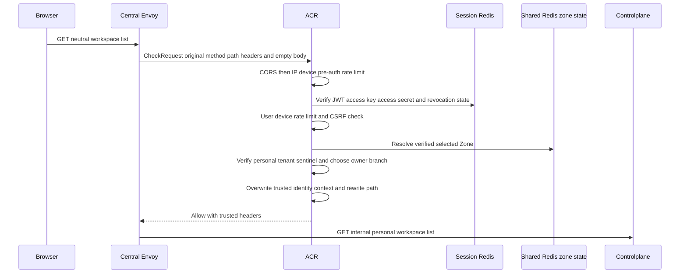
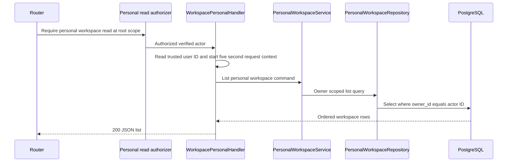

# Personal Workspace List — God View

This workflow renders the management list of workspaces owned directly by the
authenticated user. It is a personal platform workflow: a Tenant membership
does not participate in its authority or durable query.

## API and authority contract

| Item | Contract |
|---|---|
| Browser API | `GET /api/v1/hierarchy/workspaces` |
| Internal target | `GET /api/v1/personal/hierarchy/workspaces` |
| Authority | personal `hierarchy:workspace:read` at level `*` |
| Request payload | none |
| Durable read | all `hierarchy.personal_workspaces` scoped to verified owner |
| Result | `id`, `name`, `code`, `description`, and `created_at`; it is not Zone-filtered |

The neutral browser path never selects an owner. ACR verifies the personal
session context and rewrites the path; Controlplane must authorize the
personal capability before the repository applies the owner fence.

## Key contracts

| Record / key | Owner | Rule |
|---|---|---|
| `hierarchy.personal_workspaces` | PostgreSQL | every row returned has `owner_id =` verified `x-user-id` |
| `user_role:{user_id}` | IAM cache loader | rebuildable projection of the personal `workspace:read` capability |
| session record | ACR Session Redis | session and revocation state are authoritative; browser claims are insufficient |

## Phase 1 — Client → Envoy → ACR

### Client input

| Payload | Value |
|---|---|
| Body | none |

| Header / cookie | Use |
|---|---|
| Trinity cookies | carry JWT, access key, and access secret to session verification |
| `Cookie: zone_code` | proposes Zone only; ACR verifies it before using it |
| `x-csrf-token` | mutation protection mechanism; no proof is consumed for this GET |

### ACR processing and upstream headers

| Step | Behavior |
|---|---|
| Envoy input | `CheckRequest` carries original method, neutral path, authority, all headers, and empty body. |
| Verification order | CORS allowlist → IP/device pre-auth limit → JWT/access-key/access-secret plus Session Redis → user/device post-auth limit → CSRF → Zone resolution → Tenant-context equality check. |
| Owner selection | only verified Tenant sentinel `platform` selects this personal workflow; a concrete verified Tenant selects the distinct tenant list workflow. |
| State | Session Redis holds session/revocation truth; Shared Redis Zone state is rebuildable. ACR never falls back to client claims or a client scope header. |
| Remove / overwrite | remove proof headers and markers; overwrite `x-user-id`, `x-user-name`, `x-user-level`, `x-tenant-id`, `x-zone-id`, `x-client-device-id`, `x-session-proof-verified`, and `x-original-path`. |
| Path | replace `:path` with `/api/v1/personal/hierarchy/workspaces`; set `x-original-path: /api/v1/hierarchy/workspaces`. |
| Local failure | CORS, rate, session, CSRF, Zone, or context failure is returned through Envoy without a Controlplane request. |

| Forwarded trusted header | Meaning |
|---|---|
| `x-user-id`, `x-user-name`, `x-user-level` | authenticated personal actor |
| `x-tenant-id: platform` | verified personal owner branch |
| `x-zone-id`, `x-client-device-id` | verified session context; the list query does not use Zone |
| `x-session-proof-verified: false` | this is not a critical mutation |
| `x-original-path` | neutral public route for audit and tracing |

## Phase 2 — Controlplane scoped read

### REST output

| Payload field | Source |
|---|---|
| `data[].id`, `name`, `code`, `description`, `created_at` | personal workspace row |
| message | `list workspaces success` |

| Response header | Use |
|---|---|
| standard response headers only | no workflow-specific response header is emitted |

Authorization or cache failure must fail closed with `403`; missing/invalid
trusted context is rejected before the handler. PostgreSQL or unexpected
service failure is `500`. A successful empty result is `200`, not `404`.

## Current implementation discrepancies

1. The route currently has **no** `middleware.Authorize` for this personal
   owner API. It reads every workspace of the verified owner directly, so the
   required personal permission and level boundary is absent.
2. If this route is attached to the generic authorizer, its active workspace
   only composes the five-level key; the nil-UUID grant normalized to `*`
   intentionally authorizes the root list from any active workspace.
