# SRE Admin Create Zone - Workflow God View

> [!NOTE]
> Tài liệu này đóng vai trò là **Source of Truth (SoT) / God View** cho luồng Tạo Phân Vùng Hệ Thống (Create Infrastructure Zone) của SRE Admin.
> Mọi thay đổi về mã nguồn tại Admin UI (TypeScript), acr (Rust ext_authz), và Controlplane (Go route/handler) liên quan đến việc xác thực chữ ký Ed25519 và TOTP Step-Up trên tuyến đường này bắt buộc phải tuân thủ nghiêm ngặt đặc tả này.

---

## 🗺️ 1. Giới Thiệu & Kiến Trúc Tổng Quan

### ❓ Phân hệ SRE Admin Create Zone là gì?

Tạo mới một Phân vùng Hạ tầng (Infrastructure Zone) là một tác vụ vô cùng quan trọng (Critical Operation). Để bảo vệ hệ thống trước các nguy cơ tấn công chiếm quyền điều khiển hoặc giả mạo request, luồng này triển khai cơ chế bảo mật kép lớp sâu:

1. **Step-Up Multi-Factor Authentication (TOTP)**: Yêu cầu mã xác thực 6 chữ số từ thiết bị Authenticator của SRE Admin cho mỗi lần tạo mới.
2. **Edge Cryptographic Signature (Ed25519)**: Sử dụng cặp khóa thiết bị được lưu trữ trong IndexedDB của trình duyệt để ký số lên payload request, bảo vệ tính toàn vẹn dữ liệu (Integrity) và chống giả mạo (Anti-Tampering).
3. **Replay Attack Prevention**: Sử dụng Nonce một lần duy nhất được khóa bằng Redis SETNX (TTL 120s) kèm kiểm tra Clock Skew chặt chẽ trong vòng 120 giây.

### 🌐 Sơ đồ Điều Phối Request (Request Dispatching)

```mermaid
graph TD
    classDef client fill:#332244,stroke:#8844ff,stroke-width:2px;
    classDef gateway fill:#112233,stroke:#3388ff,stroke-width:2px;
    classDef edgeService fill:#113322,stroke:#33cc88,stroke-width:2px;
    classDef storage fill:#333311,stroke:#cccc33,stroke-width:2px;
    classDef backend fill:#221133,stroke:#aa44ff,stroke-width:2px;

    UI["💻 Admin UI / Client"]:::client
    Envoy["🛡️ Envoy Gateway (Edge Proxy)"]:::gateway
    acr["🛡️ acr Service (Rust - Edge Authz)"]:::edgeService
    Redis["⚡ Redis L2 (Sessions & Nonces)"]:::storage
    Vault["🔒 HashiCorp Vault (TOTP Engine)"]:::storage
    CP["🚀 Controlplane (Go Backend)"]:::backend
    DB["💾 PostgreSQL (SoT Database)"]:::storage

    UI -- "1. POST /admin/critical/core/zones (Headers + Body)" --> Envoy
    Envoy -- "2. check gRPC" --> acr
    acr -- "3. Verify Session & Get PubKey" --> Redis
    acr -- "4. Verify TOTP Step-Up" --> Vault
    acr -- "5. Replay Prevention (SETNX Nonce)" --> Redis
    acr -- "6. Verify Ed25519 Signature" --> acr
    acr -- "7. Authorization OK (gRPC status 0)" --> Envoy
    Envoy -- "8. Forward POST /admin/critical/core/zones" --> CP
    CP -- "9. Write Zone SoT" --> DB
    CP -- "10. HTTP 200/201" --> Envoy
    Envoy -- "11. HTTP Response success" --> UI
```



---

## 🏛️ 2. Mô Tả Chi Tiết Luồng Xử Lý

### 🔄 Trình Tự Thực Thi Đồng Bộ (Sequence Diagram)

```mermaid
sequenceDiagram
    autonumber
    participant UI as 💻 Admin UI
    participant Envoy as 🛡️ Envoy Gateway
    participant acr as 🛡️ acr Service (Rust)
    participant Redis as ⚡ Redis L2
    participant Vault as 🔒 Vault
    participant CP as 🚀 Controlplane (Go)

    Note over UI: User nhập Form & TOTP Code
    UI->>UI: Lấy Private Key từ IndexedDB
    UI->>UI: Tính SHA256(Body) & Tạo Nonce + Timestamp
    UI->>UI: Ký Ed25519 lên Canonical Payload:<br/>POST\n/admin/critical/core/zones\n\nBODY_HASH\nTS\nNONCE
    UI->>Envoy: POST /admin/critical/core/zones<br/>Cookie: access_token, access_key, access_secret<br/>X-Admin-Signature, X-Admin-Timestamp, X-Admin-Nonce, X-Admin-StepUp-Code
    
    Note over Envoy,acr: Envoy chuyển gRPC check sang acr
    Envoy->>acr: CheckRequest (Headers, Cookies, Body)

    Note over acr: acr nhận diện URL chứa "/critical/" -> Kích hoạt Critical Path
    
    rect rgb(20, 30, 40)
        Note over acr,Redis: 1. Kiểm tra Session & Xác thực Trinity Cookies (Song song với TOTP)
        acr->>Redis: Get Session: iam:admin_access_session:<access_key>
        Redis-->>acr: Session Data (Chứa device_public_key, ash)
        Note over acr: Đối chiếu hash(access_secret) với ash
    end

    rect rgb(20, 40, 30)
        Note over acr,Vault: 2. Xác thực mã TOTP Step-Up (Song song với Session check)
        acr->>Vault: Verify TOTP x-admin-stepup-code
        Vault-->>acr: Verify Result (Success/Failure)
    end

    alt Nếu Session hoặc TOTP kiểm tra thất bại
        acr-->>Envoy: Denied Response (HTTP 401 Unauthorized)
        Envoy-->>UI: HTTP 401 Unauthorized (Bypass session recovery)
    end

    rect rgb(40, 20, 20)
        Note over acr,Redis: 3. Chống tấn công lặp lại (Replay Prevention)
        Note over acr: Kiểm tra Clock Skew (cho phép sai lệch tối đa 120s)
        acr->>Redis: SETNX iam:nonce:<nonce> 1 EX 120
        Redis-->>acr: SETNX Result (Success/Failure)
    end

    alt Nếu Nonce đã được sử dụng hoặc Clock Skew quá lớn
        acr-->>Envoy: Denied Response (HTTP 401 Unauthorized - Replay attack)
        Envoy-->>UI: HTTP 401 Unauthorized
    end

    rect rgb(40, 30, 10)
        Note over acr: 4. Xác minh chữ ký Ed25519
        Note over acr: Tính toán SHA256(Raw Body) nhận từ Envoy
        Note over acr: Tái dựng Canonical Payload<br/>Verify chữ ký với device_public_key
    end

    alt Chữ ký không khớp hoặc bị thay đổi nội dung
        acr-->>Envoy: Denied Response (HTTP 401 Unauthorized - Invalid signature)
        Envoy-->>UI: HTTP 401 Unauthorized
    end

    Note over acr: 5. Xác thực thành công
    acr-->>Envoy: CheckResponse OK (Status Code 0)
    
    Note over Envoy,CP: Envoy chuyển tiếp request gốc đến Backend
    Envoy->>CP: POST /admin/critical/core/zones (Body)
    CP->>CP: Lưu trữ Zone mới vào CSDL PostgreSQL SoT
    CP-->>Envoy: HTTP 201 Created (JSON Response)
    Envoy-->>UI: HTTP 201 Created
```



---

## 🗃️ 3. Đặc Tả Dữ Liệu & Giao Thức (Specifications)

### 🔑 Định Dạng Canonical Payload Cho Chữ Ký Số

Để đảm bảo tính nhất quán giữa client trình duyệt và dịch vụ biên `acr`, payload dùng để ký và xác thực chữ ký Ed25519 được định nghĩa nghiêm ngặt theo định dạng canonical sau (phân tách bởi ký tự xuống dòng `\n`):

```
METHOD
PATH
QUERY
BODY_HASH_HEX
TIMESTAMP
NONCE
```

#### Chi tiết tham số:
* **METHOD**: Phương thức HTTP viết hoa (ở đây là `POST`).
* **PATH**: Đường dẫn đầy đủ không chứa query string (ví dụ: `/admin/critical/core/zones`).
* **QUERY**: Chuỗi query parameters thô của request. Nếu không có query, để trống nhưng vẫn giữ dòng (dòng thứ 3 trống).
* **BODY_HASH_HEX**: Mã băm SHA-256 dạng thập lục phân (hex) của chuỗi JSON Body thô của request.
* **TIMESTAMP**: Thời gian Unix (tính bằng giây) lúc gửi request. Dùng để đối chiếu giới hạn Clock Skew (120s).
* **NONCE**: Chuỗi định danh ngẫu nhiên (UUID hoặc tương tự) chỉ dùng một lần.

### 🛡️ Danh Sách HTTP Headers Bảo Mật Bắt Buộc

Request gửi từ Admin UI bắt buộc phải đi kèm các Header sau, nếu thiếu bất kỳ trường nào, `acr` sẽ từ chối request với mã trạng thái `HTTP 401`:

| Tên HTTP Header | Định Dạng | Mô Tả & Vai Trò |
| :--- | :--- | :--- |
| `X-Admin-Signature` | Base64 String | Chữ ký số Ed25519 (64 bytes) của canonical payload. |
| `X-Admin-Timestamp` | Unix Epoch Seconds | Thời gian gửi request từ phía client (Ví dụ: `1719517200`). |
| `X-Admin-Nonce` | UUID / String | Giá trị Nonce một lần duy nhất chống Replay attack. |
| `X-Admin-StepUp-Code` | 6-digit Numeric | Mã TOTP 2FA Step-Up từ thiết bị Authenticator. |

---

## 📂 4. Tham Chiếu Mã Nguồn & Định Tuyến (Code References)

* **Admin UI (Frontend)**:
  * [NewZone.tsx](file:///home/phucle/Desktop/New/admin-ui/src/pages/zone/NewZone.tsx): Thực hiện việc lấy Private Key từ IndexedDB, tạo mã băm body, tạo canonical payload, ký chữ ký số, và thực hiện cuộc gọi AJAX `Fetch('/admin/critical/core/zones')` kèm theo 4 header bảo mật.
* **acr Service (Rust Edge Gatekeeper)**:
  * [ext_authz.rs](file:///home/phucle/Desktop/New/acr/src/service/ext_authz.rs): Bộ lọc authz của Envoy, nhận diện request `/critical/` để kích hoạt kiểm tra OTP Step-Up song song với Trinity session, sau đó gọi dịch vụ kiểm tra chữ ký.
  * [signature.rs](file:///home/phucle/Desktop/New/acr/src/service/signature.rs): Thực thi kiểm tra Clock Skew, ghi khóa Nonce nguyên tử vào Redis L2, tính mã băm body nhận được và kiểm tra chữ ký Ed25519 bằng public key của phiên làm việc.
* **Controlplane (Go Backend Core)**:
  * [route.go](file:///home/phucle/Desktop/New/controlplane/internal/core/route.go): Định nghĩa route `/admin/critical/core/zones` trỏ trực tiếp tới hàm `CreateZone` của `ZoneHandler`.
  * [zone_handler.go](file:///home/phucle/Desktop/New/controlplane/internal/core/handler/zone_handler.go): Tiếp nhận request đã qua xác thực ở Gateway, thực hiện lưu trữ thông tin Zone vào Postgres.
