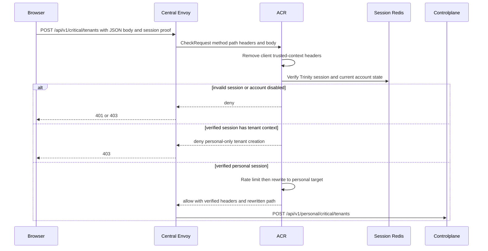
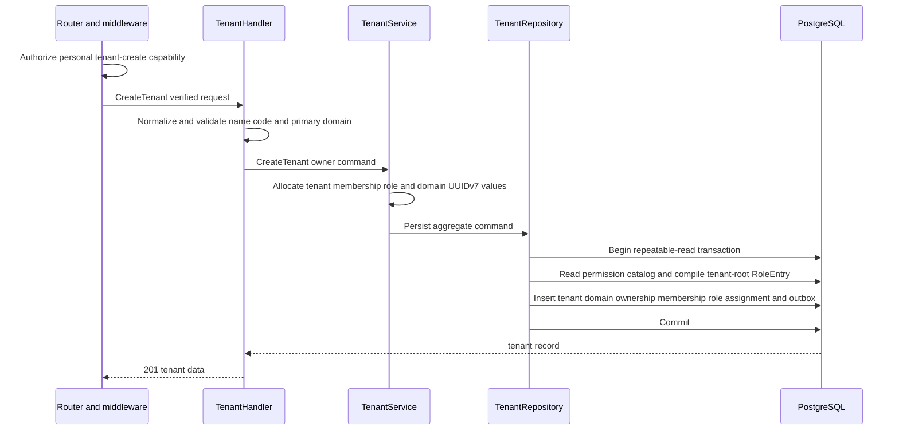
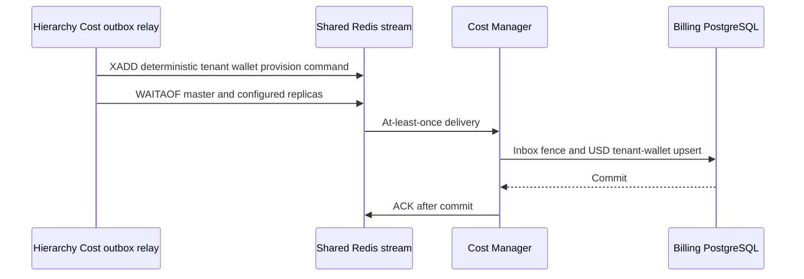

# Tenant Create — God View

This is the personal-platform workflow that creates one logical organization.
A Tenant has no Zone placement; its future workspaces select Zones separately.

## API and authority contract

| Item | Contract |
|---|---|
| Browser API | `POST /api/v1/critical/tenants` |
| Internal target | `POST /api/v1/personal/critical/tenants` only |
| Owner | authenticated personal user; a tenant session cannot create a sibling tenant |
| Authorization | personal `hierarchy:tenant:create` at the required level before the handler |
| Durable SoT | one Controlplane PostgreSQL transaction |
| Follow-up | transactional Hierarchy-to-Cost wallet-provision command; it never changes the successful HTTP result |

Browser must not call `/api/v1/personal/**`. ACR alone selects the owner branch,
rewrites the path, overwrites `:path`, and adds `x-original-path`.

### Client request

| Payload field | Rule |
|---|---|
| `name` | required, trimmed, 1–255 characters |
| `code` | required, lowercase; `^[a-z0-9][a-z0-9_-]{0,99}$` |
| `primary_domain` | required, lowercase, valid bounded DNS-style domain |

ACR consumes a one-time session proof bound to the exact method, path and raw
body before the owner rewrite; Controlplane runs `RequireSessionProof` before
authorization. Client-supplied
identity, tenant, Zone, workspace, permission, or ACR marker headers are not
trusted.

## Key contracts

| Key / record | Owner | Meaning |
|---|---|---|
| `hierarchy.tenants` | PostgreSQL | tenant aggregate; global `code` uniqueness |
| `hierarchy.tenant_domains` | PostgreSQL | exactly one primary domain created with the tenant |
| `hierarchy.tenant_memberships` | PostgreSQL | active ownership membership for creator |
| `iam.tenant_roles` + `iam.membership_role` | PostgreSQL | tenant-root role and compiled creator authority |
| `cost_outbox_records` | PostgreSQL | `billing.tenant_wallet.provision.requested.v1` recovery boundary owned by Hierarchy |

## Phase 1 — Client → Envoy → ACR

ACR removes or overwrites every client copy and forwards only these trusted
headers: `x-user-id`, `x-user-name`, `x-user-level`, `x-client-device-id`,
`x-zone-id`, `x-tenant-id` as the personal sentinel, and `x-original-path`.
The request body is forwarded unchanged.

### ACR request, local state, and upstream mutation

| Boundary | Exact contract |
|---|---|
| Client headers | `Content-Type: application/json`, `Cookie` carrying `access_token`, `access_key`, `access_secret`, and device cookie; unsafe cross-site mutation is rejected by CSRF validation. Bearer JWT is only a JWT source, not a replacement for the two opaque Trinity cookies. |
| Envoy `CheckRequest` | original `POST /api/v1/critical/tenants`, authority, all request headers, and raw JSON body are sent to ACR before any upstream route is chosen. |
| ACR local order | validate `Origin` against configured CORS allowlist; pre-auth IP/device rate-limit; verify JWT, access-key binding, Redis session record and access-secret hash; update last-seen/rotate cookies; post-auth user/device rate-limit; CSRF check; resolve verified Zone and Tenant session context. |
| Local state | session record is read through `SessionManager`; Zone resolution uses rebuildable Shared Redis state. A failed session store is not bypassed. |
| Denials | disallowed Origin, rate exhaustion, invalid/revoked Trinity session, CSRF failure, or a concrete selected Tenant returns locally through Envoy; Controlplane is not called. |
| Remove / overwrite | ACR removes proof markers and cryptographic proof headers; it overwrites client `x-user-id`, `x-user-name`, `x-user-level`, `x-tenant-id`, `x-zone-id`, `x-client-device-id`, and any `x-original-path`. |
| Inject / forward | after consuming the exact session proof, inject verified identity/context and `x-session-proof-verified: true`; set `x-original-path: /api/v1/critical/tenants`; replace `:path` with `/api/v1/personal/critical/tenants`; forward the original body only after allow. |

## Phase 2 — Controlplane transaction

The commit is all-or-nothing: no tenant may exist without its primary domain,
creator ownership membership, tenant-root role assignment, or its Cost outbox command.
Duplicate code/domain identity returns `409`; invalid input returns `400`; an
infrastructure or serialization failure returns `500`. After commit, the service
wakes the relay only as a latency hint.

## Phase 3 — Hierarchy Cost outbox relay

The request-owning pod sends a non-blocking local wake after commit. Every pod
also runs a startup drain staggered by 0–2 seconds, then a 30-second fallback
scan with 0–10-second jitter. `FOR UPDATE SKIP LOCKED` partitions claimed rows
across pods; a 30-second lease reclaims a row from a dead pod. The complete
`XADD` plus `WAITAOF` call is deadline-bounded below that lease. The relay
validates the envelope and immutable Protobuf command before publication and
marks the PostgreSQL outbox row `PUBLISHED` only after the Redis AOF durability
fence succeeds. The deterministic event ID, Cost inbox, and wallet uniqueness
converge replay; a relay or Cost failure leaves the outbox recoverable and
never rolls back the already-created tenant.
