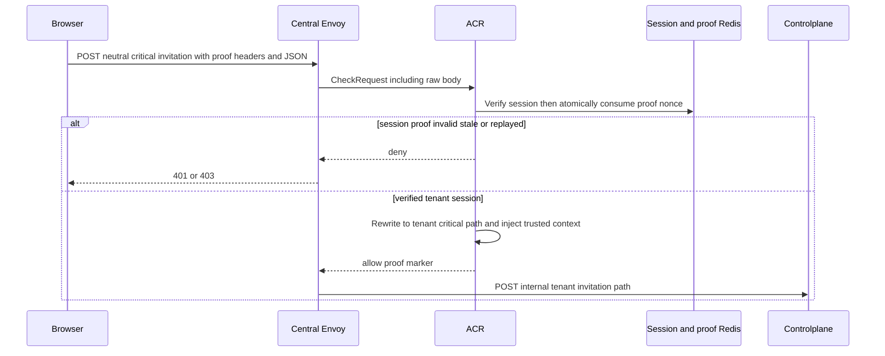
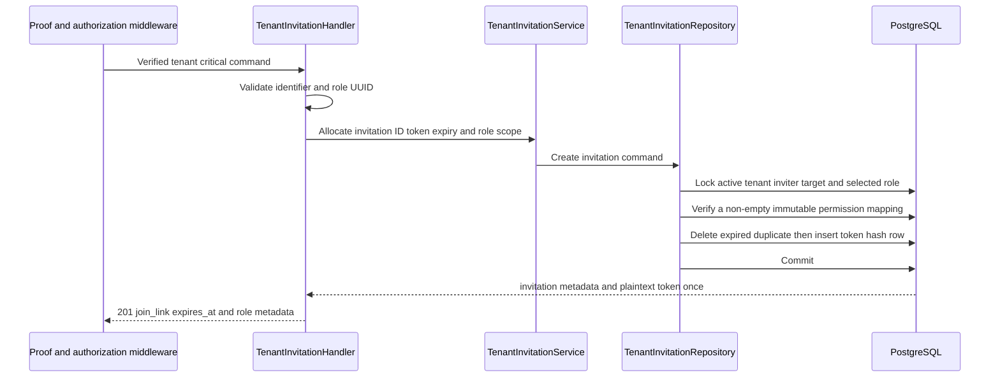

# Tenant Invitation Create — God View

This tenant-scoped critical workflow issues one bearer link bound to one
existing user and one pinned Tenant role. It does not send email.

## API and authority contract

| Item | Contract |
|---|---|
| Browser API | `POST /api/v1/critical/hierarchy/tenant-invitations` |
| Internal target | `POST /api/v1/tenant/critical/hierarchy/tenant-invitations` |
| Authority | tenant `hierarchy:tenant-invitation:create`, strictly stronger than selected role |
| Critical boundary | ACR session proof bound to exact method, public path, raw body, timestamp, and one-time challenge |
| Durable SoT | `iam.tenant_invitations` |

Payload is `{identifier, tenant_role_id}`. `identifier` is one active account's
canonical username or email; the role must belong to the current tenant.

## Key contracts

| Key / record | Meaning |
|---|---|
| `iam:session_proof:critical:{access_key}:{challenge_id}` | ACR one-time proof nonce, TTL 60 seconds |
| `iam.tenant_invitations.token_hash` | SHA-256 of a random 32-byte base64url token; plaintext never persists |
| `iam.tenant_invitations.tenant_role_revision_id` | immutable current revision selected while the role head is locked |
| `iam.tenant_role_revision_permissions` | sole immutable permission SoT for the pinned invitation revision |

The invitation row does not copy role name, level, version, or permissions;
preview, revoke and join derive all of them from the pinned immutable revision.

## Phase 1 — Client → Envoy → ACR

ACR removes client proof/context copies, injects verified `x-user-id`,
`x-tenant-id`, `x-user-level`, `x-zone-id`, `x-session-proof-verified: true`,
and challenge ID, then sets `x-original-path` and the internal `:path`.

### ACR request, proof, local state, and upstream mutation

| Boundary | Exact contract |
|---|---|
| Client headers | Trinity/device cookies, CSRF header, `Content-Type: application/json`, `x-session-proof-challenge-id`, `x-session-proof-timestamp`, and base64 Ed25519 `x-session-proof-signature`. |
| Client payload | `{ "identifier": "canonical username or email", "tenant_role_id": "UUID" }`; the signature covers the exact raw bytes, not a reserialized object. |
| Envoy `CheckRequest` | original public critical path, headers, and raw body reach ACR before rewrite. |
| ACR local order | CORS allowlist → pre-auth rate limit → full Trinity session/Redis check → post-auth rate limit → CSRF → verified Zone/Tenant resolution → load proof nonce → verify Ed25519 over `aurora.session-proof.v1` canonical bytes → atomic compare-and-delete nonce. |
| Proof state | challenge must have been obtained from ACR-local `POST /api/v1/auth/session-proof/challenge`; Redis key is `iam:session_proof:critical:{access_key}:{challenge_id}`, TTL 60 seconds. Stale, mismatched, or replayed proof never reaches Controlplane. |
| Remove / overwrite | remove the three proof inputs, any client `x-session-proof-verified`, and client identity/context/original-path headers; overwrite verified `x-user-id`, `x-user-name`, `x-user-level`, `x-tenant-id`, `x-zone-id`, and device ID. |
| Inject / forward | inject proof marker `true` and verified challenge ID; set `x-original-path` to the public critical path; replace `:path` with the tenant internal critical path; forward the exact raw JSON body. |
| Local response | CORS/rate/session/CSRF/proof/context failure is an ACR response via Envoy with no upstream forward. |

## Phase 2 — Controlplane transaction

The repository requires an active target, active tenant, active inviter,
create permission, strict numeric hierarchy, a non-empty revision, and no
existing active membership/invitation. Duplicate active invitation/member is
`409`; missing tenant, role, or target is `404`; an unauthorized or hierarchy
failure is `403`. The response is the only plaintext-token boundary.
