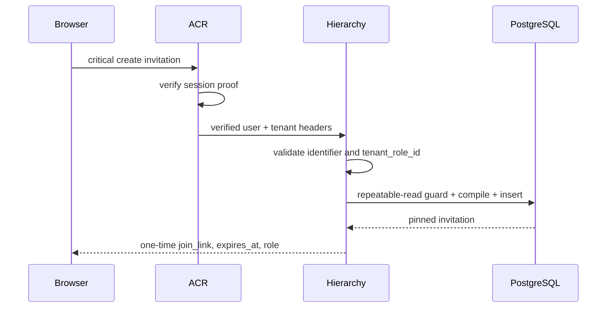
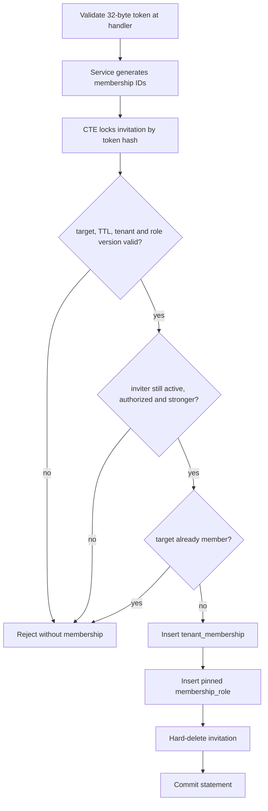

# Tenant Invitation and Join — God View

> Source of Truth cho việc mời một user hiện hữu vào tenant, preview link,
> revoke link và join tenant. Workflow này đi qua Hierarchy HTTP/service/repo,
> dùng IAM role tables và commit vào cùng Controlplane PostgreSQL.

## Contract

- Invite target là một account đã tồn tại, tra cứu bằng canonical username hoặc
  account identifier email.
- Link có TTL đúng 6 giờ.
- Token là 32 random bytes, encode base64url không padding.
- API chỉ trả plaintext token trong `join_link` của response create.
- PostgreSQL chỉ giữ SHA-256 token hash.
- Invitation pin đúng tenant role, role version, level và compiled five-level
  permission snapshot tại thời điểm mời.
- Người gửi link bằng kênh nào là trách nhiệm của họ; workflow không tự gửi mail.

## Routes

```text
POST   /api/v1/tenant/critical/hierarchy/tenant-invitations
DELETE /api/v1/tenant/critical/hierarchy/tenant-invitations/:invitation_id
GET    /api/v1/me/hierarchy/tenant-invitations/preview?token=...
POST   /api/v1/me/critical/hierarchy/tenant-invitations/join
```

Create và revoke cần tenant context, session proof và compiled tenant
permission. Join đặt `/me` trước `/critical` để ACR không rewrite self route,
nhưng ACR vẫn phải consume proof bound với exact method/path/body.

## Create



Repository verifies under one transaction:

1. tenant is active;
2. inviter membership is active;
3. inviter currently owns `hierarchy:tenant-invitation:create`;
4. target account is active and matches the chosen identifier type;
5. target is not inviter and is not already a member;
6. selected role belongs to this tenant;
7. inviter level is strictly stronger than selected role;
8. role permissions compile to non-empty five-level keys;
9. no unexpired invitation already exists for the same target/tenant.

Expired duplicate invitation may be hard-deleted inside the create CTE before
the replacement is inserted.

## Preview

Preview requires an authenticated user and only returns data when token hash
and `target_user_id` both match. It exposes tenant display data, inviter display
name, pinned role display data and expiry. It never returns token hash,
permission snapshot or another target's invitation.

## Revoke

Revoke is a critical tenant mutation. One CTE locks the invitation, verifies the
current actor permission and strict hierarchy, then hard-deletes the row.

## Join



Membership, role assignment and token consumption are one SQL statement. There
is no intermediate state where membership exists without role or token is
consumed without membership.

After commit, service invalidates local `membership_role:<user>:<tenant>` and
publishes best-effort fanout. Fanout failure is not returned to the client:
authority was durably added, so stale cache can only deny temporarily.

## Security and failure semantics

- Link is bearer authority but additionally bound to exactly one target user.
- Equal/higher target role is forbidden by numeric hierarchy.
- Role version drift invalidates the invitation.
- Revoked/suspended inviter invalidates the invitation.
- Suspended/deleted tenant invalidates the invitation.
- Successful consume hard-deletes the invitation.
- Concurrent consume is serialized by row lock and uniqueness constraints.
- Error responses stay generic; operation, actor, tenant and trace context live
  in telemetry rather than public error codes.
- Logs must never contain plaintext token, token hash or compiled permission
  bytes.
