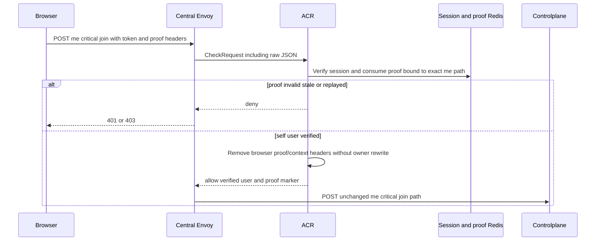
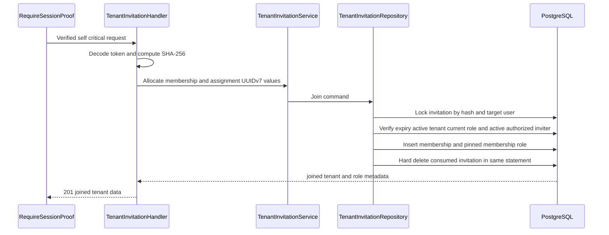
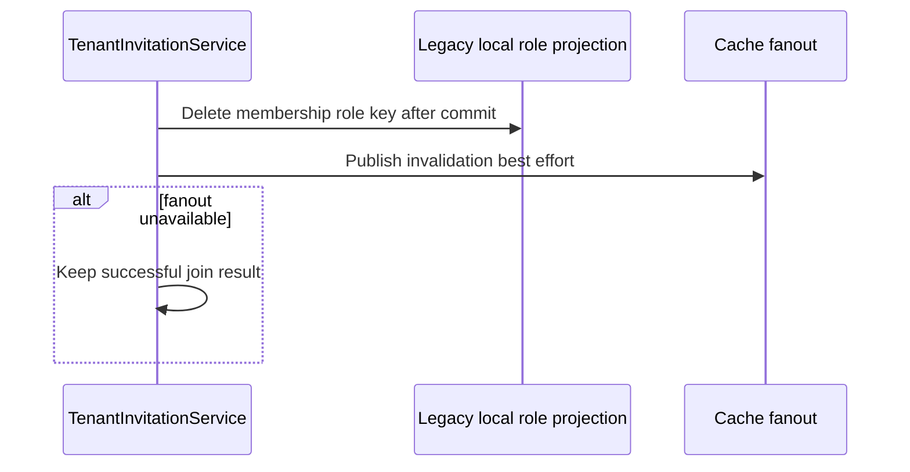

# Tenant Invitation Join — God View

This critical `/me` workflow consumes a link and adds the current user to its
Tenant. It never switches the user's active tenant; UI selection remains a
separate explicit workflow.

## API and authority contract

| Item | Contract |
|---|---|
| Browser API and upstream path | `POST /api/v1/me/critical/hierarchy/tenant-invitations/join` |
| Owner | current authenticated user, matching invitation target |
| ACR behavior | self path is not rewritten; session proof is still mandatory |
| Durable effect | membership, pinned role assignment, and invitation hard-delete form one SQL statement |

Payload is only `{token}` where token is exactly 32 decoded random bytes.

## Key contracts

| Key / record | Owner | Rule |
|---|---|---|
| `iam:session_proof:critical:{access_key}:{challenge_id}` | ACR | consumed once before Controlplane |
| `tenant_invitations.token_hash` | PostgreSQL | locks the one-time invitation |
| `tenant_memberships` | PostgreSQL | active non-owner membership created once |
| `iam.membership_role` | PostgreSQL | only the invitation's immutable revision ID is pinned; no copied role metadata or permission blob |
| `iam.tenant_role_revision_permissions` | PostgreSQL | immutable permission SoT compiled by every runtime authority read |

## Phase 1 — Client → Envoy → ACR

`/me` carries no selected tenant context, `x-original-path`, or owner path
rewrite. ACR injects only verified identity/session-proof headers required by
the handler and proof middleware.

### ACR request, proof, local state, and upstream mutation

| Boundary | Exact contract |
|---|---|
| Client headers and payload | Trinity/device cookies, CSRF header, three session-proof headers, and JSON `{ "token": "base64url-32-byte-token" }`. The signed bytes use the exact raw JSON body and the `/me/critical` path. |
| Envoy `CheckRequest` | original method, `/api/v1/me/critical/hierarchy/tenant-invitations/join`, headers, and raw body. |
| ACR local order | CORS allowlist → pre-auth IP/device rate limit → JWT/access-key/access-secret plus Redis session verification → post-auth user/device rate limit → CSRF → Zone/Tenant resolution → load proof nonce, Ed25519 verify, atomic nonce deletion. |
| Proof state | ACR-local challenge endpoint writes `iam:session_proof:critical:{access_key}:{challenge_id}` for 60 seconds. Signature binds the original self path, so a proof cannot be replayed as a tenant-owner request. |
| Remove / overwrite | remove all browser proof inputs/markers and client identity/context headers; overwrite verified `x-user-id`, `x-user-name`, `x-user-level`, `x-zone-id`, device ID, and proof fields. |
| Inject / forward | inject `x-session-proof-verified: true` and verified challenge ID. Keep `:path` exactly as `/api/v1/me/critical/hierarchy/tenant-invitations/join`; never add `x-original-path` or a selected-tenant authority header for this workflow. |
| Local response | CORS/rate/session/CSRF/proof rejection returns locally through Envoy; ACR has no success-body response and forwards only on success. |

## Phase 2 — Controlplane consume transaction

No intermediate state is valid: a membership cannot exist without its role and
the token cannot be consumed without the membership. Missing/expired/mismatched
links and invitations whose revision is no longer current return `404`;
already-member returns `409`; a now-invalid inviter or
role hierarchy returns `403`; concurrent settlement conflict returns `409`.

## Phase 3 — Local projection cleanup

Authority is already durable at Phase 2. The `membership_role` loader has zero
TTL and compiles the pinned revision from PostgreSQL on every authorization
read, so this fanout is rolling-upgrade cleanup and is not a security settlement
boundary. Missing fanout cannot preserve old tenant authority on updated pods.
