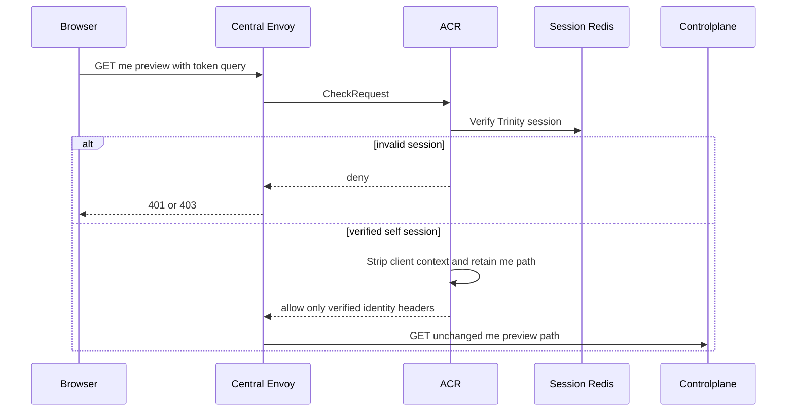
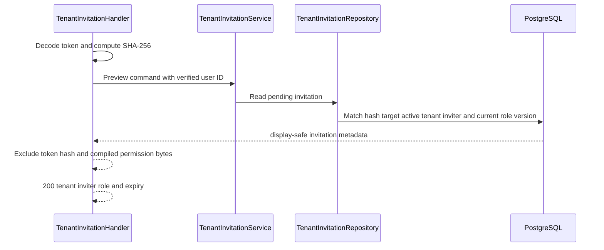

# Tenant Invitation Preview — God View

This `/me` read workflow lets only the invitation's target inspect a pending
link before deciding to join. It is self identity, not a tenant-context API.

## API and authority contract

| Item | Contract |
|---|---|
| Browser API and upstream path | `GET /api/v1/me/hierarchy/tenant-invitations/preview?token=...` |
| Owner | current authenticated user only |
| ACR behavior | verify session; no owner rewrite, no permission/level authorizer |
| Durable read | invitation hash plus target user binding in PostgreSQL |

The only query parameter is a 32-byte base64url-no-padding token. No headers
from the browser select a tenant, role, or target account.

## Key contracts

| Record | Rule |
|---|---|
| `tenant_invitations.token_hash` | SHA-256 comparison; plaintext is never logged or stored |
| `target_user_id` | must equal verified `x-user-id` |
| role version and tenant status | must still be active/current for preview |

## Phase 1 — Client → Envoy → ACR

ACR does not set `x-original-path` or rewrite `:path` for `/me`. It overwrites
the identity headers and the handler uses only verified `x-user-id` plus the
token query.

### ACR request, local state, and upstream mutation

| Boundary | Exact contract |
|---|---|
| Client input | `GET /api/v1/me/hierarchy/tenant-invitations/preview?token=...` with Trinity/device cookies. The token is query data; browser identity, Tenant, Zone, and role headers are untrusted. |
| Envoy `CheckRequest` | exact method/path including query, authority, and headers; no request payload. |
| ACR local order | CORS allowlist → pre-auth IP/device limit → JWT plus access-key/access-secret and Redis session verification → post-auth user/device limit → CSRF policy → Zone/Tenant session resolution. |
| Local state | session/revocation is read through SessionManager Redis; ACR does not resolve invitation data and does not create a local response on success. |
| Remove / overwrite | remove proof markers/headers and overwrite identity/context headers with the verified session values. |
| Inject / forward | inject verified `x-user-id`, `x-user-name`, `x-user-level`, `x-tenant-id`, `x-zone-id`, device ID, and `x-session-proof-verified: false`; retain the exact `/me` `:path` and query; do not inject `x-original-path`. |
| Local response | CORS/rate/session/CSRF failures return at ACR. Success forwards unchanged to Controlplane. |

## Phase 2 — Controlplane read

Missing, expired, target-mismatched, suspended-tenant, invalid-role, or
inactive-inviter records are all non-discoverable and return `404`.
