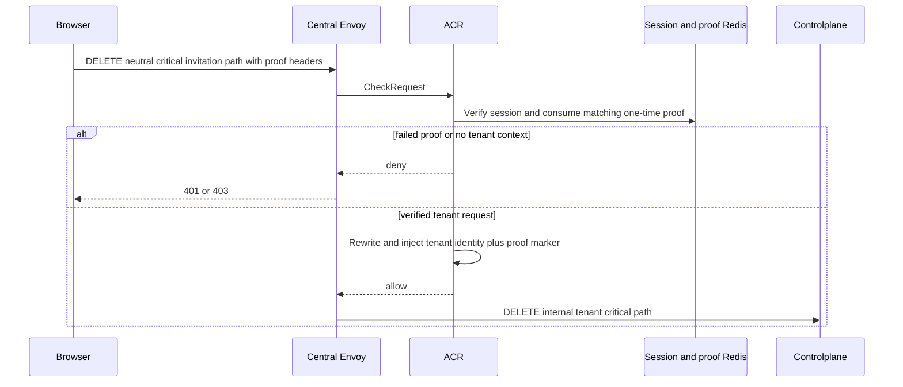
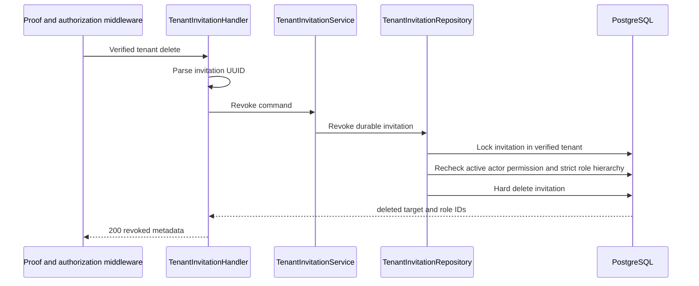

# Tenant Invitation Revoke — God View

This critical tenant workflow permanently removes one pending invitation. A
revoked link is cleanly unusable and no longer occupies the target's slot.

## API and authority contract

| Item | Contract |
|---|---|
| Browser API | `DELETE /api/v1/critical/hierarchy/tenant-invitations/{invitation_id}` |
| Internal target | `/api/v1/tenant/critical/hierarchy/tenant-invitations/{invitation_id}` |
| Authority | tenant `hierarchy:tenant-invitation:delete`, actor stronger than invited role |
| Critical boundary | ACR one-time session proof bound to the public DELETE path and empty body |
| Durable action | hard delete in PostgreSQL |

## Key contracts

| Record | Rule |
|---|---|
| `tenant_invitations.id` | invitation must belong to verified tenant |
| `tenant_memberships` + `membership_role` | durable actor status and hierarchy recheck |
| `tenant_role_permissions` | durable delete permission recheck |

## Phase 1 — Client → Envoy → ACR

ACR removes browser proof/context headers, injects the verified tenant/user
headers and `x-session-proof-verified: true`, adds `x-original-path`, and
overwrites `:path`.

### ACR request, proof, local state, and upstream mutation

| Boundary | Exact contract |
|---|---|
| Client headers | Trinity/device cookies, CSRF header, and `x-session-proof-challenge-id`, `x-session-proof-timestamp`, `x-session-proof-signature`. DELETE has an empty raw body. |
| Envoy `CheckRequest` | public DELETE path including invitation UUID, all headers, and the empty body. |
| ACR local order | CORS allowlist → pre-auth rate limit → Trinity Redis session verification → post-auth rate limit → CSRF → Zone/Tenant resolution → proof load, Ed25519 verification over the exact public DELETE path plus SHA-256 empty body, and atomic nonce consume. |
| Proof state | `iam:session_proof:critical:{access_key}:{challenge_id}` has a 60-second TTL and is deleted only after a valid signature; replay is denied at ACR. |
| Remove / overwrite | remove input proof headers/markers and every client trusted-context/original-path header; overwrite user, user level/name, tenant, Zone, and device headers. |
| Inject / forward | inject `x-session-proof-verified: true` and challenge ID; set public `x-original-path`; replace `:path` with the tenant internal DELETE path; upstream sees no signature or nonce. |
| Local response | all CORS/rate/session/CSRF/proof/tenant-context failure remains an ACR response through Envoy. |

## Phase 2 — Controlplane hard delete

Absent invitation returns `404`; insufficient permission/hierarchy returns
`403`; a concurrent state conflict returns `409`. There is no cache or
asynchronous follow-up because the invitation row is the sole authority.
