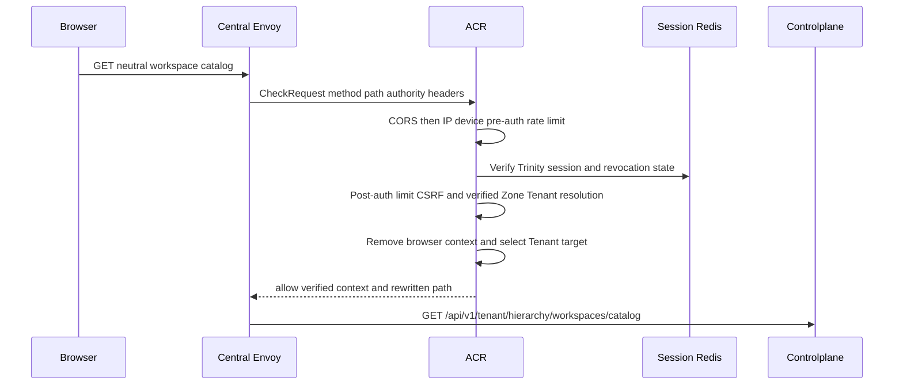
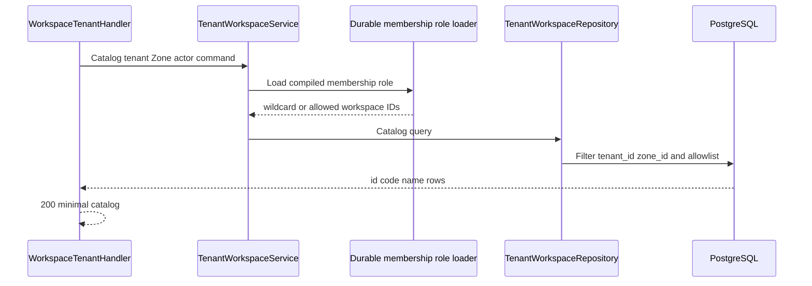

# Tenant Workspace Catalog — God View

This is the small, Zone-filtered workspace selector read used while composing
Tenant context. It intentionally returns only `id`, `code`, and `name`.

## API and authority contract

| Item | Contract |
|---|---|
| Browser API | `GET /api/v1/hierarchy/workspaces/catalog` |
| Internal target | `GET /api/v1/tenant/hierarchy/workspaces/catalog` |
| Scope | verified Tenant, verified selected Zone, verified current user |
| Authority source | service loads current membership RoleEntry and filters `workspace:read` grants |
| Durable read | `hierarchy.tenant_workspaces` |

This route is a bootstrap exception: router has no `Authorize` middleware, but
the service still loads the actor's membership-role projection and applies its
workspace allowlist before the repository query.

## Key contracts

| Record / key | Rule |
|---|---|
| verified `x-tenant-id` and `x-zone-id` | only ACR chooses Tenant and Zone scope |
| `membership_role:{user_id}:{tenant_id}` | zero-TTL loader compiles the pinned immutable revision or fails closed |
| `tenant_workspaces` | query filters both tenant and Zone, then wildcard/UUID allowlist |

## Phase 1 — Client → Envoy → ACR

ACR's CheckRequest has no payload. It reads SessionManager Redis plus
rebuildable Zone state, overwrites client identity/Tenant/Zone/device/original
path headers, injects verified `x-user-id`, `x-user-name`, `x-user-level`,
`x-tenant-id`, `x-zone-id`, `x-client-device-id`, and
`x-session-proof-verified: false`, sets `x-original-path`, and replaces `:path`.
CORS/rate/session/CSRF/context denial is local and has no upstream forward.

## Phase 2 — Controlplane catalog projection

The missing route middleware is deliberate only for the selector bootstrap
cycle; it does not authorize unfiltered access. If the membership-role loader
cannot read or compile, the implementation returns `500` today rather than
leaking rows. A later hardening change may normalize that fail-closed result to
`403`, but must not broaden the query.
