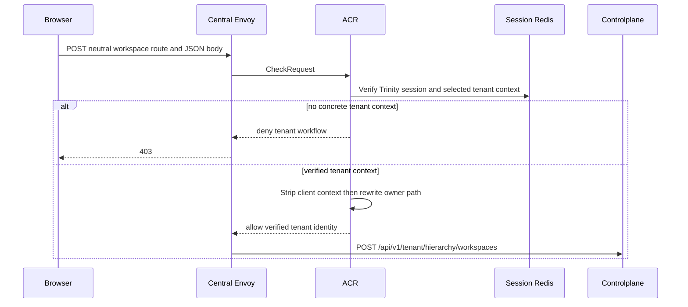
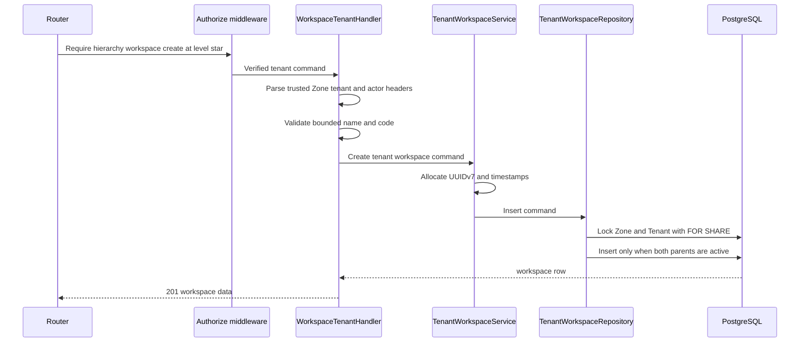

# Tenant Workspace Create — God View

This workflow creates a workspace owned by the currently selected Tenant. It
is distinct from personal workspace creation even though both use the same
neutral browser route.

## API and authority contract

| Item | Contract |
|---|---|
| Browser API | `POST /api/v1/hierarchy/workspaces` |
| Internal target | `POST /api/v1/tenant/hierarchy/workspaces` |
| Authority | current tenant membership with `hierarchy:workspace:create` at level `*` |
| Zone | ACR-verified selected Zone; browser cannot choose `x-zone-id` |
| Durable SoT | `hierarchy.tenant_workspaces` |

Payload contains `name`, `code`, and optional `description`. It never contains
`tenant_id`, `owner_id`, or `zone_id`.

## Key contracts

| Record | Owner | Invariant |
|---|---|---|
| `hierarchy.tenant_workspaces` | PostgreSQL | workspace belongs to one tenant and one Zone |
| `hierarchy.tenants` | PostgreSQL | parent must be `active` at insertion |
| `hierarchy.zones` | PostgreSQL | placement Zone must be `active` at insertion |
| `iam.membership_role` | IAM | authorizer source for the tenant capability |

## Phase 1 — Client → Envoy → ACR

ACR overwrites `x-user-id`, `x-user-name`, `x-user-level`, `x-tenant-id`,
`x-zone-id`, and `x-client-device-id`; it adds `x-original-path` and replaces
`:path`. These are the only context headers Controlplane consumes.

### ACR request, local state, and upstream mutation

| Boundary | Exact contract |
|---|---|
| Client headers and payload | `Content-Type: application/json`, Trinity cookies, device cookie, and CSRF header for mutation; JSON is only `name`, `code`, `description?`. Client `x-tenant-id`, `x-zone-id`, identity, workspace, and permission headers are ignored. |
| Envoy `CheckRequest` | original neutral method/path, authority, complete headers, and raw JSON body. |
| ACR local order | CORS allowlist → pre-auth IP/device rate-limit → JWT/access-key/access-secret/Redis session verification → post-auth user/device rate-limit → CSRF → verified Zone resolution → verified Tenant resolution. |
| Branch decision | only a concrete verified tenant session chooses this God View. Personal sentinel selects the different personal workflow; browser path never selects the branch. |
| Local state | session and revocation state are read through SessionManager Redis; Zone state is resolved from Shared Redis; no browser scope value is cached or trusted. |
| Remove / overwrite | remove client proof headers/markers; overwrite `x-user-id`, `x-user-name`, `x-user-level`, `x-tenant-id`, `x-zone-id`, `x-client-device-id`, and `x-original-path`. |
| Inject / forward | inject verified values, `x-session-proof-verified: false`, `x-original-path: /api/v1/hierarchy/workspaces`; replace `:path` with `/api/v1/tenant/hierarchy/workspaces`; forward unchanged JSON. |
| Local response | CORS/rate/session/CSRF/context failure is returned by ACR through Envoy; there is no Controlplane forward. |

## Phase 2 — Controlplane create

The repository's durable responsibility is parent-state fencing and scoped
uniqueness. Authorization is the route middleware's membership-role boundary.
Missing parent yields `404`; inactive parent or failed precondition yields
`409`; duplicate workspace code in the Tenant yields `409`; invalid handler
input yields `400`.

## Active-workspace authorization

The generic authorizer uses the active `x-workspace-id` to compose a five-level
Tenant permission key. A create grant compiled with the nil UUID is normalized
to `*`, so its authorization is independent of the previously active workspace;
the header does not identify the workspace being created. Missing active
context fails closed as a session-context invariant.

ACR removes every browser `x-workspace-id` header and conditionally injects
only the value read from the `workspace_id` cookie.
