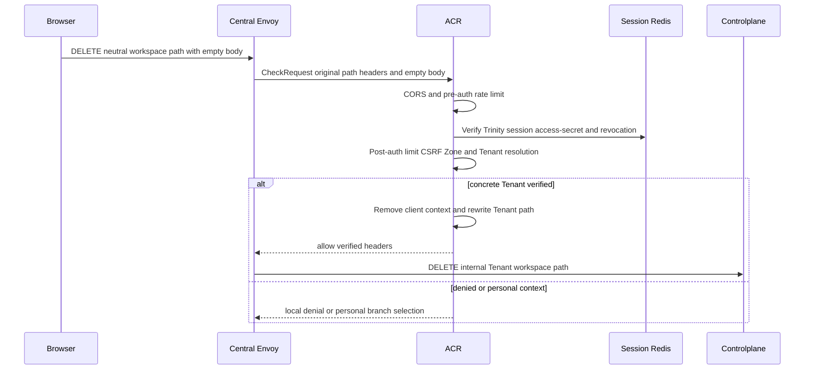
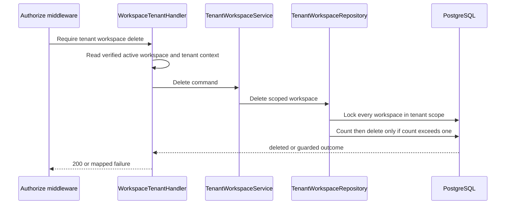
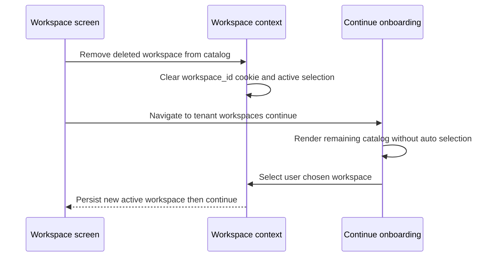

# Tenant Workspace Delete — God View

This workflow removes one Tenant workspace only when the Tenant retains at
least one workspace. It is a direct hierarchy deletion, not resource teardown.

## API and authority contract

| Item | Contract |
|---|---|
| Browser API | `DELETE /api/v1/hierarchy/workspaces` |
| Internal target | `DELETE /api/v1/tenant/hierarchy/workspaces` |
| Authority | tenant `hierarchy:workspace:delete` at level `*` |
| Durable action | scoped hard delete from `hierarchy.tenant_workspaces` |
| Guard | serialize full Tenant workspace scope and deny deletion of final workspace |

The target is exclusively the verified active `x-workspace-id` injected by ACR
from the current workspace context. The browser sends no workspace identifier,
so it cannot authorize one workspace and delete another.

## Key contracts

| Record | Rule |
|---|---|
| `tenant_workspaces` | `tenant_id` must equal verified current Tenant |
| lock set | all workspaces for that Tenant are locked before counting/deleting |
| membership RoleEntry | route authorization source for delete capability |

## Phase 1 — Client → Envoy → ACR

ACR receives the exact method/path/headers in CheckRequest. It reads Redis
session state and must remove browser proof/context headers before it overwrites
identity/Tenant/Zone/device/original-path and active workspace headers from
verified context. It injects `x-session-proof-verified: false`, sets public
`x-original-path`, and replaces `:path` with the Tenant target. It does not
forward browser context or make a Controlplane request on CORS, rate, session,
CSRF, or context failure.

## Phase 2 — Controlplane scoped delete

Missing active workspace returns `403`; absent workspace returns `404`;
final-workspace guard returns `409`; database
failure returns `500`. The present repository has no resource-teardown check:
it enforces only the final-workspace invariant. Any future workload teardown
must be a separate durable workflow before changing this deletion contract.

## Gateway workspace-context boundary

The former path/header mismatch has been removed. `middleware.Authorize` and
the handler receive the same active workspace context. ACR removes every
browser `x-workspace-id` header, then injects only the value read from
`workspace_id` cookie. A missing active workspace fails closed before deletion;
the Console clears it after success and enters explicit workspace-selection
onboarding.

## Phase 3 — Console continuation onboarding

This client-local phase runs only after the PostgreSQL delete succeeded. It is
not a replacement for durable settlement and cannot alter the deletion result.
