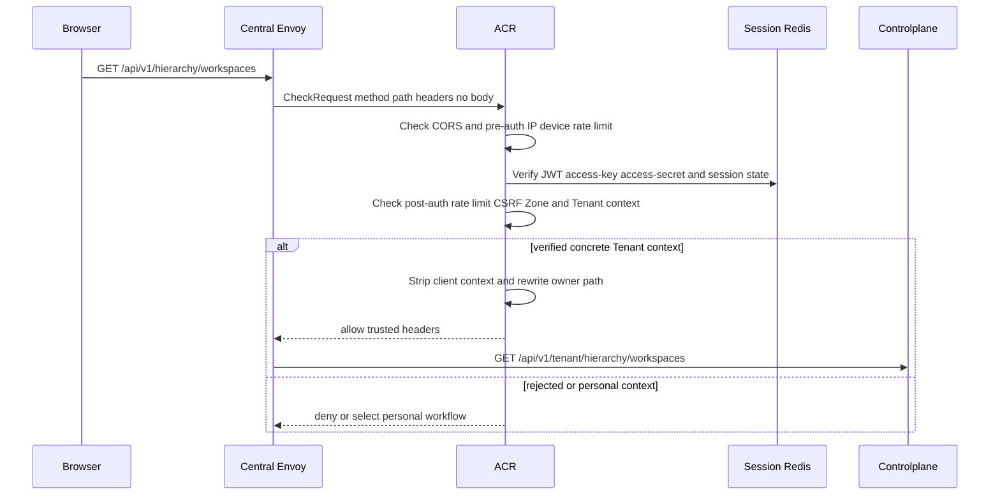
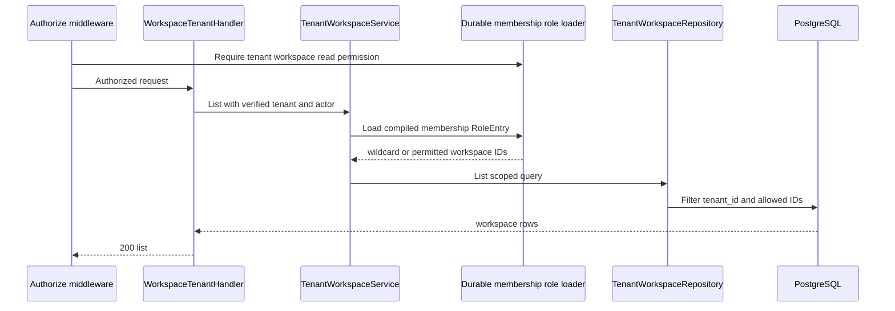

# Tenant Workspace List — God View

This read workflow returns only workspaces that the current Tenant member may
read. It is not the Zone-filtered selector/catalog workflow.

## API and authority contract

| Item | Contract |
|---|---|
| Browser API | `GET /api/v1/hierarchy/workspaces` |
| Internal target | `GET /api/v1/tenant/hierarchy/workspaces` |
| Authority | tenant `hierarchy:workspace:read` at level `*` |
| Durable read | `hierarchy.tenant_workspaces` scoped by current tenant |
| Result | all tenant workspaces for root wildcard grant, otherwise only compiled workspace IDs |

No request payload or client workspace/tenant/actor header selects the result.

## Key contracts

| Record / key | Owner | Meaning |
|---|---|---|
| `iam.membership_role` | PostgreSQL/IAM durable loader | verified actor's pinned revision binding |
| `membership_role:{user_id}:{tenant_id}` | zero-TTL loader namespace | compiled from PostgreSQL, never browser input |
| `hierarchy.tenant_workspaces` | PostgreSQL | list is always constrained by `tenant_id` |

## Phase 1 — Client → Envoy → ACR

The CheckRequest contains the original method/path, authority, and all headers.
ACR reads Redis session/revocation state, not client claims alone. It removes
proof markers and overwrites `x-user-id`, `x-user-name`, `x-user-level`,
`x-tenant-id`, `x-zone-id`, `x-client-device-id`, and `x-original-path`; it
injects verified values, `x-session-proof-verified: false`, and
`x-original-path: /api/v1/hierarchy/workspaces`, replaces `:path` with the
Tenant target, then forwards no body. CORS/rate/session/CSRF/context failure is
returned locally by ACR through Envoy.

## Phase 2 — Controlplane scoped read

The service converts only `:hierarchy:workspace:read` entries into an allowlist.
A nil-workspace grant means all tenant workspaces; otherwise PostgreSQL receives
only the parsed UUID allowlist. Durable load failure is fail-closed at the
authorization or service boundary; database failure is `500`.

## Active-workspace authorization

The generic route authorizer uses the active `x-workspace-id` to compose its
five-level key. A nil-UUID workspace grant is normalized to `*`, so a Tenant
root `workspace:read` grant authorizes this list regardless of the active
selection. The later service allowlist is the row-level durable query fence.

ACR removes every browser `x-workspace-id` header and conditionally injects
only the value read from the `workspace_id` cookie.
