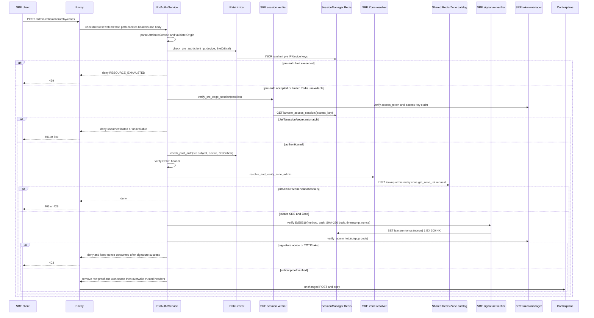
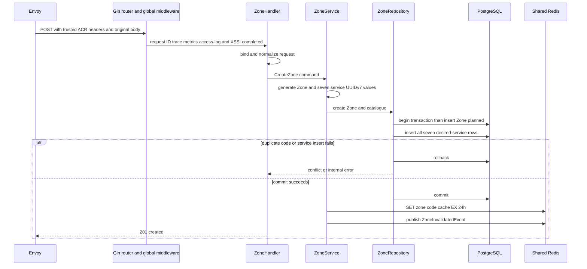
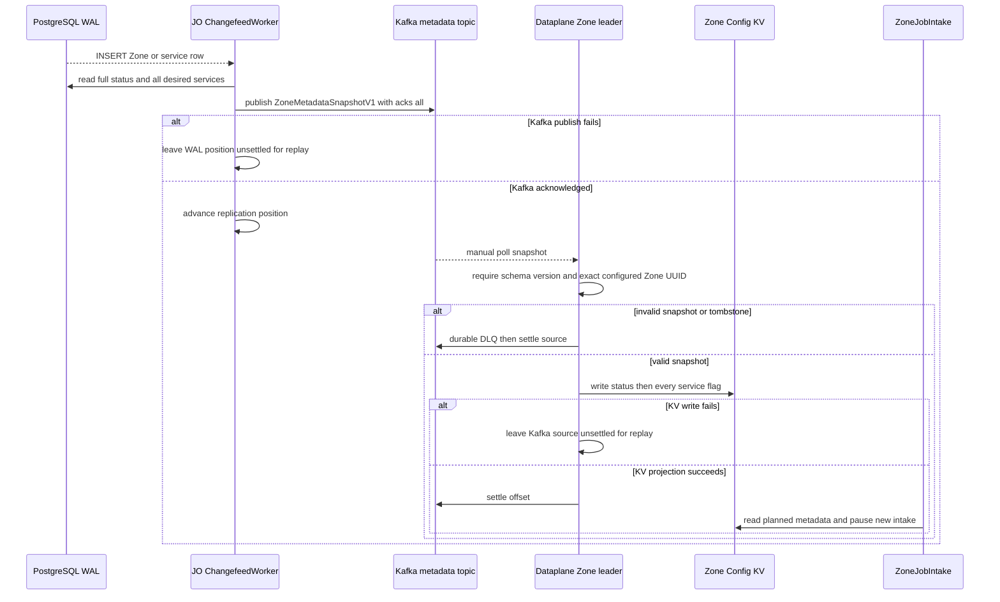

# Zone creation — God View

Creates one infrastructure Zone and its complete desired-service catalogue. The Zone starts as `planned`; PostgreSQL is authoritative and runtime propagation is asynchronous.

## API-scope contract

| Owner | Browser route | Internal route | Authority | Durable boundary |
|---|---|---|---|---|
| SRE admin | `POST /admin/critical/hierarchy/zones` | unchanged | verified SRE session plus one-time critical proof | committed `hierarchy.zones` and seven `hierarchy.zone_services` rows |

## Phase 1 — Client → Envoy → ACR

### Input

| Header / cookie | Purpose |
|---|---|
| `Origin` | allowed-origin check in `ExtAuthzService::check` |
| `X-Forwarded-For` | Envoy-provided IP for pre-auth rate limit; not client JSON |
| `Cookie: access_token, access_key, access_secret, client_device_id, zone_code` | SRE JWT/session, device bucket and selected Zone context |
| `x-zone-code` | only fallback when `zone_code` cookie is absent; never forwarded as trusted Zone identity |
| `x-csrf-token` | state-changing browser request, verified after session authentication |
| `x-admin-signature`, `x-admin-timestamp`, `x-admin-nonce` | Ed25519 proof over exact method, path and body hash |
| `x-admin-stepup-code` | six-digit TOTP |

| JSON field | Required | Meaning |
|---|---:|---|
| `code`, `name`, `location` | yes | normalized Zone identity and location |
| `description` | no | human description |
| `enable_hypervisor`, `enable_storage`, `enable_mail`, `enable_kubernetes`, `enable_ai`, `enable_managed_service` | no | desired capability flags; omitted means `false` |

### ACR processing and REST output

ACR is the authz endpoint, not the Zone command owner. It validates the request,
returns an edge denial itself when a component fails, or returns an allow
`CheckResponse` for Envoy to forward the unchanged request to Controlplane.

#### Response headers

| Result | Headers from ACR |
|---|---|
| Edge denial | no workflow-specific success header; Envoy maps the ext-authz status |
| Allowed forward | overwrite `x-user-id=sre`, `x-user-name=sre`, `x-user-level=0`, `x-client-device-id`, `x-zone-id`; add `x-session-proof-verified=true`, `x-session-proof-challenge-id`; optional rotated session/`zone_code` `Set-Cookie` |

#### Response payload

| Result | Payload |
|---|---|
| ACR denial | no stable Zone API payload: browser receives Envoy’s generic denial for CORS/rate/session/Zone/CSRF/proof failure |
| Allowed forward | no ACR body; Controlplane owns the eventual `201` payload |

### ACR forward contract

| Forwarded item | Source at ACR | Constraint |
|---|---|---|
| HTTP method, exact path and original bounded JSON body | Envoy `CheckRequest` | no `/admin` rewrite; the same bytes are signed and forwarded |
| SRE identity and device headers | verified SRE session and cookie | client values are overwritten |
| `x-zone-id` | verified JWT Zone claim after `zone_code` resolution | client must not select a different Zone UUID |
| proof marker and opaque challenge ID | successful signature+nonce+TOTP branch | raw proof values never cross ACR |
| raw admin/proof/workspace headers | browser request | removed before upstream forwarding |

ACR does not rewrite `/admin` paths. It injects `x-session-proof-verified=true` and an opaque `x-session-proof-challenge-id`; raw cryptographic headers never reach Controlplane.

| ACR upstream boundary | Action |
|---|---|
| `x-admin-signature`, `x-admin-timestamp`, `x-admin-nonce`, `x-admin-stepup-code` | remove |
| all `x-session-proof-*` request material and `x-workspace-id` | remove |
| `x-user-id`, `x-user-name`, `x-user-level`, `x-client-device-id`, `x-zone-id` | overwrite with `sre`, `sre`, `0`, verified device, and resolved claim Zone |
| `x-session-proof-verified`, `x-session-proof-challenge-id` | inject `true` and the opaque proof ID |

No ACR-local handler matches this route. Redis rate-limit outage is fail-open; session, Zone, CSRF, signature, nonce and TOTP failures deny. After the successful `CheckResponse`, Envoy forwards the original method/path/body plus only the trusted replacements above.

### Key contract

| Key / transport | Store | Operation | TTL / timeout | Owner / invariant |
|---|---|---|---|---|
| `ratelimit:pre:ip:{client_ip}:sre_critical` and device equivalent | ACR Moka block L1 → Auth-State Redis | L2 `INCR` + `EXPIRE`; L1 only records blocked key | pre IP 50/s; device 5/s; L1 block 30s | `RateLimiter`; Redis fault is fail-open |
| `ratelimit:post:user:{sre_subject}:sre_critical` and device equivalent | ACR Moka block L1 → Auth-State Redis | L2 `INCR` + `EXPIRE` | 10/s each; L1 block 30s | post-auth limiter; Redis fault is fail-open |
| `iam:sre_access_session:{access_key}` | Auth-State Redis | Prost `SreAccessSession`, `GET` | `SESSION_TTL_SECS` | `SessionManager`; contains secret hash and Ed25519 public key; missing/error denies |
| `iam:sre:nonce:{nonce}` | Auth-State Redis | `SET 1 EX 300 NX` after signature verification | 300s | signature verifier; exactly one valid request proceeds |
| `code_to_id[{zone_code}]`, `id_to_status[{zone_id}]` | ACR process-local Zone L1 | positive/negative lookup | positive 30s; negative 180s | Zone resolver; rebuildable only |
| `zone:code:{zone_code}` | Shared L2 Redis | `GET` `zone_id:status`; cache miss can request CP catalog | positive 24h; negative 180s | Zone resolver; L2 is not session authority |
| `hierarchy.zone.get_zone_list` and reply prefix | Shared L2 Redis Pub/Sub | bounded request/reply protobuf | ACR request timeout 1s | fallback catalogue refresh; no direct PostgreSQL access |

## Phase 2 — Controlplane command

### Internal input and output

| Part | Contract |
|---|---|
| Route | `POST /admin/critical/hierarchy/zones`; global HTTP middleware has already assigned request ID, OTel context, metrics, access log and Admin XSSI guard |
| Input | trusted SRE/proof headers plus `CreateZoneRequest`; handler trims name/location/description and lowercases/trims code |
| Command | `CreateZone` with generated UUIDv7 Zone ID, seven UUIDv7 service IDs, `planned` status and one boolean per supported service |
| Success | `201` generic API envelope, message `zone created`; no durable Zone payload is returned |
| Failure | `400` invalid normalized input, `409` duplicate code, `500` repository/UUID failure |

### Durable and soft-state contract

| Store/key | Operation | Owner / settlement |
|---|---|---|
| `hierarchy.zones` | insert Zone | `ZoneRepository` transaction |
| `hierarchy.zone_services` | insert exactly seven catalogue rows | same transaction; no partial Zone survives |
| `zone:code:{normalized_code}` | best-effort `SET {zone_id}:planned EX 24h` | `ZoneService` after commit; rebuildable |
| `hierarchy.zone.invalidated` | best-effort Protobuf publish | `ZoneService` after commit; not a durable runtime trigger |

The repository transaction is all-or-nothing. Duplicate `code` is `409`; malformed input is `400`; a Redis failure cannot reverse a committed Zone and returns no separate client error.

## Phase 3 — Runtime metadata propagation

### Internal input and output

| Part | Contract |
|---|---|
| Trigger | committed logical-replication `INSERT` for `hierarchy.zones` and its `zone_services` rows |
| JO input | decoded WAL row gives Zone UUID; JO rereads complete authoritative aggregate rather than publishing a delta |
| Kafka output | `ZoneMetadataSnapshotV1` with UUID key, `schema_version=1`, `planned` and all desired service flags to the per-Zone metadata topic with `acks=all` |
| Zone output | leader projects status and service entries into `AURORA_ZONE_CONFIG/zone.metadata` |
| Settlement | JO advances WAL only after Kafka ack; Zone leader settles Kafka only after all KV writes succeed |

### Key contract

| Key / topic | Store | Owner / invariant |
|---|---|---|
| `aurora.zone.metadata.{zone_id}.v1` | Kafka compacted per-Zone topic | JO full snapshots; durable Central-to-Zone log |
| `AURORA_ZONE_CONFIG/zone.metadata` | Zone NATS JetStream KV | fenced Zone leader projection; missing/corrupt data blocks intake |
| Kafka metadata consumer group | Kafka | current Zone leader only; old leader cannot settle after fencing loss |

Create success therefore means PostgreSQL committed, not that a Zone replica has projected metadata. The current projector is sequential rather than atomic aggregate replacement.
