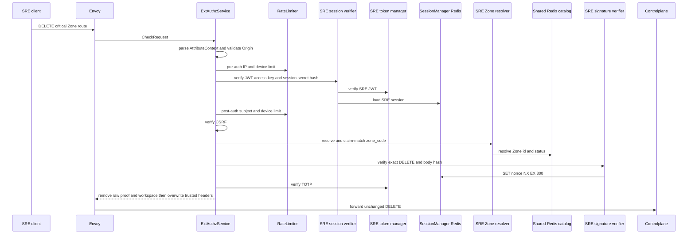
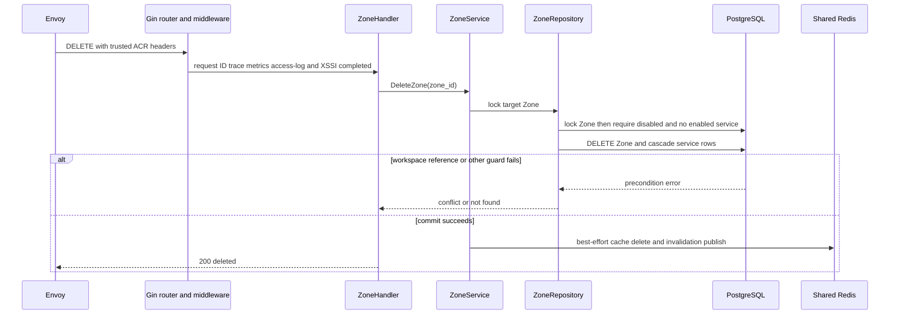
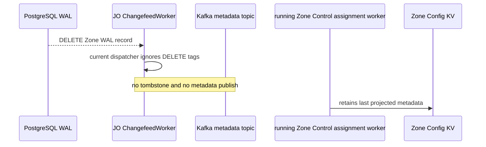

# Zone hard delete — God View

Irreversibly removes a Zone from Controlplane only after it is disabled, has no enabled service, and has no workspace reference. It is not currently a dataplane-detach workflow.

## API-scope contract

| Owner | Route | Authority | Durable boundary |
|---|---|---|---|
| SRE admin | `DELETE /admin/critical/hierarchy/zones/{zone_id}` | SRE session plus critical proof | `DELETE hierarchy.zones` under repository guard |

## Phase 1 — Client → Envoy → ACR

| Client headers/cookies | Purpose |
|---|---|
| `Origin`, `X-Forwarded-For` | CORS and Envoy-provided pre-auth IP |
| `Cookie: access_token, access_key, access_secret, client_device_id, zone_code` | SRE session, device bucket and selected Zone context |
| `x-zone-code`, `x-csrf-token` | fallback Zone selector and mutation guard |
| `x-admin-signature`, `x-admin-timestamp`, `x-admin-nonce`, `x-admin-stepup-code` | signed, one-time critical deletion |

### ACR processing and REST output

ACR validates the deletion request but never executes it. A component failure
returns an edge denial; only an allowed `CheckResponse` reaches Controlplane.

#### Response headers

| Result | Headers from ACR |
|---|---|
| Denied | no stable Zone workflow payload/header contract |
| Allowed forward | overwrite trusted SRE identity/device/Zone; inject `x-session-proof-verified=true` and opaque proof ID; optional session/Zone rotation cookies |

#### Response payload

| Result | Payload |
|---|---|
| Denied | generic Envoy denial |
| Allowed forward | no ACR body; Controlplane owns deletion response |

### ACR forward contract

| Item | Source | Constraint |
|---|---|---|
| exact DELETE path | Envoy request | no rewrite; empty body is still covered by signature digest |
| trusted identity/device/Zone headers | SRE verifier and Zone resolver | overwrite client values |
| proof marker/opaque challenge ID | successful signature/nonce/TOTP | raw proof and workspace headers removed |

ACR removes raw `x-admin-*`, caller `x-session-proof-*`, and `x-workspace-id`; it overwrites SRE identity/device/resolved Zone headers and injects `x-session-proof-verified=true` with the opaque challenge ID. Rate-limit Redis is fail-open; all session, Zone, CSRF and proof failures deny. It neither rewrites nor locally handles deletion.

### Key contract

| Key / transport | Store | Operation | TTL / timeout | Owner / invariant |
|---|---|---|---|---|
| pre/post `ratelimit:*:{ip|sre_subject|device}:sre_critical` | Moka L1 → Auth-State Redis | `INCR` + `EXPIRE`; L1 block marker | 50/s IP, 5/s pre-device, 10/s post subject/device; L1 30s | limiter; Redis failure fail-open |
| `iam:sre_access_session:{access_key}` | Auth-State Redis | Prost session `GET` | `SESSION_TTL_SECS` | SRE verifier; missing/error denies |
| `iam:sre:nonce:{nonce}` | Auth-State Redis | `SET EX 300 NX` after Ed25519 | 300s | one-time proof |
| Zone L1 and `zone:code:{code}` | process L1 → Shared L2 Redis | resolve code/status, bounded CP refresh | L1 30s/180s; L2 24h/180s | Zone resolver only |
| `hierarchy.zone.get_zone_list` request/reply | Shared L2 Redis Pub/Sub | cache-miss protobuf refresh | 1s | no ACR PostgreSQL access |

## Phase 2 — Controlplane deletion

### Internal input and output

| Part | Contract |
|---|---|
| Input | parsed `zone_id` plus trusted critical-proof headers at the HTTP boundary |
| Repository guard | locks Zone row, requires `disabled`, requires no `zone_services.desired_state=true`, then relies on workspace foreign-key restrict |
| Durable result | Zone delete and service cascade commit atomically or neither commits |
| REST output | `200` success; `400` invalid UUID, `404` absent Zone, `409` status/service/workspace precondition, `500` database error |

### Durable and soft-state contract

| Store/key | Operation | Owner / settlement |
|---|---|---|
| `hierarchy.zones` and cascading service rows | guarded hard delete | repository transaction |
| `workspaces.zone_id` | restrict constraint | prevents deletion while workspace exists |
| `zone:code:{code}` | best-effort `DEL` after commit | cache only |
| `hierarchy.zone.invalidated` | best-effort deleted event | ACR cache invalidation only |

Invalid UUID is `400`, missing Zone is `404`, and a failed state/service/workspace precondition is `409`. The deletion and its service-row cascade are atomic; soft cache cleanup is not part of that transaction.

## Phase 3 — Current runtime boundary

### Internal input and output

| Part | Current contract |
|---|---|
| Trigger observed by ChangefeedWorker | none: the worker dispatches only WAL `INSERT` and `UPDATE` |
| Kafka output | none: no terminal `ZoneMetadataSnapshotV1` and no tombstone |
| Zone KV output | none: a running Zone keeps its last projected metadata |
| Settlement/retry | none: no delete runtime consumer exists |

There is deliberately no claimed detach/recovery behavior. A terminal metadata contract must be implemented, tested and documented as a new workflow before hard delete can safely own Dataplane cleanup.
