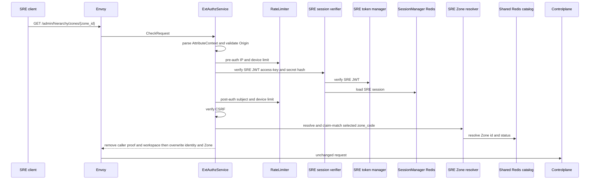
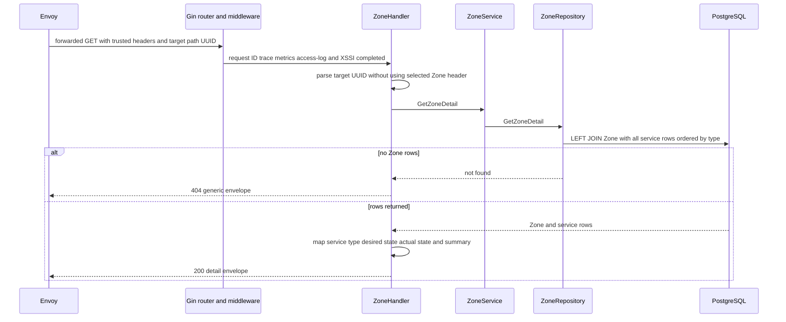

# Zone detail — God View

Reads one Zone and its desired/observed service rows for an SRE. It is an inspection workflow, not a runtime reconciliation request.

## API-scope contract

| Owner | Route | Authority | Durable source |
|---|---|---|---|
| SRE admin | `GET /admin/hierarchy/zones/{zone_id}` | verified SRE edge session | `hierarchy.zones` joined to `hierarchy.zone_services` |

## Phase 1 — Client → Envoy → ACR

| Client input | Use |
|---|---|
| `Origin`, `X-Forwarded-For` | CORS and Envoy-provided pre-auth IP |
| `Cookie: access_token, access_key, access_secret, client_device_id, zone_code` | SRE session, device bucket and selected Zone |
| `x-zone-code`, `x-csrf-token` | fallback Zone selector and browser guard |
| path `zone_id` | resource identity; parsed again by Controlplane |

### ACR processing and REST output

ACR verifies the caller’s selected Zone context before forwarding, but that
context is not this endpoint’s target. The path UUID remains opaque to ACR.

#### Response headers

| Result | Headers from ACR |
|---|---|
| Denied | no stable detail payload/header contract |
| Allowed forward | overwrite SRE identity/device/resolved selected Zone; inject `x-session-proof-verified=false`; optional rotation cookies |

#### Response payload

| Result | Payload |
|---|---|
| Denied | generic Envoy denial |
| Allowed forward | no ACR body; Controlplane owns detail payload |

### ACR forward contract

| Item | Source | Constraint |
|---|---|---|
| exact path with `{zone_id}` | Envoy request | never rewritten to selected Zone |
| SRE identity/device and selected `x-zone-id` | verified session/Zone resolver | overwrite caller values; header is authority context only |
| caller admin/proof/workspace headers | browser request | removed before forward |

ACR does not interpret `{zone_id}` as the active SRE Zone selection and does not rewrite this path.

This is noncritical: `sre::signature::verify_sre_signature` and TOTP are not called. Session/zone/CSRF failure denies; rate-limit Redis unavailability fails open. ACR injects `x-session-proof-verified=false`; `{zone_id}` remains the read target and is never replaced by `x-zone-id`.

### Key contract

| Key / transport | Store | Operation | TTL / timeout | Owner / invariant |
|---|---|---|---|---|
| pre/post `ratelimit:*:{ip|sre_subject|device}:sre_general` | Moka L1 → Auth-State Redis | `INCR` + `EXPIRE`; L1 block marker | pre 200/s IP and 15/s device; post 30/s subject/device; L1 30s | limiter; Redis fault fail-open |
| `iam:sre_access_session:{access_key}` | Auth-State Redis | Prost session `GET` | `SESSION_TTL_SECS` | SRE verifier; failure denies |
| Zone L1 and `zone:code:{code}` | process L1 → Shared L2 Redis | lookup plus CP refresh | L1 30s/180s; L2 24h/180s | selected Zone validation only |
| `hierarchy.zone.get_zone_list` request/reply | Shared L2 Redis Pub/Sub | protobuf cache miss | 1s | no ACR PostgreSQL access |

## Phase 2 — Controlplane read

### Internal input and output

| Part | Contract |
|---|---|
| Input | target `zone_id` only from path; trusted selected `x-zone-id` is caller context, not target replacement |
| Service input | typed `GetZoneDetail{ZoneID}` |
| Repository query | `zones LEFT JOIN zone_services`, ordered by service type |
| REST output | `200` Zone/service aggregate; `400` malformed UUID, `404` no Zone row, `500` database error |

### Key contract

| Store | Operation | Owner / invariant |
|---|---|---|
| `hierarchy.zones` | read target Zone | PostgreSQL authority |
| `hierarchy.zone_services` | read desired and actual service rows | actual state is observation only |
| workspace/activity fields in response | no query | current handler deliberately returns empty placeholders |
| Kafka, Zone KV and cache | no operation | detail inspection is not a runtime request |

The handler turns rows into Zone metadata, enabled-service count, desired state and `actual_state`. Invalid UUID is `400`, missing Zone is `404`, database failure is `500`. It returns no workspace/activity projection beyond its current empty placeholders and does not contact Dataplane.
