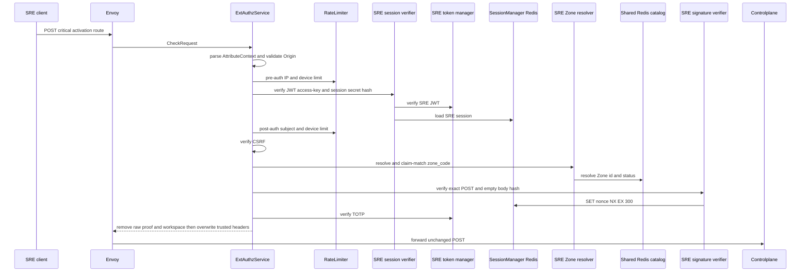
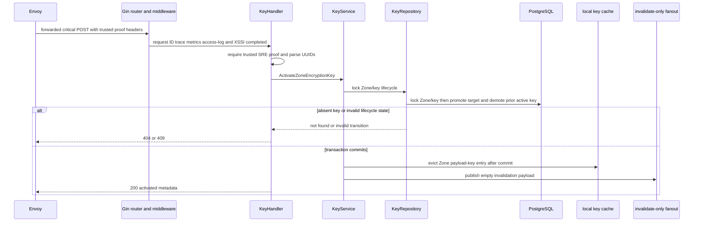
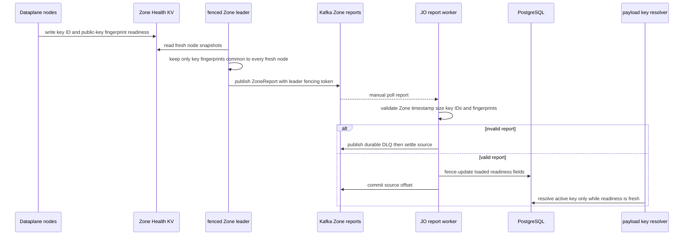

# Zone encryption-key activation — God View

Promotes a staged key to the Zone’s sole `active` public key and demotes the prior active key to `decrypt_only`. Payload admission remains gated by independent Dataplane readiness evidence.

## API-scope contract

| Owner | Route | Authority | Durable boundary |
|---|---|---|---|
| SRE admin | `POST /admin/critical/hierarchy/zones/{zone_id}/encryption-keys/{key_id}/activate` | SRE session plus critical proof | serialized key rotation transaction |

## Phase 1 — Client → Envoy → ACR

The client sends no body. It sends SRE session/CSRF headers plus `x-admin-signature`, `x-admin-timestamp`, `x-admin-nonce`, and `x-admin-stepup-code`, all bound to the exact activation path.

### REST input

| Part | Contract |
|---|---|
| Headers | `Origin`, `X-Forwarded-For`, SRE session cookies, `zone_code` or fallback `x-zone-code`, `x-csrf-token`, and all four critical-proof headers |
| Payload | empty body; Ed25519 covers the empty-body digest and exact `{zone_id}/{key_id}/activate` path |

### ACR processing and REST output

#### Response headers

| Result | Headers from ACR |
|---|---|
| Denied | no stable activation response payload |
| Allowed forward | overwrite SRE identity/device/Zone, inject verified proof marker/opaque ID, optional rotation cookies |

#### Response payload

| Result | Payload |
|---|---|
| Denied | generic Envoy denial |
| Allowed forward | none; Controlplane owns `200` payload |

### ACR forward contract

| Item | Source | Constraint |
|---|---|---|
| exact activation POST path | Envoy request | no rewrite |
| trusted identity/device/Zone headers | verified components | browser copies overwritten |
| proof marker/opaque ID | completed critical proof | raw admin/proof/workspace headers removed |

ACR removes raw `x-admin-*`, caller `x-session-proof-*`, and `x-workspace-id`; it overwrites SRE identity/device/resolved Zone headers and injects `x-session-proof-verified=true` with the opaque challenge ID. Rate-limit Redis is fail-open; session, Zone, CSRF and proof failure deny. ACR does not rewrite or locally answer this route.

### Key contract

| Key / transport | Store | Operation | TTL / timeout | Owner / invariant |
|---|---|---|---|---|
| pre/post `ratelimit:*:{ip|sre_subject|device}:sre_critical` | Moka L1 → Auth-State Redis | `INCR` + `EXPIRE`; L1 block marker | pre 50/s IP, 5/s device; post 10/s subject/device; L1 30s | limiter; Redis failure fail-open |
| `iam:sre_access_session:{access_key}` | Auth-State Redis | Prost session `GET` | `SESSION_TTL_SECS` | verifier; failure denies |
| `iam:sre:nonce:{nonce}` | Auth-State Redis | `SET EX 300 NX` | 300s | proof single-use fence |
| Zone L1 and `zone:code:{code}`; catalog request/reply | process L1 → Shared L2 Redis Pub/Sub | resolve and bounded refresh | L1 30s/180s; L2 24h/180s; request 1s | Zone resolver; no CP DB access |

## Phase 2 — Controlplane rotation

### Internal input and output

| Part | Contract |
|---|---|
| Input | trusted SRE/critical-proof headers and path Zone/key UUIDs |
| Repository transition | lock Zone/key lifecycle, promote target `staged` key and demote current `active` key to `decrypt_only` in the same transaction |
| Soft-state output | local Zone payload-key cache eviction then empty invalidate-only fanout after commit |
| REST output | `200` activated public metadata; `404` absent Zone/key, `409` non-staged/non-active transition, `500` error |

### Durable and key contract

| Store/key | Operation | Owner / invariant |
|---|---|---|
| `hierarchy.zone_encryption_keys` | serialized activation and demotion | partial unique active-key constraint preserves at most one active key |
| `hierarchy_zone_payload_key:{zone_id}` | local cache delete | service after commit only |
| invalidate-only fanout key | publish empty payload | key bytes never enter Redis; lost message bounded by readiness deadline |

Only `staged` or idempotently `active` can be activated; other states return `409`; missing Zone/key is `404`. A lost fanout is safe because each replica has a bounded readiness deadline and reloads only from PostgreSQL.

## Phase 3 — readiness evidence

### Internal input and output

| Part | Contract |
|---|---|
| Trigger | each fenced Zone leader publishes a `ZoneReport` containing only the intersection of fresh node key ID/fingerprint observations |
| JO validation | report Zone key, bounded timestamp and leader fencing token; each fingerprint must match public-key row |
| Durable output | timestamp/fencing guarded `loaded_at`, `loaded_observed_at`, `loaded_observed_fencing_token` updates |
| Admission output | payload-key resolver may select active key only while fresh readiness lease remains; activation commit alone is insufficient |

### Key contract

| Key / topic | Store | Owner / invariant |
|---|---|---|
| `AURORA_ZONE_HEALTH/zone.node.{node_id}` | Zone NATS KV | each node reports loaded key fingerprints |
| `aurora.zone.reports.v1` | Kafka | Zone leader publishes bounded report with fencing token |
| `hierarchy.zone_encryption_keys.loaded_*` | PostgreSQL | JO write-back is timestamp and fence guarded |
| `hierarchy_zone_payload_key:{zone_id}` | local cache | resolver holds short hard usability deadline and fails closed after expiry |

The key resolver fails closed for missing, stale or unavailable readiness; it never falls back to a previous active key.
