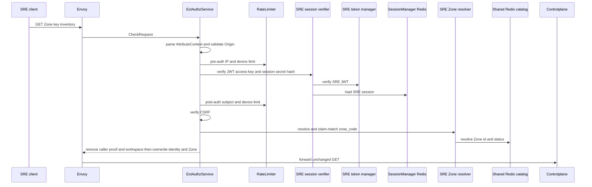
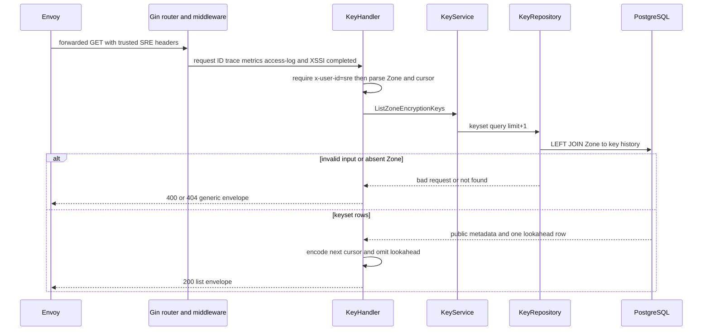

# Zone encryption-key list — God View

Lists public encryption-key capability metadata for one Zone. Private key material is never accepted, stored, or returned by this workflow.

## API-scope contract

| Owner | Route | Authority | Durable source |
|---|---|---|---|
| SRE admin | `GET /admin/hierarchy/zones/{zone_id}/encryption-keys` | verified SRE edge session | `hierarchy.zone_encryption_keys` |

## Phase 1 — Client → Envoy → ACR

| Input | Purpose |
|---|---|
| `Origin`, `X-Forwarded-For` | CORS and Envoy-provided pre-auth IP |
| `Cookie: access_token, access_key, access_secret, client_device_id, zone_code` | SRE session, device bucket and selected Zone |
| `x-zone-code`, `x-csrf-token` | fallback Zone selector and browser guard |
| path `zone_id`; optional `limit` (1–100) and cursor | resource and keyset pagination |

### ACR processing and REST output

This is a general SRE read. ACR verifies the caller/session context but leaves
the target `zone_id`, cursor and pagination parameters unchanged for
Controlplane.

#### Response headers

| Result | Headers from ACR |
|---|---|
| Denied | no stable key-list payload/header contract |
| Allowed forward | overwrite SRE identity/device/selected Zone; inject `x-session-proof-verified=false`; optional rotation cookies |

#### Response payload

| Result | Payload |
|---|---|
| Denied | generic Envoy denial |
| Allowed forward | no ACR body; Controlplane owns list payload |

### ACR forward contract

| Item | Source | Constraint |
|---|---|---|
| exact GET path/query | Envoy request | no rewrite; target Zone is still the path UUID |
| SRE identity/device and selected Zone header | verified session and Zone resolver | overwrite caller values |
| caller admin/proof/workspace headers | browser request | removed before forward |

This is not a critical mutation, so there is no Ed25519/TOTP proof.

This is noncritical: no signature/TOTP component runs. Session, CSRF and Zone resolution failure deny; only rate-limit Redis failure is fail-open. ACR injects `x-session-proof-verified=false`; it neither rewrites nor intercepts this request.

### Key contract

| Key / transport | Store | Operation | TTL / timeout | Owner / invariant |
|---|---|---|---|---|
| pre/post `ratelimit:*:{ip|sre_subject|device}:sre_general` | Moka L1 → Auth-State Redis | `INCR` + `EXPIRE`; L1 block marker | pre 200/s IP, 15/s device; post 30/s subject/device; L1 30s | limiter; Redis fault fail-open |
| `iam:sre_access_session:{access_key}` | Auth-State Redis | Prost session `GET` | `SESSION_TTL_SECS` | SRE verifier; missing/error denies |
| Zone L1 and `zone:code:{code}` | process L1 → Shared L2 Redis | code/status lookup and bounded refresh | L1 30s/180s; L2 24h/180s | selected Zone validation only |
| `hierarchy.zone.get_zone_list` request/reply | Shared L2 Redis Pub/Sub | cache-miss protobuf refresh | 1s | fallback; ACR never queries PostgreSQL |

## Phase 2 — Controlplane read

### Internal input and output

| Part | Contract |
|---|---|
| Input | path Zone UUID, optional strict `limit` 1–100, optional base64url keyset cursor, trusted `x-user-id=sre` |
| Service input | `ListZoneEncryptionKeys` with `limit+1` query bound |
| Repository output | Zone existence plus public key metadata ordered by `(created_at, id)` |
| REST output | `200` `items`, `count`, optional `next_cursor`; `400` invalid path/cursor/limit, `404` absent Zone, `500` database error |

### Key contract

| Store | Operation | Owner / invariant |
|---|---|---|
| `hierarchy.zone_encryption_keys` | keyset read of public material and lifecycle audit fields | public key only, never private counterpart |
| encoded cursor | `created_at.UnixMicro|key_id` base64url | handler parser; bounded 128 bytes |
| Kafka, Zone KV, key cache fanout | no operation | list does not change usability/readiness |

Invalid parameters return `400`, unknown Zone returns `404`, and a database failure returns `500`. The result is public X25519 material, fingerprint, algorithm and lifecycle audit fields; no runtime propagation occurs.
