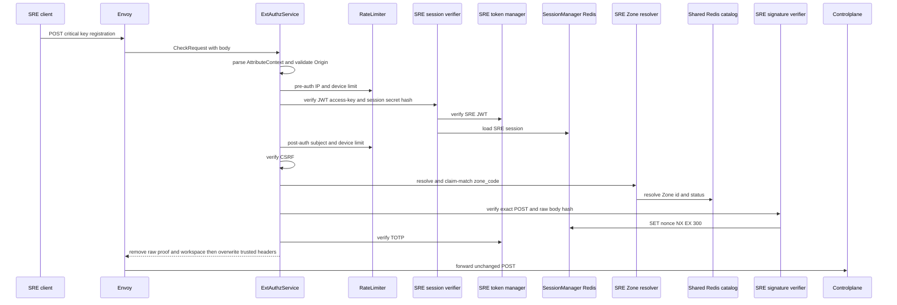
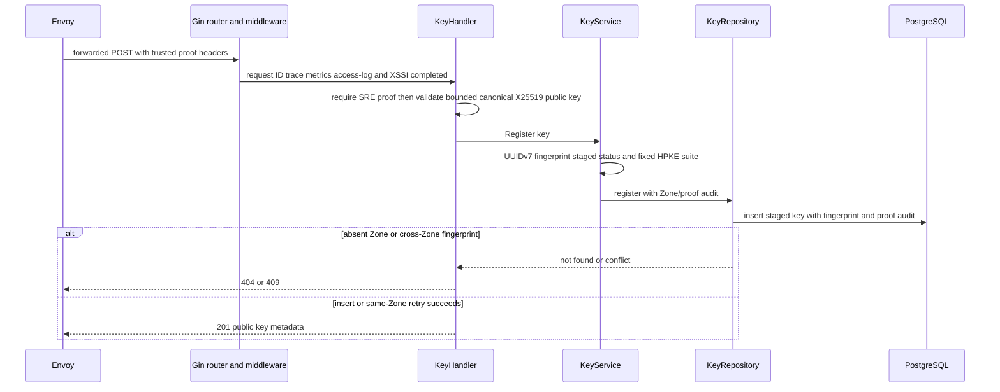

# Zone encryption-key registration — God View

Stages one canonical X25519 public key for a Zone. It creates no private counterpart and does not make the key usable for new protected payloads.

## API-scope contract

| Owner | Route | Authority | Durable boundary |
|---|---|---|---|
| SRE admin | `POST /admin/critical/hierarchy/zones/{zone_id}/encryption-keys` | SRE session plus critical proof | staged key row with audit actor/proof |

## Phase 1 — Client → Envoy → ACR

| Header / cookie | Purpose |
|---|---|
| `Origin`, `X-Forwarded-For` | CORS and Envoy-provided pre-auth IP |
| `Cookie: access_token, access_key, access_secret, client_device_id, zone_code` | SRE session, device bucket and selected Zone |
| `x-zone-code`, `x-csrf-token` | fallback Zone selector and mutation guard |
| `x-admin-signature`, `x-admin-timestamp`, `x-admin-nonce`, `x-admin-stepup-code` | one-time critical proof |

| JSON payload |
|---|
| `{ "public_key": "canonical padded base64 for exactly 32 X25519 bytes" }` |

### ACR processing and REST output

ACR authenticates and consumes the critical proof, but does not parse or retain
the public key. Successful validation yields an allow response; the same body
is forwarded to the Controlplane handler.

#### Response headers

| Result | Headers from ACR |
|---|---|
| Denied | no stable key-registration API payload |
| Allowed forward | overwrite trusted SRE identity/device/Zone; inject `x-session-proof-verified=true` and opaque proof ID; optional rotation cookies |

#### Response payload

| Result | Payload |
|---|---|
| Denied | generic Envoy denial |
| Allowed forward | none; Controlplane owns `201` payload |

### ACR forward contract

| Item | Source | Constraint |
|---|---|---|
| exact POST and bounded JSON public-key body | Envoy request | signature covers raw body; ACR does not transform it |
| SRE identity/device/Zone headers | verified session/Zone resolver | overwrite browser values |
| verified marker and proof ID | successful proof components | raw `x-admin-*`, raw proof, workspace headers removed |

ACR removes raw `x-admin-*`, caller `x-session-proof-*`, and `x-workspace-id`; it overwrites SRE identity/device/resolved Zone headers and injects `x-session-proof-verified=true` with the opaque challenge ID. Rate-limit Redis is fail-open; session, Zone, CSRF and proof dependencies fail closed. It forwards the body unchanged; public-key validation belongs to Controlplane.

### Key contract

| Key / transport | Store | Operation | TTL / timeout | Owner / invariant |
|---|---|---|---|---|
| pre/post `ratelimit:*:{ip|sre_subject|device}:sre_critical` | Moka L1 → Auth-State Redis | `INCR` + `EXPIRE`; L1 block marker | pre 50/s IP, 5/s device; post 10/s subject/device; L1 30s | limiter; Redis failure fail-open |
| `iam:sre_access_session:{access_key}` | Auth-State Redis | Prost session `GET` | `SESSION_TTL_SECS` | verifier; missing/error denies |
| `iam:sre:nonce:{nonce}` | Auth-State Redis | `SET EX 300 NX` | 300s | one valid proof only |
| Zone L1 and `zone:code:{code}` | process L1 → Shared L2 Redis | resolve + bounded CP catalog refresh | 30s/180s L1; 24h/180s L2 | Zone resolver |
| `hierarchy.zone.get_zone_list` request/reply | Shared L2 Redis Pub/Sub | cache-miss protobuf refresh | 1s | ACR never queries PostgreSQL |

## Phase 2 — Controlplane command

### Internal input and output

| Part | Contract |
|---|---|
| Input | trusted `x-user-id=sre`, `x-session-proof-verified=true`, opaque proof UUID, path Zone UUID, body capped at 4 KiB |
| Handler validation | strict canonical padded base64, exactly 32 bytes, X25519 public-key construction and ECDH low-order-point rejection |
| Service command | UUIDv7 key ID, SHA-256 fingerprint, fixed HPKE suite, `staged` status |
| REST output | `201` public metadata; `400` invalid body/material, `404` absent Zone, `409` fingerprint belongs to another Zone, `500` internal error |

### Durable and key contract

| Store/key | Operation | Owner / invariant |
|---|---|---|
| `hierarchy.zone_encryption_keys` | insert staged public key, fingerprint and actor/proof audit columns | repository; no private key column |
| global fingerprint unique index | conflict fence | same public/private pair cannot be reused across Zones |
| Kafka, Redis fanout, Zone KV | no public-key material write | registration is not activation/readiness |

Invalid material is `400`, absent Zone is `404`, and a globally reused fingerprint for another Zone is `409`. Retrying the same public key in its original Zone returns its existing record. No Kafka, Redis payload, or Zone KV carries the key bytes.
