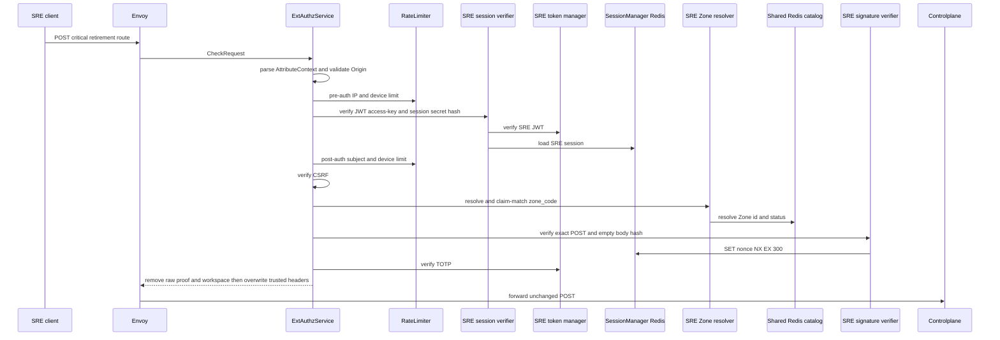
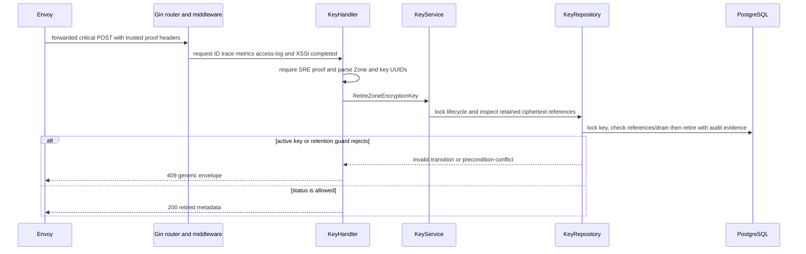

# Zone encryption-key retirement — God View

Retires an unused staged or decrypt-only key after its retention and reference fences pass. The active key cannot be retired through this route.

## API-scope contract

| Owner | Route | Authority | Durable boundary |
|---|---|---|---|
| SRE admin | `POST /admin/critical/hierarchy/zones/{zone_id}/encryption-keys/{key_id}/retire` | SRE session plus critical proof | serialized lifecycle/reference check and retire update |

## Phase 1 — Client → Envoy → ACR

The request has no body and sends SRE session/CSRF headers plus the signed one-time critical headers: `x-admin-signature`, `x-admin-timestamp`, `x-admin-nonce`, and `x-admin-stepup-code`.

### REST input

| Part | Contract |
|---|---|
| Headers | `Origin`, `X-Forwarded-For`, SRE session cookies, selected `zone_code` or fallback header, CSRF and four critical-proof headers |
| Payload | empty body; signature binds the exact retirement path |

### ACR processing and REST output

#### Response headers

| Result | Headers from ACR |
|---|---|
| Denied | no stable retirement response payload |
| Allowed forward | overwrite SRE identity/device/Zone; inject verified proof marker/opaque ID; optional rotation cookies |

#### Response payload

| Result | Payload |
|---|---|
| Denied | generic Envoy denial |
| Allowed forward | no ACR body; Controlplane owns `200` payload |

### ACR forward contract

| Item | Source | Constraint |
|---|---|---|
| exact retirement path | Envoy request | no rewrite |
| trusted identity/device/Zone | verified edge components | overwrite browser headers |
| proof marker/opaque ID | proof success | raw admin/proof/workspace headers removed |

ACR removes raw `x-admin-*`, caller `x-session-proof-*`, and `x-workspace-id`; it overwrites SRE identity/device/resolved Zone headers and injects `x-session-proof-verified=true` with the opaque challenge ID. Rate-limit Redis is fail-open; auth, Zone, CSRF and proof failure deny. No ACR-local handler or rewrite exists.

### Key contract

| Key / transport | Store | Operation | TTL / timeout | Owner / invariant |
|---|---|---|---|---|
| pre/post `ratelimit:*:{ip|sre_subject|device}:sre_critical` | Moka L1 → Auth-State Redis | `INCR` + `EXPIRE`; L1 block marker | pre 50/s IP, 5/s device; post 10/s subject/device; L1 30s | limiter; Redis fault fail-open |
| `iam:sre_access_session:{access_key}` | Auth-State Redis | Prost session `GET` | `SESSION_TTL_SECS` | SRE verifier; failure denies |
| `iam:sre:nonce:{nonce}` | Auth-State Redis | `SET EX 300 NX` | 300s | one-time critical proof |
| Zone L1, `zone:code:{code}`, catalog request/reply | process L1 → Shared L2 Redis Pub/Sub | resolve and bounded refresh | L1 30s/180s; L2 24h/180s; request 1s | Zone resolver; no direct PostgreSQL |

## Phase 2 — Controlplane retirement

### Internal input and output

| Part | Contract |
|---|---|
| Input | trusted SRE/critical-proof headers and path Zone/key UUIDs |
| Repository guard | lock lifecycle, inspect retained ciphertext references and decrypt-only drain deadline |
| Allowed transition | `staged` or `decrypt_only` to `retired`; `retired` is idempotent; `active` is forbidden |
| REST output | `200` retired metadata; `404` absent Zone/key, `409` active key, retained reference or unelapsed drain, `500` database error |

### Durable and key contract

| Store/key | Operation | Owner / invariant |
|---|---|---|
| `hierarchy.zone_encryption_keys` | serialized status/audit update | repository is lifecycle authority |
| retained ciphertext references | repository existence fence | key cannot be retired while referenced |
| cache fanout and Zone KV | no operation | retirement does not distribute private material |

`active` is rejected with `409`. A retained ciphertext reference is `409`; an unelapsed decrypt-only drain window is `409`; missing resources are `404`. Retiring an already retired key is idempotent. This workflow does not remove a Dataplane private counterpart; that operational cleanup must wait until retirement and retention cleanup have completed.
