# Zone Lifecycle — God View (Master SoT)

> [!IMPORTANT]
> Tài liệu này là **Source of Truth (SoT) duy nhất** cho toàn bộ vòng đời quản lý Zone.
> **Mọi thay đổi** liên quan đến: xác thực Ed25519/TOTP, CDC pipeline, zone state machine, actual_state write-back, dead man's switch, distributed lock **đều phải tham chiếu và cập nhật** file này trước.

---

## Mục Lục

1. [Tổng Quan Kiến Trúc](#1-tổng-quan-kiến-trúc)
2. [Database Schema & Enums](#2-database-schema--enums)
3. [Zone Status State Machine (Controlplane)](#3-zone-status-state-machine-controlplane)
4. [Luồng Tạo Zone — SRE Admin](#4-luồng-tạo-zone--sre-admin)
5. [Luồng Cập Nhật Status Zone](#5-luồng-cập-nhật-status-zone)
6. [Luồng Bật/Tắt Service Trong Zone](#6-luồng-bậttắt-service-trong-zone)
7. [Luồng Xóa Zone](#7-luồng-xóa-zone)
8. [CDC Real-time Sync Pipeline](#8-cdc-real-time-sync-pipeline)
9. [Reconciliation Polling — Self-Healing Fallback](#9-reconciliation-polling--self-healing-fallback)
10. [Dataplane State Machine](#10-dataplane-state-machine)
11. [Actual State Write-Back Pipeline](#11-actual-state-write-back-pipeline)
12. [Dataplane Health Monitors](#12-dataplane-health-monitors)
13. [Decision Engine — Backpressure & Zone Status](#13-decision-engine--backpressure--zone-status)
14. [Dead Man's Switch](#14-dead-mans-switch)
15. [HA Guards & Race Condition Inventory](#15-ha-guards--race-condition-inventory)
16. [Redis Key Registry](#16-redis-key-registry)
17. [Tham Chiếu Code Toàn Hệ Thống](#17-tham-chiếu-code-toàn-hệ-thống)

---

## 1. Tổng Quan Kiến Trúc

Hệ thống chia rõ ràng làm **3 lớp tương tác** trong vòng đời Zone:

```
[SRE UI] → Ed25519+TOTP → [Envoy] → gRPC ext_authz → [acr]
[acr] → Session + Nonce verify → [Redis L1]
[acr] → TOTP verify → [Vault]
[Envoy] → forward → [Controlplane REST]
[Controlplane] → INSERT/UPDATE → [PostgreSQL SoT]
[PostgreSQL WAL] → Logical Replication → [Job Orchestrator CdcStreamer]
[JO] → PUBLISH zone:event:metadata:{zone_id} → [Redis L1 PubSub]
[Redis L1] → broadcast → [Dataplane start_metadata_event_listener()]
[Dataplane] → HSET infra:zone:metadata → [Redis L2]
[Dataplane monitors] → HSET infra:mail, infra:hypervisor → [Redis L2]
[ZoneStatusGateway 5s] → XADD zone:backpressure:reports (Protobuf) → [Redis L1 Stream]
[JO backpressure_listener] → XREADGROUP → decode → DecisionEngine.evaluate()
[JO] → Throttled UPSERT actual_state → [PostgreSQL]
[JO] → UPSERT hypervisor.nodes → [PostgreSQL]
```

## 2. State Machine
### 2.1 Zone Status

Trạng thái vận hành tổng thể của một Infrastructure Zone.
- **DB Schema SoT (Enums)**: [`000001_hierarchy_enums.up.sql`](../../controlplane/internal/hierarchy/migrations/000001_hierarchy_enums.up.sql#L13)
- **CP Business Logic SoT (Go Entities)**: [`zone.go`](../../controlplane/internal/hierarchy/domain/entity/zone.go#L9-L17)
- **Quản lý chuyển đổi**: Enforce tại [`zone_service.go#UpdateZoneStatus()`](../../controlplane/internal/hierarchy/service/zone_service.go#L141).

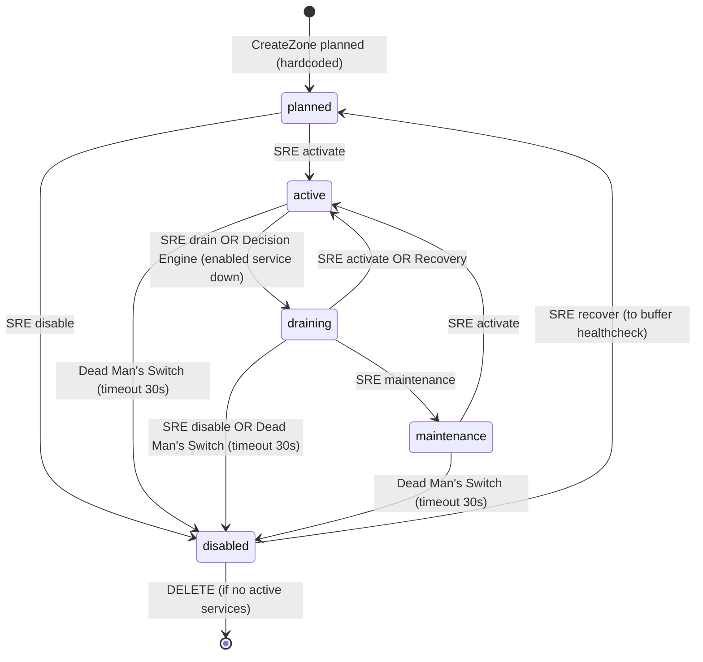
```mermaid
stateDiagram-v2
    [*] --> planned : CreateZone planned (hardcoded)
    planned --> active : SRE activate
    planned --> disabled : SRE disable
    
    active --> draining : SRE drain OR Decision Engine (enabled service down)
    active --> disabled : Dead Man's Switch (timeout 30s)
    
    draining --> active : SRE activate OR Recovery
    draining --> maintenance : SRE maintenance
    draining --> disabled : SRE disable OR Dead Man's Switch (timeout 30s)
    
    maintenance --> active : SRE activate
    maintenance --> disabled : Dead Man's Switch (timeout 30s)
    
    disabled --> planned : SRE recover (to buffer healthcheck)
    disabled --> [*] : DELETE (if no active services)
```

**Bảng mô tả các trạng thái & Tham chiếu Code:**

| Trạng thái | Ý nghĩa | Code / Reference quan trọng |
|:---|:---|:---|
| **`planned`** | Zone mới tạo, chưa chạy | Khởi tạo mặc định: [`zone_service.go`](../../controlplane/internal/hierarchy/service/zone_service.go#L80) / [`zone_repo.go`](../../controlplane/internal/hierarchy/repository/zone_repo.go#L219).<br/>Dataplane chặn kéo job: [`consumer.rs`](../../dataplane/src/job_lifecycle/consumer.rs#L80).<br/>Workload monitor check kết nối nhẹ, bỏ qua check hàng đợi: [`monitor.rs`](../../dataplane/src/executor/mail/core/monitor.rs#L119). |
| **`active`** | Zone hoạt động bình thường | Cho phép kéo Job từ Platform L1: [`consumer.rs`](../../dataplane/src/job_lifecycle/consumer.rs#L103).<br/>Workload monitor chạy full health check đo đạc hiệu năng: [`monitor.rs`](../../dataplane/src/executor/mail/core/monitor.rs#L126). |
| **`draining`** | Zone xả tải, ngưng nhận job | Chặn kéo Job mới: [`consumer.rs`](../../dataplane/src/job_lifecycle/consumer.rs#L80).<br/>Tự động kích hoạt khi service down hoặc capacity < 10: [`decision.rs`](../../job-orchestrator/src/reverse_provider/zone/decision.rs#L29). |
| **`maintenance`** | Zone bảo trì | Chặn kéo Job mới, chạy nốt worker pool: [`consumer.rs`](../../dataplane/src/job_lifecycle/consumer.rs#L80).<br/>Cho phép SRE update service toggle desired_state: [`zone_repo.go`](../../controlplane/internal/hierarchy/repository/zone_repo.go#L434). |
| **`disabled`** | Vô hiệu hóa hoàn toàn | Workload monitor tắt hẳn, status=down: [`monitor.rs`](../../dataplane/src/executor/mail/core/monitor.rs#L94).<br/>Kích hoạt tự động khi zone mất tín hiệu quá 30s: [`listener.rs`](../../job-orchestrator/src/reverse_provider/zone/listener.rs#L383).<br/>Điều kiện bắt buộc để chạy DELETE zone: [`zone_repo.go`](../../controlplane/internal/hierarchy/repository/zone_repo.go#L372). |

**Ràng buộc & Kiểm tra chuyển đổi:**
* **Kiểm tra nghiệp vụ (Go Map)**: Được xác định qua bảng ánh xạ `allowed` map tại [`zone_service.go#UpdateZoneStatus()`](../../controlplane/internal/hierarchy/service/zone_service.go#L141).
* **Bảo vệ CSDL (SQL CTE Guard)**: Truy vấn update trạng thái bằng CTE so khớp `status = ANY($3)` tại [`zone_repo.go#UpdateZoneStatus()`](../../controlplane/internal/hierarchy/repository/zone_repo.go#L337) để ngăn race condition ghi đè trạng thái bất hợp lệ.
* **Preconditions cho Hard Delete**: Enforce tại [`zone_repo.go#DeleteZone()`](../../controlplane/internal/hierarchy/repository/zone_repo.go#L372) và cascade constraints tại SQL migration [`000002_hierarchy_tables.up.sql`](../../controlplane/internal/hierarchy/migrations/000002_hierarchy_tables.up.sql). Điều kiện xóa bao gồm:
  1. Trạng thái Zone hiện tại phải là `disabled`.
  2. Không có service nào trong bảng `zone_services` được bật (`desired_state = true`).
  3. Không có workspace nào đang tham chiếu tới Zone (`ON DELETE RESTRICT`).

---

### 2.2 Zone Service (desired_state)

Danh sách dịch vụ kích hoạt hoặc vô hiệu hóa theo cấu hình mong muốn (desired_state) của SRE Admin.

| Dịch vụ | Tên DB Enum | Ý nghĩa | Code / Reference thay đổi desired_state |
|:---|:---|:---|:---|
| **Mail** | `mail` | Stalwart JMAP bulk-submission service | [`zone_service.go#UpdateZoneService()`](../../controlplane/internal/hierarchy/service/zone_service.go#L196) / [`zone_repo.go#UpdateZoneService()`](../../controlplane/internal/hierarchy/repository/zone_repo.go#L401) |
| **Hypervisor** | `hypervisor` | Quản lý hạ tầng ảo hóa Proxmox VE Cluster | [`zone_service.go#UpdateZoneService()`](../../controlplane/internal/hierarchy/service/zone_service.go#L196) |
| **Kubernetes** | `kubernetes` | Cung cấp cụm K8s Cluster | [`zone_service.go#UpdateZoneService()`](../../controlplane/internal/hierarchy/service/zone_service.go#L196) |
| **AI Workload** | `ai` | Xử lý workloads AI/GPU | [`zone_service.go#UpdateZoneService()`](../../controlplane/internal/hierarchy/service/zone_service.go#L196) |
| **Storage** | `storage` | Lưu trữ Object/Block Storage | [`zone_service.go#UpdateZoneService()`](../../controlplane/internal/hierarchy/service/zone_service.go#L196) |
| **Database** | `database` | Managed Database services | [`zone_service.go#UpdateZoneService()`](../../controlplane/internal/hierarchy/service/zone_service.go#L196) |

---

### 2.3 Zone Service Status (actual_state)

Trạng thái đo đạc và phản ánh sức khỏe thực tế (actual_state) của dịch vụ nhận về từ các agent Dataplane.

| Trạng thái | Ý nghĩa | Điều kiện chuyển dịch / Telemetry Source | Code / Reference cập nhật vào DB SoT |
|:---|:---|:---|:---|
| **`unknown`** | Chưa nhận được báo cáo tài nguyên | Giá trị mặc định khi khởi tạo hoặc chưa có report push về. | [`zone_repo.go#CreateZone()`](../../controlplane/internal/hierarchy/repository/zone_repo.go#L219) |
| **`healthy`** | Hoạt động bình thường, ổn định | JMAP Core/echo thành công và local batch queue còn capacity tại [`monitor.rs`](../../dataplane/src/executor/mail/monitor.rs). | [`listener.rs#run_backpressure_listener()`](../../job-orchestrator/src/reverse_provider/zone/listener.rs#L261) & [`db.rs`](../../job-orchestrator/src/reverse_provider/zone/db.rs#L197) |
| **`degraded`** | Gặp sự cố hiệu năng hoặc nghẽn | Queue SMTP quá tải hoặc lỗi đọc HTTP metrics Stalwart tại [`monitor.rs`](../../dataplane/src/executor/mail/core/monitor.rs#L138). | [`listener.rs#run_backpressure_listener()`](../../job-orchestrator/src/reverse_provider/zone/listener.rs#L261) & [`db.rs`](../../job-orchestrator/src/reverse_provider/zone/db.rs#L197) |
| **`unhealthy`** | Lỗi logic / tài nguyên cạn kiệt | Lỗi vận hành hoặc quá tải nghiêm trọng kéo dài. | [`listener.rs#run_backpressure_listener()`](../../job-orchestrator/src/reverse_provider/zone/listener.rs#L261) & [`db.rs`](../../job-orchestrator/src/reverse_provider/zone/db.rs#L197) |
| **`down`** | Offline hoàn toàn | JMAP health/auth thất bại tại [`monitor.rs`](../../dataplane/src/executor/mail/monitor.rs) hoặc kích hoạt bởi Dead Man's Switch. | [`listener.rs#run_backpressure_listener()`](../../job-orchestrator/src/reverse_provider/zone/listener.rs#L393) & [`db.rs`](../../job-orchestrator/src/reverse_provider/zone/db.rs#L197) |

---

---

## 4. Luồng Tạo Zone — SRE Admin

Vòng đời khởi tạo một phân vùng hạ tầng mới (Zone Creation) trải qua 4 giai đoạn cụ thể từ giao diện người dùng đến đồng bộ trạng thái thực tế.

---

### Phase 1: UI → Envoy → acr (Bảo mật & Xác thực tại Biên)

Khi SRE Admin gửi yêu cầu tạo phân vùng mới, yêu cầu này bắt buộc phải đi qua lớp bảo mật xác thực kép tại biên.

**Giao thức request và định dạng Header:**
```http
POST /admin/critical/core/zones
Cookie: access_token={jwt}; access_key={key}; access_secret={secret}
X-Admin-Signature:    {base64 Ed25519 64 bytes}
X-Admin-Timestamp:    {unix epoch seconds}
X-Admin-Nonce:        {UUID}
X-Admin-StepUp-Code:  {6-digit TOTP}

{
  "name": "edge-hcm-1",
  "code": "hcm1",
  "location": "Ho Chi Minh City",
  "description": "Primary HCM Zone",
  "enable_hypervisor": true,
  "enable_storage": true,
  "enable_mail": true,
  "enable_k8s": false,
  "enable_ai": false
}
```

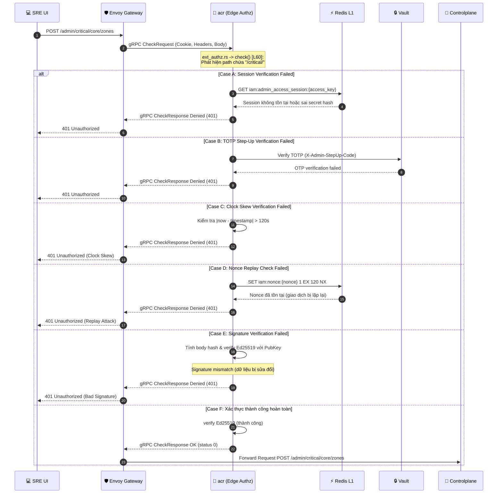
```mermaid
sequenceDiagram
    autonumber
    participant UI as 💻 SRE UI
    participant Envoy as 🛡️ Envoy Gateway
    participant ACR as 🔐 acr (Edge Authz)
    participant Redis as ⚡ Redis L1
    participant Vault as 🔒 Vault
    participant CP as 🚀 Controlplane

    UI->>Envoy: POST /admin/critical/core/zones
    Envoy->>ACR: gRPC CheckRequest (Cookie, Headers, Body)

    Note over ACR: ext_authz.rs -> check() [L60]:<br/>Phát hiện path chứa "/critical/"

    alt Case A: Session Verification Failed
        ACR->>Redis: GET iam:admin_access_session:{access_key}
        Redis-->>ACR: Session không tồn tại hoặc sai secret hash
        ACR-->>Envoy: gRPC CheckResponse Denied (401)
        Envoy-->>UI: 401 Unauthorized
    else Case B: TOTP Step-Up Verification Failed
        ACR->>Vault: Verify TOTP (X-Admin-StepUp-Code)
        Vault-->>ACR: OTP verification failed
        ACR-->>Envoy: gRPC CheckResponse Denied (401)
        Envoy-->>UI: 401 Unauthorized
    else Case C: Clock Skew Verification Failed
        ACR->>ACR: Kiểm tra |now - timestamp| > 120s
        ACR-->>Envoy: gRPC CheckResponse Denied (401)
        Envoy-->>UI: 401 Unauthorized (Clock Skew)
    else Case D: Nonce Replay Check Failed
        ACR->>Redis: SET iam:nonce:{nonce} 1 EX 120 NX
        Redis-->>ACR: Nonce đã tồn tại (giao dịch bị lặp lại)
        ACR-->>Envoy: gRPC CheckResponse Denied (401)
        Envoy-->>UI: 401 Unauthorized (Replay Attack)
    else Case E: Signature Verification Failed
        ACR->>ACR: Tính body hash & verify Ed25519 với PubKey
        Note over ACR: Signature mismatch (dữ liệu bị sửa đổi)
        ACR-->>Envoy: gRPC CheckResponse Denied (401)
        Envoy-->>UI: 401 Unauthorized (Bad Signature)
    else Case F: Xác thực thành công hoàn toàn
        ACR->>ACR: verify Ed25519 (thành công)
        ACR-->>Envoy: gRPC CheckResponse OK (status 0)
        Envoy->>CP: Forward Request POST /admin/critical/core/zones
    end
```

* **Tham chiếu code phía Client UI:**
  * Tạo và ký request: [`NewZone.tsx`](../../admin-ui/src/pages/zone/NewZone.tsx#L50) (hàm `confirmCreateZoneWithOTP()` và `handleTriggerOTP()`).
  * Quản lý cặp khóa và tạo signature: [`crypto.ts`](../../admin-ui/src/lib/crypto.ts#L10) (các hàm `getOrCreateDeviceKeys()`, `signPayload()`, và `sha256Hex()`).

* **Tham chiếu code xác thực biên:**
  * Route routing & filter: [`ext_authz.rs`](../../acr/src/service/ext_authz.rs#L415) (hàm `check()`, logic `is_critical_admin` và `verify_admin_totp()`).
  * Clock Skew & Nonce block: [`signature.rs#verify_admin_signature()`](../../acr/src/service/signature.rs#L13)
  * Ed25519 cryptographic check: [`signature.rs#verify_ed25519_signature()`](../../acr/src/service/signature.rs#L178)

---

### Phase 2: Controlplane Routing & Persistence (Go Backend)

Khi request vượt qua biên, Envoy sẽ chuyển tiếp gói tin gốc tới cụm Controlplane để thực thi nghiệp vụ lưu trữ trạng thái mong muốn.

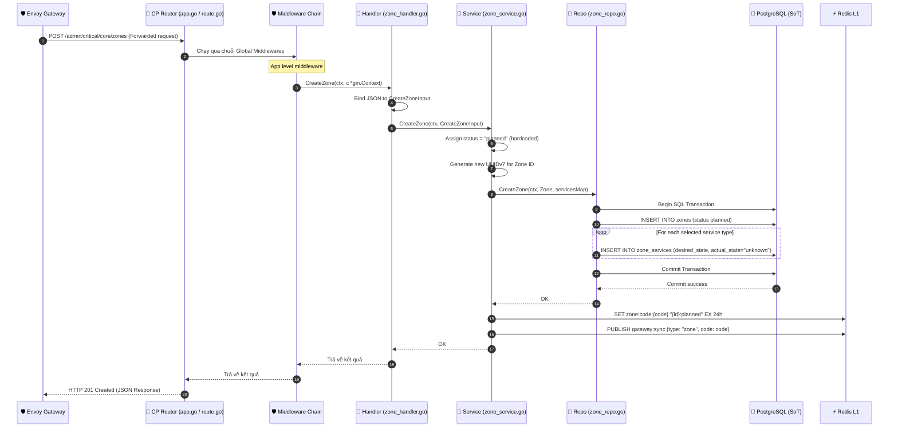
```mermaid
sequenceDiagram
    autonumber
    participant Envoy as 🛡️ Envoy Gateway
    participant Router as 🚀 CP Router (app.go / route.go)
    participant Midd as 🛡️ Middleware Chain
    participant Handler as 🚀 Handler (zone_handler.go)
    participant Service as 🚀 Service (zone_service.go)
    participant Repo as 🚀 Repo (zone_repo.go)
    participant DB as 💾 PostgreSQL (SoT)
    participant L1 as ⚡ Redis L1

    Envoy->>Router: POST /admin/critical/core/zones (Forwarded request)
    Router->>Midd: Chạy qua chuỗi Global Middlewares
    
    Note over Midd: App level middleware
    
    Midd->>Handler: CreateZone(ctx, c *gin.Context)
    Handler->>Handler: Bind JSON to CreateZoneInput
    Handler->>Service: CreateZone(ctx, CreateZoneInput)
    Service->>Service: Assign status = "planned" (hardcoded)
    Service->>Service: Generate new UUIDv7 for Zone ID
    Service->>Repo: CreateZone(ctx, Zone, servicesMap)
    
    Repo->>DB: Begin SQL Transaction
    Repo->>DB: INSERT INTO zones (status planned)
    loop For each selected service type
        Repo->>DB: INSERT INTO zone_services (desired_state, actual_state="unknown")
    end
    Repo->>DB: Commit Transaction
    DB-->>Repo: Commit success
    Repo-->>Service: OK
    
    Service->>L1: SET zone:code:{code} "{id}:planned" EX 24h
    Service->>L1: PUBLISH gateway:sync {type: "zone", code: code}
    Service-->>Handler: OK
    Handler-->>Midd: Trả về kết quả
    Midd-->>Router: Trả về kết quả
    Router-->>Envoy: HTTP 201 Created (JSON Response)
```

1. **CP Routing**: [`route.go`](../../controlplane/internal/hierarchy/route.go#L9) nhận gói tin được forward.
2. **Middleware Chain**: Gói tin đi qua chuỗi Global Middlewares định nghĩa tại [`app.go`](../../controlplane/internal/app/app.go#L193) trước khi đến handler:
   - `gin.Recovery()`: Hồi phục panic runtime.
   - `middleware.RequestID()`: Gán X-Request-ID duy nhất.
   - `middleware.OTelTraceContext()`: Đồng bộ trace context với OTel.
   - `middleware.OTelHTTPMetrics()`: Ghi nhận metrics HTTP lên Prometheus.
   - `middleware.AccessLog()`: Logging chi tiết request.
   - `middleware.AdminXSSI()`: Phòng chống tấn công Cross-Site Scripting Inclusion.
   - Không áp dụng Go-level authorization middleware vì SRE không cần phân quyền (SRE không phải account mà là phương thức xác minh nên không phân quyền mà là toàn quyền trên /admin api).
3. **HTTP Handler**: [`zone_handler.go#CreateZone()`](../../controlplane/internal/hierarchy/transport/http/handler/zone_handler.go#L43) giải mã JSON body vào struct `CreateZoneInput`.
4. **Core Service**: [`zone_service.go#CreateZone()`](../../controlplane/internal/hierarchy/service/zone_service.go#L80) thực hiện validate các quy tắc, tự động gán cứng trạng thái ban đầu của Zone là `planned` (không cho phép gán `active` trực tiếp), sinh ID UUIDv7 mới và gửi tới repo.
5. **Database Repository**: [`zone_repo.go#CreateZone()`](../../controlplane/internal/hierarchy/repository/zone_repo.go#L219) mở một cơ cấu giao dịch (Transaction):
   * INSERT bản ghi Zone vào bảng `zones` (status = `'planned'`).
   * UPSERT hàng loạt dịch vụ tương ứng vào bảng `zone_services` với cấu hình mong muốn `desired_state` nhận từ UI (actual_state mặc định là `'unknown'`).
6. **Post-Commit Invalidation**: Sau khi transaction commit thành công, service thực hiện ghi đè cache Redis L1 tại `zone:code:{code}` và phát tín hiệu `gateway:sync` để đồng bộ cache ACL biên.

---

### Phase 3: Dataplane Cluster Activation & Planned Behavior

Sau khi CSDL được cập nhật, Dataplane khởi động (hoặc đang chạy) với cấu hình `ZONE_ID` tương ứng sẽ phản ứng dựa theo trạng thái `planned` của phân vùng:

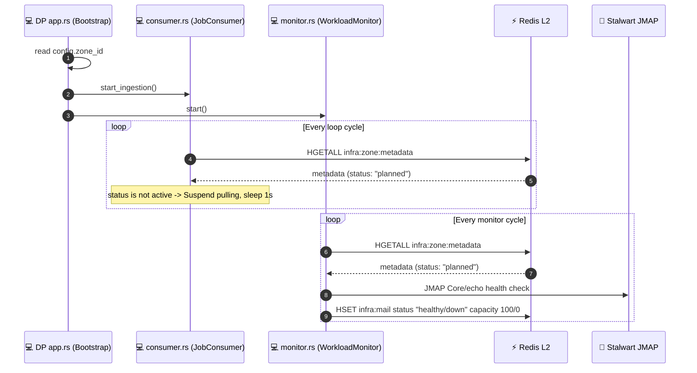
```mermaid
sequenceDiagram
    autonumber
    participant App as 💻 DP app.rs (Bootstrap)
    participant Consumer as 💻 consumer.rs (JobConsumer)
    participant Monitor as 💻 monitor.rs (WorkloadMonitor)
    participant L2 as ⚡ Redis L2
    participant SW as 📧 Stalwart JMAP

    App->>App: read config.zone_id
    App->>Consumer: start_ingestion()
    App->>Monitor: start()
    
    loop Every loop cycle
        Consumer->>L2: HGETALL infra:zone:metadata
        L2-->>Consumer: metadata (status: "planned")
        Note over Consumer: status is not active -> Suspend pulling, sleep 1s
    end

    loop Every monitor cycle
        Monitor->>L2: HGETALL infra:zone:metadata
        L2-->>Monitor: metadata (status: "planned")
        Monitor->>SW: JMAP Core/echo health check
        Monitor->>L2: HSET infra:mail status "healthy/down" capacity 100/0
    end
```

1. **Khởi chạy container**: Tiến trình Dataplane bootstrap tại [`app.rs#AppContainer::start()`](../../dataplane/src/app.rs#L55).
2. **Ingestion Loop (Job Consumer)**: [`consumer.rs#start_ingestion()`](../../dataplane/src/job_lifecycle/consumer.rs#L56) kiểm tra trạng thái Zone từ Redis L2 (`infra:zone:metadata`). Vì trạng thái là `planned` (chưa active), consumer sẽ ngắt kéo Job mới từ Platform L1, sleep 1s loop và ghi nhận log tạm dừng.
3. **Workload Health Check**:
   * Monitor tại [`monitor.rs`](../../dataplane/src/executor/mail/monitor.rs) dùng JMAP health cùng local pending/in-flight batch pressure để báo cáo capacity; không còn LMTP socket probe.
   * Node Resource Monitor báo cáo năng lực phần cứng Dataplane node lên Redis L2 tại key `dataplane:node:{node_id}`.

---

### Phase 4: CDC & Telemetry Write-back (Cập nhật Actual State)

Hệ thống đồng bộ cấu hình desired state xuống và kéo chỉ số actual state lên thông qua Job Orchestrator:

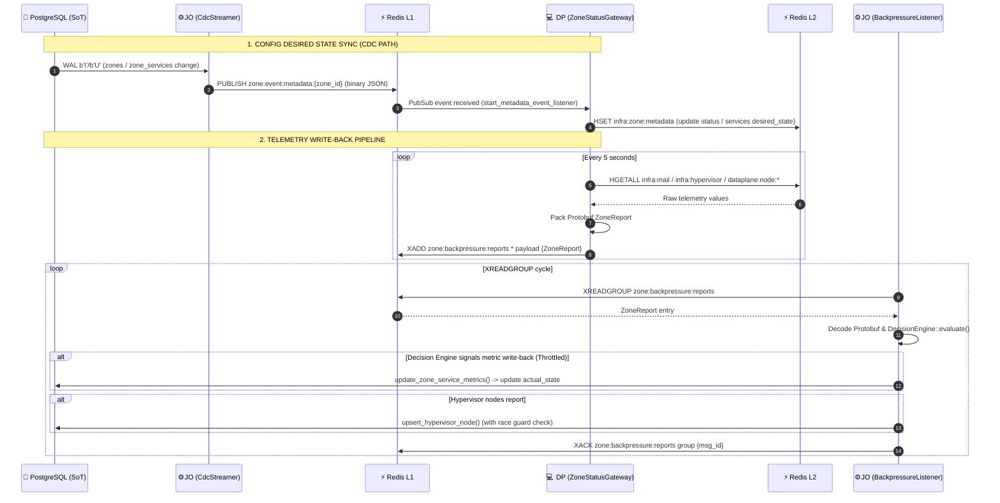
```mermaid
sequenceDiagram
    autonumber
    participant DB as 💾 PostgreSQL (SoT)
    participant JO_CDC as ⚙️ JO (CdcStreamer)
    participant L1 as ⚡ Redis L1
    participant DP_Gate as 💻 DP (ZoneStatusGateway)
    participant L2 as ⚡ Redis L2
    participant JO_Back as ⚙️ JO (BackpressureListener)

    Note over DB,DP_Gate: 1. CONFIG DESIRED STATE SYNC (CDC PATH)
    DB->>JO_CDC: WAL b'I'/b'U' (zones / zone_services change)
    JO_CDC->>L1: PUBLISH zone:event:metadata:{zone_id} (binary JSON)
    L1->>DP_Gate: PubSub event received (start_metadata_event_listener)
    DP_Gate->>L2: HSET infra:zone:metadata (update status / services desired_state)

    Note over DP_Gate,DB: 2. TELEMETRY WRITE-BACK PIPELINE
    loop Every 5 seconds
        DP_Gate->>L2: HGETALL infra:mail / infra:hypervisor / dataplane:node:*
        L2-->>DP_Gate: Raw telemetry values
        DP_Gate->>DP_Gate: Pack Protobuf ZoneReport
        DP_Gate->>L1: XADD zone:backpressure:reports * payload {ZoneReport}
    end

    loop XREADGROUP cycle
        JO_Back->>L1: XREADGROUP zone:backpressure:reports
        L1-->>JO_Back: ZoneReport entry
        JO_Back->>JO_Back: Decode Protobuf & DecisionEngine::evaluate()
        alt Decision Engine signals metric write-back (Throttled)
            JO_Back->>DB: update_zone_service_metrics() -> update actual_state
        end
        alt Hypervisor nodes report
            JO_Back->>DB: upsert_hypervisor_node() (with race guard check)
        end
        JO_Back->>L1: XACK zone:backpressure:reports group {msg_id}
    end
```

1. **CDC Metadata Event**:
   * PostgreSQL WAL ghi nhận hành động ghi của Phase 2 và stream trực tiếp tới JO [`CdcStreamer`](../../job-orchestrator/src/cdc/mod.rs).
   * JO bắt sự kiện thay đổi trên các bảng metadata và publish event lên Redis L1 `zone:event:metadata:{zone_id}`.
   * DP Node [`start_metadata_event_listener()`](../../dataplane/src/zone_gateway.rs#L293) subscribe kênh này và đồng bộ ngay lập tức cấu hình mong muốn vào Redis L2 `infra:zone:metadata`.
2. **Telemetry Pack & Report**:
   * Dataplane [`ZoneStatusGateway`](../../dataplane/src/zone_gateway.rs#L27) chạy định kỳ mỗi 5s, tổng hợp tài nguyên cluster từ L2 (CPU/RAM trung bình node, status và capacity thực tế của workloads).
   * Gateway đóng gói dữ liệu dạng Protobuf và push vào Redis L1 stream `zone:backpressure:reports`.
3. **Write-back DB SoT**:
   * JO [`run_backpressure_listener()`](../../job-orchestrator/src/reverse_provider/zone/listener.rs#L15) đọc stream L1, decode Protobuf.
   * Gọi [`DecisionEngine::evaluate()`](../../job-orchestrator/src/reverse_provider/zone/decision.rs#L7) tính toán và tự động cập nhật `actual_state` vào bảng `zone_services` thông qua [`db.rs#update_zone_service_metrics()`](../../job-orchestrator/src/reverse_provider/zone/db.rs#L197) (sử dụng cơ chế Throttled Write để chống spam IOPS).

---

---

## 5. Luồng Cập Nhật Status Zone

Quy trình thay đổi trạng thái vận hành của một phân vùng (ví dụ: chuyển từ `planned` sang `active`) trải qua 3 giai đoạn chính.

---

### Phase 1: Client → Envoy & acr (Xác thực Biên)

SRE gửi yêu cầu thay đổi trạng thái của Zone. Request đi qua cụm biên để thực hiện xác thực chữ ký số Ed25519 và TOTP Step-Up MFA.

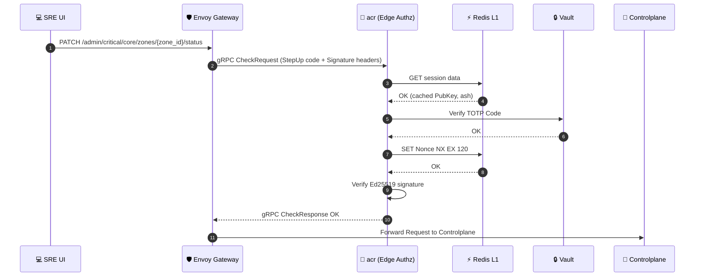
```mermaid
sequenceDiagram
    autonumber
    participant UI as 💻 SRE UI
    participant Envoy as 🛡️ Envoy Gateway
    participant ACR as 🔐 acr (Edge Authz)
    participant Redis as ⚡ Redis L1
    participant Vault as 🔒 Vault
    participant CP as 🚀 Controlplane

    UI->>Envoy: PATCH /admin/critical/core/zones/{zone_id}/status
    Envoy->>ACR: gRPC CheckRequest (StepUp code + Signature headers)
    
    ACR->>Redis: GET session data
    Redis-->>ACR: OK (cached PubKey, ash)
    ACR->>Vault: Verify TOTP Code
    Vault-->>ACR: OK
    ACR->>Redis: SET Nonce NX EX 120
    Redis-->>ACR: OK
    ACR->>ACR: Verify Ed25519 signature
    
    ACR-->>Envoy: gRPC CheckResponse OK
    Envoy->>CP: Forward Request to Controlplane
```

* **Tham chiếu code xác thực biên:**
  * Endpoint routing: `/admin/critical/core/zones/:zone_id/status`
  * Logic check và verify tương tự luồng khởi tạo, thực thi tại [`ext_authz.rs`](../../acr/src/service/ext_authz.rs#L415).

---

### Phase 2: Controlplane Processing & Persistence (Go Backend)

Controlplane kiểm tra tính hợp lệ của việc chuyển dịch trạng thái trước khi ghi nhận vào DB SoT và cập nhật cache L1.

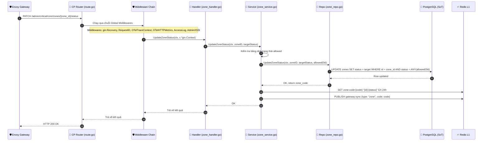
```mermaid
sequenceDiagram
    autonumber
    participant Envoy as 🛡️ Envoy Gateway
    participant Router as 🚀 CP Router (route.go)
    participant Midd as 🛡️ Middleware Chain
    participant Handler as 🚀 Handler (zone_handler.go)
    participant Service as 🚀 Service (zone_service.go)
    participant Repo as 🚀 Repo (zone_repo.go)
    participant DB as 💾 PostgreSQL (SoT)
    participant L1 as ⚡ Redis L1

    Envoy->>Router: PATCH /admin/critical/core/zones/{zone_id}/status
    Router->>Midd: Chạy qua chuỗi Global Middlewares
    
    Note over Midd: Middlewares: gin.Recovery, RequestID, OTelTraceContext, OTelHTTPMetrics, AccessLog, AdminXSSI
    
    Midd->>Handler: UpdateZoneStatus(ctx, c *gin.Context)
    Handler->>Service: UpdateZoneStatus(ctx, zoneID, targetStatus)
    Service->>Service: Kiểm tra bảng dịch trạng thái allowed
    Service->>Repo: UpdateZoneStatus(ctx, zoneID, targetStatus, allowedOld)
    Repo->>DB: UPDATE zones SET status = target WHERE id = zone_id AND status = ANY(allowedOld)
    DB-->>Repo: Row updated
    Repo-->>Service: OK, return zone_code
    Service->>L1: SET zone:code:{code} "{id}:{status}" EX 24h
    Service->>L1: PUBLISH gateway:sync {type: "zone", code: code}
    Service-->>Handler: OK
    Handler-->>Midd: Trả về kết quả
    Midd-->>Router: Trả về kết quả
    Router-->>Envoy: HTTP 200 OK
```

1. **Routing**: [`route.go`](../../controlplane/internal/hierarchy/route.go#L20) nhận request chuyển tiếp.
2. **Global Middlewares**: Giao dịch đi qua chuỗi middlewares ở [`app.go`](../../controlplane/internal/app/app.go#L193):
   - `gin.Recovery()`: Hồi phục panic runtime.
   - `middleware.RequestID()`: Gán X-Request-ID duy nhất.
   - `middleware.OTelTraceContext()`: Đồng bộ trace context với OTel.
   - `middleware.OTelHTTPMetrics()`: Ghi nhận metrics HTTP lên Prometheus.
   - `middleware.AccessLog()`: Logging chi tiết request.
   - `middleware.AdminXSSI()`: Phòng chống tấn công Cross-Site Scripting Inclusion.
   - Không áp dụng Go-level authorization middleware vì SRE có toàn quyền.
3. **Handler**: [`zone_handler.go#UpdateZoneStatus()`](../../controlplane/internal/hierarchy/transport/http/handler/zone_handler.go#L253) giải mã payload `{"status": "active"}`.
4. **Service**: [`zone_service.go#UpdateZoneStatus()`](../../controlplane/internal/hierarchy/service/zone_service.go#L141) đối chiếu với bảng allowed transitions. Nếu hợp lệ, gọi repo thực hiện truy vấn.
5. **CSDL (Repo)**: [`zone_repo.go#UpdateZoneStatus()`](../../controlplane/internal/hierarchy/repository/zone_repo.go#L337) chạy truy vấn CTE cập nhật cột `status` với điều kiện khớp các trạng thái cũ hợp lệ.
6. **Cache Invalidation**: Service ghi đè Redis L1 `zone:code:{code}` và publish event `gateway:sync` để thông báo cho lớp gateway cập nhật bộ đệm định tuyến biên.

---

### Phase 3: CDC Sync & Dataplane State Machine Reaction

Trạng thái mới lan truyền xuống Dataplane qua CDC và định hình lại cơ chế kéo job / healthcheck của cluster.

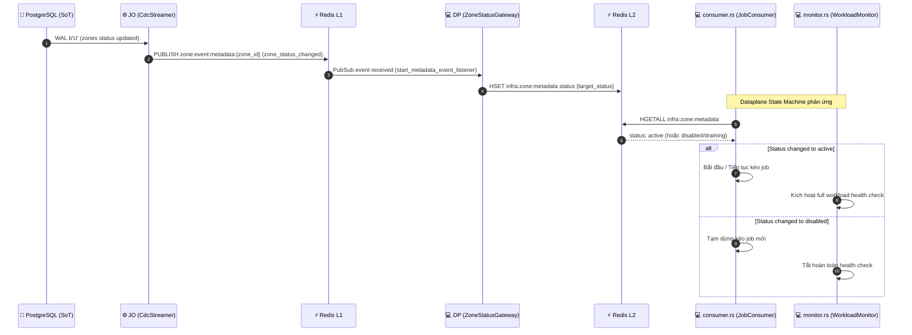
```mermaid
sequenceDiagram
    autonumber
    participant DB as 💾 PostgreSQL (SoT)
    participant JO_CDC as ⚙️ JO (CdcStreamer)
    participant L1 as ⚡ Redis L1
    participant DP_Gate as 💻 DP (ZoneStatusGateway)
    participant L2 as ⚡ Redis L2
    participant Consumer as 💻 consumer.rs (JobConsumer)
    participant Monitor as 💻 monitor.rs (WorkloadMonitor)

    DB->>JO_CDC: WAL b'U' (zones status updated)
    JO_CDC->>L1: PUBLISH zone:event:metadata:{zone_id} (zone_status_changed)
    L1->>DP_Gate: PubSub event received (start_metadata_event_listener)
    DP_Gate->>L2: HSET infra:zone:metadata status {target_status}
    
    Note over Consumer,Monitor: Dataplane State Machine phản ứng
    Consumer->>L2: HGETALL infra:zone:metadata
    L2-->>Consumer: status: active (hoặc disabled/draining)
    alt Status changed to active
        Consumer->>Consumer: Bắt đầu / Tiếp tục kéo job
        Monitor->>Monitor: Kích hoạt full workload health check
    else Status changed to disabled
        Consumer->>Consumer: Tạm dừng kéo job mới
        Monitor->>Monitor: Tắt hoàn toàn health check
    end
```

1. **CDC Broadcast**: Sự kiện update bảng `zones` được stream từ WAL Postgres đến JO [`CdcStreamer`](../../job-orchestrator/src/cdc/mod.rs) và được publish lên kênh Redis L1 `zone:event:metadata:{zone_id}`.
2. **Dataplane L2 Sync**: DP Node [`start_metadata_event_listener()`](../../dataplane/src/zone_gateway.rs#L293) ghi trạng thái mới vào Redis L2 `infra:zone:metadata`.
3. **State Machine Reaction**:
   * **Job Consumer**: [`consumer.rs#start_ingestion()`](../../dataplane/src/job_lifecycle/consumer.rs#L56) ở chu kỳ lặp mới đọc trạng thái `active` từ L2, tiến hành kéo job trở lại. Nếu trạng thái là `disabled`, `maintenance`, hoặc `draining` -> ngừng kéo job mới.
   * **Workload Health Check**: [`monitor.rs#start()`](../../dataplane/src/executor/mail/core/monitor.rs#L20) nếu đọc thấy status `active` sẽ khôi phục quét metrics đầy đủ, nếu là `disabled` sẽ tắt hẳn monitor.

---

## 6. Luồng Bật/Tắt Service Trong Zone

Kiểm soát việc cung cấp cấu hình dịch vụ mong muốn (desired_state) trong Zone, bắt buộc phải thực hiện trong trạng thái bảo trì.

---

### Phase 1: Client → Envoy & acr (Xác thực Biên)

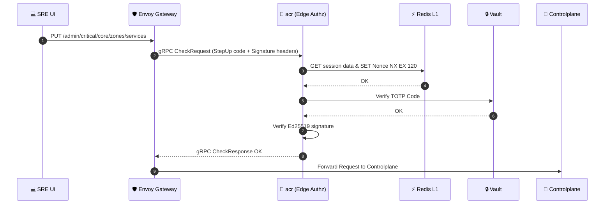
```mermaid
sequenceDiagram
    autonumber
    participant UI as 💻 SRE UI
    participant Envoy as 🛡️ Envoy Gateway
    participant ACR as 🔐 acr (Edge Authz)
    participant Redis as ⚡ Redis L1
    participant Vault as 🔒 Vault
    participant CP as 🚀 Controlplane

    UI->>Envoy: PUT /admin/critical/core/zones/services
    Envoy->>ACR: gRPC CheckRequest (StepUp code + Signature headers)
    
    ACR->>Redis: GET session data & SET Nonce NX EX 120
    Redis-->>ACR: OK
    ACR->>Vault: Verify TOTP Code
    Vault-->>ACR: OK
    ACR->>ACR: Verify Ed25519 signature
    
    ACR-->>Envoy: gRPC CheckResponse OK
    Envoy->>CP: Forward Request to Controlplane
```

* **Tham chiếu code xác thực biên:**
  * Endpoint routing: `/admin/critical/core/zones/services`
  * Xác thực tương tự luồng khởi tạo, thực thi tại [`ext_authz.rs`](../../acr/src/service/ext_authz.rs#L415).

---

### Phase 2: Controlplane Processing & Persistence (Go Backend)

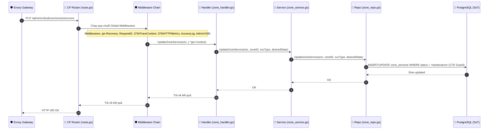
```mermaid
sequenceDiagram
    autonumber
    participant Envoy as 🛡️ Envoy Gateway
    participant Router as 🚀 CP Router (route.go)
    participant Midd as 🛡️ Middleware Chain
    participant Handler as 🚀 Handler (zone_handler.go)
    participant Service as 🚀 Service (zone_service.go)
    participant Repo as 🚀 Repo (zone_repo.go)
    participant DB as 💾 PostgreSQL (SoT)

    Envoy->>Router: PUT /admin/critical/core/zones/services
    Router->>Midd: Chạy qua chuỗi Global Middlewares
    
    Note over Midd: Middlewares: gin.Recovery, RequestID, OTelTraceContext, OTelHTTPMetrics, AccessLog, AdminXSSI
    
    Midd->>Handler: UpdateZoneService(ctx, c *gin.Context)
    Handler->>Service: UpdateZoneService(ctx, zoneID, svcType, desiredState)
    Service->>Repo: UpdateZoneService(ctx, zoneID, svcType, desiredState)
    Repo->>DB: INSERT/UPDATE zone_services WHERE status = 'maintenance' (CTE Guard)
    DB-->>Repo: Row updated
    Repo-->>Service: OK
    Service-->>Handler: OK
    Handler-->>Midd: Trả về kết quả
    Midd-->>Router: Trả về kết quả
    Router-->>Envoy: HTTP 200 OK
```

1. **Routing**: [`route.go`](../../controlplane/internal/hierarchy/route.go#L29) nhận request `PUT`.
2. **Global Middlewares**: Giao dịch đi qua chuỗi middlewares ở [`app.go`](../../controlplane/internal/app/app.go#L193):
   - `gin.Recovery()`: Hồi phục panic.
   - `middleware.RequestID()`: Gán Request ID.
   - `middleware.OTelTraceContext()`: OTel tracing.
   - `middleware.OTelHTTPMetrics()`: Prometheus metrics.
   - `middleware.AccessLog()`: Access logging.
   - `middleware.AdminXSSI()`: XSSI guard.
   - Không áp dụng Go-level authorization middleware vì SRE có toàn quyền.
3. **HTTP Handler**: [`zone_handler.go#UpdateZoneService()`](../../controlplane/internal/hierarchy/transport/http/handler/zone_handler.go#L355) giải mã payload mong muốn.
4. **Core Service**: [`zone_service.go#UpdateZoneService()`](../../controlplane/internal/hierarchy/service/zone_service.go#L196) kiểm tra trạng thái hiện tại của Zone. Nếu không phải `maintenance` -> trả lỗi `ErrZoneServiceStateConflict`.
5. **Database (Repo)**: [`zone_repo.go#UpdateZoneService()`](../../controlplane/internal/hierarchy/repository/zone_repo.go#L401) chạy truy vấn CTE. Giao dịch chỉ cập nhật/chèn desired_state mới nếu trạng thái Zone khớp `maintenance`.

---

### Phase 3: CDC Sync & Dataplane Health Check Mode Transition

> [!IMPORTANT]
> **Nguyên tắc cốt lõi**: Health check chỉ chạy cho service đang **enabled**. Service bị tắt (`desired_state = false`) **không được** health check và **không được** đưa vào DecisionEngine. Đây là SOT cho toàn bộ luồng bật/tắt service.

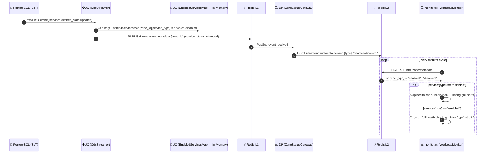
```mermaid
sequenceDiagram
    autonumber
    participant DB as 💾 PostgreSQL (SoT)
    participant JO_CDC as ⚙️ JO (CdcStreamer)
    participant JO_RAM as 🧠 JO (EnabledServicesMap — In-Memory)
    participant L1 as ⚡ Redis L1
    participant DP_Gate as 💻 DP (ZoneStatusGateway)
    participant L2 as ⚡ Redis L2
    participant Monitor as 💻 monitor.rs (WorkloadMonitor)

    DB->>JO_CDC: WAL b'U' (zone_services desired_state updated)
    JO_CDC->>JO_RAM: Cập nhật EnabledServicesMap[zone_id][service_type] = enabled/disabled
    JO_CDC->>L1: PUBLISH zone:event:metadata:{zone_id} (service_status_changed)
    L1->>DP_Gate: PubSub event received
    DP_Gate->>L2: HSET infra:zone:metadata service:{type} "enabled/disabled"
    
    loop Every monitor cycle
        Monitor->>L2: HGETALL infra:zone:metadata
        L2-->>Monitor: service:{type} = "enabled" | "disabled"
        alt service:{type} == "disabled"
            Monitor->>Monitor: Skip health check hoàn toàn — không ghi metric
        else service:{type} == "enabled"
            Monitor->>Monitor: Thực thi full health check, ghi infra:{type} vào L2
        end
    end
```

1. **CDC Event & RAM Update**: JO [`CdcStreamer`](../../job-orchestrator/src/cdc/mod.rs) phát hiện update trên `zone_services` → cập nhật ngay **`EnabledServicesMap`** trong RAM của JO (SOT điều phối health check) → PUBLISH sự kiện `service_status_changed` lên Redis L1.
2. **DP Listener**: [`start_metadata_event_listener()`](../../dataplane/src/zone_gateway.rs#L293) hứng và ghi đè cấu hình `desired_state` của service vào L2 `infra:zone:metadata`.
3. **Monitor Reaction**: [`monitor.rs#start()`](../../dataplane/src/executor/mail/core/monitor.rs#L20) ở chu kỳ quét tiếp theo đọc `service:{type}` từ L2. Nếu `"disabled"` → **bỏ qua hoàn toàn**, không ghi metric, không báo cáo `down`. Nếu `"enabled"` → thực thi full health check.
4. **Fallback khi miss RAM**: Nếu `EnabledServicesMap` trong JO không có entry cho zone_id+service (ví dụ sau khi JO restart), JO **đọc trực tiếp từ PostgreSQL** (`zone_services` table) để lấy `desired_state` hiện tại và nạp lại vào RAM trước khi ra quyết định.

---

## 7. Luồng Xóa Zone

Xóa bỏ hoàn toàn một phân vùng hạ tầng khỏi cơ sở dữ liệu khi phân vùng đó không còn sử dụng.

---

### Phase 1: Client → Envoy & acr (Xác thực Biên)

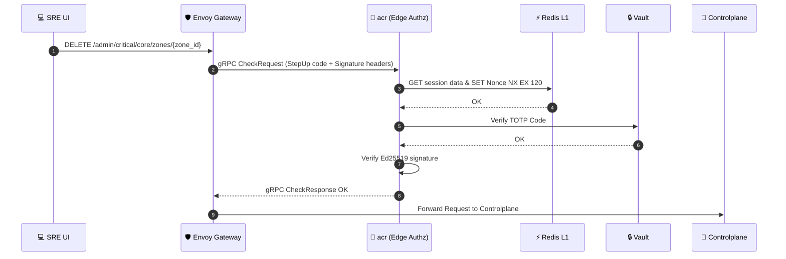
```mermaid
sequenceDiagram
    autonumber
    participant UI as 💻 SRE UI
    participant Envoy as 🛡️ Envoy Gateway
    participant ACR as 🔐 acr (Edge Authz)
    participant Redis as ⚡ Redis L1
    participant Vault as 🔒 Vault
    participant CP as 🚀 Controlplane

    UI->>Envoy: DELETE /admin/critical/core/zones/{zone_id}
    Envoy->>ACR: gRPC CheckRequest (StepUp code + Signature headers)
    
    ACR->>Redis: GET session data & SET Nonce NX EX 120
    Redis-->>ACR: OK
    ACR->>Vault: Verify TOTP Code
    Vault-->>ACR: OK
    ACR->>ACR: Verify Ed25519 signature
    
    ACR-->>Envoy: gRPC CheckResponse OK
    Envoy->>CP: Forward Request to Controlplane
```

* **Tham chiếu code xác thực biên:**
  * Endpoint routing: `/admin/critical/core/zones/:zone_id`
  * Xác thực tương tự luồng khởi tạo, thực thi tại [`ext_authz.rs`](../../acr/src/service/ext_authz.rs#L415).

---

### Phase 2: Controlplane Processing & Deletion (Go Backend)

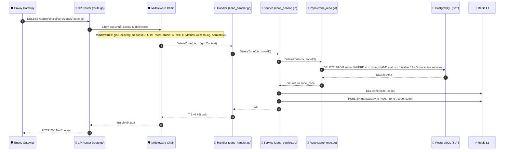
```mermaid
sequenceDiagram
    autonumber
    participant Envoy as 🛡️ Envoy Gateway
    participant Router as 🚀 CP Router (route.go)
    participant Midd as 🛡️ Middleware Chain
    participant Handler as 🚀 Handler (zone_handler.go)
    participant Service as 🚀 Service (zone_service.go)
    participant Repo as 🚀 Repo (zone_repo.go)
    participant DB as 💾 PostgreSQL (SoT)
    participant L1 as ⚡ Redis L1

    Envoy->>Router: DELETE /admin/critical/core/zones/{zone_id}
    Router->>Midd: Chạy qua chuỗi Global Middlewares
    
    Note over Midd: Middlewares: gin.Recovery, RequestID, OTelTraceContext, OTelHTTPMetrics, AccessLog, AdminXSSI
    
    Midd->>Handler: DeleteZone(ctx, c *gin.Context)
    Handler->>Service: DeleteZone(ctx, zoneID)
    Service->>Repo: DeleteZone(ctx, zoneID)
    Repo->>DB: DELETE FROM zones WHERE id = zone_id AND status = 'disabled' AND (no active services)
    DB-->>Repo: Row deleted
    Repo-->>Service: OK, return zone_code
    Service->>L1: DEL zone:code:{code}
    Service->>L1: PUBLISH gateway:sync {type: "zone", code: code}
    Service-->>Handler: OK
    Handler-->>Midd: Trả về kết quả
    Midd-->>Router: Trả về kết quả
    Router-->>Envoy: HTTP 204 No Content
```

1. **Routing**: [`route.go`](../../controlplane/internal/hierarchy/route.go#L25) nhận request `DELETE`.
2. **Global Middlewares**: Giao dịch đi qua chuỗi middlewares ở [`app.go`](../../controlplane/internal/app/app.go#L193):
   - `gin.Recovery()`: Hồi phục panic.
   - `middleware.RequestID()`: Request tracking.
   - `middleware.OTelTraceContext()`: Tracing context.
   - `middleware.OTelHTTPMetrics()`: Prometheus HTTP metrics.
   - `middleware.AccessLog()`: Access logging.
   - `middleware.AdminXSSI()`: XSSI protection.
   - Không áp dụng Go-level authorization middleware vì SRE có toàn quyền.
3. **HTTP Handler**: [`zone_handler.go#DeleteZone()`](../../controlplane/internal/hierarchy/transport/http/handler/zone_handler.go#L312) nhận diện ID cần xóa.
4. **Core Service**: [`zone_service.go#DeleteZone()`](../../controlplane/internal/hierarchy/service/zone_service.go#L177) xác nhận xóa.
5. **Database Deletion (Repo)**: [`zone_repo.go#DeleteZone()`](../../controlplane/internal/hierarchy/repository/zone_repo.go#L372) thực thi truy vấn CTE kiểm tra chặt chẽ điều kiện tiên quyết (Zone phải ở status `disabled` và không có dịch vụ nào đang kích hoạt). Nếu thỏa mãn, thực thi xóa cứng ( cascade xóa service, restrict lỗi nếu còn workspaces).
6. **Cache Purge**: Service thực hiện DEL key `zone:code:{code}` và publish event `gateway:sync` để thông báo cho edge proxy cập nhật bảng định tuyến biên.

---

### Phase 3: CDC Sync & Dataplane/Orchestrator Detach

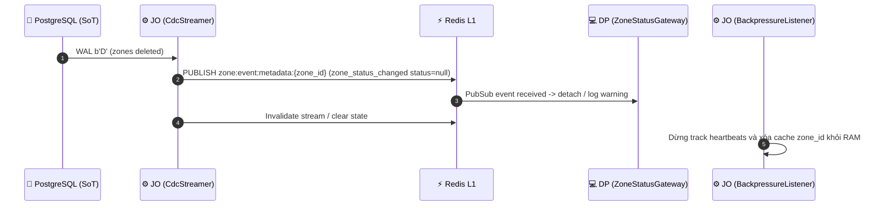
```mermaid
sequenceDiagram
    autonumber
    participant DB as 💾 PostgreSQL (SoT)
    participant JO_CDC as ⚙️ JO (CdcStreamer)
    participant L1 as ⚡ Redis L1
    participant DP_Gate as 💻 DP (ZoneStatusGateway)
    participant JO_Back as ⚙️ JO (BackpressureListener)

    DB->>JO_CDC: WAL b'D' (zones deleted)
    JO_CDC->>L1: PUBLISH zone:event:metadata:{zone_id} (zone_status_changed status=null)
    L1->>DP_Gate: PubSub event received -> detach / log warning
    JO_CDC->>L1: Invalidate stream / clear state
    JO_Back->>JO_Back: Dừng track heartbeats và xóa cache zone_id khỏi RAM
```

1. **CDC Broadcast**: JO [`CdcStreamer`](../../job-orchestrator/src/cdc/mod.rs) phát hiện sự kiện DELETE (`b'D'`) -> PUBLISH sự kiện `zone_status_changed` với payload status null lên L1.
2. **DP Detach**: DP [`start_metadata_event_listener()`](../../dataplane/src/zone_gateway.rs#L293) ghi nhận và đưa agent về trạng thái treo/dừng hoạt động đồng bộ.
3. **JO Cleanup**: JO Backpressure Listener [`listener.rs`](../../job-orchestrator/src/reverse_provider/zone/listener.rs#L15) dừng tracking heartbeat của zone và dọn dẹp các cache vùng nhớ tạm trên RAM.

---

## 9. Reconciliation Polling — Self-Healing Fallback

Cơ chế tự phục hồi cấu hình (Self-Healing) giúp đảm bảo Dataplane luôn đồng bộ trạng thái mong muốn từ Database SoT ngay cả khi có sự cố mạng.

---

### 9.1 Lý Do Cần Thiết
* **Tính chất phi trạng thái của Redis PubSub**: Redis PubSub không lưu trữ lịch sử tin nhắn. Nếu kết nối mạng giữa Dataplane và Redis L1 bị mất lúc Controlplane phát sự kiện CDC, Dataplane sẽ bỏ lỡ cấu hình mới (packet loss).
* **Self-Healing Fallback**: Polling hoạt động như một chốt chặn cuối cùng để tự động vá lỗi lệch cấu hình (desynchronization) giữa desired_state ở Database và actual_state chạy thực tế tại Dataplane.

---

### 9.2 Cơ Chế Trigger
1. **Khởi động nguội (Cold Start)**: Trigger ngay lập tức khi Dataplane boot up. Biến đếm `counter` được khởi tạo bằng giá trị tối đa `720` tại [`zone_gateway.rs`](../../dataplane/src/zone_gateway.rs#L44).
2. **Định kỳ (Periodic Polling)**: Mỗi 60 phút (tiến trình Gateway chạy vòng lặp 5 giây, khi biến đếm đạt `720` chu kỳ sẽ tự động kích hoạt đồng bộ tại [`zone_gateway.rs`](../../dataplane/src/zone_gateway.rs#L50)).
3. **Distributed Lock Guard**: Tranh chấp lock nguyên tử `lock:zone:sync_metadata` trên Redis L2 với thời gian hết hạn (TTL) 10 giây. Chỉ duy nhất node thắng cuộc được thực hiện truy vấn để tránh bão truy vấn lên Database SoT. Giải phóng lock nguyên tử bằng Lua script tại [`zone_gateway.rs`](../../dataplane/src/zone_gateway.rs#L558).
4. **JO Metadata Handler**: JO lắng nghe kênh truy vấn tại [`listener.rs#run_metadata_query_listener()`](../../job-orchestrator/src/reverse_provider/zone/listener.rs#L460) để đọc dữ liệu SoT trực tiếp từ Postgres và phản hồi ngược lại cho Dataplane.

---

### 9.3 Quy Trình Đồng Bộ (Sequence Diagram)

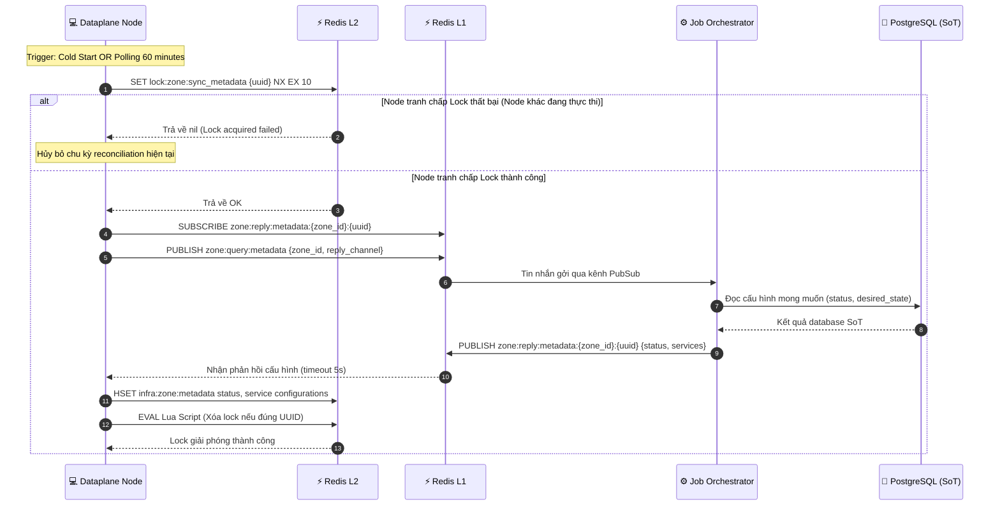
```mermaid
sequenceDiagram
    autonumber
    participant DP_Node as 💻 Dataplane Node
    participant L2 as ⚡ Redis L2
    participant L1 as ⚡ Redis L1
    participant JO as ⚙️ Job Orchestrator
    participant DB as 💾 PostgreSQL (SoT)

    Note over DP_Node: Trigger: Cold Start OR Polling 60 minutes
    DP_Node->>L2: SET lock:zone:sync_metadata {uuid} NX EX 10
    
    alt Node tranh chấp Lock thất bại (Node khác đang thực thi)
        L2-->>DP_Node: Trả về nil (Lock acquired failed)
        Note over DP_Node: Hủy bỏ chu kỳ reconciliation hiện tại
    else Node tranh chấp Lock thành công
        L2-->>DP_Node: Trả về OK
        DP_Node->>L1: SUBSCRIBE zone:reply:metadata:{zone_id}:{uuid}
        DP_Node->>L1: PUBLISH zone:query:metadata {zone_id, reply_channel}
        
        L1->>JO: Tin nhắn gởi qua kênh PubSub
        JO->>DB: Đọc cấu hình mong muốn (status, desired_state)
        DB-->>JO: Kết quả database SoT
        JO->>L1: PUBLISH zone:reply:metadata:{zone_id}:{uuid} {status, services}
        
        L1-->>DP_Node: Nhận phản hồi cấu hình (timeout 5s)
        DP_Node->>L2: HSET infra:zone:metadata status, service configurations
        
        DP_Node->>L2: EVAL Lua Script (Xóa lock nếu đúng UUID)
        L2-->>DP_Node: Lock giải phóng thành công
    end
```

---

## 10. Dataplane State Machine

### 10.1 Redis L2 Key: `infra:zone:metadata`

```
HGETALL infra:zone:metadata → {
    "status":              "planned" | "active" | "draining" | "maintenance" | "disabled",
    "service:mail":        "enabled" | "disabled",
    "service:hypervisor":  "enabled" | "disabled",
    "service:kubernetes":  "enabled" | "disabled",
    "service:ai":          "enabled" | "disabled",
    "service:storage":     "enabled" | "disabled",
    "updated_at":          unix_timestamp
}
```

### 10.2 Bảng Phản Ứng

Đọc **mỗi chu kỳ** của từng daemon (5-15 giây).

> [!IMPORTANT]
> **Nguyên tắc enabled-only**: Monitor chỉ health check service đang `enabled`. Service bị `disabled` → monitor bỏ qua hoàn toàn (không check, không ghi metric). DecisionEngine chỉ nhận đầu vào từ service đang `enabled`.

| Zone Status | Service | Job Consumer | Mail Monitor | Storage Monitor | Hypervisor Monitor |
|:---|:---|:---|:---|:---|:---|
| **`active`** | `enabled` | ✅ Kéo job bình thường | ✅ TCP + HTTP metrics, capacity 0-100 | ✅ HTTP health check MinIO | ✅ Poll Proxmox 15s |
| **`active`** | `disabled` | ✅ Kéo job | ⏭️ Skip hoàn toàn — không metric | ⏭️ Skip hoàn toàn | ⏭️ Skip hoàn toàn |
| **`planned`** | `enabled` | ⏸️ sleep 1s, loop | ⚡ TCP only (không scan SMTP queue) | ⚡ TCP only | ✅ Poll Proxmox 15s |
| **`planned`** | `disabled` | ⏸️ sleep 1s, loop | ⏭️ Skip hoàn toàn | ⏭️ Skip hoàn toàn | ⏭️ Skip hoàn toàn |
| **`maintenance`** | `enabled` | ⏸️ Không kéo job mới | ✅ Full check + capacity | ✅ Full check | ✅ Poll Proxmox 15s |
| **`maintenance`** | `disabled` | ⏸️ Không kéo job mới | ⏭️ Skip hoàn toàn | ⏭️ Skip hoàn toàn | ⏭️ Skip hoàn toàn |
| **`draining`** | `enabled` | ⏸️ Không kéo job mới | ✅ Full check + capacity | ✅ Full check | ✅ Poll Proxmox 15s |
| **`draining`** | `disabled` | ⏸️ Không kéo job mới | ⏭️ Skip hoàn toàn | ⏭️ Skip hoàn toàn | ⏭️ Skip hoàn toàn |
| **`disabled`** | any | ⏸️ Dừng hoàn toàn | ❌ status=down, capacity=0 | ❌ status=down | ❌ Dừng poll |

## 11. Dataplane Health Monitors

Cụm Dataplane định kỳ quét sức khỏe của phần cứng và các workloads chạy trong phân vùng để cập nhật vào Redis L2.

---

### 11.1 Workload Monitor (Mail / Stalwart)

Báo cáo trạng thái Mail JMAP và local batch pressure. Triển khai tại [`monitor.rs`](../../dataplane/src/executor/mail/monitor.rs).

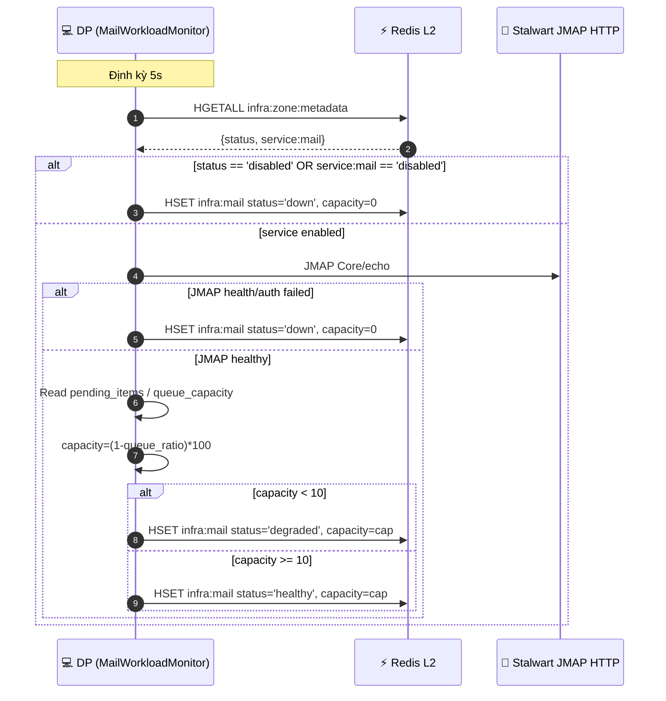
```mermaid
sequenceDiagram
    autonumber
    participant DP as 💻 DP (MailWorkloadMonitor)
    participant L2 as ⚡ Redis L2
    participant SW as 📧 Stalwart JMAP HTTP

    Note over DP: Định kỳ 5s
    DP->>L2: HGETALL infra:zone:metadata
    L2-->>DP: {status, service:mail}

    alt status == 'disabled' OR service:mail == 'disabled'
        DP->>L2: HSET infra:mail status='down', capacity=0
    else service enabled
        DP->>SW: JMAP Core/echo
        alt JMAP health/auth failed
            DP->>L2: HSET infra:mail status='down', capacity=0
        else JMAP healthy
            DP->>DP: Read pending_items / queue_capacity
            DP->>DP: capacity=(1-queue_ratio)*100
            alt capacity < 10
                DP->>L2: HSET infra:mail status='degraded', capacity=cap
            else capacity >= 10
                DP->>L2: HSET infra:mail status='healthy', capacity=cap
            end
        end
    end
```

* **Khi chưa setup Stalwart hoặc auth sai**: JMAP health thất bại → ghi `down`, `capacity = 0` vào Redis L2.

---

### 11.2 Hypervisor Monitor (Proxmox VE Cluster)

Đo đạc chỉ số sức khỏe của các node ảo hóa. Triển khai tại [`monitor.rs`](../../dataplane/src/executor/hypervisor/core/monitor.rs#L36).

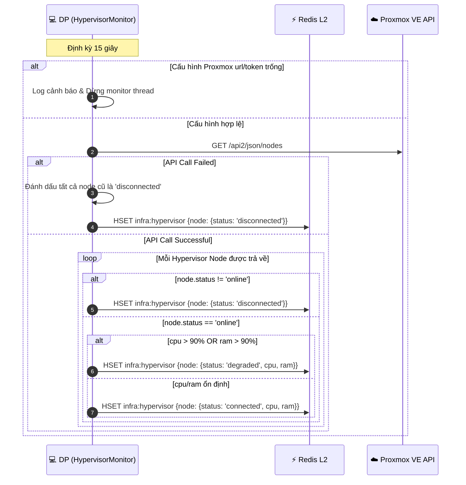
```mermaid
sequenceDiagram
    autonumber
    participant DP as 💻 DP (HypervisorMonitor)
    participant L2 as ⚡ Redis L2
    participant PM as ☁️ Proxmox VE API

    Note over DP: Định kỳ 15 giây
    alt Cấu hình Proxmox url/token trống
        DP->>DP: Log cảnh báo & Dừng monitor thread
    else Cấu hình hợp lệ
        DP->>PM: GET /api2/json/nodes
        alt API Call Failed
            DP->>DP: Đánh dấu tất cả node cũ là 'disconnected'
            DP->>L2: HSET infra:hypervisor {node: {status: 'disconnected'}}
        else API Call Successful
            loop Mỗi Hypervisor Node được trả về
                alt node.status != 'online'
                    DP->>L2: HSET infra:hypervisor {node: {status: 'disconnected'}}
                else node.status == 'online'
                    alt cpu > 90% OR ram > 90%
                        DP->>L2: HSET infra:hypervisor {node: {status: 'degraded', cpu, ram}}
                    else cpu/ram ổn định
                        DP->>L2: HSET infra:hypervisor {node: {status: 'connected', cpu, ram}}
                    end
                end
            end
        end
    end
```

* **Khi chưa cấu hình Proxmox**: Monitor ghi nhận cảnh báo và dừng thực thi -> actual_state của hypervisor giữ nguyên trạng thái mặc định `'unknown'`.

---

### 11.3 Resource Monitor (Node Self-Reporter)

Báo cáo năng lực tính toán hiện tại của DP Node. Triển khai tại [`resource.rs`](../../dataplane/src/observability/resource/mod.rs).

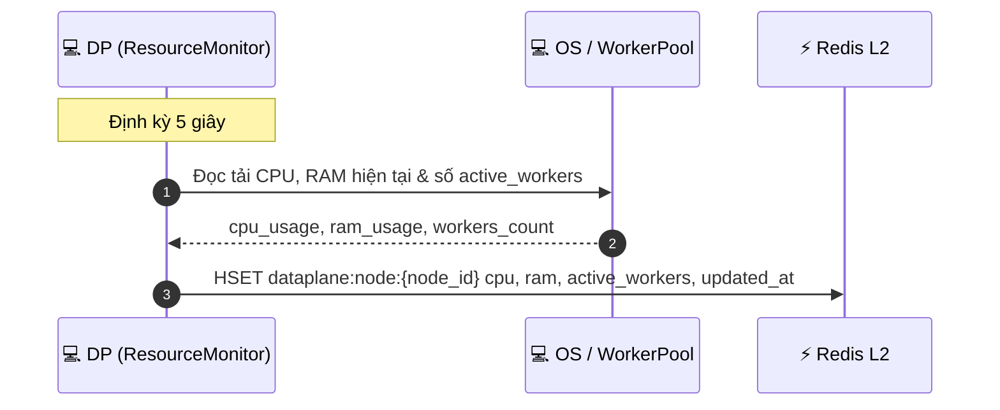
```mermaid
sequenceDiagram
    autonumber
    participant DP as 💻 DP (ResourceMonitor)
    participant OS as 💻 OS / WorkerPool
    participant L2 as ⚡ Redis L2

    Note over DP: Định kỳ 5 giây
    DP->>OS: Đọc tải CPU, RAM hiện tại & số active_workers
    OS-->>DP: cpu_usage, ram_usage, workers_count
    DP->>L2: HSET dataplane:node:{node_id} cpu, ram, active_workers, updated_at
```

---

## 12. Decision Engine — Backpressure & Zone Status

Hệ thống đưa ra quyết định chuyển đổi trạng thái vận hành của Zone dựa trên các chỉ số hiệu năng và sức khỏe đo được. Triển khai tại [`decision.rs`](../../job-orchestrator/src/reverse_provider/zone/decision.rs#L7).

> [!IMPORTANT]
> **Nguyên tắc Enabled-Only Evaluation**: `DecisionEngine::evaluate()` chỉ nhận đầu vào từ các service đang **enabled** trên zone đó. Service bị tắt (`desired_state = false`) được coi là **không liên quan** — không được đưa vào điều kiện draining trigger cũng như recovery condition. Điều này ngăn zone bị kéo về `draining` chỉ vì một service không được cài đặt.

---

### 12.0 EnabledServicesMap — In-Memory SOT của JO

Job Orchestrator duy trì một `EnabledServicesMap` trong RAM để điều phối:
- **Luồng nào được health check** (dataplane monitor)
- **Input nào được đưa vào DecisionEngine**

```
EnabledServicesMap[zone_id] = {
    "mail":       true | false,
    "storage":    true | false,
    "hypervisor": true | false,
    "kubernetes": true | false,
    "ai":         true | false,
    "database":   true | false,
}
```

**Bootstrap khi JO khởi động (Snapshot Pattern)**:

```
1. JO startup → Query PostgreSQL: SELECT zone_id, service_type, desired_state FROM zone_services
2. Load toàn bộ kết quả vào EnabledServicesMap
3. Subscribe CDC channel zone_services
4. Bắt đầu health check loop & decision loop
```

> [!WARNING]
> Nếu JO restart trong khoảng thời gian có thay đổi `zone_services`, CDC event trong khoảng đó sẽ bị miss. Snapshot tại bước 1 đảm bảo trạng thái cuối cùng luôn được phục hồi chính xác. Xem thêm **HA Guard #16**.

**Fallback khi miss RAM**:
Nếu trong quá trình evaluate, `EnabledServicesMap[zone_id]` không có entry (ví dụ zone vừa được tạo mới sau bootstrap), JO **đọc trực tiếp từ PostgreSQL** để lấy `desired_state` và nạp lại vào RAM trước khi ra quyết định. Không được ra quyết định khi thiếu thông tin enabled/disabled.

---

### 12.1 Ngưỡng Đo Đạc & Phân Loại Tải

#### A. Self Dataplane Cluster
| Chỉ số | Quá tải (→ congested) | Phục hồi (→ active) |
|:---|:---|:---|
| `avg_cpu` | > 90% | < 85% |
| `avg_ram` | > 90% | < 85% |

#### B. Mail Workload *(chỉ áp dụng khi `mail_enabled = true`)*
| Chỉ số | Quá tải (→ draining/disabled) | Phục hồi (→ active) |
|:---|:---|:---|
| `queue_len` (SMTP queue size) | > 5000 | < 4000 |
| `pending_len` | > 500 | < 400 |
| `mail_capacity` | < 10% (Force draining) | ≥ 50% |
| `mail_status` | `"down"` (Force draining) | `"healthy"` (Điều kiện kích hoạt lại) |

#### C. Storage Workload *(chỉ áp dụng khi `storage_enabled = true`)*
| Chỉ số | Quá tải (→ draining) | Phục hồi (→ active) |
|:---|:---|:---|
| `storage_capacity` | < 10% (Force draining) | ≥ 50% |
| `storage_status` | `"down"` (Force draining) | `"healthy"` |

#### D. Hypervisor Workload *(chỉ áp dụng khi `hypervisor_enabled = true`)*
| Chỉ số | Quá tải (→ degraded) | Phục hồi (→ connected) |
|:---|:---|:---|
| `node_cpu` | > 90% | < 90% |
| `node_ram` | > 90% | < 90% |
| `node_status` | `"disconnected"` | `"connected"` |

---

### 12.2 Luồng Ra Quyết Định (Sequence Diagram)

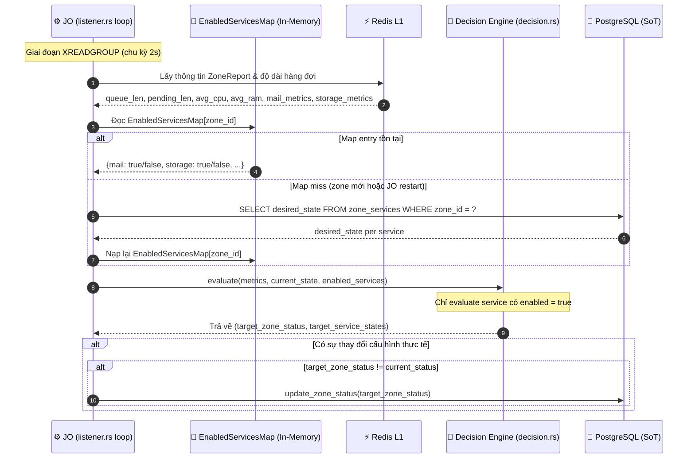
```mermaid
sequenceDiagram
    autonumber
    participant JO as ⚙️ JO (listener.rs loop)
    participant RAM as 🧠 EnabledServicesMap (In-Memory)
    participant L1 as ⚡ Redis L1
    participant DE as 🧠 Decision Engine (decision.rs)
    participant DB as 💾 PostgreSQL (SoT)

    Note over JO: Giai đoạn XREADGROUP (chu kỳ 2s)
    JO->>L1: Lấy thông tin ZoneReport & độ dài hàng đợi
    L1-->>JO: queue_len, pending_len, avg_cpu, avg_ram, mail_metrics, storage_metrics

    JO->>RAM: Đọc EnabledServicesMap[zone_id]
    alt Map entry tồn tại
        RAM-->>JO: {mail: true/false, storage: true/false, ...}
    else Map miss (zone mới hoặc JO restart)
        JO->>DB: SELECT desired_state FROM zone_services WHERE zone_id = ?
        DB-->>JO: desired_state per service
        JO->>RAM: Nạp lại EnabledServicesMap[zone_id]
    end

    JO->>DE: evaluate(metrics, current_state, enabled_services)
    Note over DE: Chỉ evaluate service có enabled = true
    DE-->>JO: Trả về (target_zone_status, target_service_states)

    alt Có sự thay đổi cấu hình thực tế
        alt target_zone_status != current_status
            JO->>DB: update_zone_status(target_zone_status)
        end
    end
```

---

### 12.3 Quy Tắc Đánh Giá Trạng Thái

> [!NOTE]
> Các quy tắc dưới đây chỉ được áp dụng khi service tương ứng đang **enabled**. Service bị `disabled` không tham gia vào bất kỳ quy tắc nào — kể cả draining trigger lẫn recovery condition.

#### A. Logic Draining Trigger (chỉ xét service enabled)

```
let mail_failing    = mail_enabled    && (mail_status == "down"    || mail_capacity < 10)
let storage_failing = storage_enabled && (storage_status == "down" || storage_capacity < 10)

if mail_failing || storage_failing {
    → draining
}
```

#### B. Logic Recovery từ Draining (chỉ xét service enabled)

```
let mail_ok    = !mail_enabled    || (mail_status == "healthy"    && mail_capacity >= 50)
let storage_ok = !storage_enabled || (storage_status == "healthy" && storage_capacity >= 50)

if mail_ok && storage_ok && is_recovered {
    → active
}
```

#### C. Bảng Quyết Định Trạng Thái Zone (`target_zone_status`)
| Trạng thái hiện tại | Điều kiện chuyển dịch | Trạng thái tiếp theo | Ý nghĩa hành vi |
|:---|:---|:---|:---|
| `"active"` \| `"congested"` \| `"draining"` | Bất kỳ **enabled** service nào `down` hoặc `capacity < 10` | `"draining"` | Tự động xả tải, cô lập zone lỗi. |
| `"active"` | `avg_cpu/ram > 90%` OR `queue_len > 5000` | `"congested"` | Cảnh báo nghẽn, tạm hoãn job mới. |
| `"congested"` | `avg_cpu/ram < 85%` AND `queue_len < 4000` | `"active"` | Khôi phục bình thường. |
| `"draining"` | Tất cả **enabled** service `healthy + capacity ≥ 50` AND is_recovered | `"active"` | Tự động kích hoạt lại sau khi xử lý xong sự cố. |

* **Cơ chế Hysteresis**: Ngưỡng quá tải cao hơn ngưỡng phục hồi tránh Zone Flapping.
* **Service disabled = transparent**: Không ảnh hưởng quyết định, zone có thể `active` với một subset service bất kỳ.

---

## 13. Dead Man's Switch

Lớp bảo vệ chủ động tự động hủy kích hoạt Zone hoặc Node nếu mất kết nối hoặc không nhận được tín hiệu heartbeat.

---

### 13.1 Zone-Level (30 giây)

Nếu một phân vùng không gửi báo cáo ZoneReport sau 30 giây, Orchestrator sẽ tự động cập nhật phân vùng đó thành `disabled`. Triển khai tại [`listener.rs#L362-L413`](../../job-orchestrator/src/reverse_provider/zone/listener.rs#L362-L413).

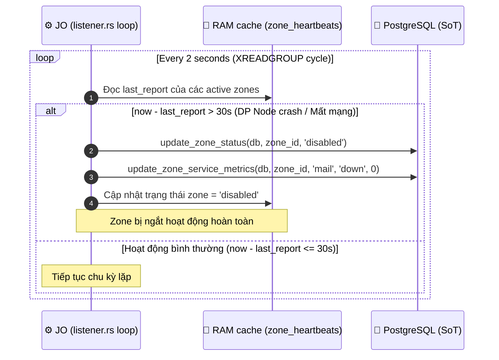
```mermaid
sequenceDiagram
    autonumber
    participant JO_Loop as ⚙️ JO (listener.rs loop)
    participant Cache as 🧠 RAM cache (zone_heartbeats)
    participant DB as 💾 PostgreSQL (SoT)

    loop Every 2 seconds (XREADGROUP cycle)
        JO_Loop->>Cache: Đọc last_report của các active zones
        alt now - last_report > 30s (DP Node crash / Mất mạng)
            JO_Loop->>DB: update_zone_status(db, zone_id, 'disabled')
            JO_Loop->>DB: update_zone_service_metrics(db, zone_id, 'mail', 'down', 0)
            JO_Loop->>Cache: Cập nhật trạng thái zone = 'disabled'
            Note over JO_Loop, Cache: Zone bị ngắt hoạt động hoàn toàn
        else Hoạt động bình thường (now - last_report <= 30s)
            Note over JO_Loop: Tiếp tục chu kỳ lặp
        end
    end
```

---

### 13.2 Node-Level (45 giây)

Nếu một Hypervisor Node không báo cáo trạng thái sau 45 giây, Node đó sẽ được đánh dấu là mất kết nối. Triển khai tại [`listener.rs#L416-L455`](../../job-orchestrator/src/reverse_provider/zone/listener.rs#L416-L455).

```mermaid
sequenceDiagram
    autonumber
    participant JO_Loop as ⚙️ JO (listener.rs loop)
    participant Cache as 🧠 RAM cache (node_heartbeats)
    participant DB as 💾 PostgreSQL (SoT)

    loop Every 2 seconds
        JO_Loop->>Cache: Quét danh sách node_heartbeats
        alt now - last_seen > 45s (Hypervisor node down)
            JO_Loop->>Cache: Xóa node khỏi RAM cache
            JO_Loop->>DB: mark_hypervisor_nodes_disconnected(db, zone_id, [dead_nodes])
            DB-->>JO_Loop: SQL UPDATE hypervisor.nodes status='disconnected'
            Note over JO_Loop: Node chuyển sang trạng thái disconnected
        else Node alive (now - last_seen <= 45s)
            Note over JO_Loop: Tiếp tục giữ trạng thái
        end
    end
```

---

## 14. HA Guards & Race Condition Inventory

| # | Rủi Ro | Cơ Chế Bảo Vệ | File & Location |
|:---|:---|:---|:---|
| 1 | **Write Stampede** khi sync metadata (nhiều DP node cùng đồng bộ) | `SET lock:zone:sync_metadata NX EX 10` — chỉ 1 node thắng | `zone_gateway.rs#L432-L453` |
| 2 | **Lock orphan** (node crash trong TTL 10s) | TTL tự hết hạn sau 10s | Redis TTL |
| 3 | **Sai lock chủ** (Node A xóa lock của Node B) | Lua atomic: `if get(key)==my_id then del(key)` | `zone_gateway.rs#L558-L571` |
| 4 | **CDC packet loss** (mạng đứt lúc PUBLISH) | Reconciliation polling 60 phút self-healing | `zone_gateway.rs#L42-L68` |
| 5 | **Replay Attack** (resend request đã bắt) | Redis SETNX `iam:nonce:{nonce}` EX 120 atomic | `signature.rs#L86-L113` |
| 6 | **Clock Skew Attack** (timestamp cũ để bypass) | `|now - ts| ≤ 120s` check | `signature.rs#L56-L71` |
| 7 | **Out-of-order Hypervisor heartbeat** | `WHERE last_active_at < sent_at` trong UPSERT | `db.rs#L312` |
| 8 | **actual_state IOPS spam** (ghi mỗi 5s) | Throttle: 3 điều kiện (status / delta>10 / >120s) | `listener.rs#L242-L258` |
| 9 | **Zone flapping** (active↔congested) | Hysteresis: overload threshold > recovery threshold | `decision.rs#L33-L38` |
| 10 | **Miss CDC khi cold start** | `counter = 720` → Reconciliation chạy ngay lập tức | `zone_gateway.rs#L44` |
| 11 | **Zombie zone** (DP crash, CP không biết) | Dead Man's Switch 30s → tự set `disabled` | `listener.rs#L362-L413` |
| 12 | **Invalid state transition** | State machine map + DB CTE guard | `zone_repo.go#L338-L370` |
| 13 | **Cascade DELETE workspace** | `ON DELETE RESTRICT` trên `workspaces.zone_id` | Migration L106 |
| 14 | **Duplicate zone code** | `UNIQUE (code)` → `ErrCodeAlreadyExists` | `zone_repo.go#L239-L244` |
| 15 | **UpdateService khi zone không maintenance** | SQL `WHERE status = 'maintenance'` trong upsert CTE | `zone_repo.go#L142` |
| 16 | **EnabledServicesMap bootstrap gap** (JO restart, miss CDC event trong khoảng restart) | JO snapshot toàn bộ `zone_services` từ DB trước khi subscribe CDC | `decision.rs` — bootstrap loader |
| 17 | **Decision với thiếu enabled info** (zone mới tạo sau JO boot, chưa có entry trong RAM) | Fallback: đọc DB trực tiếp khi miss RAM entry, nạp lại map trước khi evaluate | `decision.rs` — DB fallback |
| 18 | **False draining** (service disabled bị tính là `down`) | Enabled-Only Evaluation: service disabled = transparent, không tham gia draining trigger | `decision.rs` — enabled_services filter |

---

## 15. Redis Key Registry

### Platform Redis (L1) — Shared

| Key Pattern | Type | TTL | Nội Dung | Owner |
|:---|:---|:---|:---|:---|
| `zone:code:{code}` | String | 24h | `"{uuid}:{status}"` | CP after CREATE/UPDATE |
| `zone:event:metadata:{zone_id}` | PubSub channel | N/A | Binary JSON event | JO CDC |
| `zone:query:metadata` | PubSub channel | N/A | Binary JSON request | DP Reconciliation |
| `zone:reply:metadata:{zone_id}:{uuid}` | PubSub channel | N/A | Binary JSON response | JO reply |
| `zone:backpressure:reports` | Stream | MAXLEN ~1000 | Protobuf ZoneReport | DP push, JO read |
| `jobs:{zone_id}` | Stream | N/A | Job entries (outbox) | CP |
| `jobs:platform` | Stream | N/A | Platform job entries | CP |
| `iam:admin_access_session:{access_key}` | Hash | Session TTL | `{device_public_key, ash, user_id, role}` | IAM module |
| `iam:nonce:{nonce}` | String | 120s | `"1"` | ACR Replay prevention |

### Zone Redis (L2) — Per-Zone Internal

| Key | Type | TTL | Nội Dung | Owner |
|:---|:---|:---|:---|:---|
| `infra:zone:metadata` | Hash | Persistent | `{status, service:*, updated_at}` | DP CDC/Reconciliation |
| `infra:mail` | Hash | Persistent | `{status, capacity, updated_at}` | MailWorkloadMonitor |
| `infra:hypervisor` | Hash | Persistent | `{node_code: JSON}` | HypervisorMonitor |
| `dataplane:node:{node_id}` | Hash | Logic TTL 15s | `{cpu, ram, active_workers, updated_at}` | ResourceMonitor |
| `lock:zone:sync_metadata` | String | 10s | `"{node_uuid}"` | DP Distributed Lock |

---

> [!NOTE]
> **File này thay thế hoàn toàn:**
> - `sre_create_zone_god_view.md` (deprecated)
> - `zone_metadata_sync_and_state_machine_god_view.md` (deprecated)
>
> Mọi PR/MR liên quan đến zone lifecycle phải tham chiếu và cập nhật file này.
