# Zone Lifecycle — God View (Master SoT)

> [!IMPORTANT]
> Tài liệu này là **Source of Truth (SoT) duy nhất** cho toàn bộ vòng đời quản lý Zone.
> **Mọi thay đổi** liên quan đến: xác thực Ed25519/TOTP, CDC pipeline, zone state machine, actual_state write-back, dead man's switch, distributed lock **đều phải tham chiếu và cập nhật** file này trước.

---

## Mục Lục

1. [Tổng Quan Kiến Trúc](#1-tổng-quan-kiến-trúc)
2. [Database Schema & Enums](#2-database-schema--enums)
3. [Zone Status State Machine (Controlplane)](#3-zone-status-state-machine-controlplane)
4. [Luồng Tạo Zone — SRE Admin](#4-luồng-tạo-zone--sre-admin)
5. [Luồng Cập Nhật Status Zone](#5-luồng-cập-nhật-status-zone)
6. [Luồng Bật/Tắt Service Trong Zone](#6-luồng-bậttắt-service-trong-zone)
7. [Luồng Xóa Zone](#7-luồng-xóa-zone)
8. [CDC Real-time Sync Pipeline](#8-cdc-real-time-sync-pipeline)
9. [Reconciliation Polling — Self-Healing Fallback](#9-reconciliation-polling--self-healing-fallback)
10. [Dataplane State Machine](#10-dataplane-state-machine)
11. [Actual State Write-Back Pipeline](#11-actual-state-write-back-pipeline)
12. [Dataplane Health Monitors](#12-dataplane-health-monitors)
13. [Decision Engine — Backpressure & Zone Status](#13-decision-engine--backpressure--zone-status)
14. [Dead Man's Switch](#14-dead-mans-switch)
15. [HA Guards & Race Condition Inventory](#15-ha-guards--race-condition-inventory)
16. [Runtime Store Registry](#16-runtime-store-registry)
17. [Tham Chiếu Code Toàn Hệ Thống](#17-tham-chiếu-code-toàn-hệ-thống)

---

## 1. Tổng Quan Kiến Trúc

Hệ thống chia rõ ràng làm **3 lớp tương tác** trong vòng đời Zone:

```
[SRE UI] → Ed25519+TOTP → [Envoy] → gRPC ext_authz → [acr]
[acr] → Session + Nonce verify → [Redis L1]
[acr] → TOTP verify → [Vault]
[Envoy] → forward → [Controlplane REST]
[Controlplane] → INSERT/UPDATE → [PostgreSQL SoT]
[PostgreSQL WAL] → Logical Replication → [Job Orchestrator ChangefeedWorker]
[JO] → PRODUCE full ZoneMetadataSnapshotV1 → [Kafka compacted per-Zone topic]
[Kafka] → manual consume → [Dataplane start_metadata_event_listener()]
[Dataplane] → CAS zone.metadata → [NATS Zone Config KV]
[Dataplane Zone leader] → stable leader lease + current snapshots → [NATS Zone Health/Coordination KV]
[ZoneStatusGateway] → PRODUCE ZoneReport (Protobuf) → [Kafka zone reports]
[JO zone_state worker] → manual poll → validate → ZoneDrainPolicy.evaluate()
[JO] → timestamp-fenced UPDATE actual_state/observed_at → [PostgreSQL]
[JO] → validate then discard physical-node telemetry; no PostgreSQL node table
```

## 2. State Machine
### 2.1 Zone Status

Trạng thái vận hành tổng thể của một Infrastructure Zone.
- **DB Schema SoT (Enums)**: [`000001_hierarchy_enums.up.sql`](../../controlplane/internal/hierarchy/migrations/000001_hierarchy_enums.up.sql#L13)
- **CP Business Logic SoT (Go Entities)**: [`zone.go`](../../controlplane/internal/hierarchy/domain/entity/zone.go#L9-L17)
- **Quản lý chuyển đổi**: Enforce tại [`zone_service.go#UpdateZoneStatus()`](../../controlplane/internal/hierarchy/service/zone_service.go#L141).

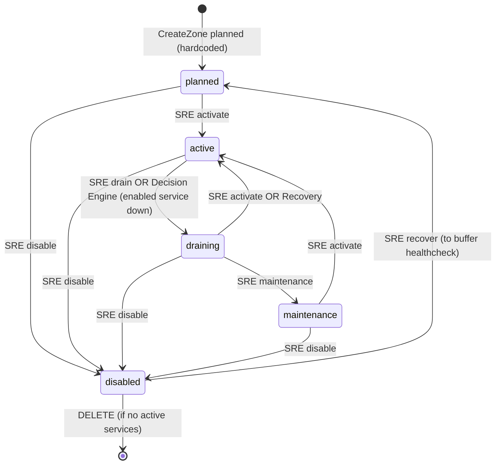

**Bảng mô tả các trạng thái & Tham chiếu Code:**

| Trạng thái | Ý nghĩa | Code / Reference quan trọng |
|:---|:---|:---|
| **`planned`** | Zone mới tạo, chưa chạy | Khởi tạo mặc định: [`zone_service.go`](../../controlplane/internal/hierarchy/service/zone_service.go#L80) / [`zone_repo.go`](../../controlplane/internal/hierarchy/repository/zone_repo.go#L219).<br/>Dataplane chặn kéo job: [`intake.rs`](../../dataplane/src/job_runtime/intake.rs). Zone leader vẫn probe JMAP và xuất OTel/Grafana trước khi activate: [`infra/mail.rs`](../../dataplane/src/leader/infra/mail.rs). |
| **`active`** | Zone hoạt động bình thường | Cho phép kéo Job từ command topic của đúng Zone: [`intake.rs`](../../dataplane/src/job_runtime/intake.rs). Zone leader tổng hợp queue pressure, JMAP và Stalwart health vào Zone KV/OTel: [`infra/mail.rs`](../../dataplane/src/leader/infra/mail.rs). |
| **`draining`** | Zone xả tải, ngưng nhận job | Chặn kéo Job mới: [`intake.rs`](../../dataplane/src/job_runtime/intake.rs).<br/>Tự động kích hoạt khi service down hoặc capacity < 10: [`policy.rs`](../../job-orchestrator/src/zone_state/policy.rs). |
| **`maintenance`** | Zone bảo trì | Chặn kéo Job mới, chạy nốt worker pool: [`intake.rs`](../../dataplane/src/job_runtime/intake.rs).<br/>Cho phép SRE update service toggle desired_state: [`zone_repo.go`](../../controlplane/internal/hierarchy/repository/zone_repo.go#L434). |
| **`disabled`** | Vô hiệu hóa hoàn toàn | Dataplane không kéo job mới; health observer vẫn xuất OTel nhưng fenced `zone.service.mail` quảng cáo `down/0`. Dead-man không tự đổi lifecycle hoặc `desired_state`.<br/>Điều kiện bắt buộc để chạy DELETE zone: [`zone_repo.go`](../../controlplane/internal/hierarchy/repository/zone_repo.go#L372). |

**Ràng buộc & Kiểm tra chuyển đổi:**
* **Kiểm tra nghiệp vụ (Go Map)**: Được xác định qua bảng ánh xạ `allowed` map tại [`zone_service.go#UpdateZoneStatus()`](../../controlplane/internal/hierarchy/service/zone_service.go#L141).
* **Bảo vệ CSDL (SQL CTE Guard)**: Truy vấn update trạng thái bằng CTE so khớp `status = ANY($3)` tại [`zone_repo.go#UpdateZoneStatus()`](../../controlplane/internal/hierarchy/repository/zone_repo.go#L337) để ngăn race condition ghi đè trạng thái bất hợp lệ.
* **Preconditions cho Hard Delete**: Enforce tại [`zone_repo.go#DeleteZone()`](../../controlplane/internal/hierarchy/repository/zone_repo.go#L372) và cascade constraints tại SQL migration [`000002_hierarchy_tables.up.sql`](../../controlplane/internal/hierarchy/migrations/000002_hierarchy_tables.up.sql). Điều kiện xóa bao gồm:
  1. Trạng thái Zone hiện tại phải là `disabled`.
  2. Không có service nào trong bảng `zone_services` được bật (`desired_state = true`).
  3. Không có workspace nào đang tham chiếu tới Zone (`ON DELETE RESTRICT`).

---

### 2.2 Zone Service (desired_state)

Danh sách dịch vụ kích hoạt hoặc vô hiệu hóa theo cấu hình mong muốn (desired_state) của SRE Admin.

| Dịch vụ | Tên DB Enum | Ý nghĩa | Code / Reference thay đổi desired_state |
|:---|:---|:---|:---|
| **Mail** | `mail` | Stalwart JMAP bulk-submission service | [`zone_service.go#UpdateZoneService()`](../../controlplane/internal/hierarchy/service/zone_service.go#L196) / [`zone_repo.go#UpdateZoneService()`](../../controlplane/internal/hierarchy/repository/zone_repo.go#L401) |
| **Hypervisor** | `hypervisor` | Quản lý hạ tầng ảo hóa Proxmox VE Cluster | [`zone_service.go#UpdateZoneService()`](../../controlplane/internal/hierarchy/service/zone_service.go#L196) |
| **Kubernetes** | `kubernetes` | Cung cấp cụm K8s Cluster | [`zone_service.go#UpdateZoneService()`](../../controlplane/internal/hierarchy/service/zone_service.go#L196) |
| **AI Workload** | `ai` | Xử lý workloads AI/GPU | [`zone_service.go#UpdateZoneService()`](../../controlplane/internal/hierarchy/service/zone_service.go#L196) |
| **Storage** | `storage` | Lưu trữ Object/Block Storage | [`zone_service.go#UpdateZoneService()`](../../controlplane/internal/hierarchy/service/zone_service.go#L196) |
| **Database** | `database` | Managed Database services | [`zone_service.go#UpdateZoneService()`](../../controlplane/internal/hierarchy/service/zone_service.go#L196) |

---

### 2.3 Zone Service Status (actual_state)

Trạng thái đo đạc và phản ánh sức khỏe thực tế (actual_state) của dịch vụ nhận về từ các agent Dataplane.

| Trạng thái | Ý nghĩa | Điều kiện chuyển dịch / Telemetry Source | Code / Reference cập nhật vào DB SoT |
|:---|:---|:---|:---|
| **`unknown`** | Chưa nhận được báo cáo tài nguyên | Giá trị mặc định khi khởi tạo hoặc chưa có report push về. | [`zone_repo.go#CreateZone()`](../../controlplane/internal/hierarchy/repository/zone_repo.go#L219) |
| **`healthy`** | Hoạt động bình thường, ổn định | Fresh successful JMAP probe và batch queue còn capacity. | [`infra/mail.rs`](../../dataplane/src/leader/infra/mail.rs) → `zone.service.mail` → leader Zone reporter |
| **`degraded`** | Gặp sự cố hiệu năng hoặc nghẽn | Một phần Dataplane probe lỗi, queue pressure cao hoặc inventory bị truncate. | Generic Zone report với `actual_observed_at` fence |
| **`unhealthy`** | Lỗi logic / probe chưa đủ bằng chứng | Reserved status cho monitor khác; Mail observer hiện derive healthy/degraded/down. | Generic Zone report với `actual_observed_at` fence |
| **`down`** | Offline hoàn toàn | Không còn fresh successful JMAP probe, service disabled hoặc generic dead-man timeout. | Generic Zone report với `actual_observed_at` fence |

---

---

## 4. Luồng Tạo Zone — SRE Admin

Vòng đời khởi tạo một phân vùng hạ tầng mới (Zone Creation) trải qua 4 giai đoạn cụ thể từ giao diện người dùng đến đồng bộ trạng thái thực tế.

---

### Phase 1: UI → Envoy → acr (Bảo mật & Xác thực tại Biên)

Khi SRE Admin gửi yêu cầu tạo phân vùng mới, yêu cầu này bắt buộc phải đi qua lớp bảo mật xác thực kép tại biên.

**Giao thức request và định dạng Header:**
```http
POST /admin/critical/core/zones
Cookie: access_token={jwt}; access_key={key}; access_secret={secret}
X-Admin-Signature:    {base64 Ed25519 64 bytes}
X-Admin-Timestamp:    {unix epoch seconds}
X-Admin-Nonce:        {UUID}
X-Admin-StepUp-Code:  {6-digit TOTP}

{
  "name": "edge-hcm-1",
  "code": "hcm1",
  "location": "Ho Chi Minh City",
  "description": "Primary HCM Zone",
  "enable_hypervisor": true,
  "enable_storage": true,
  "enable_mail": true,
  "enable_k8s": false,
  "enable_ai": false
}
```

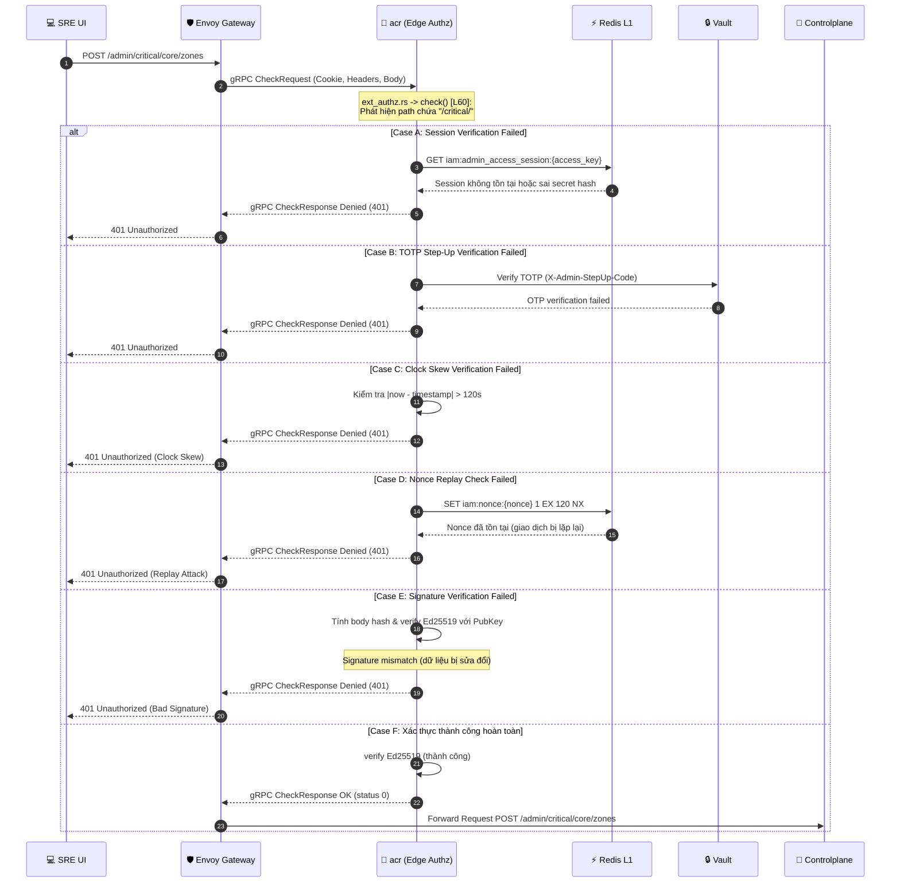

* **Tham chiếu code phía Client UI:**
  * Tạo và ký request: [`NewZone.tsx`](../../admin-ui/src/pages/zone/NewZone.tsx#L50) (hàm `confirmCreateZoneWithOTP()` và `handleTriggerOTP()`).
  * Quản lý cặp khóa và tạo signature: [`crypto.ts`](../../admin-ui/src/lib/crypto.ts#L10) (các hàm `getOrCreateDeviceKeys()`, `signPayload()`, và `sha256Hex()`).

* **Tham chiếu code xác thực biên:**
  * Route routing & filter: [`ext_authz.rs`](../../acr/src/service/ext_authz.rs#L415) (hàm `check()`, logic `is_critical_admin` và `verify_admin_totp()`).
  * Clock Skew & Nonce block: [`signature.rs#verify_admin_signature()`](../../acr/src/service/signature.rs#L13)
  * Ed25519 cryptographic check: [`signature.rs#verify_ed25519_signature()`](../../acr/src/service/signature.rs#L178)

---

### Phase 2: Controlplane Routing & Persistence (Go Backend)

Khi request vượt qua biên, Envoy sẽ chuyển tiếp gói tin gốc tới cụm Controlplane để thực thi nghiệp vụ lưu trữ trạng thái mong muốn.

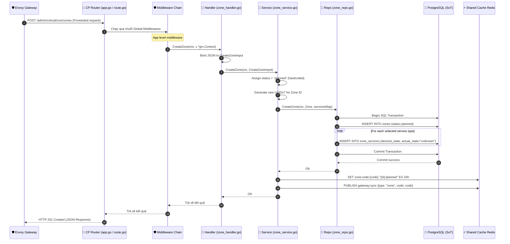

1. **CP Routing**: [`route.go`](../../controlplane/internal/hierarchy/route.go#L9) nhận gói tin được forward.
2. **Middleware Chain**: Gói tin đi qua chuỗi Global Middlewares định nghĩa tại [`app.go`](../../controlplane/internal/app/app.go#L193) trước khi đến handler:
   - `gin.Recovery()`: Hồi phục panic runtime.
   - `middleware.RequestID()`: Gán X-Request-ID duy nhất.
   - `middleware.OTelTraceContext()`: Đồng bộ trace context với OTel.
   - `middleware.OTelHTTPMetrics()`: Ghi nhận metrics HTTP lên Prometheus.
   - `middleware.AccessLog()`: Logging chi tiết request.
   - `middleware.AdminXSSI()`: Phòng chống tấn công Cross-Site Scripting Inclusion.
   - Không áp dụng Go-level authorization middleware vì SRE không cần phân quyền (SRE không phải account mà là phương thức xác minh nên không phân quyền mà là toàn quyền trên /admin api).
3. **HTTP Handler**: [`zone_handler.go#CreateZone()`](../../controlplane/internal/hierarchy/transport/http/handler/zone_handler.go#L43) giải mã JSON body vào struct `CreateZoneInput`.
4. **Core Service**: [`zone_service.go#CreateZone()`](../../controlplane/internal/hierarchy/service/zone_service.go#L80) thực hiện validate các quy tắc, tự động gán cứng trạng thái ban đầu của Zone là `planned` (không cho phép gán `active` trực tiếp), sinh ID UUIDv7 mới và gửi tới repo.
5. **Database Repository**: [`zone_repo.go#CreateZone()`](../../controlplane/internal/hierarchy/repository/zone_repo.go#L219) mở một cơ cấu giao dịch (Transaction):
   * INSERT bản ghi Zone vào bảng `zones` (status = `'planned'`).
   * UPSERT hàng loạt dịch vụ tương ứng vào bảng `zone_services` với cấu hình mong muốn `desired_state` nhận từ UI (actual_state mặc định là `'unknown'`).
6. **Post-Commit Invalidation**: Sau khi transaction commit thành công, service thực hiện ghi đè cache Redis L1 tại `zone:code:{code}` và phát tín hiệu `gateway:sync` để đồng bộ cache ACL biên.

---

### Phase 3: Dataplane Cluster Activation & Planned Behavior

Sau khi CSDL được cập nhật, Dataplane khởi động (hoặc đang chạy) với cấu hình `ZONE_ID` tương ứng sẽ phản ứng dựa theo trạng thái `planned` của phân vùng:

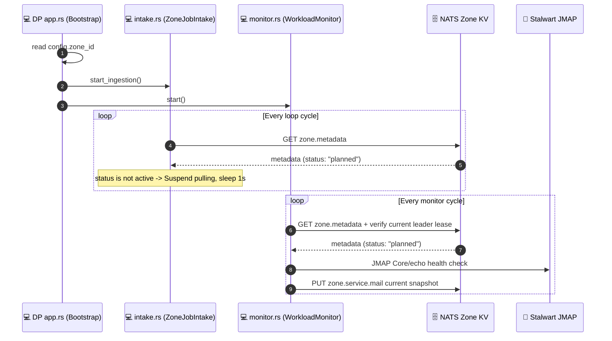

1. **Khởi chạy container**: Tiến trình Dataplane bootstrap tại [`app.rs#AppContainer::start()`](../../dataplane/src/app.rs#L55).
2. **Zone Job Intake**: [`intake.rs#run_zone_job_intake()`](../../dataplane/src/job_runtime/intake.rs) đọc cached `zone.metadata` từ `AURORA_ZONE_CONFIG`. Vì trạng thái là `planned`, intake ngắt kéo Job mới. Metadata thiếu/hỏng hoặc KV unavailable cũng dừng intake theo fail-closed.
3. **Mail Health Observation**:
   * [`infra/mail.rs`](../../dataplane/src/leader/infra/mail.rs) dùng JMAP health cùng local pending/in-flight batch pressure cho Zone KV và OTel/Grafana; không có CP infrastructure projection.
   * Node Resource Monitor ghi snapshot từng pod vào `AURORA_ZONE_HEALTH/zone.node.<node_id>`; Gateway bỏ snapshot cũ hơn 15 giây.

---

### Phase 4: CDC & Telemetry Write-back (Cập nhật Actual State)

Hệ thống đồng bộ cấu hình desired state xuống và kéo chỉ số actual state lên thông qua Job Orchestrator:

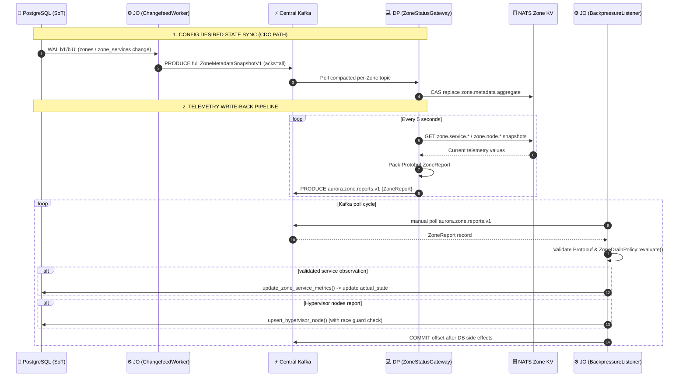

1. **CDC Metadata Event**:
   * PostgreSQL WAL ghi nhận hành động ghi của Phase 2 và stream trực tiếp tới JO [`ChangefeedWorker`](../../job-orchestrator/src/changefeed/worker.rs).
   * JO đọc full aggregate và publish `ZoneMetadataSnapshotV1` vào Kafka compacted topic riêng Zone.
   * DP leader [`zone_metadata::run_zone_metadata_kafka_listener()`](../../dataplane/src/leader/zone_metadata.rs) consume topic và CAS-apply vào `AURORA_ZONE_CONFIG/zone.metadata`.
2. **Telemetry Pack & Report**:
   * Dataplane [`zone_report`](../../dataplane/src/leader/zone_report.rs) chạy dưới stable `lease.zone.leader`, tổng hợp snapshot từ health KV rồi publish Kafka `aurora.zone.reports.v1`.
   * Gateway đóng gói `ZoneReport` Protobuf, dùng Zone ID làm record key và `acks=all`.
3. **Write-back DB SoT**:
   * JO [`run_backpressure_listener()`](../../job-orchestrator/src/zone_state/worker.rs) manual-consume Kafka, validate Protobuf và commit sau side effects.
   * [`ZoneDrainPolicy::evaluate()`](../../job-orchestrator/src/zone_state/policy.rs) tính lifecycle; [`store.rs`](../../job-orchestrator/src/zone_state/store.rs) ghi mọi observation bằng timestamp fence. Việc không throttle timestamp là invariant để cluster-wide watchdog không hạ nhầm Zone sau rebalance.
   * [`watchdog.rs`](../../job-orchestrator/src/zone_state/watchdog.rs) giữ Shared Redis leader lease ngắn và chỉ hạ actual health/node dựa trên timestamp durable; không đổi desired state.

---

---

## 5. Luồng Cập Nhật Status Zone

Quy trình thay đổi trạng thái vận hành của một phân vùng (ví dụ: chuyển từ `planned` sang `active`) trải qua 3 giai đoạn chính.

---

### Phase 1: Client → Envoy & acr (Xác thực Biên)

SRE gửi yêu cầu thay đổi trạng thái của Zone. Request đi qua cụm biên để thực hiện xác thực chữ ký số Ed25519 và TOTP Step-Up MFA.

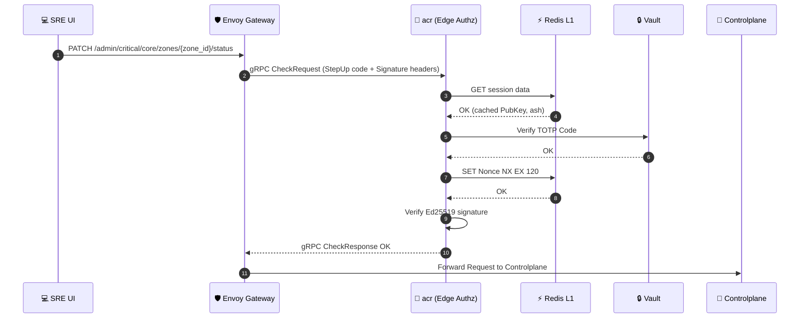

* **Tham chiếu code xác thực biên:**
  * Endpoint routing: `/admin/critical/core/zones/:zone_id/status`
  * Logic check và verify tương tự luồng khởi tạo, thực thi tại [`ext_authz.rs`](../../acr/src/service/ext_authz.rs#L415).

---

### Phase 2: Controlplane Processing & Persistence (Go Backend)

Controlplane kiểm tra tính hợp lệ của việc chuyển dịch trạng thái trước khi ghi nhận vào DB SoT và cập nhật cache L1.

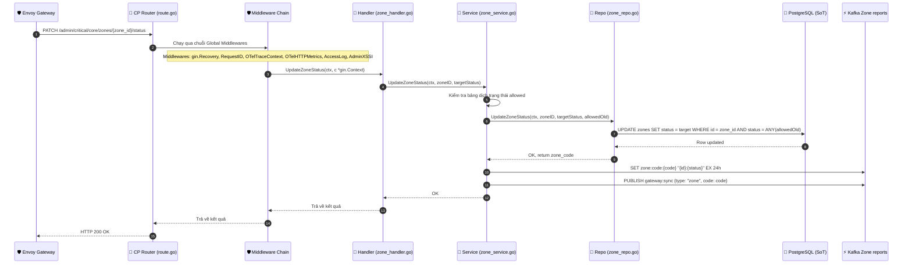

1. **Routing**: [`route.go`](../../controlplane/internal/hierarchy/route.go#L20) nhận request chuyển tiếp.
2. **Global Middlewares**: Giao dịch đi qua chuỗi middlewares ở [`app.go`](../../controlplane/internal/app/app.go#L193):
   - `gin.Recovery()`: Hồi phục panic runtime.
   - `middleware.RequestID()`: Gán X-Request-ID duy nhất.
   - `middleware.OTelTraceContext()`: Đồng bộ trace context với OTel.
   - `middleware.OTelHTTPMetrics()`: Ghi nhận metrics HTTP lên Prometheus.
   - `middleware.AccessLog()`: Logging chi tiết request.
   - `middleware.AdminXSSI()`: Phòng chống tấn công Cross-Site Scripting Inclusion.
   - Không áp dụng Go-level authorization middleware vì SRE có toàn quyền.
3. **Handler**: [`zone_handler.go#UpdateZoneStatus()`](../../controlplane/internal/hierarchy/transport/http/handler/zone_handler.go#L253) giải mã payload `{"status": "active"}`.
4. **Service**: [`zone_service.go#UpdateZoneStatus()`](../../controlplane/internal/hierarchy/service/zone_service.go#L141) đối chiếu với bảng allowed transitions. Nếu hợp lệ, gọi repo thực hiện truy vấn.
5. **CSDL (Repo)**: [`zone_repo.go#UpdateZoneStatus()`](../../controlplane/internal/hierarchy/repository/zone_repo.go#L337) chạy truy vấn CTE cập nhật cột `status` với điều kiện khớp các trạng thái cũ hợp lệ.
6. **Cache Invalidation**: Service ghi đè Redis L1 `zone:code:{code}` và publish event `gateway:sync` để thông báo cho lớp gateway cập nhật bộ đệm định tuyến biên.

---

### Phase 3: CDC Sync & Dataplane State Machine Reaction

Trạng thái mới lan truyền xuống Dataplane qua CDC và định hình lại cơ chế kéo job / healthcheck của cluster.

```mermaid
sequenceDiagram
    autonumber
    participant DB as 💾 PostgreSQL (SoT)
    participant JO_CDC as ⚙️ JO (ChangefeedWorker)
    participant L1 as ⚡ Kafka metadata topic
    participant DP_Gate as 💻 DP (ZoneStatusGateway)
    participant KV as 🗄️ NATS Zone Config KV
    participant Consumer as 💻 intake.rs (ZoneJobIntake)
    participant Monitor as 💻 monitor.rs (WorkloadMonitor)

    DB->>JO_CDC: WAL b'U' (zones status updated)
    JO_CDC->>L1: PRODUCE full ZoneMetadataSnapshotV1, acks=all
    L1->>DP_Gate: Poll compacted per-Zone topic
    DP_Gate->>KV: CAS replace full zone.metadata aggregate
    
    Note over Consumer,Monitor: Dataplane State Machine phản ứng
    Consumer->>KV: GET zone.metadata
    KV-->>Consumer: status: active (hoặc disabled/draining)
    alt Status changed to active
        Consumer->>Consumer: Bắt đầu / Tiếp tục kéo job
        Monitor->>Monitor: Tiếp tục report actual state và workload pressure
    else Status changed to disabled
        Consumer->>Consumer: Tạm dừng kéo job mới
        Monitor->>Monitor: Tiếp tục report snapshot; không tự đổi desired/lifecycle
    end
```

1. **CDC Snapshot**: Sự kiện update bảng `zones` được stream từ WAL tới JO; JO đọc/publish full aggregate vào Kafka compacted topic riêng Zone.
2. **Dataplane KV Sync**: DP leader [`zone_metadata::run_zone_metadata_kafka_listener()`](../../dataplane/src/leader/zone_metadata.rs) validate Zone rồi CAS-apply full `AURORA_ZONE_CONFIG/zone.metadata`.
3. **State Machine Reaction**:
   * **Zone Job Intake**: [`intake.rs#run_zone_job_intake()`](../../dataplane/src/job_runtime/intake.rs) chỉ kéo job khi đọc được `active`. `disabled`, `maintenance`, `draining`, `planned`, metadata thiếu/hỏng hoặc KV error đều ngừng job mới.
   * **Mail Health Observer**: [`leader/infra/mail.rs`](../../dataplane/src/leader/infra/mail.rs) tiếp tục ghi fenced Zone health và OTel metrics; quyết định bật/tắt vẫn thuộc SRE qua `desired_state` và zone lifecycle.

---

## 6. Luồng Bật/Tắt Service Trong Zone

Kiểm soát việc cung cấp cấu hình dịch vụ mong muốn (desired_state) trong Zone, bắt buộc phải thực hiện trong trạng thái bảo trì.

---

### Phase 1: Client → Envoy & acr (Xác thực Biên)

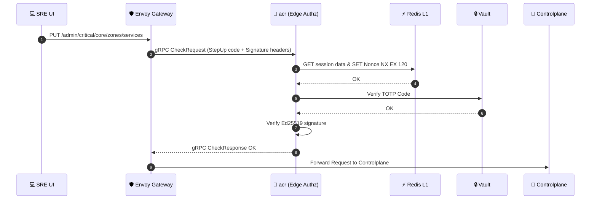

* **Tham chiếu code xác thực biên:**
  * Endpoint routing: `/admin/critical/core/zones/services`
  * Xác thực tương tự luồng khởi tạo, thực thi tại [`ext_authz.rs`](../../acr/src/service/ext_authz.rs#L415).

---

### Phase 2: Controlplane Processing & Persistence (Go Backend)

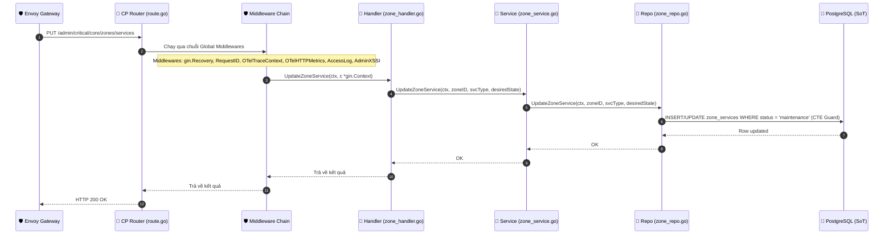

1. **Routing**: [`route.go`](../../controlplane/internal/hierarchy/route.go#L29) nhận request `PUT`.
2. **Global Middlewares**: Giao dịch đi qua chuỗi middlewares ở [`app.go`](../../controlplane/internal/app/app.go#L193):
   - `gin.Recovery()`: Hồi phục panic.
   - `middleware.RequestID()`: Gán Request ID.
   - `middleware.OTelTraceContext()`: OTel tracing.
   - `middleware.OTelHTTPMetrics()`: Prometheus metrics.
   - `middleware.AccessLog()`: Access logging.
   - `middleware.AdminXSSI()`: XSSI guard.
   - Không áp dụng Go-level authorization middleware vì SRE có toàn quyền.
3. **HTTP Handler**: [`zone_handler.go#UpdateZoneService()`](../../controlplane/internal/hierarchy/transport/http/handler/zone_handler.go#L355) giải mã payload mong muốn.
4. **Core Service**: [`zone_service.go#UpdateZoneService()`](../../controlplane/internal/hierarchy/service/zone_service.go#L196) kiểm tra trạng thái hiện tại của Zone. Nếu không phải `maintenance` -> trả lỗi `ErrZoneServiceStateConflict`.
5. **Database (Repo)**: [`zone_repo.go#UpdateZoneService()`](../../controlplane/internal/hierarchy/repository/zone_repo.go#L401) chạy truy vấn CTE. Giao dịch chỉ cập nhật/chèn desired_state mới nếu trạng thái Zone khớp `maintenance`.

---

### Phase 3: CDC Sync & Dataplane Health Check Mode Transition

> [!IMPORTANT]
> **Nguyên tắc cốt lõi**: Health check chỉ chạy cho service đang **enabled**. Service bị tắt (`desired_state = false`) **không được** health check và **không được** đưa vào DecisionEngine. Đây là SOT cho toàn bộ luồng bật/tắt service.

```mermaid
sequenceDiagram
    autonumber
    participant DB as 💾 PostgreSQL (SoT)
    participant JO_CDC as ⚙️ JO (ChangefeedWorker)
    participant JO_RAM as 🧠 JO (EnabledServicesMap — In-Memory)
    participant L1 as ⚡ Kafka metadata topic
    participant DP_Gate as 💻 DP (ZoneStatusGateway)
    participant KV as 🗄️ NATS Zone KV
    participant Monitor as 💻 monitor.rs (WorkloadMonitor)

    DB->>JO_CDC: WAL b'U' (zone_services desired_state updated)
    JO_CDC->>L1: PRODUCE full ZoneMetadataSnapshotV1, acks=all
    L1->>DP_Gate: Poll compacted per-Zone topic
    DP_Gate->>KV: CAS replace full desired aggregate
    
    loop Every monitor cycle
        Monitor->>KV: GET zone.metadata
        KV-->>Monitor: services[type] = true | false
        alt service:{type} == "disabled"
            Monitor->>KV: Không probe; ghi current snapshot down/0
        else service:{type} == "enabled"
            Monitor->>Monitor: Thực thi full health check
            Monitor->>KV: PUT zone.service.{type}
        end
    end
```

1. **Changefeed Snapshot**: JO [`ChangefeedWorker`](../../job-orchestrator/src/changefeed/worker.rs) phát hiện update trên `zone_services`, đọc full aggregate và publish Kafka bằng Zone ID key.
2. **DP Listener**: [`zone_metadata::run_zone_metadata_kafka_listener()`](../../dataplane/src/leader/zone_metadata.rs) consume full snapshot và CAS-apply `AURORA_ZONE_CONFIG/zone.metadata`.
3. **Monitor Reaction**: Mail/storage/hypervisor monitor đọc `services[type]`. Nếu `false`, monitor không gọi backend nhưng ghi current snapshot `down/0` hoặc empty/down để xóa trạng thái khỏe cũ; DecisionEngine filter service disabled trước khi đánh giá. Nếu `true`, monitor thực hiện health check đầy đủ.
4. **Fallback khi miss RAM**: Nếu `EnabledServicesMap` trong JO không có entry cho zone_id+service (ví dụ sau khi JO restart), JO **đọc trực tiếp từ PostgreSQL** (`zone_services` table) để lấy `desired_state` hiện tại và nạp lại vào RAM trước khi ra quyết định.

---

## 7. Luồng Xóa Zone

Xóa bỏ hoàn toàn một phân vùng hạ tầng khỏi cơ sở dữ liệu khi phân vùng đó không còn sử dụng.

---

### Phase 1: Client → Envoy & acr (Xác thực Biên)

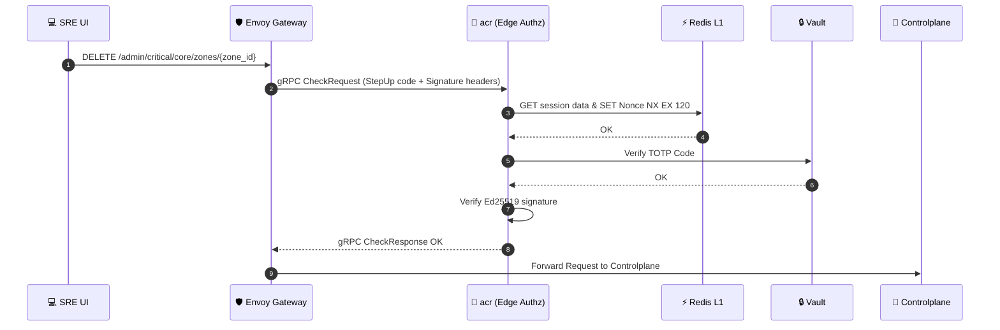

* **Tham chiếu code xác thực biên:**
  * Endpoint routing: `/admin/critical/core/zones/:zone_id`
  * Xác thực tương tự luồng khởi tạo, thực thi tại [`ext_authz.rs`](../../acr/src/service/ext_authz.rs#L415).

---

### Phase 2: Controlplane Processing & Deletion (Go Backend)

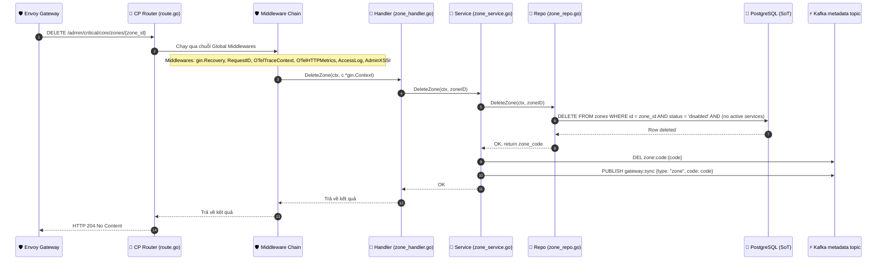

1. **Routing**: [`route.go`](../../controlplane/internal/hierarchy/route.go#L25) nhận request `DELETE`.
2. **Global Middlewares**: Giao dịch đi qua chuỗi middlewares ở [`app.go`](../../controlplane/internal/app/app.go#L193):
   - `gin.Recovery()`: Hồi phục panic.
   - `middleware.RequestID()`: Request tracking.
   - `middleware.OTelTraceContext()`: Tracing context.
   - `middleware.OTelHTTPMetrics()`: Prometheus HTTP metrics.
   - `middleware.AccessLog()`: Access logging.
   - `middleware.AdminXSSI()`: XSSI protection.
   - Không áp dụng Go-level authorization middleware vì SRE có toàn quyền.
3. **HTTP Handler**: [`zone_handler.go#DeleteZone()`](../../controlplane/internal/hierarchy/transport/http/handler/zone_handler.go#L312) nhận diện ID cần xóa.
4. **Core Service**: [`zone_service.go#DeleteZone()`](../../controlplane/internal/hierarchy/service/zone_service.go#L177) xác nhận xóa.
5. **Database Deletion (Repo)**: [`zone_repo.go#DeleteZone()`](../../controlplane/internal/hierarchy/repository/zone_repo.go#L372) thực thi truy vấn CTE kiểm tra chặt chẽ điều kiện tiên quyết (Zone phải ở status `disabled` và không có dịch vụ nào đang kích hoạt). Nếu thỏa mãn, thực thi xóa cứng ( cascade xóa service, restrict lỗi nếu còn workspaces).
6. **Cache Purge**: Service thực hiện DEL key `zone:code:{code}` và publish event `gateway:sync` để thông báo cho edge proxy cập nhật bảng định tuyến biên.

---

### Phase 3: CDC Sync & Dataplane/Orchestrator Detach

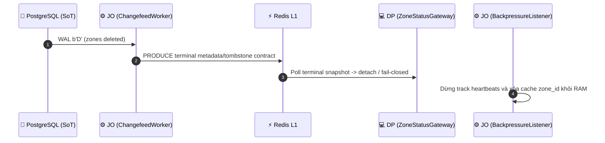

1. **CDC Broadcast**: JO phát hiện DELETE và phải phát terminal metadata contract bền vững trên Kafka; không dùng ephemeral PubSub.
2. **DP Detach**: DP leader [`zone_metadata::run_zone_metadata_kafka_listener()`](../../dataplane/src/leader/zone_metadata.rs) ghi nhận và đưa agent về trạng thái treo/dừng hoạt động đồng bộ.
3. **JO Cleanup**: [`zone_state/processor.rs`](../../job-orchestrator/src/zone_state/processor.rs) đọc lifecycle và desired-service state trong một PostgreSQL round-trip cho mỗi report; không giữ SRE state trong RAM qua Kafka rebalance. Cluster watchdog cũng không phụ thuộc process-local cache.

---

## 9. Reconciliation Polling — Self-Healing Fallback

Cơ chế tự phục hồi cấu hình (Self-Healing) giúp đảm bảo Dataplane luôn đồng bộ trạng thái mong muốn từ Database SoT ngay cả khi có sự cố mạng.

---

### 9.1 Lý Do Cần Thiết
* **Compacted snapshot có thể stale hoặc bị apply lỗi**: Kafka giữ snapshot bền vững nhưng không thay authoritative PostgreSQL reconciliation.
* **Self-Healing Fallback**: Durable query yêu cầu JO đọc full aggregate từ DB và republish snapshot để vá drift.

---

### 9.2 Cơ Chế Trigger
1. **Khởi động nguội (Cold Start)**: Trigger ngay khi Dataplane giành `lease.zone.leader` trong [`zone_metadata.rs`](../../dataplane/src/leader/zone_metadata.rs).
2. **Định kỳ (Periodic Polling)**: Sau khoảng 720 gateway cycle (xấp xỉ 60 phút), reporter kích hoạt một vòng repair mới; coordination lease loại duplicate query giữa các pod.
3. **Distributed Lease Guard**: Các pod CAS stable key `lease.zone.leader` trong `AURORA_ZONE_COORDINATION`, TTL 15 giây và renew 5 giây. Value mang owner và fencing token; leader cũ không thể renew/release session mới.
4. **JO Metadata Handler**: JO consume durable query tại [`metadata.rs`](../../job-orchestrator/src/zone_state/metadata.rs), đọc SoT bằng long-lived PostgreSQL connection rồi publish snapshot về Kafka compacted topic.

---

### 9.3 Quy Trình Đồng Bộ (Sequence Diagram)

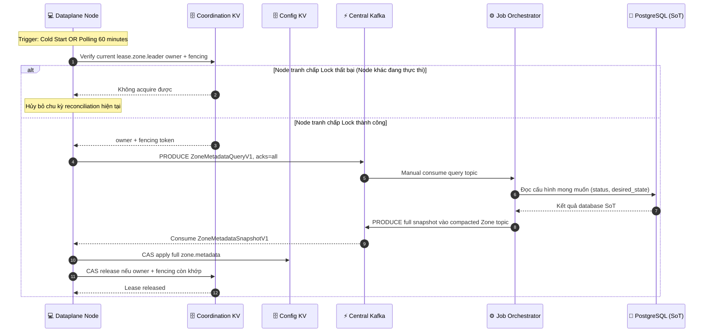

---

## 10. Dataplane State Machine

### 10.1 NATS Config KV Key: `zone.metadata`

```
GET zone.metadata → {
    "status": "planned" | "active" | "draining" | "maintenance" | "disabled" | "inactive",
    "services": {
        "mail": true | false,
        "hypervisor": true | false,
        "storage": true | false
    },
    "updated_at": unix_timestamp
}
```

### 10.2 Bảng Phản Ứng

Đọc **mỗi chu kỳ** của từng daemon (5-15 giây).

> [!IMPORTANT]
> **Nguyên tắc enabled-only**: Monitor chỉ health check service đang `enabled`. Service bị `disabled` → monitor bỏ qua hoàn toàn (không check, không ghi metric). DecisionEngine chỉ nhận đầu vào từ service đang `enabled`.

| Zone Status | Service | Job Consumer | Mail Monitor | Storage Monitor | Hypervisor Monitor |
|:---|:---|:---|:---|:---|:---|
| **`active`** | `enabled` | ✅ Kéo job bình thường | ✅ TCP + HTTP metrics, capacity 0-100 | ✅ HTTP health check MinIO | ✅ Poll Proxmox 15s |
| **`active`** | `disabled` | ✅ Kéo job | ❌ Ghi down/0, không probe | ❌ Ghi down/0, không probe | ❌ Ghi empty/down, không poll |
| **`planned`** | `enabled` | ⏸️ sleep 1s, loop | ✅ JMAP health + local pressure | ✅ HTTP health MinIO | ✅ Poll Proxmox 15s |
| **`planned`** | `disabled` | ⏸️ sleep 1s, loop | ❌ Ghi down/0 | ❌ Ghi down/0 | ❌ Ghi empty/down |
| **`maintenance`** | `enabled` | ⏸️ Không kéo job mới | ✅ Full check + capacity | ✅ Full check | ✅ Poll Proxmox 15s |
| **`maintenance`** | `disabled` | ⏸️ Không kéo job mới | ❌ Ghi down/0 | ❌ Ghi down/0 | ❌ Ghi empty/down |
| **`draining`** | `enabled` | ⏸️ Không kéo job mới | ✅ Full check + capacity | ✅ Full check | ✅ Poll Proxmox 15s |
| **`draining`** | `disabled` | ⏸️ Không kéo job mới | ❌ Ghi down/0 | ❌ Ghi down/0 | ❌ Ghi empty/down |
| **`disabled`** | any | ⏸️ Dừng hoàn toàn | ❌ status=down, capacity=0 | ❌ status=down | ❌ Dừng poll |

## 11. Dataplane Health Monitors

Cụm Dataplane dùng stable `lease.zone.leader` trong `AURORA_ZONE_COORDINATION`. Chỉ current leader
probe service và ghi fenced snapshot vào `AURORA_ZONE_HEALTH`; mất renew sẽ cancel toàn bộ probe trước
khi replica khác takeover.

---

### 11.1 Health Observer (Mail / Stalwart)

Ghi fenced Zone health và OTel metrics cho Mail JMAP, local batch pressure, Dataplane node và Stalwart registry. Triển khai tại [`leader/infra/mail.rs`](../../dataplane/src/leader/infra/mail.rs).

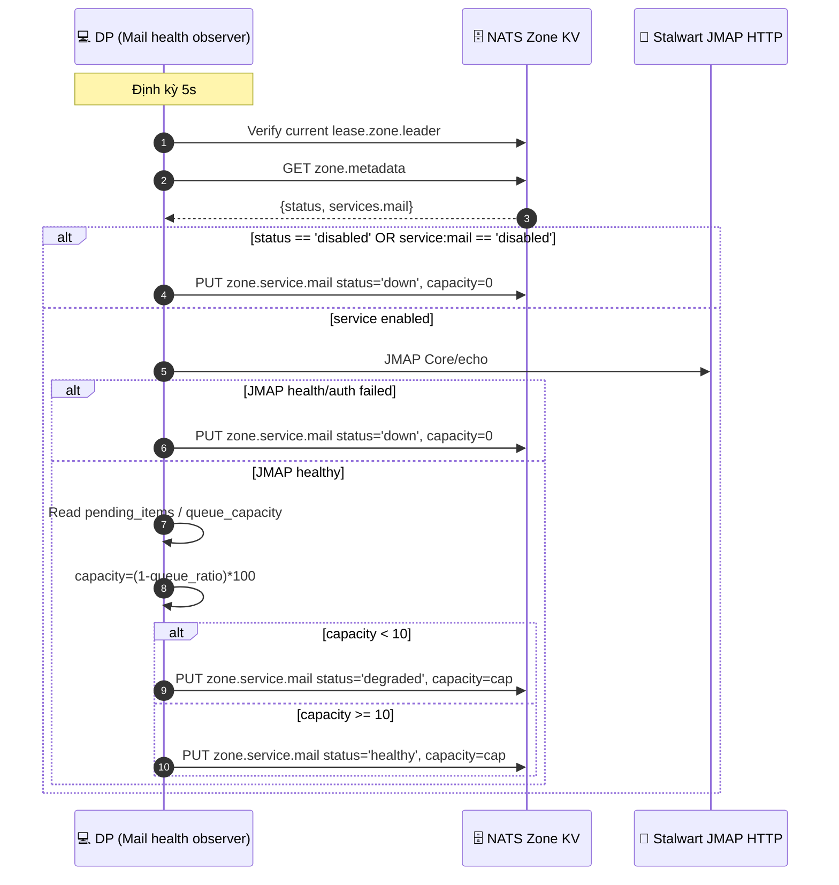

* **Khi JMAP health thất bại**: ghi `down`, `capacity = 0` vào health KV. Stalwart inventory auth là read-only integration riêng; lỗi inventory chỉ phát bounded OTel error.

---

### 11.2 Hypervisor Monitor (Proxmox VE Cluster)

Đo đạc chỉ số sức khỏe của các node ảo hóa. Chỉ Zone leader thực hiện tại
[`leader/infra/hypervisor.rs`](../../dataplane/src/leader/infra/hypervisor.rs).

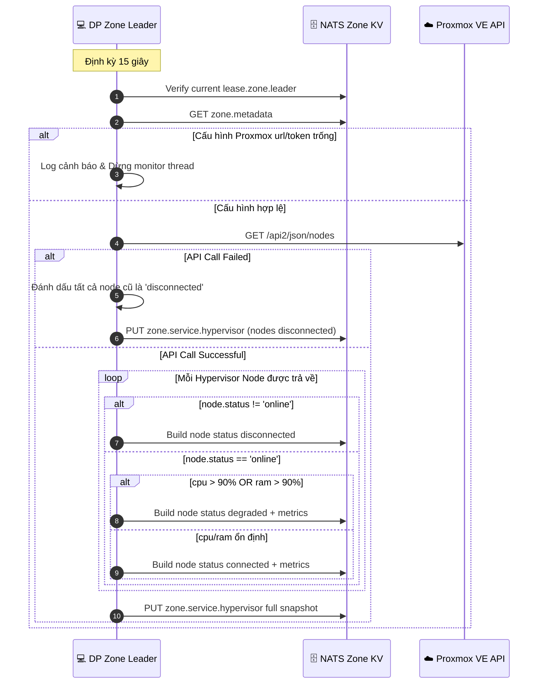

* **Khi chưa cấu hình Proxmox**: Monitor ghi nhận cảnh báo và dừng thực thi -> actual_state của hypervisor giữ nguyên trạng thái mặc định `'unknown'`.

---

### 11.3 Node Runtime Metrics (Node Self-Reporter)

Báo cáo năng lực tính toán hiện tại của DP Node. Triển khai tại [`metrics.rs`](../../dataplane/src/observability/metrics.rs).

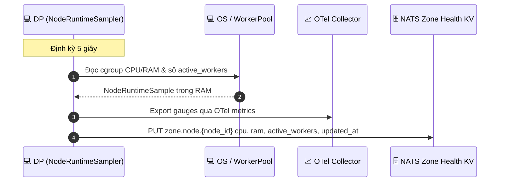

---

## 12. Decision Engine — Backpressure & Zone Status

Hệ thống đưa ra quyết định chuyển đổi trạng thái vận hành của Zone dựa trên các chỉ số hiệu năng và sức khỏe đã validate. Triển khai tại [`policy.rs`](../../job-orchestrator/src/zone_state/policy.rs).

> [!IMPORTANT]
> **Nguyên tắc Enabled-Only Evaluation**: `DecisionEngine::evaluate()` chỉ nhận đầu vào từ các service đang **enabled** trên zone đó. Service bị tắt (`desired_state = false`) được coi là **không liên quan** — không được đưa vào điều kiện draining trigger cũng như recovery condition. Điều này ngăn zone bị kéo về `draining` chỉ vì một service không được cài đặt.

---

### 12.0 EnabledServicesMap — In-Memory SOT của JO

Job Orchestrator duy trì một `EnabledServicesMap` trong RAM để điều phối:
- **Luồng nào được health check** (dataplane monitor)
- **Input nào được đưa vào DecisionEngine**

```
EnabledServicesMap[zone_id] = {
    "mail":       true | false,
    "storage":    true | false,
    "hypervisor": true | false,
    "kubernetes": true | false,
    "ai":         true | false,
    "database":   true | false,
}
```

**Bootstrap khi JO khởi động (Snapshot Pattern)**:

```
1. JO startup → Query PostgreSQL: SELECT zone_id, service_type, desired_state FROM zone_services
2. Load toàn bộ kết quả vào EnabledServicesMap
3. Subscribe CDC channel zone_services
4. Bắt đầu health check loop & decision loop
```

> [!WARNING]
> Nếu JO restart trong khoảng thời gian có thay đổi `zone_services`, CDC event trong khoảng đó sẽ bị miss. Snapshot tại bước 1 đảm bảo trạng thái cuối cùng luôn được phục hồi chính xác. Xem thêm **HA Guard #16**.

**Fallback khi miss RAM**:
Nếu trong quá trình evaluate, `EnabledServicesMap[zone_id]` không có entry (ví dụ zone vừa được tạo mới sau bootstrap), JO **đọc trực tiếp từ PostgreSQL** để lấy `desired_state` và nạp lại vào RAM trước khi ra quyết định. Không được ra quyết định khi thiếu thông tin enabled/disabled.

---

### 12.1 Ngưỡng Đo Đạc & Phân Loại Tải

#### A. Self Dataplane Cluster
| Chỉ số | Quá tải (→ congested) | Phục hồi (→ active) |
|:---|:---|:---|
| `avg_cpu` | > 90% | < 85% |
| `avg_ram` | > 90% | < 85% |

#### B. Mail Workload *(chỉ áp dụng khi `mail_enabled = true`)*
| Chỉ số | Quá tải (→ draining/disabled) | Phục hồi (→ active) |
|:---|:---|:---|
| `queue_len` (SMTP queue size) | > 5000 | < 4000 |
| `pending_len` | > 500 | < 400 |
| `mail_capacity` | < 10% (Force draining) | ≥ 50% |
| `mail_status` | `"down"` (Force draining) | `"healthy"` (Điều kiện kích hoạt lại) |

#### C. Storage Workload *(chỉ áp dụng khi `storage_enabled = true`)*
| Chỉ số | Quá tải (→ draining) | Phục hồi (→ active) |
|:---|:---|:---|
| `storage_capacity` | < 10% (Force draining) | ≥ 50% |
| `storage_status` | `"down"` (Force draining) | `"healthy"` |

#### D. Hypervisor Workload *(chỉ áp dụng khi `hypervisor_enabled = true`)*
| Chỉ số | Quá tải (→ degraded) | Phục hồi (→ connected) |
|:---|:---|:---|
| `node_cpu` | > 90% | < 90% |
| `node_ram` | > 90% | < 90% |
| `node_status` | `"disconnected"` | `"connected"` |

---

### 12.2 Luồng Ra Quyết Định (Sequence Diagram)

```mermaid
sequenceDiagram
    autonumber
    participant JO as ⚙️ JO (listener.rs loop)
    participant RAM as 🧠 EnabledServicesMap (In-Memory)
    participant L1 as ⚡ Kafka Zone reports
    participant DE as 🧠 Decision Engine (decision.rs)
    participant DB as 💾 PostgreSQL (SoT)

    Note over JO: Giai đoạn manual Kafka poll
    JO->>L1: Lấy ZoneReport; Kafka lag đã được Dataplane đo tại source
    L1-->>JO: queue_len, pending_len, avg_cpu, avg_ram, mail_metrics, storage_metrics

    JO->>RAM: Đọc EnabledServicesMap[zone_id]
    alt Map entry tồn tại
        RAM-->>JO: {mail: true/false, storage: true/false, ...}
    else Map miss (zone mới hoặc JO restart)
        JO->>DB: SELECT desired_state FROM zone_services WHERE zone_id = ?
        DB-->>JO: desired_state per service
        JO->>RAM: Nạp lại EnabledServicesMap[zone_id]
    end

    JO->>DE: evaluate(metrics, current_state, enabled_services)
    Note over DE: Chỉ evaluate service có enabled = true
    DE-->>JO: Trả về (target_zone_status, target_service_states)

    alt Có sự thay đổi cấu hình thực tế
        alt target_zone_status != current_status
            JO->>DB: update_zone_status(target_zone_status)
        end
    end
```

---

### 12.3 Quy Tắc Đánh Giá Trạng Thái

> [!NOTE]
> Các quy tắc dưới đây chỉ được áp dụng khi service tương ứng đang **enabled**. Service bị `disabled` không tham gia vào bất kỳ quy tắc nào — kể cả draining trigger lẫn recovery condition.

#### A. Logic Draining Trigger (chỉ xét service enabled)

```
let mail_failing    = mail_enabled    && (mail_status == "down"    || mail_capacity < 10)
let storage_failing = storage_enabled && (storage_status == "down" || storage_capacity < 10)

if mail_failing || storage_failing {
    → draining
}
```

#### B. Logic Recovery từ Draining (chỉ xét service enabled)

```
let mail_ok    = !mail_enabled    || (mail_status == "healthy"    && mail_capacity >= 50)
let storage_ok = !storage_enabled || (storage_status == "healthy" && storage_capacity >= 50)

if mail_ok && storage_ok && is_recovered {
    → active
}
```

#### C. Bảng Quyết Định Trạng Thái Zone (`target_zone_status`)
| Trạng thái hiện tại | Điều kiện chuyển dịch | Trạng thái tiếp theo | Ý nghĩa hành vi |
|:---|:---|:---|:---|
| `"active"` \| `"congested"` \| `"draining"` | Bất kỳ **enabled** service nào `down` hoặc `capacity < 10` | `"draining"` | Tự động xả tải, cô lập zone lỗi. |
| `"active"` | `avg_cpu/ram > 90%` OR `queue_len > 5000` | `"congested"` | Cảnh báo nghẽn, tạm hoãn job mới. |
| `"congested"` | `avg_cpu/ram < 85%` AND `queue_len < 4000` | `"active"` | Khôi phục bình thường. |
| `"draining"` | Tất cả **enabled** service `healthy + capacity ≥ 50` AND is_recovered | `"active"` | Tự động kích hoạt lại sau khi xử lý xong sự cố. |

* **Cơ chế Hysteresis**: Ngưỡng quá tải cao hơn ngưỡng phục hồi tránh Zone Flapping.
* **Service disabled = transparent**: Không ảnh hưởng quyết định, zone có thể `active` với một subset service bất kỳ.

---

## 13. Dead Man's Switch

Lớp bảo vệ hạ actual operational health nếu mất heartbeat. Nó không có quyền đổi Zone lifecycle hoặc
`zone_services.desired_state`; hai loại write đó chỉ thuộc SRE command boundary.

---

### 13.1 Zone-Level (30 giây)

Nếu một phân vùng không gửi generic ZoneReport sau 30 giây, Orchestrator giữ nguyên Zone status và desired
service flags, chỉ hạ Mail/Storage actual health do generic reporter sở hữu. Dead-man dùng observation timestamp
hiện tại để report cũ đang in-flight không thể resurrect service.

```mermaid
sequenceDiagram
    autonumber
    participant JO_Loop as ⚙️ JO (listener.rs loop)
    participant Cache as 🧠 RAM cache (zone_heartbeats)
    participant DB as 💾 PostgreSQL (SoT)

    loop Every 2 seconds (Kafka poll/dead-man cycle)
        JO_Loop->>Cache: Đọc last_report của các active zones
        alt now - last_report > 30s (DP Node crash / Mất mạng)
            JO_Loop->>DB: update Mail/Storage actual health with newer observation fence
            JO_Loop->>Cache: Reset timeout; preserve lifecycle + desired flags
            Note over JO_Loop, Cache: SRE ownership không bị reporter vượt quyền
        else Hoạt động bình thường (now - last_report <= 30s)
            Note over JO_Loop: Tiếp tục chu kỳ lặp
        end
    end
```

---

### 13.2 Physical-node telemetry

Physical Proxmox node là runtime topology của đúng Zone, không phải hierarchy
business state. Dataplane leader probe và fence current snapshot; JO không lưu
node vào PostgreSQL. [`watchdog.rs`](../../job-orchestrator/src/zone_state/watchdog.rs)
chỉ hạ `zone_services.actual_state` theo durable observation timestamp dưới
Shared Redis lease.

```mermaid
sequenceDiagram
    autonumber
    participant DP as Dataplane Zone leader
    participant KV as Zone Health KV
    participant Kafka as Kafka Zone report
    participant JO as Job Orchestrator

    DP->>KV: Fenced PUT current hypervisor snapshot
    DP->>Kafka: Produce bounded ZoneReport
    Kafka-->>JO: Validate Zone/timestamp/payload
    JO->>JO: Do not persist physical nodes
    Note over DP,JO: Proxmox node OTel/Grafana export is a deferred observability rollout
```

---

## 14. HA Guards & Race Condition Inventory

| # | Rủi Ro | Cơ Chế Bảo Vệ | File & Location |
|:---|:---|:---|:---|
| 1 | **Write Stampede** khi sync metadata | CAS `lease.zone.leader` — chỉ một owner/fencing thắng | `dataplane/src/leader/leadership.rs` |
| 2 | **Lease orphan** khi pod crash | Logical expiry 15s cho phép replica khác takeover | `dataplane/src/leader/leadership.rs` |
| 3 | **Owner cũ release lease mới** | Renew/release bắt buộc khớp owner và fencing token | `dataplane/src/infra/zone_kv.rs` |
| 4 | **CDC packet loss** khi Kafka path gián đoạn | Cold-start/hourly reconciliation từ PostgreSQL SoT | `dataplane/src/leader/zone_metadata.rs` |
| 5 | **Replay Attack** (resend request đã bắt) | Redis SETNX `iam:nonce:{nonce}` EX 120 atomic | `signature.rs#L86-L113` |
| 6 | **Clock Skew Attack** (timestamp cũ để bypass) | `|now - ts| ≤ 120s` check | `signature.rs#L56-L71` |
| 7 | **Zombie Hypervisor probe** | Zone leader ownership + fencing token chặn old leader ghi current snapshot | `leader/infra/hypervisor.rs` |
| 8 | **Watchdog false-down sau Kafka rebalance** | Mỗi report advance durable observation timestamp; watchdog dùng cluster-wide Redis lease | `zone_state/{worker,watchdog}.rs` |
| 9 | **HA out-of-order Zone report** | `zone_services.actual_observed_at` chỉ nhận timestamp mới hơn | `zone_state/store.rs` |
| 10 | **Zone flapping** (active↔draining) | Typed policy + hysteresis: overload threshold > recovery threshold | `zone_state/policy.rs` |
| 11 | **Miss CDC khi cold start** | Leader reconciliation chạy ngay; metadata chưa có thì ingestion fail-closed | `dataplane/src/leader/zone_metadata.rs` |
| 12 | **Zombie generic Zone report** | Singleton watchdog hạ actual health bằng durable timestamp; không sửa desired state | `zone_state/watchdog.rs` |
| 13 | **Invalid state transition** | State machine map + DB CTE guard | `zone_repo.go#L338-L370` |
| 14 | **Cascade DELETE workspace** | `ON DELETE RESTRICT` trên `workspaces.zone_id` | Migration L106 |
| 15 | **Duplicate zone code** | `UNIQUE (code)` → `ErrCodeAlreadyExists` | `zone_repo.go#L239-L244` |
| 16 | **UpdateService khi zone không maintenance** | SQL `WHERE status = 'maintenance'` trong upsert CTE | `zone_repo.go#L142` |
| 17 | **EnabledServicesMap bootstrap gap** | Changefeed bootstrap toàn bộ desired state bằng long-lived metadata connection | `changefeed/worker.rs` |
| 18 | **Decision với enabled info stale** | Mỗi report đọc một typed policy snapshot từ PostgreSQL; không cache SRE state qua rebalance | `zone_state/{processor,store}.rs` |
| 19 | **False draining** (service disabled bị tính là `down`) | Enabled-only typed policy: service disabled không tham gia trigger | `zone_state/policy.rs` |

---

## 15. Runtime Store Registry

### Shared Cache Redis và Central Kafka

| Key Pattern | Type | TTL | Nội Dung | Owner |
|:---|:---|:---|:---|:---|
| `zone:code:{code}` | Cache string | bounded TTL | Rebuildable routing cache | CP |
| `aurora.zone.metadata.<zone_id>.v1` | Kafka compacted topic | Broker policy | Full ZoneMetadataSnapshotV1 | JO → DP |
| `aurora.zone.metadata.queries.v1` | Kafka topic | Broker policy | Durable ZoneMetadataQueryV1 | DP → JO |
| `aurora.zone.reports.v1` | Kafka topic | Broker policy | Protobuf ZoneReport | DP → JO |
| `aurora.jobs.commands.zone.<zone_id>.v1` | Kafka topic | Broker policy | JobCommandV1 | JO → DP |

### NATS JetStream KV — Per-Zone Internal

| Bucket / Key | Type | Retention | Nội Dung | Owner |
|:---|:---|:---|:---|:---|
| `AURORA_ZONE_CONFIG/zone.metadata` | JSON KV | Persistent, history 1 | `{status, services, updated_at}` | DP CDC/Reconciliation |
| `AURORA_ZONE_HEALTH/zone.service.mail` | JSON KV | Max age 24h, history 1 | JMAP status/capacity/queue/cycle | `leader/infra/mail.rs` |
| `AURORA_ZONE_HEALTH/mail.health.node.<node_id>` | JSON KV | Max age 24h; logical stale by observer interval | Per-process Mail pressure snapshot, no probe | Every Dataplane Mail pod |
| `AURORA_ZONE_HEALTH/zone.service.storage` | JSON KV | Max age 24h, history 1 | MinIO status/capacity/leader fencing | `leader/infra/storage.rs` |
| `AURORA_ZONE_HEALTH/zone.service.hypervisor` | JSON KV | Max age 24h, history 1 | Hypervisor node snapshot/leader fencing | `leader/infra/hypervisor.rs` |
| `AURORA_ZONE_HEALTH/zone.node.<node_id>` | JSON KV | Max age 24h; logical stale 15s | CPU, RAM, workers, updated_at | NodeRuntimeSampler |
| `AURORA_ZONE_COORDINATION/lease.zone.leader` | CAS lease | Logical TTL 15s | owner/fencing/expiry/last owner | Leader Coordinator |
| `AURORA_ZONE_COORDINATION/signal.workers.scale` | Fenced soft directive | TTL 15s | zone/target/lag/leader fencing/expiry | Leader scaler → Worker followers |
| `AURORA_ZONE_COORDINATION/lease.job.<sha256>` | CAS lease | Logical TTL 30s | owner/fencing/expiry | Job lifecycle |

---

> [!NOTE]
> **File này thay thế hoàn toàn:**
> - `sre_create_zone_god_view.md` (deprecated)
> - `zone_metadata_sync_and_state_machine_god_view.md` là companion SoT chi tiết riêng cho metadata/KV state machine.
>
> Mọi PR/MR liên quan đến zone lifecycle phải tham chiếu và cập nhật file này.
