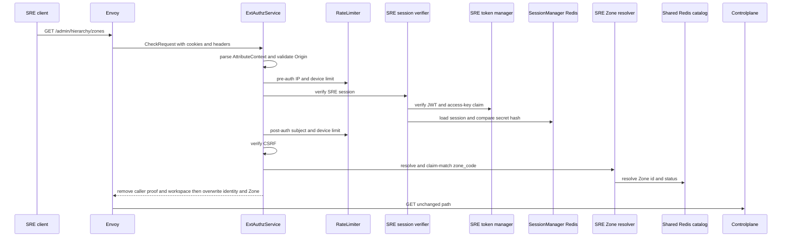
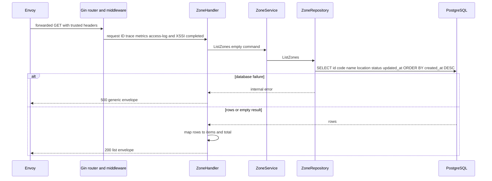

# Zone list — God View

Returns the current SRE inventory of Zones. It is an admin read workflow; it neither changes desired state nor starts runtime work.

## API-scope contract

| Owner | Route | Authority | Durable source |
|---|---|---|---|
| SRE admin | `GET /admin/hierarchy/zones` | verified SRE edge session | `hierarchy.zones` |

Canonical request/reply protobuf: `proto/hierarchy/zone_catalog/v1/zone_catalog.proto`.

## Phase 1 — Client → Envoy → ACR

| Client input | Use |
|---|---|
| `Origin`, `X-Forwarded-For` | CORS and Envoy-provided pre-auth IP |
| `Cookie: access_token, access_key, access_secret, client_device_id, zone_code` | SRE session, device bucket and selected Zone |
| `x-zone-code`, `x-csrf-token` | fallback Zone selector and authenticated browser guard |

### ACR processing and REST output

ACR runs the general SRE edge chain and emits no local success body. Envoy
forwards only after the SRE session and selected Zone are verified.

#### Response headers

| Result | Headers from ACR |
|---|---|
| Denied | no stable Zone workflow response payload |
| Allowed forward | overwrite SRE identity/device/resolved Zone; inject `x-session-proof-verified=false`; optional rotated cookies |

#### Response payload

| Result | Payload |
|---|---|
| Denied | generic Envoy denial |
| Allowed forward | none; Controlplane owns list payload |

### ACR forward contract

| Item | Source | Constraint |
|---|---|---|
| exact GET path | Envoy request | not rewritten |
| SRE identity/device/Zone headers | verified session and Zone resolver | client values overwritten |
| incoming raw admin/proof and workspace headers | browser request | removed before forward |

No client identity header is trusted upstream; ACR overwrites the trusted SRE headers. This route is not critical, so it has no Ed25519/TOTP proof.

The route is noncritical: no signature/TOTP component runs. Session, CSRF and Zone failures deny; a rate-limit Redis outage fails open. ACR injects `x-session-proof-verified=false`, does not rewrite the path, and has no local response.

### Key contract

| Key / transport | Store | Operation | TTL / timeout | Owner / invariant |
|---|---|---|---|---|
| pre/post `ratelimit:*:{ip|sre_subject|device}:sre_general` | Moka L1 → Auth-State Redis | `INCR` + `EXPIRE`; L1 block marker | pre 200/s IP and 15/s device; post 30/s subject/device; L1 30s | limiter; Redis failure fail-open |
| `iam:sre_access_session:{access_key}` | Auth-State Redis | Prost session `GET` | `SESSION_TTL_SECS` | SRE session verifier; missing/error denies |
| Zone L1 and `zone:code:{code}` | process L1 → Shared L2 Redis | code/status lookup and bounded refresh | L1 30s positive/180s negative; L2 24h/180s | Zone resolver; rebuildable only |
| `hierarchy.zone.get_zone_list` request/reply | Shared L2 Redis Pub/Sub | cache-miss protobuf refresh | 1s | fallback only; no CP DB connection at ACR |

## Phase 2 — Controlplane read

### Internal input and output

| Part | Contract |
|---|---|
| Input | unchanged GET path plus trusted SRE headers; handler has no client pagination/filter input |
| Service input | empty `ListZones` command |
| Repository query | `SELECT id, code, name, location, status, updated_at FROM hierarchy.zones ORDER BY created_at DESC` |
| REST output | `200` envelope with `items` and `total`; empty list is success; database error is `500` |

### Key contract

| Store | Operation | Owner / invariant |
|---|---|---|
| `hierarchy.zones` | ordered read only | PostgreSQL is the inventory authority |
| Workflow metrics/logs | one service workflow observation and request-scoped logs | observability only, not a read cache |
| Kafka, Zone KV, cache invalidation | no operation | this read must not trigger runtime work |

The response contains `items` and `total`. Database failure is `500`; an empty list is successful. No cache, Kafka, or Dataplane side effect is part of this workflow.
