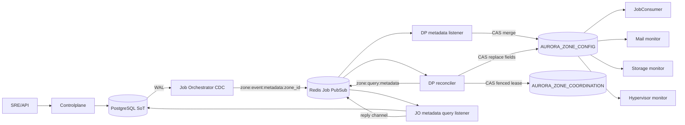
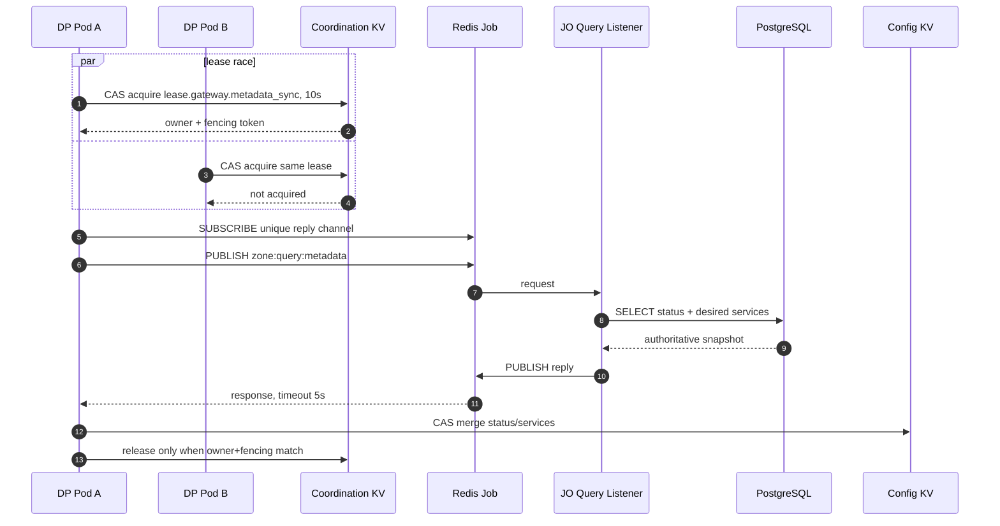

# Zone Metadata Sync và Dataplane State Machine — God View

> [!IMPORTANT]
> Đây là Source of Truth cho việc đưa `hierarchy.zones.status` và `hierarchy.zone_services.desired_state` xuống runtime của một Zone. Redis Job chỉ là transport; current Zone state được lưu bền vững trong NATS JetStream KV. Không được khôi phục Redis riêng cho Zone runtime.

## 0. Control header

| Thuộc tính | Giá trị |
|---|---|
| Authoritative SoT | Controlplane PostgreSQL |
| Real-time trigger | PostgreSQL WAL → JO CDC → Redis Job PubSub |
| Repair path | Cold-start và khoảng một giờ/lần qua JO query/reply |
| Runtime snapshot | `AURORA_ZONE_CONFIG/zone.metadata` |
| Coordination | `AURORA_ZONE_COORDINATION/lease.gateway.metadata_sync` |
| Physical boundary | NATS JetStream cluster riêng của từng Zone; không dùng NATS Core trung tâm |
| Apply semantics | JSON aggregate + optimistic CAS |
| Failure mode | Fail-closed: metadata thiếu/hỏng/KV unavailable thì dừng ingestion |

## 1. Kiến trúc



Mọi DP pod đều có thể nhận real-time PubSub event. CAS trên revision bảo toàn thay đổi đồng thời giữa `status` và từng service: loser đọc revision mới rồi retry, không blind overwrite aggregate.

NATS Core trung tâm và Zone NATS là hai deployment/credential boundary độc lập. Core phục vụ CP/JO/IAM/Notification; Zone JetStream phục vụ KV database cho Dataplane. `NATS_ZONE_URL` bắt buộc trỏ tới endpoint nội bộ của Zone và không được fallback sang biến kết nối Core.

## 2. Zone metadata contract

Key `zone.metadata` chứa một JSON value:

```json
{
  "status": "active",
  "services": {
    "mail": true,
    "storage": true,
    "hypervisor": false
  },
  "updated_at": 1784620800
}
```

Rules:

- `status` chưa được hydrate mặc định là `inactive`, không phải `active`.
- Event `zone_status_changed` chỉ đổi `status`.
- Event `service_status_changed` chỉ đổi một entry trong `services`.
- Mỗi mutation đọc current entry, merge field, rồi `update(expected_revision)`; tối đa 5 lần tranh chấp trước khi báo lỗi.
- Config bucket dùng file storage, history `1`, không TTL và replica factor `3/5` ở production.
- Payload malformed/corrupt không được thay bằng default active.

## 3. Real-time path

```mermaid
sequenceDiagram
    autonumber
    participant PG as PostgreSQL
    participant JO as JO CDC
    participant RJ as Redis Job PubSub
    participant DPA as DP Pod A
    participant DPB as DP Pod B
    participant KV as Zone Config KV

    PG->>JO: WAL zones / zone_services
    JO->>RJ: PUBLISH zone:event:metadata:zone_id
    par subscriber A
        RJ->>DPA: JSON event
        DPA->>KV: read entry + CAS merge
    and subscriber B
        RJ->>DPB: same JSON event
        DPB->>KV: read entry + CAS merge
    end
    Note over DPA,KV: Một CAS thắng; replica còn lại retry/no-op với cùng desired value
```

Redis PubSub không phải durability boundary. Sự kiện có thể mất khi subscriber disconnect; vì vậy real-time path chỉ giảm convergence latency, còn reconciler mới là repair boundary.

## 4. Cold-start và periodic reconciliation



- `counter=720` làm lần đầu chạy ngay khi process boot; sau đó khoảng 720 gateway cycle, tương đương xấp xỉ một giờ.
- Mỗi request dùng reply channel có UUID để không ăn nhầm response.
- Lease release không xóa key; nó CAS value sang released state, giữ fencing token đơn điệu.
- Timeout/lỗi không thay metadata thành active. Lease hết hạn cho phép replica khác repair ở chu kỳ sau.

## 5. State machine tại Dataplane

| Zone status | Job ingestion | Health probes |
|---|---|---|
| `active` | Cho phép Redis Job fetch khi admission còn capacity | Probe service được enable và ghi current snapshot |
| `planned` | Dừng job mới, sleep 1 giây | Vẫn probe để SRE thấy readiness trước activation |
| `maintenance` | Dừng job mới; job đã chạy tiếp tục theo lifecycle riêng | Vẫn probe service được enable |
| `draining` | Dừng job mới | Vẫn probe để quan sát drain/recovery |
| `disabled` | Dừng job mới | Mail/storage ghi `down`; service disabled không được coi healthy |
| `inactive`, missing, corrupt, KV error | Dừng job mới theo fail-closed | Không được suy diễn Zone active |

Service flag mặc định `true` chỉ khi metadata aggregate đã đọc thành công nhưng chưa có entry tương ứng; migration/bootstrap phải hydrate đầy đủ service catalogue để tránh ambiguity này.

## 6. Health và coordination buckets

| Bucket/key | Writer | Nội dung |
|---|---|---|
| `AURORA_ZONE_HEALTH/zone.node.<node_id>` | Mỗi DP pod | CPU, RAM, active workers, `updated_at` |
| `.../zone.service.mail` | Mail infra reporter rotating lease holder | JMAP health, capacity, queue pressure, probe node, fencing token |
| `.../zone.service.storage` | Rotating lease holder | MinIO health/capacity, probe node, fencing token |
| `.../zone.service.hypervisor` | Rotating lease holder | Proxmox nodes snapshot, probe node, fencing token |
| `AURORA_ZONE_COORDINATION/lease.health.*` | Health monitors | Stable pod owner, fencing, expiry, last owner |
| `.../lease.gateway.report` | Zone reporter | Một aggregate report mỗi cycle |
| `.../lease.mail.infra.report` | Mail infra reporters | Một Stalwart probe + infra report mỗi cycle |
| `.../lease.mail.consumer.report` | Mail consumer reporters | Một bounded consumer delta relay mỗi cycle |

Health bucket history là `1`, max age 24 giờ. Gateway bỏ node snapshot cũ hơn 15 giây. Service monitors dùng stable pod ID và same-owner cooldown: sau khi release, pod khác được ưu tiên; cụm một pod vẫn probe lại sau cooldown.

## 7. HA, race và security guardrails

| Case | Guard | Kết quả |
|---|---|---|
| Hai event sửa hai field cùng lúc | KV expected revision + retry | Không lost update |
| Pod A release sau khi lease đã sang Pod B | Owner + fencing comparison | A không release được lease B |
| N pod cold-start cùng lúc | CAS coordination lease | Chỉ một pod query JO/DB |
| Redis PubSub mất event | Periodic authoritative reconciliation | Eventual repair |
| NATS KV mất kết nối | Ingestion fail-closed | Không chạy job với desired state không xác định |
| Bucket cấu hình sai replica/storage/history | Bootstrap validation | Pod fail-fast |
| Health writer bị kẹt | Lease expiry + rotating owner | Replica khác tiếp quản |
| Probe cũ trả kết quả sau takeover | Renew trước side effect + health CAS theo fencing token | Token thấp không overwrite snapshot mới |
| Clock skew | Node time phải được NTP đồng bộ; fencing/CAS chặn stale release | Alert nếu skew vượt lease safety margin |

NATS credential của Zone phải chỉ có quyền trên ba bucket của chính Zone. NetworkPolicy không cho endpoint Zone JetStream từ controlplane namespace. JO không có credential truy cập Zone KV; JO chỉ dùng CP PostgreSQL, Redis Job và NATS Core cho các luồng trung tâm khác.

## 8. Code map

- `dataplane/src/infra/zone_kv.rs`: buckets, metadata CAS, fenced/rotating lease.
- `dataplane/src/zone_gateway/listener.rs`: real-time PubSub apply.
- `dataplane/src/zone_gateway/reconciler.rs`: cold-start/periodic repair.
- `dataplane/src/job_lifecycle/consumer.rs`: fail-closed state reaction.
- `dataplane/src/zone_gateway/reporter.rs`: health aggregation và report lease.
- `job-orchestrator/src/cdc/mod.rs`: zone/service CDC publisher.
- `job-orchestrator/src/reverse_provider/zone/listener/query.rs`: metadata query responder.
