# Zone Metadata Sync & State Machine - Workflow God View

> [!NOTE]
> Tài liệu này đóng vai trò là **Source of Truth (SoT) / God View** cho luồng Đồng bộ Cấu hình Phân vùng (Zone Metadata Sync) và Trạng thái Vận hành (Operational State Machine) của Dataplane Cluster.
> Mọi thay đổi liên quan đến cấu hình trạng thái Zone, CdcStreamer và luồng đồng bộ/chặn kéo job của Dataplane bắt buộc phải tuân thủ nghiêm ngặt đặc tả này.

---

## 🗺️ 1. Giới Thiệu & Kiến Trúc Tổng Quan

Trong hệ thống Cloud-native HA (High Availability), việc điều phối trạng thái hoạt động của các phân vùng hạ tầng (Zones) và các dịch vụ chạy trong phân vùng đó (Zone Services) đóng vai trò quyết định đến tính bền vững của dữ liệu và hiệu năng tải. 

Hệ thống triển khai mô hình **Hybrid Event-Driven & Pull Reconciliation** để đồng bộ trạng thái cấu hình từ database Controlplane (SoT) xuống Redis L2 của từng Zone:
1. **CDC Real-time Event (Chính - <10ms)**: Bắt trực tiếp các thay đổi cấu hình (`INSERT` và `UPDATE`) trên các bảng `hierarchy.zones` và `hierarchy.zone_services` qua PostgreSQL Logical Replication, phát tán tin nhắn PubSub nhị phân để Dataplane áp dụng cấu hình lập tức.
2. **Distributed Polling Reconciliation (Phụ - 1 giờ/lần)**: Lưới an toàn tự phục hồi (Self-Healing) đối soát cấu hình, được bảo vệ bằng **Distributed Lock** chống Write Stampede và Double-query.

### 🌐 Sơ đồ Phối Hợp Sự Kiện & Dữ Liệu (Dataflow Diagram)

```mermaid
graph TD
    classDef client fill:#332244,stroke:#8844ff,stroke-width:2px;
    classDef storage fill:#333311,stroke:#cccc33,stroke-width:2px;
    classDef proxy fill:#112233,stroke:#3388ff,stroke-width:2px;
    classDef dataplane fill:#113322,stroke:#33cc88,stroke-width:2px;

    SRE["💻 SRE Admin / API"]:::client
    DB["💾 PostgreSQL SoT<br/>(hierarchy.zones / services)"]:::storage
    JP["🚀 job-orchestrator (CdcStreamer)"]:::proxy
    RedisL1["⚡ Redis Platform L1"]:::storage
    DP_Listener["💻 DP CDC Event Listener"]:::dataplane
    DP_Sync["💻 DP Reconciliation Loop"]:::dataplane
    RedisL2["⚡ Redis Zone L2<br/>(infra:zone:metadata)"]:::storage
    MailMonitor["💻 Mail Workload Monitor"]:::dataplane
    Consumer["💻 Job Consumer (Fetcher)"]:::dataplane

    SRE -- "1. Update status/enabled" --> DB
    DB -- "2. WAL Log (b'I' or b'U')" --> JP
    JP -- "3. Parse & PUBLISH (Binary)" --> RedisL1
    RedisL1 -- "4. Real-time PubSub Event" --> DP_Listener
    DP_Listener -- "5. HSET metadata" --> RedisL2

    DP_Sync -- "6. (Every 1h) SETNX Lock" --> RedisL2
    DP_Sync -- "7. (If lock OK) PUBLISH Query" --> RedisL1
    RedisL1 -- "8. Query Metadata" --> JP
    JP -- "9. Query DB" --> DB
    JP -- "10. PUBLISH Response (Binary)" --> RedisL1
    RedisL1 -- "11. Response Event" --> DP_Sync
    DP_Sync -- "12. HSET metadata" --> RedisL2

    RedisL2 -- "Read Metadata" --> MailMonitor
    RedisL2 -- "Read Metadata" --> Consumer
```



---

## 🏛️ 2. Mô Tả Chi Tiết Luồng Xử Lý

### 🔄 Trình Tự Đồng Bộ & Tự Phục Hồi (Sequence Diagram)

```mermaid
sequenceDiagram
    autonumber
    participant DB as 💾 PostgreSQL (SoT)
    participant JP as 🚀 job-orchestrator (CDC)
    participant L1 as ⚡ Redis Platform L1
    participant DP1 as 💻 Dataplane Node A (Master)
    participant DP2 as 💻 Dataplane Node B (Replica)
    participant L2 as ⚡ Redis Zone L2

    Note over DB,JP: LUỒNG CDC THỜI GIAN THỰC (REAL-TIME PATH)
    rect rgb(20, 30, 40)
        DB->>DB: SRE thay đổi status Zone / enabled Service
        DB->>JP: WAL Logical Replication Stream (INSERT b'I' hoặc UPDATE b'U')
        Note over JP: CdcStreamer nhận diện thay đổi trên zones/zone_services
        JP->>L1: PUBLISH zone:event:metadata:<zone_id> (Binary payload)
        par Gửi tới các node đang lắng nghe PubSub
            L1->>DP1: Tin nhắn cập nhật CDC
            DP1->>L2: HSET infra:zone:metadata (cập nhật status / service)
        and
            L1->>DP2: Tin nhắn cập nhật CDC
            DP2->>L2: HSET infra:zone:metadata (cập nhật status / service)
        end
    end

    Note over DP1,L2: LUỒNG ĐỐI SOÁT ĐỊNH KỲ (RECONCILIATION & DISTRIBUTED LOCK)
    rect rgb(30, 40, 20)
        Note over DP1,DP2: Đến chu kỳ 1 giờ / Cold Start đồng thời
        par Node A tranh chấp lock
            DP1->>L2: SET lock:zone:sync_metadata node_A NX EX 10
            L2-->>DP1: OK (Thành công)
        and Node B tranh chấp lock
            DP2->>L2: SET lock:zone:sync_metadata node_B NX EX 10
            L2-->>DP2: nil (Thất bại)
        end
        Note over DP2: Node B hủy chu kỳ Polling
        
        DP1->>L1: SUBSCRIBE zone:reply:metadata:<zone_id>:<uuid>
        DP1->>L1: PUBLISH zone:query:metadata (Binary Request)
        L1->>JP: Nhận Request metadata
        JP->>DB: SELECT status & enabled services
        DB-->>JP: Trạng thái (status: maintenance, mail: enabled)
        JP->>L1: PUBLISH zone:reply:metadata:<zone_id>:<uuid> (Binary Response)
        L1-->>DP1: Nhận Response
        DP1->>L2: HSET infra:zone:metadata
        DP1->>L2: UNSUBSCRIBE & EVAL script Lua giải phóng lock nguyên tử
    end
```



---

## ⚙️ 3. Đặc Tả State Machine Zone Tại Dataplane

Khi các luồng đồng bộ cập nhật giá trị vào khóa Redis L2 `infra:zone:metadata`, các daemon trong Dataplane Cluster sẽ phản ứng theo bảng trạng thái sau:

| Trạng thái Zone | Cấu hình Service | Phản ứng của Job Consumer (Fetcher) | Phản ứng của Mail Workload Monitor |
| :--- | :--- | :--- | :--- |
| **`active`** | `enabled` | **Cho phép kéo Job**: Kéo job bình thường từ Platform L1. | **Hoạt động đầy đủ**: Chạy TCP check & đọc HTTP SMTP queue metrics để tính capacity (0-100). |
| **`planned`** | `enabled` / `disabled` | **Chặn kéo Job**: Tạm dừng kéo job mới từ Platform L1 (sleep 1s và loop). | **Healthcheck cơ bản**: Chỉ chạy TCP handshake check để báo healthy, bỏ qua quét hàng đợi SMTP nặng. |
| **`maintenance`** | `enabled` / `disabled` | **Chặn kéo Job**: Ngưng kéo job mới từ L1. Chờ xử lý nốt các job đang chạy trong worker pool. | **Hoạt động đầy đủ**: Chạy TCP check & đọc metrics để tính capacity bình thường. |
| **`draining`** | `enabled` / `disabled` | **Chặn kéo Job**: Ngưng kéo job mới từ L1. | **Hoạt động đầy đủ**: Chạy TCP check & đọc metrics để tính capacity bình thường. |
| **`disabled`** | `*` (Bất kỳ) | **Chặn kéo Job**: Ngưng hoàn toàn kéo job mới từ L1. | **Tắt hoàn toàn**: Set `status = "down"`, `capacity = 0`. Ngắt kết nối Stalwart, bỏ qua healcheck. |
| **`*` (Bất kỳ)** | **`disabled`** | *Không đổi* | **Tắt hoàn toàn**: Set `status = "down"`, `capacity = 0`. |

---

## 🔒 4. Ranh Giới Bảo Mật & Rủi Ro HA (Security & Reliability Guardrails)

1. **Distributed Lock Safety (An Toàn Khóa Phân Phối)**:
   * Tránh **Write Stampede** (nhiều node cùng ghi đè đập nhau lên Redis L2) và **Double-query** (nhiều node cùng query DB SoT) bằng khóa `lock:zone:sync_metadata` với TTL 10 giây.
   * Sử dụng lệnh **EVAL Lua Script** để đảm bảo giải phóng khóa nguyên tử:
     ```lua
     if redis.call('get', KEYS[1]) == ARGV[1] then
         return redis.call('del', KEYS[1])
     else
         return 0
     end
     ```
     Giải pháp này loại bỏ rủi ro Node A xóa nhầm lock của Node B nếu luồng của Node A bị nghẽn mạng quá TTL 10 giây.

2. **Network Partition Resilience (Mất Gói Tin CDC)**:
   * Redis PubSub là phi trạng thái. Nếu kết nối mạng giữa Platform L1 và Dataplane bị đứt đúng lúc publish CDC event, Dataplane sẽ bị lệch cấu hình.
   * **Giải pháp tự phục hồi (Self-Healing)**: Luồng Reconciliation (Polling sync) chạy định kỳ mỗi 60 phút sẽ đóng vai trò chốt chặn cuối cùng sửa đổi và đồng bộ lại cấu hình chuẩn xác cho Redis L2 cache.

3. **Memory Safety & Lifetime trong Rust Async**:
   * Tránh lỗi mượn biến trùng lặp (Mutable Borrow Checker E0499) khi subscribe PubSub bất đồng bộ bằng cách bọc luồng lấy tin `stream.next()` và publish request trong một block scope `{}` cục bộ.
   * Block scope này đảm bảo biến `stream` được drop trước khi gọi `unsubscribe` trên kết nối `pubsub_conn`.
