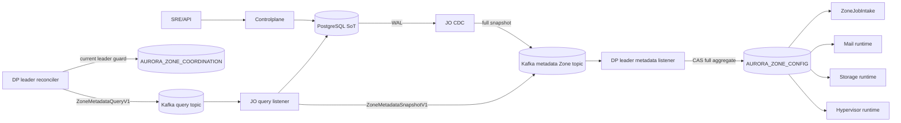
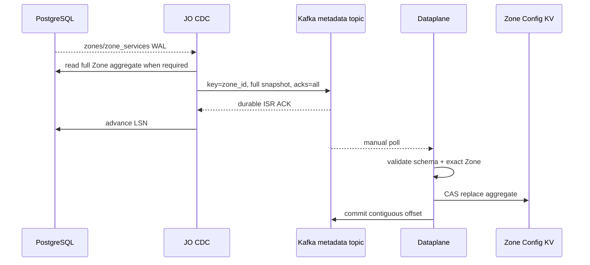
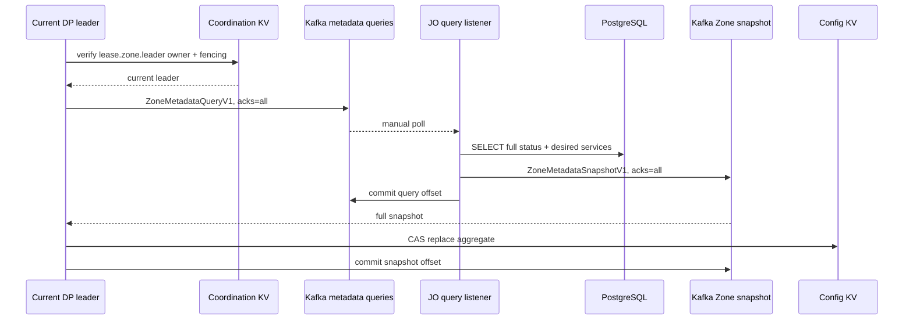

# Zone Metadata Sync và Dataplane State Machine — God View

> [!IMPORTANT]
> Đây là Source of Truth cho `hierarchy.zones.status` và
> `hierarchy.zone_services.desired_state` tại runtime. PostgreSQL là authoritative SoT,
> Kafka transport plane là durable Central↔Zone transport, NATS JetStream KV riêng Zone là runtime snapshot.

## 0. Control header

| Thuộc tính | Contract |
|---|---|
| Authoritative SoT | Controlplane PostgreSQL |
| Trigger | WAL → JO CDC → compacted Kafka per-Zone topic |
| Repair | DP cold-start/periodic query topic → JO full snapshot response |
| Wire | `ZoneMetadataQueryV1`, `ZoneMetadataSnapshotV1` |
| Runtime key | `AURORA_ZONE_CONFIG/zone.metadata` |
| Coordination | Stable `AURORA_ZONE_COORDINATION/lease.zone.leader` |
| Apply | Full aggregate + CAS |
| Failure | Missing/corrupt/unavailable metadata → fail-closed ingestion |

## 1. Architecture



JO không truy cập Zone KV. DP không truy cập PostgreSQL. `NATS_ZONE_URL` không được fallback sang
Central NATS. Kafka topic, `snapshot.zone_id` và configured `ZONE_ID` phải trùng.

## 2. Snapshot contract

Logical value trong KV:

```json
{
  "status": "active",
  "services": {
    "mail": true,
    "storage": true,
    "hypervisor": false
  },
  "updated_at": 1784620800
}
```

Kafka dùng full aggregate `ZoneMetadataSnapshotV1`, không phát field delta:

- `event_id`: 16 bytes;
- `zone_id`: 16 bytes;
- `status`;
- repeated `{service_type, enabled}`;
- observation time;
- `schema_version=1`.

Full snapshot tránh lost update giữa status và desired services. Per-Zone topic có một partition,
key là Zone UUID và `cleanup.policy=compact`, nên cold start có thể đọc authoritative snapshot gần nhất.

## 3. WAL real-time path



- Duplicate WAL replay produces same logical snapshot.
- Invalid/cross-Zone snapshot được durable DLQ trước commit.
- KV failure giữ offset chưa settle.
- Rebalance epoch fence chặn completion của owner cũ commit assignment mới.

## 4. Cold-start và periodic repair



- Query không dùng unique reply channel hay Redis PubSub.
- Query topic durable; JO commit chỉ sau snapshot Kafka ACK.
- Compacted response topic là shared recovery log cho toàn bộ pod trong đúng Zone.
- Reconciler chạy trong leader session, có startup run, hourly timer và deterministic jitter.
- Timeout/lỗi không suy diễn Zone thành active.

## 5. Dataplane state machine

| Zone status | Kafka ingestion | Health probes |
|---|---|---|
| `active` | Poll/dispatch khi admission còn capacity | Probe service enabled |
| `planned` | Không dispatch job mới | Probe readiness |
| `maintenance` | Dừng job mới; in-flight tự hoàn tất | Vẫn probe |
| `draining` | Dừng job mới | Quan sát drain |
| `disabled` | Dừng job mới | Service disabled không được báo healthy |
| `inactive`, missing, corrupt, KV error | Fail-closed | Không suy diễn active |

Service absent trong authoritative aggregate phải được coi disabled/invalid theo catalog contract; bootstrap
phải hydrate đầy đủ desired service catalogue.

## 6. Health/report separation

| State | Store/path |
|---|---|
| Desired Zone/service state | PostgreSQL → Kafka → `AURORA_ZONE_CONFIG` |
| Node/service current health | `AURORA_ZONE_HEALTH` |
| Lease/fencing | `AURORA_ZONE_COORDINATION` |
| Aggregate Zone report | DP → `aurora.zone.reports.v1` → JO |
| Dynamic consumer runtime watch | Pod memory → NATS Core → Central Shared Redis TTL |
| Metrics/traces/logs | OTel/Grafana |

Zone reporter chạy trong stable leader session. Mỗi pod xuất cached lag của các partition đang assign;
leader cộng snapshot fresh để có lag toàn Zone. JO không cross-query broker bằng Zone credential.
Nếu lag stale, Decision Engine giữ state hiện tại thay vì tự động chuyển Zone.

## 7. Race/failure matrix

| Case | Guard | Result |
|---|---|---|
| WAL duplicate | Full snapshot + stable key | Idempotent apply |
| Query duplicate | request ID + full snapshot | Safe replay |
| Metadata topic poison | Strict validation + durable DLQ | Commit sau DLQ ACK |
| Pod A complete sau rebalance | Assignment epoch | Không commit owner mới |
| N pod cold start | Stable Zone leader lease/fencing | Một query/report owner |
| Pod A release lease của B | owner + fencing compare | Reject stale release |
| Kafka quorum loss | `acks=all`, min ISR | Không ACK/commit |
| Zone KV unavailable | No Kafka settle | Replay sau recovery |
| Stale lag report | `job_queue_lag_stale` | Không auto-transition |
| Clock skew | bounded report timestamp + fencing | Reject/quarantine + alert |

## 8. Security

- Production Kafka dùng TLS/mTLS hoặc SASL over TLS và topic/group ACL theo Zone.
- Dataplane Zone A không được subscribe metadata/command topic Zone B.
- NATS credential chỉ cho ba KV bucket của chính Zone.
- JO/Controlplane không được có endpoint/credential Zone KV.
- Metadata không mang secret, owner hoặc customer broker configuration.
- Missing/malformed payload fail-close; không fallback default active.

## 9. Code map

- `job-orchestrator/src/changefeed/worker.rs`: full metadata snapshot publisher.
- `job-orchestrator/src/zone_state/metadata.rs`: durable query consumer.
- `job-orchestrator/src/zone_state/worker.rs`: Zone report consumer.
- `job-orchestrator/src/zone_state/watchdog.rs`: Shared Redis leader lease và durable timestamp watchdog.
- `dataplane/src/leader/leadership.rs`: Zone leader election/failover và fenced session.
- `dataplane/src/leader/zone_metadata.rs`: compacted snapshot listener/projector và repair query publisher.
- `dataplane/src/leader/zone_report.rs`: Zone report aggregation.
- `dataplane/src/job_runtime/intake.rs`: fail-closed state reaction.
- `dataplane/src/infra/zone_kv.rs`: KV CAS and fencing.
- `dataplane/src/infra/kafka.rs`: manual consumer and contiguous settlement.
