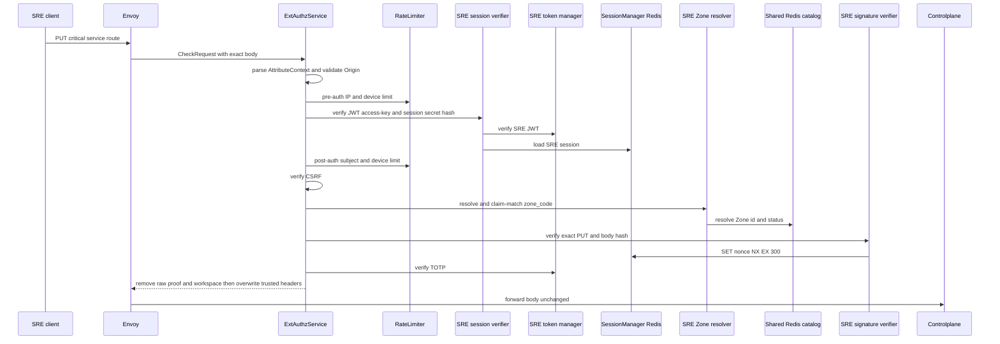
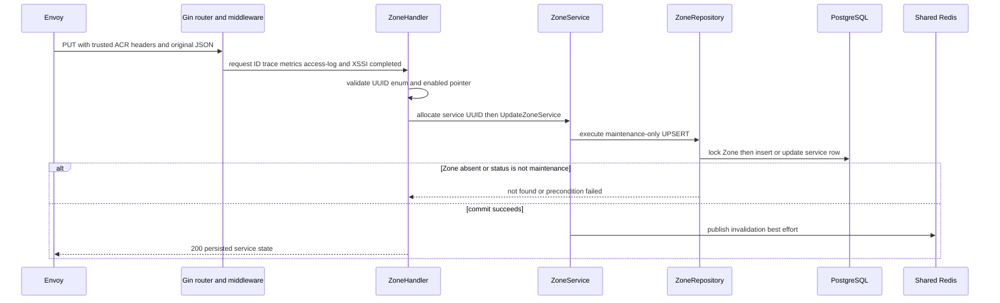
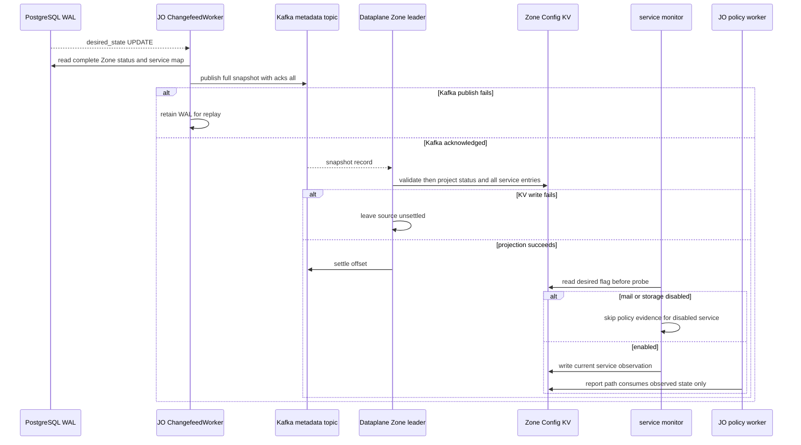

# Zone service desired-state update — God View

Enables or disables one declared Zone service while the Zone is in maintenance. `desired_state` is SRE-owned; runtime reports may change `actual_state` but never desired state.

## API-scope contract

| Owner | Route | Authority | Durable boundary |
|---|---|---|---|
| SRE admin | `PUT /admin/critical/hierarchy/zones/services` | SRE session plus critical proof | locked UPSERT in `hierarchy.zone_services` |

## Phase 1 — Client → Envoy → ACR

| Header / cookie | Purpose |
|---|---|
| `Origin`, `X-Forwarded-For` | CORS and Envoy-provided pre-auth IP |
| `Cookie: access_token, access_key, access_secret, client_device_id, zone_code` | SRE session, device bucket and selected Zone context |
| `x-zone-code`, `x-csrf-token` | fallback Zone selector and mutation guard |
| `x-admin-signature`, `x-admin-timestamp`, `x-admin-nonce`, `x-admin-stepup-code` | one-time critical proof |

| JSON field | Meaning |
|---|---|
| `zone_id` | target UUID |
| `service_type` | `hypervisor`, `storage`, `mail`, `kubernetes`, `ai`, `database`, or `managed_service` |
| `enabled` | desired state |

### ACR processing and REST output

ACR owns only edge validation. It returns an ext-authz denial before Controlplane
on a failed component; an allowed request has no ACR body and is forwarded
unchanged.

#### Response headers

| Result | Headers from ACR |
|---|---|
| Denied | no stable workflow JSON/header payload |
| Allowed forward | trusted SRE identity/device/Zone headers overwrite browser values; `x-session-proof-verified=true` and opaque challenge ID injected; session/Zone rotation can add `Set-Cookie` |

#### Response payload

| Result | Payload |
|---|---|
| Denied | generic Envoy denial |
| Allowed forward | none; Controlplane owns `200` payload |

### ACR forward contract

| Forwarded item | Source | Constraint |
|---|---|---|
| exact PUT path and `{zone_id, service_type, enabled}` JSON | Envoy request | no rewrite; signature covers this body |
| SRE identity, verified device and Zone UUID | SRE session + Zone resolver | overwrite client values |
| proof marker/opaque ID | completed proof branch | raw admin/proof inputs are removed |

ACR removes raw `x-admin-*`, caller `x-session-proof-*`, and `x-workspace-id`; it overwrites SRE identity/device/resolved Zone headers and injects `x-session-proof-verified=true` with the opaque challenge ID. Rate-limit Redis is fail-open; session, CSRF, Zone and proof failures deny. It does not rewrite or locally handle this route.

### Key contract

| Key / transport | Store | Operation | TTL / timeout | Owner / invariant |
|---|---|---|---|---|
| pre/post `ratelimit:*:{ip|sre_subject|device}:sre_critical` | Moka L1 → Auth-State Redis | `INCR` + `EXPIRE`; L1 block marker | 50/s IP, 5/s pre-device, 10/s post subject/device; L1 30s | limiter; Redis fault fail-open |
| `iam:sre_access_session:{access_key}` | Auth-State Redis | Prost session `GET` | `SESSION_TTL_SECS` | SRE verifier; session error/mismatch denies |
| `iam:sre:nonce:{nonce}` | Auth-State Redis | `SET EX 300 NX` | 300s | signature verifier; single use |
| Zone L1 and `zone:code:{code}` | process L1 → Shared L2 Redis | code/status lookup and bounded CP refresh | 30s positive L1, 180s negative; L2 24h/180s | Zone resolver; rebuildable |
| `hierarchy.zone.get_zone_list` request/reply | Shared L2 Redis Pub/Sub | protobuf cache-miss refresh | 1s | no direct PostgreSQL from ACR |

## Phase 2 — Controlplane command

### Internal input and output

| Part | Contract |
|---|---|
| Input | `zone_id`, allowed service enum and non-nil `enabled` parsed by handler; trusted SRE/proof headers are the authorization evidence |
| Command | `UpdateZoneService` receives a fresh UUIDv7 candidate for a newly inserted row and the requested desired state |
| Repository guard | locks the Zone row and UPSERTs only while its durable status is `maintenance` |
| REST output | `200` with persisted service row; `400` invalid input, `404` absent Zone, `409` non-maintenance guard, `500` persistence/UUID error |

### Durable and soft-state contract

| Store/key | Operation | Owner / settlement |
|---|---|---|
| locked `hierarchy.zones` row | serialization point | repository owns status precondition |
| `hierarchy.zone_services` | UPSERT `(zone_id, service_type)` desired state | same SQL statement; current `actual_state` remains runtime-owned |
| `hierarchy.zone.invalidated` | best-effort publish after commit | invalidation only, not CDC delivery |

Missing Zone is `404`; a non-maintenance Zone is `409`; persistence failure is `500`. Redis publish is best effort after commit.

## Phase 3 — Runtime reaction

### Internal input and output

| Part | Contract |
|---|---|
| Trigger | committed `UPDATE` or inserted `zone_services` row in WAL |
| JO input/output | rereads full Zone aggregate and publishes `ZoneMetadataSnapshotV1` with every desired flag after Kafka durable ack |
| Zone output | leader validates exact Zone and updates Config KV status/service entries before settling source offset |
| Monitor/policy result | monitor reads projected desired state; disabled mail/storage are excluded from current policy evaluation and runtime must never change desired state |

### Key contract

| Key / topic | Store | Owner / invariant |
|---|---|---|
| per-Zone metadata topic | Kafka | full snapshot and replay source |
| `AURORA_ZONE_CONFIG/zone.metadata` | Zone NATS JetStream KV | Zone leader owns projection |
| `AURORA_ZONE_HEALTH/zone.service.*` | Zone NATS JetStream KV | monitors write observed health only |

The API `200` confirms desired-state persistence, not a completed monitor transition or a health result.
