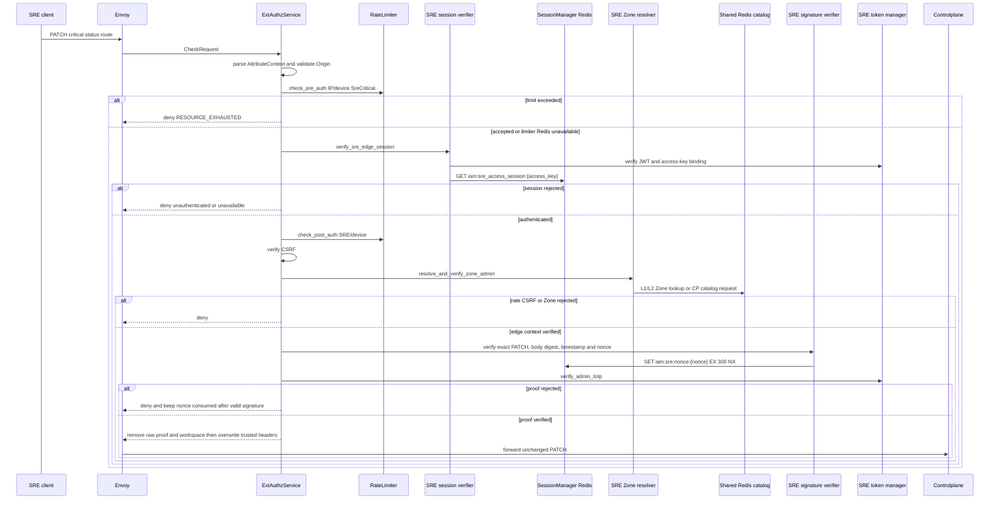
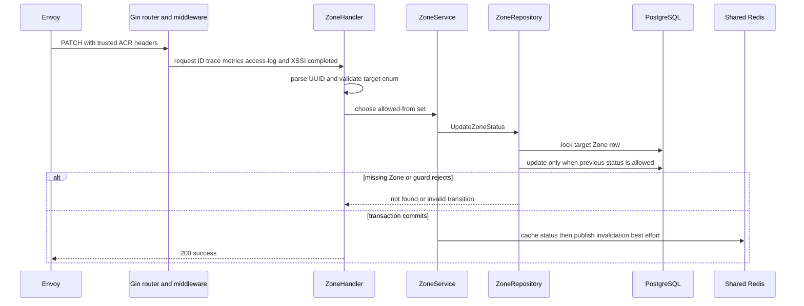
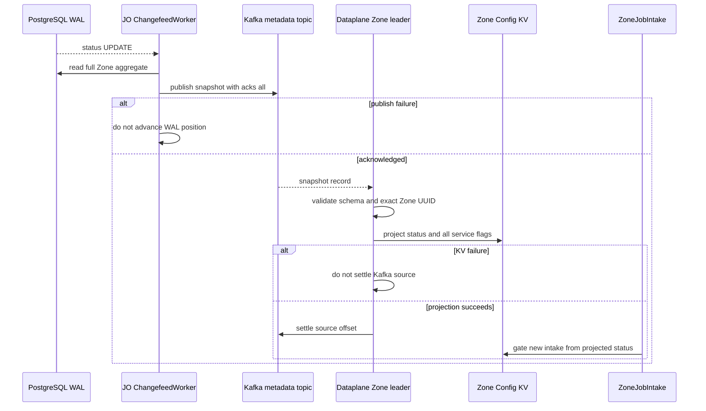

# Zone status update — God View

Changes the SRE-owned lifecycle status of one Zone. It is separate from JO’s report-driven operational transition, which is bounded to the transitions implemented in the runtime policy.

## API-scope contract

| Owner | Route | Authority | Durable boundary |
|---|---|---|---|
| SRE admin | `PATCH /admin/critical/hierarchy/zones/{zone_id}/status` | SRE session plus Ed25519, nonce and TOTP proof | guarded update of `hierarchy.zones.status` |

### State transition contract

| Target | Allowed previous status |
|---|---|
| `planned` | `active`, `disabled`, `planned` |
| `active` | `planned`, `draining`, `maintenance`, `active` |
| `draining` | `active`, `draining` |
| `maintenance` | `draining`, `maintenance` |
| `disabled` | `draining`, `planned`, `disabled` |

## Phase 1 — Client → Envoy → ACR

| Header / cookie | Purpose |
|---|---|
| `Origin`, `X-Forwarded-For` | CORS and Envoy-provided pre-auth rate-limit IP |
| `Cookie: access_token, access_key, access_secret, client_device_id, zone_code` | SRE session, device rate bucket and selected Zone context |
| `x-zone-code` | fallback selector only when the Zone cookie is absent |
| `x-csrf-token` | authenticated browser mutation guard |
| `x-admin-signature`, `x-admin-timestamp`, `x-admin-nonce`, `x-admin-stepup-code` | one-time request proof |

| JSON payload |
|---|
| `{ "status": "active|planned|draining|maintenance|disabled" }` |

### ACR processing and REST output

`ExtAuthzService::check` returns a local denial when its edge components fail;
on success it emits only an allow response and Envoy forwards this unchanged
PATCH to Controlplane.

#### Response headers

| Result | Headers from ACR |
|---|---|
| Edge denial | no Zone workflow response header contract |
| Allowed forward | overwrite SRE identity/device/resolved `x-zone-id`; add `x-session-proof-verified=true` and opaque `x-session-proof-challenge-id`; optional rotated session/Zone `Set-Cookie` |

#### Response payload

| Result | Payload |
|---|---|
| Edge denial | Envoy generic denial; no stable Zone API JSON payload |
| Allowed forward | no ACR body; Controlplane owns `200` response |

### ACR forward contract

| Item | Source | Constraint |
|---|---|---|
| method, exact path and `{status}` body | Envoy request | no `/admin` rewrite; Ed25519 covers the same bytes |
| `x-user-id`, `x-user-name`, `x-user-level`, device and Zone headers | verified SRE session + Zone resolver | overwrite caller values |
| proof marker and opaque proof ID | signature, nonce and TOTP success | raw proof never reaches CP |
| `x-admin-*`, caller `x-session-proof-*`, `x-workspace-id` | client request | removed before forward |

ACR removes raw `x-admin-*`, incoming `x-session-proof-*`, and `x-workspace-id`; it overwrites the SRE identity/device/resolved Zone headers and injects `x-session-proof-verified=true` with the opaque challenge ID. Rate-limit Redis failure is fail-open; all session/Zone/CSRF/proof failure is denied. No path rewrite or ACR-local response applies.

### Key contract

| Key / transport | Store | Operation | TTL / timeout | Owner / invariant |
|---|---|---|---|---|
| pre/post `ratelimit:*:{ip|sre_subject|device}:sre_critical` | ACR Moka block L1 → Auth-State Redis | L2 `INCR` + `EXPIRE` | pre IP 50/s, device 5/s; post subject/device 10/s; L1 block 30s | `RateLimiter`; Redis outage fails open |
| `iam:sre_access_session:{access_key}` | Auth-State Redis | Prost SRE session `GET` | `SESSION_TTL_SECS` | `SessionManager`; hash and signing public key; failure denies |
| `iam:sre:nonce:{nonce}` | Auth-State Redis | `SET 1 EX 300 NX` | 300s | signature verifier; one request only |
| Zone L1 `code_to_id`/`id_to_status`; `zone:code:{code}` | process L1 → Shared L2 Redis | lookup, negative cache, bounded CP refresh | L1 30s positive/180s negative; L2 24h positive/180s negative | Zone resolver; never identity authority |
| `hierarchy.zone.get_zone_list` request/reply | Shared L2 Redis Pub/Sub | protobuf request/reply | 1s | cache-miss fallback; ACR never queries PostgreSQL |

## Phase 2 — Controlplane transition

### Internal input and output

| Part | Contract |
|---|---|
| Input | path UUID, validated target `ZoneStatus`, trusted SRE/proof headers for audit boundary |
| Service decision | maps target status to the exact allowed previous statuses listed above |
| Repository output | current Zone row exists flag, guarded update result, code/name and previous status |
| REST output | `200` only after guarded commit; `400` malformed UUID/status, `404` absent Zone, `409` rejected transition, `500` database error |

### Durable and soft-state contract

| Store/key | Operation | Owner / invariant |
|---|---|---|
| locked `hierarchy.zones` row | `FOR UPDATE`, then conditional status update | serializes status, desired-service update and delete |
| `zone:code:{code}` | overwrite `{zone_id}:{status}` EX 24h | post-commit rebuildable cache |
| `hierarchy.zone.invalidated` | best-effort invalidation event | not the runtime delivery contract |

The locked row serializes status, service mutation and delete. Missing Zone is `404`; a rejected guard is `409`; other persistence failure is `500`. A cache failure does not roll back the committed status.

## Phase 3 — Runtime reaction

### Internal input and output

| Part | Contract |
|---|---|
| Trigger | committed `UPDATE hierarchy.zones.status` WAL row |
| JO output | full `ZoneMetadataSnapshotV1`, not a status delta, published with `acks=all` |
| Dataplane output | leader writes new status to `AURORA_ZONE_CONFIG/zone.metadata` and settles only after KV success |
| Admission result | only projected `active` allows new job intake; `planned`, `draining`, `maintenance`, `disabled`, missing/corrupt metadata and KV error fail closed |

The HTTP `200` is not a Dataplane acknowledgement. Delete/tombstone behavior is not part of this update workflow.
