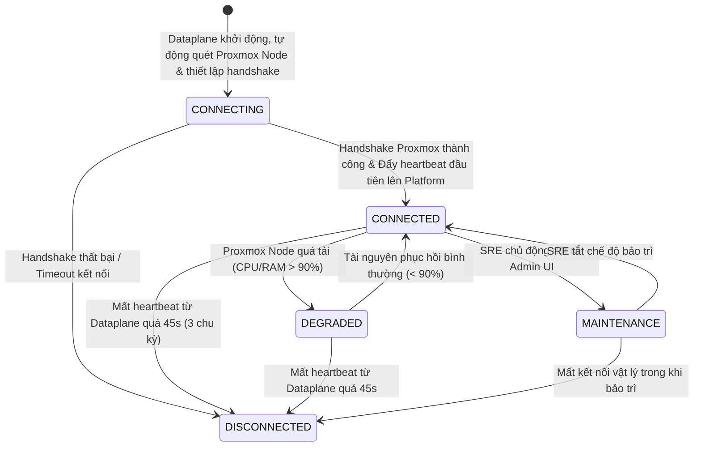
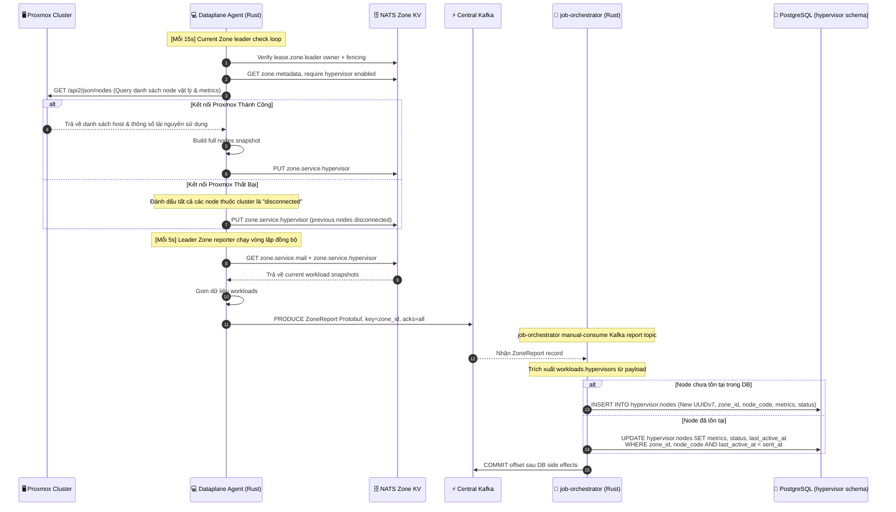

# Proxmox Hypervisor Connection Lifecycle - Workflow God View

> [!NOTE]
> Tài liệu này là **Source of Truth (SoT) / God View** cho luồng kết nối và
> health snapshot của Proxmox trong Zone. Node telemetry là observability data;
> Admin UI không render node list. Grafana là nơi visualize node/capacity.
> Mọi thay đổi liên quan đến schema `hypervisor`, controlplane Go module, job-orchestrator, dataplane agent, và Admin UI bắt buộc phải tuân thủ nghiêm ngặt đặc tả này.
>
> Luồng provision VM cá nhân được đặc tả riêng tại
> [`personal_vm_create_god_view.md`](./personal_vm_create_god_view.md).

---

## 🗺️ 1. Giới Thiệu & Kiến Trúc Tổng Quan

Hệ thống quản lý Hypervisor triển khai theo mô hình **Decoupled Architecture**:
1. **Dataplane Agent** đóng vai trò là bên duy nhất lưu trữ cấu hình kết nối vật lý và trực tiếp giữ kết nối tới Proxmox Cluster thông qua biến môi trường.
2. **Controlplane (Platform Level)** hoàn toàn không lưu thông tin nhạy cảm (như API endpoint, API tokens của Proxmox) nhằm giảm thiểu tối đa rủi ro bảo mật (Blast Radius). Controlplane chỉ đóng vai trò tracking trạng thái logic của hạ tầng được report từ Dataplane.
3. Luồng đồng bộ trạng thái tái sử dụng **Zone Status Gateway** và Kafka topic **`aurora.zone.reports.v1`**.

### 🌐 Sơ đồ Điều Phối Request & Trạng Thái (System Dataflow)

```mermaid
graph TD
    classDef client fill:#332244,stroke:#8844ff,stroke-width:2px;
    classDef gateway fill:#112233,stroke:#3388ff,stroke-width:2px;
    classDef storage fill:#333311,stroke:#cccc33,stroke-width:2px;
    classDef backend fill:#221133,stroke:#aa44ff,stroke-width:2px;
    classDef dataplane fill:#113322,stroke:#33cc88,stroke-width:2px;

    SRE["💻 Admin UI (SRE Admin)"]:::client
    Envoy["🛡️ Envoy Gateway"]:::gateway
    acr["🛡️ acr Service (Rust)"]:::gateway
    CP["🚀 Controlplane Go (hypervisor module)"]:::backend
    DB["💾 PostgreSQL SoT (hypervisor schema)"]:::storage
    ZoneKV["🗄️ NATS Zone KV (Health + Coordination)"]:::storage
    Kafka["⚡ Central Kafka"]:::storage
    JO["🚀 job-orchestrator (Rust Listener)"]:::backend
    DP["💻 Dataplane Agent (Rust)"]:::dataplane
    PVE["🖥️ Proxmox Cluster"]:::dataplane

    %% Luồng Auto-discovery & Heartbeat
    DP -- "a. Stable leader polls Nodes & Metrics" --> PVE
    DP -- "b. Leader-fenced PUT zone.service.hypervisor" --> ZoneKV
    
    %% Gateway Gom & Sync L1 (ZoneStatusGateway)
    ZoneKV -- "c. Read zone.service.* snapshots" --> DP
    DP -- "d. PRODUCE aurora.zone.reports.v1" --> Kafka
    
    %% Platform listener consume & write DB
    Kafka -- "e. Manual Kafka poll" --> JO
    JO -- "f. UPSERT Dynamic Nodes" --> DB
```



---

## 🗃️ 2. Thiết Kế Cơ Sở Dữ Liệu & Zone KV

### 1. Current snapshot trong NATS Zone KV
* **Health key**: `AURORA_ZONE_HEALTH/zone.service.hypervisor`
* **Coordination key**: `AURORA_ZONE_COORDINATION/lease.zone.leader`
* **Value**: Một JSON snapshot nguyên khối chứa toàn bộ node của chu kỳ, probe owner và fencing token:
  ```json
  {
    "status": "healthy",
    "nodes": {
      "pve-node-01": {
        "status": "connected",
      "cpu_cores_total": 64,
      "cpu_cores_used": 16,
      "ram_mb_total": 262144,
      "ram_mb_used": 65536,
      "storage_gb_total": 2048,
        "storage_gb_used": 512,
        "updated_at": 1719517200
      }
    },
    "updated_at": 1719517200,
    "probe_node_id": "dataplane-vn-n2",
    "fencing_token": 42
  }
  ```

### 2. Cấu Trúc Bảng Database PostgreSQL (hypervisor schema)
Database không lưu trữ `endpoint` kết nối hay credentials của Proxmox, mà chỉ lưu thông tin phục vụ tracking và xếp lịch VM.

```sql
CREATE SCHEMA IF NOT EXISTS hypervisor;

-- Bảng quản lý trạng thái logic của các Proxmox Nodes (Tự động cập nhật qua Heartbeat)
CREATE TABLE IF NOT EXISTS hypervisor.nodes (
    id UUID PRIMARY KEY, -- Sinh động UUIDv7 khi phát hiện node mới
    zone_id UUID NOT NULL, -- Ánh xạ logic tới hierarchy.zones(id)
    node_code VARCHAR(100) NOT NULL, -- Định danh vật lý nhận từ Proxmox (ví dụ: pve-node-01)
    name VARCHAR(255) NOT NULL,      -- Tên hiển thị thân thiện
    status VARCHAR(32) NOT NULL DEFAULT 'disconnected', -- disconnected, connecting, connected, degraded, maintenance
    
    -- Dung lượng tài nguyên (Capacity metrics)
    cpu_cores_total INT NOT NULL DEFAULT 0,
    cpu_cores_used INT NOT NULL DEFAULT 0,
    ram_mb_total BIGINT NOT NULL DEFAULT 0,
    ram_mb_used BIGINT NOT NULL DEFAULT 0,
    storage_gb_total BIGINT NOT NULL DEFAULT 0,
    storage_gb_used BIGINT NOT NULL DEFAULT 0,
    
    -- Metadata vận hành
    last_active_at TIMESTAMPTZ NOT NULL DEFAULT now(),
    created_at TIMESTAMPTZ NOT NULL DEFAULT now(),
    updated_at TIMESTAMPTZ NOT NULL DEFAULT now(),
    
    CONSTRAINT ux_hypervisor_nodes_zone_code UNIQUE (zone_id, node_code)
);

CREATE INDEX IF NOT EXISTS idx_hypervisor_nodes_zone ON hypervisor.nodes(zone_id);
CREATE INDEX IF NOT EXISTS idx_hypervisor_nodes_status ON hypervisor.nodes(status);
```

---

## 🔄 3. Vòng Đời Kết Nối & Cơ Chế Khám Phá (Auto-Discovery)

### 1. Cơ chế Tự Động Phát Hiện Node (Auto-Discovery)
- SRE **không cần** đăng ký thủ công từng node vật lý của Proxmox Cluster trên Admin UI.
- Dataplane khởi tạo một `HypervisorRuntime` shared cho pod nhưng không probe khi
  khởi tạo. Chỉ replica đang giữ Zone leader lease mới chạy periodic query danh
  sách node vật lý qua Proxmox API; worker replica không chạy health probe.
- Leader và job executor dùng chung connection pool của runtime. Worker chỉ gọi
  Proxmox cho command đã được Kafka deliver và Zone lease/fence; failover leader
  không sinh thêm một HTTP client hoặc một health loop song song trong cùng pod.
- Danh sách node được ghi thành current snapshot trong Zone Health KV rồi Zone Gateway đẩy lên Platform.
- Phía Platform (`job-orchestrator`), khi nhận báo cáo từ stream, nếu phát hiện `node_code` chưa tồn tại trong bảng `hypervisor.nodes` thuộc `zone_id` tương ứng, hệ thống sẽ tự động thực hiện **INSERT** bản ghi node mới với UUIDv7 được sinh tự động.

### 2. State Machine của Hypervisor Node



---

## 🏛️ 4. Mô Tả Chi Tiết Luồng Xử Lý (Sequence Diagrams)

### Luồng A: Node health observability

Không có public/admin node-management API trong UI flow. Dataplane leader ghi
snapshot health theo Zone, JO materialize báo cáo durable nếu workflow yêu cầu,
và Grafana đọc datasource observability để visualize. Node metadata không phải
input cho image catalog hay VM create request.

### Luồng B: Auto-Discovery, Healthcheck & Đẩy Tải (Heartbeat Flow)



---

## 🔒 5. Ranh Giới Bảo Mật & Rủi Ro HA (Security & Reliability Guardrails)

### 1. Đối soát Trạng thái Máy ảo

Periodic VM drift reconciliation chưa phải AS-IS. Nó là workflow deferred và
không được suy luận từ health report. Khi bổ sung phải dùng Kafka durable report,
bounded batch/jitter, leader fencing và authoritative settlement riêng.

### 2. Nguyên Tắc Quyền Tối Thiểu (Least Privilege) cho API Proxmox
* **Thách thức**: Hacker chiếm quyền Dataplane Agent ở biên và phá hủy toàn bộ hạ tầng Proxmox vật lý.
* **Giải pháp**:
  - API Token/Credentials cấu hình cho Dataplane ở biên bắt buộc không sử dụng tài nguyên root (`root@pam`).
  - Phân quyền (PVE Role) chỉ giới hạn trong một Resource Pool cụ thể phục vụ tạo/xóa VM, loại bỏ các quyền quản lý Cluster, Storage cấu hình, và Network vật lý.

### 3. Tối ưu hóa API Query (Tránh Rate Limiting Proxmox)
* **Thách thức**: Việc query liên tục danh sách Node và VM lên API Proxmox làm nghẽn tiến trình `pvedaemon` / `pveproxy`.
* **Giải pháp**:
  - Chỉ Zone leader gọi một cluster-level node-list request trong mỗi health
    interval; không query riêng từng node và không để mỗi replica tự poll.
  - Current health snapshot trong Zone Health KV là dữ liệu để reporter đọc lại;
    reporter không gọi ngược Proxmox.
  - `HypervisorRuntime` dùng một shared `reqwest` connection pool cho health probe
    và job execution. Không có cache RAM mơ hồ có thể phục vụ capacity stale cho
    placement; create workflow lấy inventory/capacity mới trước mutation.

### 4. Tự Phục Hồi & Phát Hiện Node Chết (Dead Man's Switch)
* **Giải pháp**:
  - `job-orchestrator` duy trì Dead Man's Switch: Nếu cả zone quá 30 giây không gửi report lên stream, toàn bộ hypervisors của zone đó tự động chuyển sang `disconnected`.
  - Nếu zone vẫn gửi report nhưng một node cụ thể trong report đó không được cập nhật trạng thái mới hoặc bị biến mất khỏi report quá 45 giây, hệ thống tự động đánh dấu node đó là `disconnected`.
* **Phòng ngừa Race Condition (Out-of-order Heartbeats)**: Sử dụng cơ chế kiểm tra `last_active_at` khi cập nhật DB. 
  ```sql
  UPDATE hypervisor.nodes 
  SET status = $1, cpu_cores_used = $2, ..., last_active_at = $3
  WHERE zone_id = $4 AND node_code = $5 AND last_active_at < $3;
  ```
