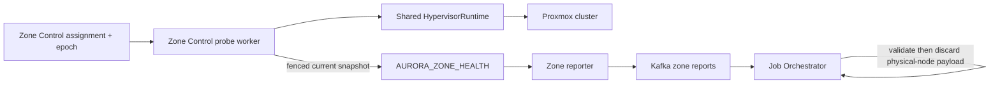

# Proxmox Connection and Node Telemetry - Workflow God View

> [!IMPORTANT]
> Đây là Source of Truth cho ownership kết nối Proxmox và physical-node
> telemetry. Physical node là runtime topology của từng Zone, không phải
> Controlplane business resource.
>
> Luồng provision VM cá nhân được đặc tả riêng tại
> [`personal_vm_create_god_view.md`](./personal_vm_create_god_view.md).

## 1. Invariant và ownership

| Thành phần | Ownership |
|---|---|
| Dataplane đúng Zone | Giữ Proxmox endpoint/token, probe node và thực thi VM job |
| Assigned Zone Control worker | Chạy periodic Proxmox health probe cho đúng assignment epoch |
| Dataplane worker | Không chạy health loop; chỉ gọi Proxmox khi thực thi command |
| Zone Health KV | Current reconstructible snapshot, không phải business SoT |
| Kafka Zone report | Durable transport cho bounded Zone report |
| Job Orchestrator | Validate report và settle offset; không persist physical nodes |
| OTel/Grafana | Target operator view; node metric export/dashboard còn deferred |
| Controlplane Hypervisor | Sở hữu image/VM desired resource và shared outbox |

Controlplane và JO không có Proxmox hoặc Zone KV credential. Dataplane không có
Controlplane PostgreSQL credential. Proxmox token chỉ tồn tại trong đúng Zone và
không được đưa vào command, result, Zone KV, log hoặc trace.

Không tồn tại các thành phần sau trong contract:

- bảng `hypervisor.nodes`;
- node repository/service/handler trong Controlplane;
- public/admin node-management API;
- node list hoặc node capacity screen trong Admin UI;
- node watchdog ghi PostgreSQL.

## 2. Topology AS-IS



`HypervisorRuntime` là một shared runtime trong pod, dùng chung connection pool
cho Zone Control probe và worker execution. Không tạo HTTP client/pool riêng theo mỗi
loop hoặc mỗi job.

Zone report hiện vẫn mang bounded `workloads.hypervisors` trong thời gian rollout
contract. JO validate schema, size, Zone binding và timestamp trước khi commit
Kafka offset, nhưng không materialize physical node vào PostgreSQL. Việc xóa
field transport này về sau phải là một protobuf-compatible rollout riêng.

## 3. Assignment-fenced probe flow

```mermaid
sequenceDiagram
    autonumber
    participant Lease as Zone Control assignment KV
    participant Leader as assigned Zone Control worker
    participant Runtime as HypervisorRuntime
    participant PVE as Proxmox
    participant Health as Zone Health KV
    participant Kafka as Kafka
    participant JO as Job Orchestrator

    Leader->>Lease: Verify current owner and assignment epoch
    Leader->>Health: Read zone metadata; require hypervisor enabled
    alt metadata unavailable or assignment lost
        Leader-->>Leader: Fail closed; skip external probe/write
    else service disabled
        Leader->>Health: Fenced PUT down/empty snapshot
    else current assignment
        Leader->>Runtime: probe_nodes()
        Runtime->>PVE: GET cluster node inventory
        alt probe succeeds
            PVE-->>Runtime: node health and capacity
            Leader->>Health: Fenced PUT full current snapshot
        else probe fails
            Leader->>Health: Fenced PUT previous nodes as disconnected
        end
    end

    Leader->>Health: Read current service snapshots
    Leader->>Kafka: Produce ZoneReport, key=zone_id, acks=all
    Kafka-->>JO: Manual consume
    JO->>JO: Validate envelope, timestamp and bounded payload
    JO->>Kafka: Commit offset after required Zone service side effects
```

Probe interval có jitter để tránh đồng bộ tải sau rolling restart. Khi worker
chết, assignment hết hạn cho phép replica khác takeover. Mọi write health của worker
cũ phải bị assignment epoch từ chối; việc có hai process cùng sống trong cửa sổ
failover không được tạo hai writer hợp lệ.

## 4. Snapshot semantics

Key current snapshot:

```text
AURORA_ZONE_HEALTH/zone.service.hypervisor
```

Snapshot gồm service status, map node health/capacity, observation time,
`probe_node_id` và `fencing_token`. Đây là soft/current state:

- có thể stale hoặc mất và được probe lại;
- không dùng để authorize, tính tiền hoặc xác nhận durable VM completion;
- không được join vào Controlplane create path;
- không làm ownership record của VM/image;
- không được giữ plaintext secret hoặc provider response body.

VM placement không đọc một PostgreSQL node catalogue. Khi thực thi create job,
Dataplane lấy inventory/capacity mới từ Proxmox, chọn node online đủ tài nguyên,
rồi giữ resource lease/provider-binding idempotency boundary cho mutation.

## 5. Failure, backpressure và shutdown

| Failure | Semantics |
|---|---|
| Zone metadata/KV unavailable | Probe fail-closed; không gọi Proxmox hoặc ghi unfenced |
| Proxmox timeout/error | Ghi current snapshot disconnected nếu assignment vẫn current |
| Health snapshot stale/mất | Rebuild ở probe kế tiếp; không sửa business resource |
| Kafka report publish lỗi | Không giả lập DB node state; producer retry bounded |
| JO duplicate/out-of-order report | Timestamp fence bảo vệ Zone service observation |
| Worker chết giữa probe/write | Reassignment; epoch chặn zombie writer |
| OTel collector unavailable | Business/VM execution không phụ thuộc collector |

Graceful shutdown hủy assigned probe, chờ bounded in-flight probe rồi dừng.
Worker shutdown và Kafka settlement tuân theo
job lifecycle riêng; health probe không được giữ worker hoặc command offset.

## 6. Security và cardinality

- Proxmox dùng TLS và least-privilege API token, không dùng `root@pam`.
- Token chỉ có quyền cần thiết trên pool/storage/template và VM operations.
- Log/trace không chứa authorization header, SSH key, raw response hay URL có
  credential.
- OTel label chỉ dùng bounded dimensions như Zone, workload và health class;
  không dùng VM UUID hoặc user-controlled name làm metric label.
- Physical node name chỉ là operational attribute tại Zone/observability
  boundary, không trở thành public authorization identity.

## 7. Deferred work

OTel export cho Proxmox node, dashboard/alert Grafana và việc loại
`workloads.hypervisors` khỏi ZoneReport là rollout observability/contract riêng.
Chúng không được khôi phục
`hypervisor.nodes` hoặc node-management API trong Controlplane.
