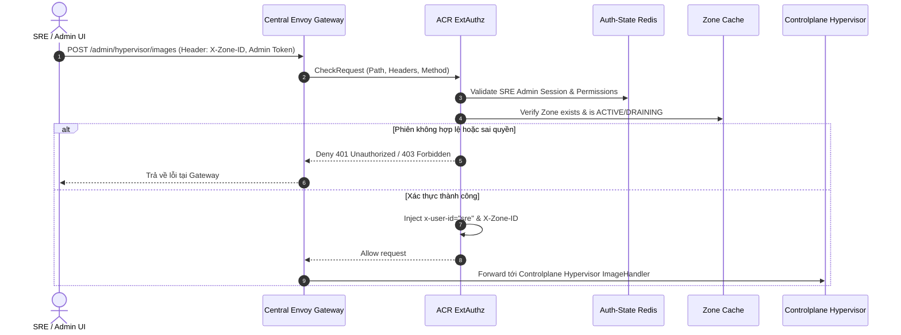
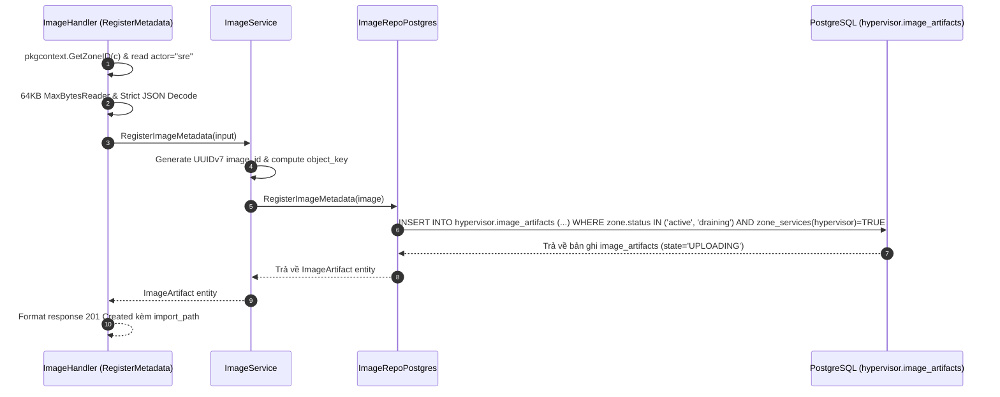
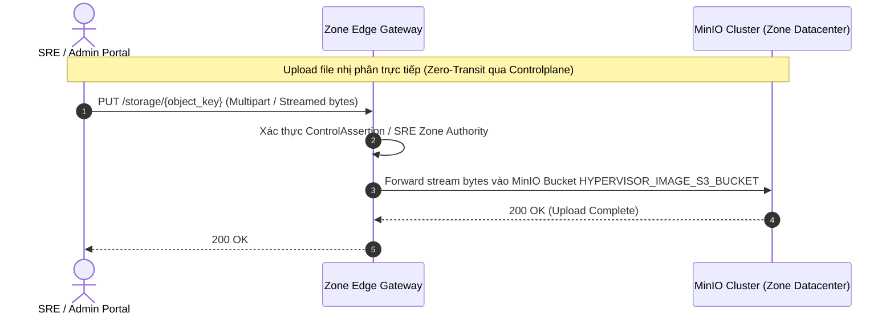
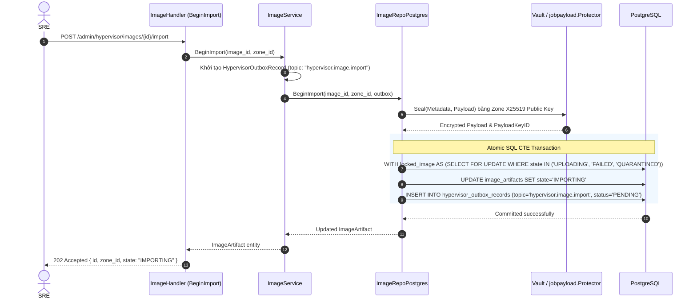
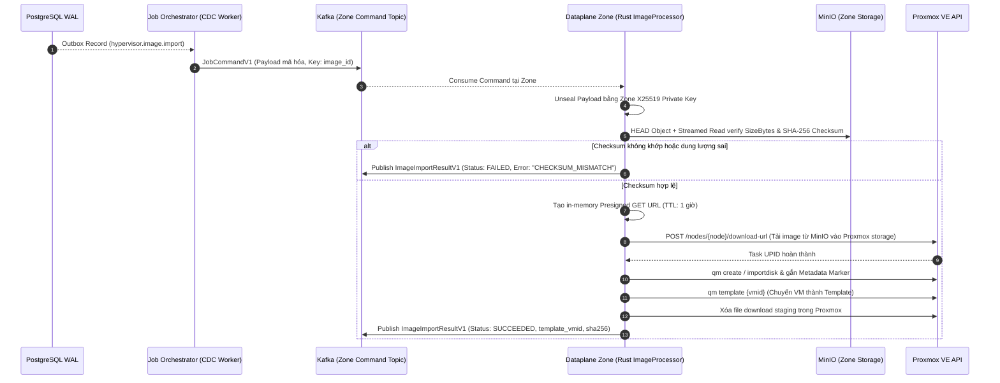
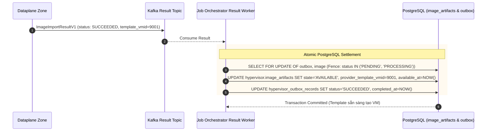

# SRE Hypervisor Image Upload & Provisioning — Workflow God View

Quy trình SRE Hypervisor Image Upload & Provisioning là workflow quản trị hạ tầng (SRE/Platform Admin) end-to-end duy nhất để đưa một Image Hệ điều hành (OS Template) mới vào một Zone Datacenter cụ thể. Workflow bắt đầu từ khi SRE khai báo metadata, upload file nhị phân trực tiếp lên MinIO của Zone, kích hoạt import, Dataplane kiểm tra tính toàn vẹn và chuyển đổi thành Proxmox VM Template, kết thúc khi bản ghi đạt trạng thái bền vững `AVAILABLE`.

Mỗi Zone là một datacenter độc lập; image bytes và Proxmox template của Zone A **không bao giờ** được tham chiếu, copy hay chia sẻ trực tiếp qua Zone B. Image artifact là bất biến (immutable) theo bộ khóa `(zone_id, code, revision)`.

---

## API-scope contract

### Lộ trình Quản trị SRE (`/admin/hypervisor/images`)

- **Neutral Gateway Route**: Browser/Admin UI gọi route quản trị `/admin/hypervisor/images` kèm header `X-Zone-ID` và SRE Admin Credentials.
- **ACR ExtAuthz Boundary**: ACR xác thực phiên SRE Admin, kiểm tra trạng thái Zone trong Cache, loại bỏ các header untrusted từ client, inject `x-user-id: sre` (dạng text identity định danh SRE, không phải User UUID) và `X-Zone-ID`.
- **Controlplane Boundary**: Route `/admin/hypervisor/images` **không áp dụng `middleware.Authorize` của User RBAC** (vì SRE không thuộc tổ chức tenant/workspace cá nhân nào). Handler trích xuất `zoneID` qua `pkgcontext.GetZoneID(c, op)` và `actor` qua `x-user-id`.

| Boundary | Authority | Durable state |
|---|---|---|
| Admin UI (SRE) | SRE Admin Session & Target Zone ID | None |
| ACR ExtAuthz | SRE Credentials / Admin Session Token | Auth-State Redis |
| Controlplane Hypervisor | Metadata Validation & Atomic Outbox Transaction (`jobpayload.Protector`) | PostgreSQL (`hypervisor.image_artifacts`, `hypervisor_outbox_records`) |
| Job Orchestrator | CDC Logical Outbox Reader & Result Settlement | PostgreSQL & Kafka |
| Dataplane (Rust Zone) | S3 MinIO Client & Proxmox API Client | MinIO Zone Bucket & Proxmox VM Template |

---

## REST input and output

### 1. Request Headers

| Header | Boundary nhận | Mục đích sử dụng |
|---|---|---|
| `Cookie` / `Authorization` | Envoy $\to$ ACR | ACR giải mã và xác thực phiên SRE Admin Token. |
| `X-Zone-ID` | Controlplane Handler | Trích xuất qua `pkgcontext.GetZoneID(c, op)` để định vị Zone cụ thể. |
| `X-User-ID` | Controlplane Handler | Nhận diện actor SRE (`"sre"`). |
| `X-Client-Device-ID` | Envoy $\to$ ACR | Định danh thiết bị rate limit. |
| `traceparent` | Toàn hệ thống | Lan truyền W3C Distributed Tracing. |

### 2. JSON Payload — `RegisterMetadata` (`POST /admin/hypervisor/images`)

```json
{
  "name": "Ubuntu 24.04 LTS Noble Numbat",
  "code": "ubuntu-24.04-server",
  "distribution": "ubuntu",
  "release": "24.04",
  "revision": 1,
  "architecture": "x86_64",
  "format": "qcow2",
  "size_bytes": 2361393152,
  "sha256": "e3b0c44298fc1c149afbf4c8996fb92427ae41e4649b934ca495991b7852b855"
}
```

* **Ràng buộc đầu vào**:
  - `name`: 1–512 ký tự.
  - `code`: Biểu thức chính quy `^[a-zA-Z0-9][a-zA-Z0-9._-]{0,127}$`.
  - `architecture`: `"x86_64"` hoặc `"aarch64"`.
  - `format`: `"qcow2"` hoặc `"raw"`.
  - `size_bytes`: 1 byte $\to$ 1 TiB ($1 \le \text{size} \le 2^{40}$).
  - `sha256`: Đúng 64 ký tự hex (32 raw bytes).
  - Giới hạn payload: Streaming decode với `http.MaxBytesReader(65536)` (64KB) và `DisallowUnknownFields()`.

### 3. Response Status Table

| Status | Endpoint | Ý nghĩa |
|---|---|---|
| `201 Created` | `POST /admin/hypervisor/images` | Metadata đã ghi vào DB (`state = 'UPLOADING'`), trả về `import_path`. |
| `202 Accepted` | `POST /admin/hypervisor/images/{id}/import` | Khởi tạo Outbox Job thành công (`state = 'IMPORTING'`), bắt đầu quy trình chuyển đổi Proxmox Template. |
| `400 Bad Request` | Cả 2 endpoint | Thiếu header `X-Zone-ID`, body sai schema, checksum SHA-256 không hợp lệ. |
| `404 Not Found` | `BeginImport` | Không tìm thấy `image_id` trong Zone chỉ định. |
| `409 Conflict` | `RegisterMetadata` / `BeginImport` | Trùng lặp bộ khóa `(zone_id, code, revision)` hoặc Image không ở trạng thái được phép import (`UPLOADING`, `FAILED`, `QUARANTINED`). |
| `500 Internal Error`| Cả 2 endpoint | Lỗi Database PostgreSQL, Vault Encryption hoặc Zone Gateway. |

---

## Key and transport contract

| Kho lưu trữ / Kênh truyền | Vị trí / Tên định danh | Thao tác | Bất biến & Ràng buộc sở hữu |
|---|---|---|---|
| `hypervisor.image_artifacts` | PostgreSQL | `INSERT` / `UPDATE` | Khóa chính `id` (UUIDv7). Ràng buộc Unique `(zone_id, code, revision)`. |
| `hypervisor.hypervisor_outbox_records` | PostgreSQL | `INSERT` (Atomic trong CTE) | Outbox duy nhất của Hypervisor. Payload được mã hóa X25519 qua `jobpayload.Protector`. |
| `aurora.jobs.commands.zone.{zone_id}.v1` | Kafka Topic | Job Orchestrator CDC Publish | Giao tiếp At-least-once tới đúng Dataplane Zone mục tiêu. Key = `image_id`. |
| `aurora.jobs.results.v1` | Kafka Topic | Dataplane Publish | Chứa `ImageImportResultV1`. JO chỉ settle các row outbox `PENDING` hoặc `PROCESSING`. |
| `HYPERVISOR_IMAGE_S3_BUCKET` | MinIO Zone Cluster | Direct S3 Client | Bucket hạ tầng nội bộ của Zone. Object key bất biến: `hypervisor/images/{zone_id}/{code}/r{revision}/{image_id}.{format}`. |
| Proxmox VM Storage | Proxmox VE Cluster | Proxmox API `download-url` | VMID template được cấp phát tự động, convert sang `template=1`. |

---

## Phase 1 — SRE Client → Envoy → ACR ExtAuthz

ACR xác thực phiên SRE Admin Token, kiểm tra trạng thái Zone trong Cache, bảo vệ hệ thống trước tấn công brute-force và inject các header danh tính tin cậy (`x-user-id: sre`, `X-Zone-ID`) sang Controlplane.



### Hop-by-Hop Contract — Phase 1

#### Hop 1.1: SRE Client → Central Envoy Gateway
- **Input Contract**:
  - Request: `POST /admin/hypervisor/images` (hoặc `POST /admin/hypervisor/images/{id}/import`)
  - Headers: `Authorization: Bearer <sre_token>`, `X-Zone-ID: <uuid>`, `Origin`, `X-Client-Device-ID`, `traceparent`.
  - Body: JSON payload (`RegisterImageMetadataRequest` cho đăng ký metadata).

#### Hop 1.2: Envoy Gateway → ACR ExtAuthz (`CheckRequest`)
- **Input**: Envoy forward request method, `:path`, headers và body hash sang gRPC `CheckRequest`.
- **Authority & Validation**:
  - ACR tra cứu phiên SRE trong `Auth-State Redis` (`iam:sre_session:...`).
  - Kiểm tra trạng thái Zone ID trong `Shared Zone Cache` (Zone phải ở trạng thái `active` hoặc `draining`).
  - Kiểm tra Rate Limit theo `X-Client-Device-ID`.
- **Header Injection & Upstream Forwarding**:
  - Xóa sạch các header untrusted từ browser (`x-workspace-id`, `x-user-level`, `x-tenant-id`).
  - Inject header tin cậy: `x-user-id: sre`, `X-Zone-ID: <zone_uuid>`, `x-original-path`.
- **Output Schema**: `CheckResponse` OK chuyển tiếp request nguyên bản sang Controlplane Hypervisor Cluster.

---

## Phase 2 — Controlplane Metadata Registration (`RegisterMetadata`)

Controlplane nhận metadata, kiểm tra ràng buộc Zone và tính khả dụng của dịch vụ `hypervisor`, sinh `image_id` (UUIDv7) và ghi vào PostgreSQL với trạng thái **`UPLOADING`**. **Tuyệt đối không tạo Outbox Job ở bước này** vì file bytes chưa được đưa lên MinIO.



### Hop-by-Hop Contract — Phase 2

#### Hop 2.1: Envoy → Controlplane ImageHandler
- **Input Contract**:
  - Injected Headers: `x-user-id: "sre"`, `X-Zone-ID: <uuid>`, `traceparent`.
  - Body Stream: `http.MaxBytesReader(c.Writer, c.Request.Body, 65536)`.
- **Handler Validation**:
  - `zoneID, ok := pkgcontext.GetZoneID(c, op)` $\to$ từ chối ngay nếu thiếu hoặc sai UUID.
  - `actor := strings.TrimSpace(c.GetHeader("x-user-id"))` $\to$ yêu cầu actor `"sre"` (độ dài $\le 128$).
  - `decoder.DisallowUnknownFields()` $\to$ chống mass-assignment.
  - Regex & Type Validation: `code`, `distribution`, `release`, `revision \ge 1`, `architecture` (`x86_64`/`aarch64`), `format` (`qcow2`/`raw`), `1 \le size_bytes \le 1\text{ TiB}`, `sha256` (64 hex characters).

#### Hop 2.2: ImageService → PostgreSQL Repository (`RegisterImageMetadata`)
- **Input Domain Entity**: `hypervisorEntity.RegisterImageMetadata`
- **Internal Derivations**:
  - `imageID`: `uuid.NewV7()` (đảm bảo thứ tự thời gian).
  - `objectKey`: `hypervisor/images/{zone_id}/{code}/r{revision}/{image_id}.{format}`.
- **SQL Atomic Fencing Query**:
  ```sql
  INSERT INTO hypervisor.image_artifacts (
      id, zone_id, name, code, distribution, release, revision,
      architecture, format, size_bytes, sha256, object_key,
      state, created_by, created_at, updated_at
  )
  SELECT $1, $2, $3, $4, $5, $6, $7, $8, $9, $10, $11, $12, 'UPLOADING', $14, $15, $16
  FROM hierarchy.zones zone
  WHERE zone.id = $2
    AND zone.status IN ('active', 'draining')
    AND EXISTS (
        SELECT 1 FROM hierarchy.zone_services service
        WHERE service.zone_id = zone.id
          AND service.service_type = 'hypervisor'
          AND service.desired_state = TRUE
    )
  RETURNING id, zone_id, name, code, distribution, release, revision,
            architecture, format, size_bytes, sha256, object_key,
            state, created_by, provider_template_vmid, error_code, error_message,
            created_at, updated_at, available_at;
  ```
- **Error Mapping**:
  - PostgreSQL `23505` (Unique Violation) $\to$ `ErrImageConflict` $\to$ HTTP `409 Conflict`.
  - `pgx.ErrNoRows` (Fencing Failed) $\to$ `ErrScopeUnavailable` $\to$ HTTP `409 Conflict`.
- **Output Schema**: HTTP `201 Created`
  ```json
  {
    "id": "018e6a12-...",
    "zone_id": "7b0b2e8a-...",
    "name": "Ubuntu 24.04 LTS Noble Numbat",
    "code": "ubuntu-24.04-server",
    "distribution": "ubuntu",
    "release": "24.04",
    "revision": 1,
    "architecture": "x86_64",
    "format": "qcow2",
    "size_bytes": 2361393152,
    "sha256": "e3b0c44298fc1c149afbf4c8996fb92427ae41e4649b934ca495991b7852b855",
    "state": "UPLOADING",
    "import_path": "/admin/hypervisor/images/018e6a12-.../import",
    "created_at": "2026-08-21T20:00:00Z"
  }
  ```

---

## Phase 3 — SRE Direct Byte Upload & Zone Edge Gateway

SRE/Admin Portal upload trực tiếp file ảnh đĩa (`.qcow2`, `.raw`, `.iso`) lên MinIO Storage của Zone thông qua **Zone Public/Control Edge Gateway**. Quá trình này hoàn toàn tách biệt khỏi Controlplane HTTP API để tránh làm nghẽn băng thông và tràn bộ nhớ pod.



### Hop-by-Hop Contract — Phase 3

#### Hop 3.1: SRE Admin Client → Zone Edge Gateway
- **Input Contract**:
  - HTTP `PUT /storage/hypervisor/images/{zone_id}/{code}/r{revision}/{image_id}.{format}`
  - Headers: `Authorization` (hoặc `X-Aurora-Transfer-Ticket` / `ControlAssertion`), `Content-Length`, `Content-Type: application/octet-stream`.
  - Body: Binary stream (file `.qcow2`, `.raw`, hoặc `.iso`).

#### Hop 3.2: Zone Edge Gateway → MinIO Zone Storage
- **Authority**: Zone Gateway xác thực `ControlAssertion` do ACR ký bằng Ed25519 Public Key (hoặc đối soát `TransferTicket` từ `zone_kv`).
- **Durable Effect**: Stream bytes được lưu trực tiếp vào MinIO bucket `HYPERVISOR_IMAGE_S3_BUCKET` tại đúng `object_key`.
- **Output Schema**: HTTP `200 OK`.

---

## Phase 4 — Import Trigger (`BeginImport`) & Outbox Sealing

Sau khi upload file hoàn tất lên MinIO của Zone, SRE gọi `POST /admin/hypervisor/images/{id}/import`. Controlplane thực hiện khóa bi quan (Pessimistic Lock) dòng image, chuyển trạng thái sang **`IMPORTING`**, mã hóa Job Payload qua `jobpayload.Protector` (X25519) và ghi vào bảng `hypervisor_outbox_records` trong **cùng một Transaction nguyên tử**.



### Hop-by-Hop Contract — Phase 4

#### Hop 4.1: SRE Admin UI → ImageHandler (`BeginImport`)
- **Input Contract**:
  - Request: `POST /admin/hypervisor/images/{image_id}/import`
  - Headers: `X-Zone-ID: <uuid>`, `x-user-id: sre`.
- **Validation**:
  - `zoneID, ok := pkgcontext.GetZoneID(c, op)`
  - `imageID, err := uuid.Parse(strings.TrimSpace(c.Param("image_id")))`

#### Hop 4.2: ImageService → Repository & Vault Payload Protection
- **Outbox Struct Assembly**:
  - `topic`: `"hypervisor.image.import"`
  - `resource_id`: `imageID.String()`
  - `payload`: Protobuf serialize của `ImageImportV1` (`image_id`, `zone_id`, `object_key`, `size_bytes`, `sha256`, `format`, `revision`, `code`).
- **Cryptographic Sealing**:
  - Gọi `jobpayload.Protector.Seal(ctx, metadata, payload)` sử dụng **X25519 Public Key của Zone** lưu trong `hierarchy.zone_encryption_keys`.
  - Trả về ciphertext và `payload_key_id`.

#### Hop 4.3: PostgreSQL Atomic CTE Execution (`BeginImport`)
- **SQL Execution**:
  ```sql
  WITH locked_image AS (
      SELECT id
      FROM hypervisor.image_artifacts
      WHERE id = $1
        AND zone_id = $2
        AND state IN ('UPLOADING', 'FAILED', 'QUARANTINED')
      FOR UPDATE
  ),
  updated_image AS (
      UPDATE hypervisor.image_artifacts
      SET state = 'IMPORTING',
          error_code = NULL,
          error_message = NULL,
          updated_at = NOW()
      WHERE id IN (SELECT id FROM locked_image)
      RETURNING id, zone_id, name, code, distribution, release, revision,
                architecture, format, size_bytes, sha256, object_key,
                state, created_by, provider_template_vmid, error_code, error_message,
                created_at, updated_at, available_at
  ),
  inserted_outbox AS (
      INSERT INTO hypervisor.hypervisor_outbox_records (
          event_id, zone_id, job_topic, resource_id, job_version,
          payload, payload_key_id, payload_schema_version, status, created_at
      )
      SELECT $3, $2, $4, $1, $5, $6, $7, $8, 'PENDING', NOW()
      FROM updated_image
  )
  SELECT * FROM updated_image;
  ```
- **Error Mapping**:
  - `pgx.ErrNoRows` $\to$ kiểm tra nếu image tồn tại thì trả về `ErrImageStateConflict` (HTTP `409`), nếu không tồn tại trả về `ErrImageNotFound` (HTTP `404`).
- **Output Schema**: HTTP `202 Accepted`
  ```json
  {
    "id": "018e6a12-...",
    "zone_id": "7b0b2e8a-...",
    "revision": 1,
    "state": "IMPORTING"
  }
  ```

---

## Phase 5 — Outbox CDC Dispatch & Dataplane Proxmox Template Conversion

Job Orchestrator đọc Logical Changefeed từ PostgreSQL WAL, gửi lệnh qua Kafka tới Dataplane của Zone. Dataplane giải mã payload, xác thực tính toàn vẹn của file trên MinIO, cấp Presigned GET URL ngắn hạn trong bộ nhớ, yêu cầu Proxmox import và chuyển đổi thành VM Template.



### Hop-by-Hop Contract — Phase 5

#### Hop 5.1: PostgreSQL WAL → Job Orchestrator CDC Dispatch
- **Input**: Committed record trong `hypervisor.hypervisor_outbox_records` (`job_topic = 'hypervisor.image.import'`, `status = 'PENDING'`).
- **Processing**: JO đóng gói `JobCommandV1` (giữ nguyên ciphertext byte-for-byte).
- **Transport**: Kafka Topic `aurora.jobs.commands.zone.{zone_id}.v1`, Partition Key = `image_id`.

#### Hop 5.2: Zone Command Kafka → Dataplane ImageProcessor (`image.rs`)
- **Input**: Consumed `JobCommandV1`.
- **Payload Decryption**: Dataplane đọc `job-payload-keys.json` (Zone X25519 Private Key), giải mã ciphertext thành Protobuf `ImageImportV1`.

#### Hop 5.3: Dataplane → MinIO Zone Storage Integrity Check
- **Verification**:
  - `HEAD` Object: Kiểm tra object có tồn tại và `content_length == size_bytes`.
  - Streamed `GET` Object: Đọc từng chunk, băm SHA-256 thời gian thực và so khớp với `sha256` trong payload.
  - Nếu sai lệch: Hủy bỏ, gửi kết quả `ImageImportResultV1` với `status: FAILED` và `error_code: "CHECKSUM_MISMATCH"`.

#### Hop 5.4: Dataplane → Proxmox VE Cluster API
- **Presigned URL Generation**: Dataplane sinh Presigned GET URL (TTL 1 giờ) chỉ lưu trong RAM.
- **Download to Proxmox Staging**: Gọi Proxmox API `POST /nodes/{node}/download-url` kèm checksum SHA-256.
- **Proxmox VM & Template Creation**:
  - Cấp phát `vmid` mới (ví dụ `9001`).
  - Gọi Proxmox CLI/API `qm create {vmid} --name {image_code}`.
  - Gọi `qm importdisk {vmid} {staged_path} {target_storage}`.
  - Gắn nhãn identity marker vào VM config.
  - Gọi `qm template {vmid}` chuyển đổi sang VM Template bất biến.
- **Staging Cleanup**: Gọi API xóa file tải về tạm trong phân vùng staging của Proxmox.

#### Hop 5.5: Dataplane → Central Kafka Result Topic
- **Topic**: `aurora.central.job_results`
- **Output Protobuf (`ImageImportResultV1`)**:
  - `job_id`: UUID (`event_id` của outbox record).
  - `job_topic`: `"hypervisor.image.import"`.
  - `status`: `JOB_STATUS_SUCCEEDED` (hoặc `JOB_STATUS_FAILED`).
  - `template_vmid`: uint32 (`9001`).
  - `sha256`: 32 bytes SHA-256.

---

## Phase 6 — Job Settlement & Template Availability

Job Orchestrator Result Worker nhận `ImageImportResultV1` từ Kafka `aurora.central.job_results`, mở Transaction cập nhật bảng `hypervisor_outbox_records` sang `SUCCEEDED` và cập nhật `hypervisor.image_artifacts` sang **`AVAILABLE`** cùng số hiệu `provider_template_vmid`. Ngay sau đó, Image chính thức sẵn sàng trong Zone để phục vụ việc tạo Virtual Machine.



### Hop-by-Hop Contract — Phase 6

#### Hop 6.1: Kafka Result → Job Orchestrator Result Worker
- **Input**: Consumed `ImageImportResultV1` Protobuf từ Kafka.
- **Authority & Idempotency Fence**:
  ```sql
  SELECT outbox.resource_id, outbox.status::text, image.revision, image.sha256
  FROM hypervisor.hypervisor_outbox_records outbox
  JOIN hypervisor.image_artifacts image ON image.id::text = outbox.resource_id
  WHERE outbox.event_id = $1 AND outbox.job_topic = $2
  FOR UPDATE OF outbox, image;
  ```
  - Khóa bi quan cả outbox row và image row.
  - Kiểm tra trạng thái outbox: Bắt buộc phải là `PENDING` hoặc `PROCESSING`. Nếu đã `SUCCEEDED`/`FAILED` từ trước $\to$ Rollback, bỏ qua (chống duplicate / replay result).

#### Hop 6.2: PostgreSQL ACID State Settlement
- **Khi Thành công (`JOB_STATUS_SUCCEEDED`)**:
  ```sql
  UPDATE hypervisor.image_artifacts
  SET state = 'AVAILABLE',
      provider_template_vmid = $1,
      available_at = NOW(),
      error_code = NULL,
      error_message = NULL,
      updated_at = NOW()
  WHERE id = $2;

  UPDATE hypervisor.hypervisor_outbox_records
  SET status = 'SUCCEEDED',
      completed_at = NOW()
  WHERE event_id = $3;
  ```
- **Khi Thất bại (`JOB_STATUS_FAILED`)**:
  ```sql
  UPDATE hypervisor.image_artifacts
  SET state = 'FAILED',
      error_code = $1,
      error_message = $2,
      updated_at = NOW()
  WHERE id = $3;

  UPDATE hypervisor.hypervisor_outbox_records
  SET status = 'FAILED',
      completed_at = NOW()
  WHERE event_id = $4;
  ```
- **Hậu quả bền vững (Durable Outcome)**:
  - Bản ghi `image_artifacts` đạt trạng thái `AVAILABLE`.
  - Số hiệu `provider_template_vmid` được lưu trữ vĩnh viễn.
  - Các workflow tạo máy ảo (`personal_vm_create`) có thể ngay lập tức phát hiện Image này trong Zone Catalog để phân bổ VM.

---

## Failure and security rules

| Tình huống sự cố | Hành vi xử lý thực tế |
|---|---|
| **SHA-256 Checksum không khớp** | Dataplane kiểm tra hash trước khi nạp vào Proxmox. Nếu sai lệch, hủy lệnh ngay lập tức, trả kết quả `FAILED` $\to$ JO chuyển `state = 'FAILED'` kèm `error_code = 'CHECKSUM_MISMATCH'`. |
| **Proxmox hết dung lượng đĩa (Storage Full)** | Proxmox trả task error $\to$ Dataplane bắt lỗi, dọn dẹp file download dở dang $\to$ JO chuyển trạng thái `FAILED`. SRE có thể gọi lại `BeginImport` sau khi mở rộng đĩa. |
| **Lệnh Kafka bị trùng lặp (Duplicate Command)** | Dataplane nhận diện tính bất biến qua `(zone_id, code, revision)`. Nếu Proxmox đã tồn tại template đúng identity marker, Dataplane adopt template cũ và trả kết quả thành công mà không tạo thêm bản sao rác. |
| **Replay Job Result cũ** | SQL guard trong `job-orchestrator` chỉ cho phép settle các dòng outbox đang có trạng thái `PENDING` hoặc `PROCESSING`. Các kết quả replay sau khi đã settle sẽ bị rollback an toàn. |
| **Presigned GET URL rò rỉ** | Presigned URL chỉ được sinh trong RAM của Dataplane với TTL 1 giờ, tuyệt đối không ghi vào Kafka, Database, Log hay Zone KV. |
| **SRE gọi `BeginImport` khi file chưa upload xong** | Dataplane gọi `HEAD` Object trên MinIO thấy không tồn tại hoặc kích thước nhỏ hơn `size_bytes` đã khai báo $\to$ Trả kết quả thất bại `OBJECT_NOT_FOUND` / `INCOMPLETE_OBJECT`. |

---

## Code map

### 1. Controlplane Hypervisor Module
- **Route Registration**: [`controlplane/internal/hypervisor/route.go`](file:///c:/Users/phuc/Desktop/aurora/controlplane/internal/hypervisor/route.go)
- **HTTP Handler**: [`controlplane/internal/hypervisor/transport/http/handler/image_handler.go`](file:///c:/Users/phuc/Desktop/aurora/controlplane/internal/hypervisor/transport/http/handler/image_handler.go)
- **Domain Service**: [`controlplane/internal/hypervisor/service/image_service.go`](file:///c:/Users/phuc/Desktop/aurora/controlplane/internal/hypervisor/service/image_service.go)
- **PostgreSQL Repository**: [`controlplane/internal/hypervisor/repository/image_repo.go`](file:///c:/Users/phuc/Desktop/aurora/controlplane/internal/hypervisor/repository/image_repo.go)
- **Payload Protector**: [`controlplane/internal/security/job_payload.go`](file:///c:/Users/phuc/Desktop/aurora/controlplane/internal/security/job_payload.go)

### 2. Job Orchestrator
- **Outbox Changefeed Dispatch**: [`job-orchestrator/src/changefeed/dispatch.rs`](file:///c:/Users/phuc/Desktop/aurora/job-orchestrator/src/changefeed/dispatch.rs)
- **Image Result Worker**: [`job-orchestrator/src/results/hypervisor/image.rs`](file:///c:/Users/phuc/Desktop/aurora/job-orchestrator/src/results/hypervisor/image.rs)

### 3. Dataplane Zone (Rust)
- **Image Processor Executor**: [`dataplane/src/executor/hypervisor/processor/image.rs`](file:///c:/Users/phuc/Desktop/aurora/dataplane/src/executor/hypervisor/processor/image.rs)
- **Proxmox Client Driver**: [`dataplane/src/executor/hypervisor/processor/proxmox.rs`](file:///c:/Users/phuc/Desktop/aurora/dataplane/src/executor/hypervisor/processor/proxmox.rs)
- **Zone MinIO S3 Store**: [`dataplane/src/executor/hypervisor/processor/image.rs`](file:///c:/Users/phuc/Desktop/aurora/dataplane/src/executor/hypervisor/processor/image.rs#L25-L80)
