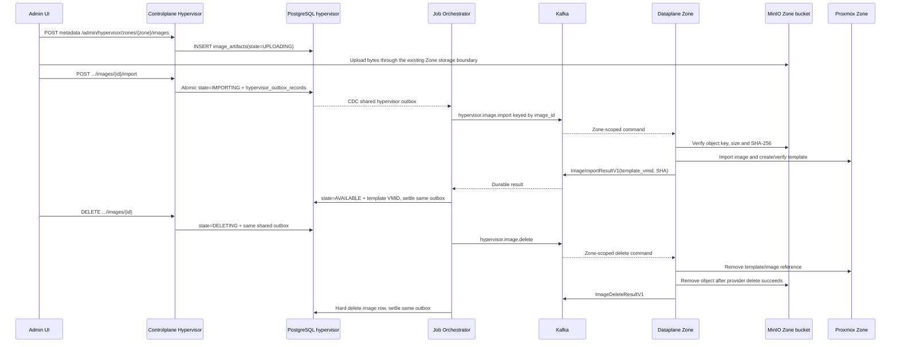

# Hypervisor Image Registry - Workflow God View

> [!IMPORTANT]
> Mỗi Zone là một datacenter độc lập. Image bytes và Proxmox template của Zone
> A không được tham chiếu hoặc copy qua Zone B. Không tạo `zone-image-service`.

## Ownership và dữ liệu

| Thành phần | Trách nhiệm |
|---|---|
| Admin UI | Quản lý metadata image theo Zone và theo dõi import/delete; không hiển thị node |
| Controlplane Hypervisor | Sở hữu `image_artifacts` và một outbox duy nhất `hypervisor_outbox_records` |
| Zone image storage | Bucket MinIO của chính Zone; object key do Controlplane tạo từ image UUID/revision/SHA |
| Job Orchestrator | CDC outbox, publish command Kafka và settle result trong PostgreSQL |
| Dataplane của Zone | Đọc object ở Zone MinIO, import vào Proxmox và trả template VMID |
| Cloud Console | Chỉ đọc `AVAILABLE` catalog trong Zone đã chọn để tạo VM |
| Grafana | Visualize node/capacity/health telemetry; không phải Admin UI |

Image artifact là immutable theo `(zone_id, code, revision)`. `name` là display
label tự do; `code` mới là stable identifier. Xóa thành công là hard delete sau
Zone ACK, không có `deleted_at` hoặc trạng thái `DELETED`.

## Luồng command

The image bytes path is a Zone storage concern; the hypervisor outbox carries
metadata/command only and never embeds image bytes. Kafka uses at-least-once
delivery, manual commit and DLQ. Image import/delete validates zone binding,
image ID, revision and SHA before any Proxmox mutation. Duplicate commands are
safe because the Dataplane adopts the existing template/object by immutable
image identity.
