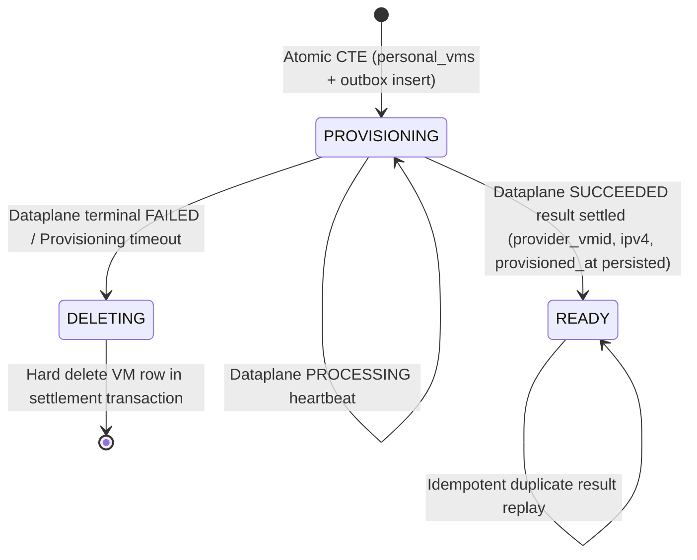
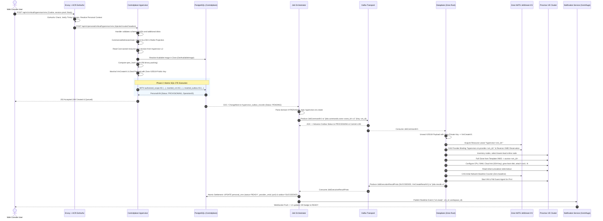

# Personal VM Create — Workflow God View

> [!IMPORTANT]
> Đây là Source of Truth duy nhất cho quy trình **Personal VM Create** end-to-end: từ khi người dùng khởi tạo yêu cầu tạo Máy ảo cá nhân trên Web Console, qua Gateway xác thực & định tuyến, Controlplane thẩm định & lưu trữ Outbox nguyên tử, Job Orchestrator điều vận qua Kafka, Dataplane thực thi phân bổ & khởi tạo trên cụm Proxmox VE nội vùng, tới khi Job Settlement hoàn tất và thông báo Realtime về giao diện người dùng.

---

## API-scope contract

### Lộ trình Người dùng Cá nhân (`/api/v1/personal/critical/hypervisor/vms`)

- **Neutral Client Route**: Browser/Web Console gọi `POST /api/v1/critical/hypervisor/vms`; ACR xác thực session proof ký đúng raw body trước khi chọn owner route.
- **ACR ExtAuthz Boundary**: 
  - ACR xác thực Session Cookie qua Trinity / Auth-State Redis.
  - ACR xác thực session proof dùng chung cho mọi critical mutation, rồi rewrite nội bộ sang `/api/v1/personal/critical/hypervisor/vms`.
  - ACR xóa toàn bộ header do client tự gửi (`x-user-id`, `x-workspace-id`, `x-zone-id`, `x-user-level`), sau đó **inject tập header tin cậy**:
    * `x-user-id`: UUID của người dùng cá nhân (Owner).
    * `x-workspace-id`: UUID của Personal Workspace tương ứng.
    * `x-zone-id`: UUID của Zone Datacenter đích.
    * `x-user-level`: Cấp độ bảo mật/xác thực của session.
- **Controlplane Boundary**:
  - Route `/api/v1/personal/critical/hypervisor/vms` yêu cầu `RequireSessionProof()` và `middleware.Authorize("hypervisor:vm:create", L1Registry, "*")`.
  - Handler trích xuất `userID`, `workspaceID`, `zoneID` an toàn qua các context helper (`pkgcontext.GetUserID`, `pkgcontext.GetWorkspaceID`, `pkgcontext.GetZoneID`).
  - Hypervisor service đọc revision từ L2 do chính Hypervisor projection workflow làm nóng để dựng job; CTE tái thẩm định revision/window/hash cùng `(workspace_id, zone_id, owner_user_id)`, Zone `active` và service `hypervisor` trong transaction tạo VM.

| Thành phần | Vai trò & Trách nhiệm thẩm quyền | Durable State lưu trữ |
|---|---|---|
| **Cloud Console (UI)** | Tiếp nhận input từ user, render trạng thái `PROVISIONING` $\to$ `READY`. | None (State nằm tại Backend) |
| **Envoy + ACR ExtAuthz** | Xác thực session, trích xuất Personal Context, Rewrite Path & Inject trusted headers. | Auth-State Redis |
| **Controlplane Hypervisor** | Đọc L2 resource-plan để dựng payload; CTE thẩm định Commercial Admission và revision rồi ghi Outbox nguyên tử. | PostgreSQL (`personal_vms`, `hypervisor_outbox_records`, resource-plan projection) + Hypervisor L2 |
| **Job Orchestrator (JO)** | CDC Outbox Dispatcher, phân phối Command qua Kafka, tiếp nhận Result và thực hiện DB Settlement. | PostgreSQL & Kafka Commit Offset |
| **Kafka Transport** | Kênh vận chuyển phân tán bất biến 2 chiều (Command & Result) giữa Central và Zone. | Kafka Brokers |
| **Dataplane (Zone Rust)** | Unseal Payload X25519, CAS Provider Binding & VMID trong Zone KV, Clone & Provision Proxmox VE, đo baseline mạng. | Proxmox VE Cluster & Zone NATS JetStream KV |
| **Notification Service (Centrifugo)** | Nhận sự kiện hoàn tất từ JO và bắn WebSocket Push về Browser UI. | Centrifugo Realtime Engine |

---

## REST input and output

### 1. Request Headers

| Header / Cookie | Boundary nhận | Mục đích sử dụng |
|---|---|---|
| `Cookie: aurora_session` | Browser $\to$ Envoy $\to$ ACR | ACR giải mã và xác thực phiên đăng nhập người dùng. |
| `x-user-id` | **ACR $\to$ Controlplane** | **Được ACR inject** (UUID người dùng). Handler đọc qua `pkgcontext.GetUserID`. |
| `x-workspace-id` | **ACR $\to$ Controlplane** | **Được ACR inject** (UUID Personal Workspace). Handler đọc qua `pkgcontext.GetWorkspaceID`. |
| `x-zone-id` | **ACR $\to$ Controlplane** | **Được ACR inject** (UUID Zone Datacenter). Handler đọc qua `pkgcontext.GetZoneID`. |
| `x-user-level` | **ACR $\to$ Controlplane** | **Được ACR inject** (Cấp độ phân quyền tài khoản). |
| `traceparent` | Toàn hệ thống | Lan truyền W3C Distributed Tracing xuyên suốt các service. |

### 2. JSON Request Payload (`POST /api/v1/critical/hypervisor/vms`)

```json
{
  "name": "dev-ubuntu-box",
  "image_id": "018e6a12-8888-7123-9abc-def012345678",
  "resource_plan_id": "018e6a34-9999-7abc-def0-123456789abc",
  "resource_plan_revision_id": "018e6a34-9999-7abc-def0-fedcba987654",
  "additional_disks": [
    {
      "size_gb": 50
    }
  ],
  "ssh_public_key": "ssh-ed25519 AAAAC3NzaC1lZDI1NTE5AAAAIG... user@workstation"
}
```

* **Chi tiết ràng buộc các trường trong Request Body**:
  - `name` *(string, bắt buộc)*: Tên máy ảo, 1-63 ký tự chữ thường, số hoặc dấu gạch đơn, bắt đầu bằng chữ cái (`^[a-z][a-z0-9-]{0,61}[a-z0-9]$|^[a-z]$`), không chứa hai dấu gạch nối liên tiếp (`--`).
  - `image_id` *(string UUID, bắt buộc)*: UUID của Image OS Template đã ở trạng thái `AVAILABLE` trong đúng Zone chỉ định.
  - `resource_plan_id` và `resource_plan_revision_id` *(UUID, bắt buộc)*: revision bất biến do Cost Console định nghĩa. Cloud Console không gửi CPU/RAM/boot disk tự chọn; Hypervisor service lấy capacity/hash từ L2 của module, còn CTE Controlplane là authority xác nhận revision/window/hash trong durable projection.
  - `additional_disks` *(array of objects, tùy chọn)*: Danh sách đĩa dữ liệu gắn thêm (tối đa 15 đĩa). `size_gb` là decimal string BIGINT, từ `"8"` đến `"4096"`; tổng dung lượng đĩa (boot + data) không vượt quá 65536 GiB.
  - `ssh_public_key` *(string, bắt buộc)*: Khóa công khai SSH để inject qua Cloud-Init, tối đa 16384 bytes, bắt đầu bằng `ssh-ed25519 `, `ssh-rsa ` hoặc `ecdsa-sha2-`.

### 3. JSON Response Payload (`202 Accepted` / `200 OK`)

```json
{
  "code": 202,
  "message": "VM provisioning accepted",
  "data": {
    "id": "018e6a34-9999-7abc-def0-123456789abc",
    "operation_id": "018e6a34-9999-7abc-def0-fedcba987654",
    "name": "dev-ubuntu-box",
    "image": "Ubuntu 24.04 LTS Server",
    "image_id": "018e6a12-8888-7123-9abc-def012345678",
    "image_revision": "1",
    "resource_plan_id": "018e6a34-9999-7abc-def0-123456789abc",
    "resource_plan_revision_id": "018e6a34-9999-7abc-def0-fedcba987654",
    "resource_plan_revision_number": "1",
    "cpu_cores": 2,
    "memory_mb": "4096",
    "boot_disk_gb": "64",
    "disk_gb": "114",
    "additional_disk_sizes_gb": ["50"],
    "status": "PROVISIONING",
    "zone_id": "7b0b2e8a-e555-4a18-97c3-21c6014e7a88",
    "provider_vmid": "",
    "ipv4_address": null,
    "created_at": "2026-08-21T20:30:00Z",
    "updated_at": "2026-08-21T20:30:00Z",
    "provisioned_at": null
  }
}
```

---

## State machine & Invariants



### Invariants bất biến:
1. **Natural Identity & Idempotency Key**:
   - Khóa duy nhất xác định danh tính máy ảo là `(workspace_id, name)`.
   - `spec_hash = SHA-256(image_id || image_revision_be64 || image_sha256 || cpu_be64 || memory_be64 || boot_disk_be64 || repeated(disk_index_be64 || disk_size_be64) || ssh_public_key)`.
   - Nếu client gửi lại request trùng `(workspace_id, name)` với cùng `spec_hash` $\to$ Trả về `200 OK` với thông tin VM hiện tại, **tuyệt đối không sinh outbox thứ hai**.
   - Nếu client gửi request trùng tên nhưng khác cấu hình (`spec_hash` sai khác) $\to$ Trả về **`409 Conflict` (`ErrNameConflict`)**.
2. **Terminal Failure Semantics**:
   - Khi provisioning thất bại ở Dataplane, VM **không bao giờ ở lại trạng thái `FAILED` vĩnh viễn** trong bảng `personal_vms`. Result Worker của Job Orchestrator chuyển status sang `DELETING`, thực hiện dọn dẹp và xóa cứng dòng VM khỏi DB để giải phóng `(workspace_id, name)` cho user tạo lại.
   - Bản ghi lỗi được lưu giữ tại `hypervisor_outbox_records` phục vụ tra cứu lỗi và auditing.

---

## Sequence diagram (End-to-End)



---

## Hop-by-Hop detailed contracts

### Phase 1 — Client $\to$ Envoy $\to$ ACR ExtAuthz

#### Hop 1.1: Web Console Client $\to$ Envoy Gateway
* **HTTP Wire Request**:
```http
POST /api/v1/critical/hypervisor/vms HTTP/1.1
Host: api.aurora.local
Cookie: aurora_session=sess_sec_987abc...; zone_context=hn-zone-01; x_client_device_id=dev-mac-018e
Content-Type: application/json
Origin: https://console.aurora.local
X-Requested-With: XMLHttpRequest
traceparent: 00-4bf92f3577b34da6a3ce929d0e0e4736-00f067aa0ba902b7-01

{
  "name": "dev-ubuntu-box",
  "image_id": "018e6a12-8888-7123-9abc-def012345678",
  "resource_plan_id": "018e6a34-9999-7abc-def0-123456789abc",
  "resource_plan_revision_id": "018e6a34-9999-7abc-def0-fedcba987654",
  "additional_disks": [
    { "size_gb": "50" }
  ],
  "ssh_public_key": "ssh-ed25519 AAAAC3NzaC1lZDI1NTE5AAAAIG... user@workstation"
}
```

#### Hop 1.2: Envoy $\to$ ACR ExtAuthz (`CheckRequest`)
- **Input**: Envoy forward toàn bộ Cookie, Method `POST`, Path `/api/v1/critical/hypervisor/vms`.
- **Thẩm định & Khử trùng tại ACR**:
  1. Tra cứu token trong `Auth-State Redis`, xác thực danh tính người dùng `user_id`.
  2. Đọc ngữ cảnh Zone `zone_context` (`zone_code`) $\to$ phân giải thành `zone_id` (UUID).
  3. Xác định Personal Workspace mặc định của user trong Zone đó $\to$ `workspace_id` (UUID).
  4. Xác thực session proof ký đúng method, neutral path và raw body, dùng chung cho mọi critical mutation.
  5. Thực hiện **Path Rewrite** nội bộ sang `/api/v1/personal/critical/hypervisor/vms`.
  6. Xóa bỏ toàn bộ header nguy hại do client tự gửi và **Inject các trusted headers**:
     * `x-user-id`: `018e6a00-1111-7abc-def0-123456789abc`
     * `x-workspace-id`: `018e6a00-2222-7abc-def0-123456789abc`
     * `x-zone-id`: `7b0b2e8a-e555-4a18-97c3-21c6014e7a88`
     * `x-user-level`: `"1"`
     * `x-original-path`: `"/api/v1/critical/hypervisor/vms"`
- **Output Schema**: `CheckResponse` OK (0) forward sang Controlplane Hypervisor Upstream.

---

### Phase 2 — Controlplane Processing & Atomic CTE Persistence

#### Hop 2.1: Controlplane Handler & Security Preconditions
1. **Context Extraction**: Trích xuất `userID`, `workspaceID`, `zoneID` qua `pkgcontext`.
2. **Payload Validation**: Kiểm tra Regex `name`, giới hạn số đĩa $\le 15$, kích thước đĩa $8 \le \text{size} \le 4096$, SSH Key hợp lệ.
3. **Resource Plan Fast Path**: Hypervisor service đọc revision từ L2 do projection workflow của Hypervisor sở hữu để dựng payload. Cache miss hoặc payload lỗi trả retryable unavailable; request path không fallback DB.
4. **Image Verification**: Truy vấn `GetAvailableImage` xác nhận Image tồn tại trong Zone, trạng thái `AVAILABLE` và đã có `provider_template_vmid`.
5. **Durable Recheck**: CTE cùng transaction kiểm tra Commercial Admission, resource-plan revision/window/hash, workspace, Zone và image trước khi insert VM và outbox.

#### Hop 2.2: Payload Sealing & Atomic SQL CTE
* **Mã hóa Payload**:
  - Serialize struct Protobuf `VmCreateV1`.
  - Gọi `jobpayload.Protector.Seal(ctx, Metadata, payload)` mã hóa bằng X25519 Public Key của Zone đích.
* **Atomic SQL CTE (`CreateOrGet`)**:
```sql
WITH commercial_admission AS (
    SELECT 1
    FROM hypervisor.commercial_admission_projection admission
    WHERE admission.owner_id = $owner_user_id
      AND admission.owner_type = 'PERSONAL'
      AND admission.decision = 'ALLOW'
      AND admission.effective_at <= NOW()
      AND (admission.valid_until IS NULL OR admission.valid_until > NOW())
),
resource_plan AS (
    SELECT 1
    FROM hypervisor.hypervisor_resource_plan_revisions
    WHERE plan_id = $plan_id
      AND revision_id = $plan_revision_id
      AND revision_number = $plan_revision_number
      AND content_sha256 = $plan_content_sha256
      AND cpu_cores = $cpu_cores
      AND memory_mib = $memory_mb
      AND boot_disk_gib = $boot_disk_gb
      AND state = 'ACTIVE'
      AND allow_create = TRUE
      AND effective_from <= NOW()
      AND (effective_to IS NULL OR NOW() < effective_to)
),
authorized_scope AS (
    SELECT 1
    FROM commercial_admission
    CROSS JOIN resource_plan
    CROSS JOIN hierarchy.personal_workspaces workspace
    JOIN hierarchy.zones zone
      ON zone.id = workspace.zone_id
    JOIN hypervisor.image_artifacts image
      ON image.id = $image_id
     AND image.zone_id = zone.id
     AND image.revision = $image_revision
     AND image.sha256 = $image_sha256
     AND image.state = 'AVAILABLE'
     AND image.provider_template_vmid IS NOT NULL
    WHERE workspace.id = $workspace_id
      AND workspace.owner_id = $owner_user_id
      AND workspace.zone_id = $zone_id
      AND zone.status = 'active'
      AND EXISTS (
        SELECT 1
        FROM hierarchy.zone_services service
        WHERE service.zone_id = zone.id
          AND service.service_type = 'hypervisor'
          AND service.desired_state = TRUE
      )
),
inserted_vm AS (
    INSERT INTO hypervisor.personal_vms (
        id, workspace_id, zone_id, owner_user_id, name, image,
        image_id, image_revision, image_sha256,
        resource_plan_id, resource_plan_revision_id, resource_plan_revision_number, resource_plan_content_sha256,
        cpu_cores, memory_mb, boot_disk_gb,
        disk_gb, additional_disk_sizes_gb, ssh_public_key, spec_hash,
        status, operation_id, provider_name, created_at, updated_at
    )
    SELECT $vm_id, $workspace_id, $zone_id, $owner_user_id, $name, $image_name,
           $image_id, $image_revision, $image_sha256,
           $plan_id, $plan_revision_id, $plan_revision_number, $plan_content_sha256,
           $cpu_cores, $memory_mb, $boot_disk_gb,
           $disk_gb, $additional_disks, $ssh_public_key, $spec_hash,
           'PROVISIONING', $operation_id, $provider_name, NOW(), NOW()
    FROM authorized_scope
    ON CONFLICT (workspace_id, name) DO NOTHING
    RETURNING *
),
inserted_outbox AS (
    INSERT INTO hypervisor.hypervisor_outbox_records (
        event_id, zone_id, job_topic, payload, actor_user_id,
        owner_id, owner_type,
        status, job_version, resource_id, payload_schema_version,
        trace_id, idle, payload_key_id, resource_name
    )
    SELECT $operation_id, $zone_id, 'hypervisor.vm.create', $sealed_payload, $owner_user_id,
           $owner_user_id, 'PERSONAL',
           'PENDING', 1, $vm_id::text, 1,
           $trace_id, 600, $payload_key_id, $name
    FROM inserted_vm
    RETURNING event_id
)
SELECT id, workspace_id, zone_id, owner_user_id, name, image,
       image_id, image_revision, image_sha256,
       resource_plan_id, resource_plan_revision_id, resource_plan_revision_number, resource_plan_content_sha256,
       cpu_cores, memory_mb, boot_disk_gb,
       disk_gb, additional_disk_sizes_gb, ssh_public_key, spec_hash,
       status, operation_id, provider_name, provider_vmid,
       host(ipv4_address),
       created_at, updated_at, provisioned_at, TRUE AS created
FROM inserted_vm;
```
* **Output**: HTTP `202 Accepted` trả về Client.

---

### Phase 3 — Outbox CDC Dispatch & Kafka Transport

#### Hop 3.1: Changefeed Read $\to$ Job Orchestrator
- **Trigger**: Job Orchestrator CDC Worker phát hiện dòng mới trong `hypervisor_outbox_records` có trạng thái `PENDING`.
- **Validation**: Kiểm tra `source_domain == 'HYPERVISOR'` và `job_topic == 'hypervisor.vm.create'`.

#### Hop 3.2: Job Orchestrator $\to$ Kafka Command Topic
- **Kafka Topic**: `jobs.commands.zone.<zone_id>.v1`
- **Partition Key**: `vm_id` (UUID dạng chuỗi để bảo đảm per-resource total ordering).
- **Message Envelope**: `JobCommandV1`
  * `event_id`: UUIDv7 của Outbox Record.
  * `zone_id`: UUID Zone đích.
  * `job_topic`: `"hypervisor.vm.create"`
  * `payload`: Sealed binary payload (HPKE X25519).
  * `payload_key_id`: ID khóa giải mã.
- **Durable Action**: Sau khi Kafka broker xác nhận `acks=all`, JO cập nhật `hypervisor_outbox_records.status = 'PROCESSING'` và advance LSN checkpoint.

---

### Phase 4 — Dataplane Proxmox Provisioning & State Enforcement

#### Hop 4.1: Dataplane Intake & Payload Unsealing
1. Dataplane consumer nhận `JobCommandV1` từ Kafka partition của Zone.
2. Dùng Zone X25519 Private Key giải mã payload thành `hypervisorproto.VmCreateV1`.
3. Kiểm tra tính toàn vẹn của `spec_hash` và schema version.

#### Hop 4.2: Resource Lease & CAS Provider Binding (Zone KV)
1. **Acquire Distributed Lease**: Ghi khóa tạm `hypervisor:<vm_id>` trong NATS JetStream KV với TTL để tránh 2 worker cùng xử lý 1 VM.
2. **CAS Reverse VMID Reservation**: Sinh candidate VMID từ VM UUID (có collision probe tối đa 32 candidate). Thực hiện atomic CAS vào `AURORA_ZONE_CONFIG/hypervisor.provider.vmid.<provider_vmid>`.
3. **CAS Provider Binding**: Ghi binding `AURORA_ZONE_CONFIG/hypervisor.vm.provider.<vm_id>` trỏ tới `provider_vmid` và `spec_hash`.

#### Hop 4.3: Proxmox VE Hardware Execution
1. **Node Selection**: Gọi Proxmox API `/nodes`, chọn node đang online có đủ CPU/RAM và có tổng tải thấp nhất.
2. **Full Clone**: Gọi `/nodes/{node}/qemu/{template_vmid}/clone` tạo VM mới với tên `aurora-<vm_id>`.
3. **Hardware & Cloud-Init Configuration**:
   - Cấu hình số vCPU, RAM MB.
   - Inject `ssh_public_key` vào Cloud-Init drive.
   - Resize Boot Disk lên đúng `boot_disk_gb`.
   - Gắn thêm các Data Disks `scsi1` đến `scsiN` theo `additional_disks`.
4. **Network Baseline Counter**: Đọc chỉ số byte mạng ban đầu `netin` / `netout` từ Proxmox RRD/Status, thực hiện CAS khởi tạo baseline trong Zone KV để phục vụ đo lường Pay-As-You-Go Network Metering.
5. **Start VM**: Gọi `/nodes/{node}/qemu/{vmid}/status/start`.
6. **Guest Agent IP Polling**: Bounded polling qua QEMU Guest Agent để lấy địa chỉ IPv4 được cấp phát.

#### Hop 4.4: Dataplane Result Publication
- **Produce Result**: Gửi `JobExecutionResultProto` về Kafka topic `jobs.results.v1`:
  * `event_id`: Operation ID.
  * `status`: `SUCCEEDED`
  * `payload`: Protobuf `VmCreateResultV1` chứa `vm_id`, `provider_vmid`, `ipv4_address`, `config_hash`.

---

### Phase 5 — Job Settlement & Realtime Notification

#### Hop 5.1: Job Orchestrator Result Worker Settlement
- **Database Transaction**:
  ```sql
  WITH settled_outbox AS (
      UPDATE hypervisor.hypervisor_outbox_records
      SET status = 'SUCCEEDED', completed_at = NOW(), updated_at = NOW()
      WHERE event_id = $event_id AND status = 'PROCESSING'
      RETURNING event_id, resource_id
  )
  UPDATE hypervisor.personal_vms vm
  SET status = 'READY',
      provider_vmid = $provider_vmid,
      ipv4_address = $ipv4_address::inet,
      provisioned_at = NOW(),
      updated_at = NOW()
  FROM settled_outbox
  WHERE vm.id = $vm_id AND vm.status = 'PROVISIONING';
  ```
- **Commit**: Sau khi DB commit thành công, JO commit Kafka offset của result message.

#### Hop 5.2: Realtime WebSocket Notification (Centrifugo)
- JO bắn payload sự kiện sang Centrifugo:
  * Channel: `personal:workspace:<workspace_id>`
  * Event: `vm.ready`
  * Payload: `{ "vm_id": "...", "status": "READY", "ipv4_address": "10.0.12.34" }`
- Trình duyệt người dùng nhận WebSocket frame và cập nhật trạng thái VM trên giao diện tức thời mà không cần reload trang.

---

## Bảng Ma trận Xử lý Lỗi & Khôi phục (Failure Semantics)

| Điểm xảy ra sự cố | Hành vi xử lý & Cơ chế bảo đảm (Recovery / Invariant) |
|---|---|
| **Ví tiền chưa mở / Bảng giá chưa sẵn sàng** | Bị chặn ngay tại Controlplane Precondition Gates $\to$ Trả về `402 Payment Required` hoặc `503 Service Unavailable`. Không tạo rác trong DB. |
| **User bấm tạo 2 lần (Double Click / Network Retry)** | Câu lệnh SQL `ON CONFLICT (workspace_id, name) DO NOTHING` nhận diện VM đã tạo $\to$ Trả về `200 OK` với dữ liệu VM đang tạo, không sinh outbox thứ 2. |
| **Cụm Proxmox hết tài nguyên RAM/Disk** | Dataplane thử lại với bounded backoff. Nếu kiệt tài nguyên $\to$ Bắn kết quả `FAILED` $\to$ JO chuyển VM sang `DELETING` và xóa cứng dòng VM, giải phóng tên cho user. |
| **Dataplane sập nguồn giữa lúc đang Clone** | Kafka redeliver message sau timeout $\to$ Worker mới dùng Zone KV CAS Provider Binding để nhận diện VM đã tạo dở trên Proxmox, tiếp tục cấu hình hoặc dọn dẹp an toàn. |
| **Replay Result cũ từ Kafka** | SQL Guard `WHERE status = 'PROCESSING'` ngăn chặn việc cập nhật đè lên các bản ghi đã settle. |
| **Centrifugo WebSocket bị đứt kết nối** | Không ảnh hưởng đến dữ liệu bền vững. Khi user tải lại trang hoặc mở lại tab, API `GET /api/v1/hypervisor/vms` truy vấn từ PostgreSQL sẽ hiển thị đúng trạng thái `READY`. |

---

## Code map

### Phase 1 — Client $\to$ Envoy $\to$ ACR ExtAuthz
- **ACR ExtAuthz Filter & Session Validation**: [`acr/src/gateway/ext_authz.rs`](../../acr/src/gateway/ext_authz.rs)
- **ACR Session Context Resolver**: [`acr/src/user/session.rs`](../../acr/src/user/session.rs)
- **Header Constants**: [`acr/src/pkg/header.rs`](../../acr/src/pkg/header.rs)

### Phase 2 — Controlplane Processing & Atomic CTE Persistence
- **Route Registration & Group**: [`controlplane/internal/hypervisor/route.go`](../../controlplane/internal/hypervisor/route.go)
- **HTTP Handler**: [`controlplane/internal/hypervisor/transport/http/handler/personal_vm_handler.go`](../../controlplane/internal/hypervisor/transport/http/handler/personal_vm_handler.go) (`Create`)
- **Domain Service & Precondition Gates**: [`controlplane/internal/hypervisor/service/personal_vm_service.go`](../../controlplane/internal/hypervisor/service/personal_vm_service.go) (`Create`)
- **PostgreSQL Repository (Atomic CTE)**: [`controlplane/internal/hypervisor/repository/personal_vm_repo.go`](../../controlplane/internal/hypervisor/repository/personal_vm_repo.go) (`CreateOrGet`)
- **X25519 Payload Protector**: [`controlplane/internal/security/job_payload.go`](../../controlplane/internal/security/job_payload.go) (`Seal`)
- **DTOs & Schemas**: [`controlplane/internal/hypervisor/transport/http/dto/vm.go`](../../controlplane/internal/hypervisor/transport/http/dto/vm.go)

### Phase 3 — Outbox CDC Dispatch & Kafka Transport
- **JO Outbox Changefeed Reader**: [`job-orchestrator/src/workers.rs`](../../job-orchestrator/src/workers.rs)
- **Kafka Command Publisher**: [`job-orchestrator/src/infra/kafka.rs`](../../job-orchestrator/src/infra/kafka.rs)
- **Job Topics Registry**: [`job-orchestrator/src/job_topics.rs`](../../job-orchestrator/src/job_topics.rs)

### Phase 4 — Dataplane Proxmox Provisioning
- **Dataplane VM Processor**: [`dataplane/src/executor/hypervisor/processor/create_vm.rs`](../../dataplane/src/executor/hypervisor/processor/create_vm.rs)
- **Proxmox HTTP API Client**: [`dataplane/src/executor/hypervisor/processor/proxmox.rs`](../../dataplane/src/executor/hypervisor/processor/proxmox.rs)
- **Zone KV Lease & Provider Binding**: [`dataplane/src/infra/zone_kv.rs`](../../dataplane/src/infra/zone_kv.rs)

### Phase 5 — Job Settlement & Realtime Notification
- **JO VM Result Worker (DB Settlement)**: [`job-orchestrator/src/results/hypervisor/vm.rs`](../../job-orchestrator/src/results/hypervisor/vm.rs), [`job-orchestrator/src/results/apply.rs`](../../job-orchestrator/src/results/apply.rs)
- **Centrifugo Realtime Job Notification**: [`notification-service/src/application/job_notifications.rs`](../../notification-service/src/application/job_notifications.rs)
- **PostgreSQL Schema & Tables**: `hypervisor.personal_vms`, `hypervisor.hypervisor_outbox_records`
