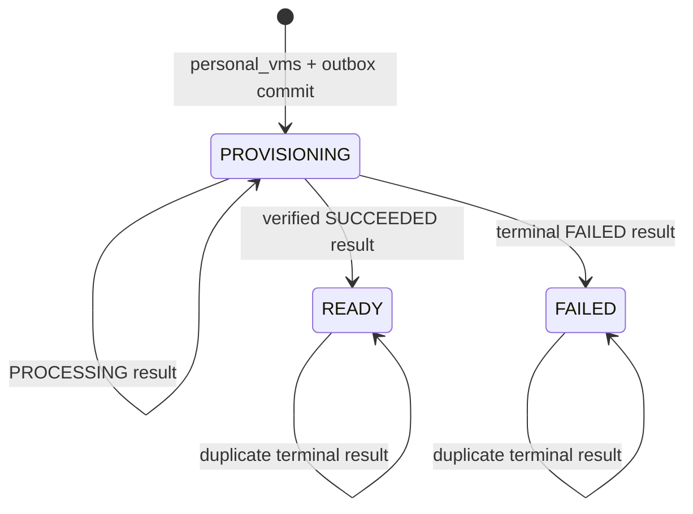

# Personal VM Create - Workflow God View

> [!IMPORTANT]
> Đây là Source of Truth cho luồng tạo VM cá nhân từ Cloud Console tới
> Proxmox và trả trạng thái về Controlplane. Luồng Cost/Metering chưa thuộc
> contract này; không được suy luận trạng thái thanh toán từ VM lifecycle.

## 1. Phạm vi và ownership

| Thành phần | Ownership |
|---|---|
| Cloud Console | Form và current view; không tự tạo identity/routing |
| Envoy + ACR | Xác thực, authorize và rewrite route theo personal context |
| Controlplane Hypervisor | Desired state, natural identity, VM lifecycle và outbox |
| Controlplane PostgreSQL | Durable SoT của `personal_vms` và `vm_outbox_records` |
| Job Orchestrator | CDC bridge, allow-list contract, result settlement và realtime notification |
| Kafka | Durable at-least-once transport Central-Zone |
| Dataplane đúng Zone | Validate transport, lease/fence, gọi Proxmox và publish result |
| Zone NATS JetStream KV | Immutable local provider binding và CAS reservation của VMID |
| Proxmox | Runtime side effect |

Controlplane và JO không có credential Proxmox hoặc Zone KV. Dataplane không
được kết nối Controlplane PostgreSQL, Shared Redis, Auth-State Redis hoặc Vault.

## 2. Public API và request validation

Public route:

- `POST /api/v1/hypervisor/vms`
- `GET /api/v1/hypervisor/vms`
- `GET /api/v1/hypervisor/vms/:id`

ACR dùng verified session context để rewrite personal request thành
`/api/v1/personal/hypervisor/vms...`. Envoy phải strip các internal identity
header từ client trước khi inject lại `user_id`, `workspace_id`, `zone_id` và
permission đã xác minh.

Create permission là `hypervisor:vm:create`; read permission là
`hypervisor:vm:read`.

HTTP request validation kết thúc tại handler:

- `name`: lowercase, 1-63 ký tự, bắt đầu bằng chữ, chỉ chữ/số/dấu gạch đơn;
- `image`: `ubuntu-24.04` hoặc `debian-12`;
- `cpu_cores`: 1-64;
- `memory_mb`: 512-262144 và chia hết cho 256;
- `disk_gb`: 8-4096;
- `ssh_public_key`: tối đa 16 KiB và có public-key prefix được hỗ trợ.

Service không parse hoặc lặp lại HTTP validation. Repository chỉ enforce
authorized persistence scope và database integrity. Dataplane vẫn phải validate
Protobuf/schema/zone/hash sau Kafka trust boundary; đây là transport security,
không phải lặp lại HTTP validation.

## 3. Natural identity và state machine

Natural identity là `(workspace_id, normalized_name)`, được enforce bằng unique
constraint. Client không cần gửi idempotency key.

| Tình huống concurrent/retry | Kết quả |
|---|---|
| Cùng workspace, cùng name, cùng spec | Trả lại cùng VM/operation; không tạo outbox thứ hai |
| Cùng workspace, cùng name, khác spec | `409 Conflict` |
| Cùng name ở workspace khác | Hai VM độc lập |
| Bản ghi trước đã `FAILED` | Không tái dùng ngầm; trả `409` để repair/delete rõ ràng |

`spec_hash = SHA-256(image || 0x00 || cpu_be64 || memory_be64 || disk_be64 ||
ssh_public_key)`. Hash là execution identity bất biến và được Dataplane tính lại
trước side effect.



`READY` chỉ được ghi sau khi JO xác minh result payload khớp `vm_id`,
`provider_name` và `config_hash` authoritative. Realtime notification không
được dùng để thay durable state này.

## 4. End-to-end write flow

```mermaid
sequenceDiagram
    autonumber
    participant UI as Cloud Console
    participant Edge as Envoy + ACR
    participant CP as Controlplane Hypervisor
    participant DB as Controlplane PostgreSQL
    participant JO as Job Orchestrator
    participant Kafka as Kafka transport
    participant DP as Dataplane đúng Zone
    participant KV as Zone NATS KV
    participant PVE as Proxmox

    UI->>Edge: POST /api/v1/hypervisor/vms
    Edge->>CP: POST /api/v1/personal/hypervisor/vms + verified context
    CP->>CP: Handler validates and normalizes request
    CP->>DB: Atomic INSERT personal_vms + vm_outbox_records
    DB-->>CP: VM PROVISIONING, operation_id
    CP-->>UI: 202 Accepted

    DB-->>JO: WAL/CDC INSERT hypervisor.vm_outbox_records
    JO->>JO: Validate source domain HYPERVISOR and registered job topic
    JO->>Kafka: Produce "jobs.commands.zone.<zone_id>.v1"
    Note over JO,Kafka: key=resource_id; acks=all before WAL LSN ACK

    Kafka-->>DP: Manual-consume JobCommandV1
    DP->>DP: Validate schema, target zone, resource, config hash and retry budget
    DP->>KV: Acquire resource lease "hypervisor:<vm_id>"
    DP->>KV: CAS provider binding and reverse VMID reservation
    DP->>PVE: Inventory, select node, full clone template
    DP->>PVE: Configure CPU/RAM/cloud-init, grow disk, start VM
    DP->>Kafka: Produce PROCESSING then SUCCEEDED/FAILED result
    Note over DP,Kafka: command offset settles only after result/retry/DLQ durability

    Kafka-->>JO: "jobs.results.v1"
    JO->>DB: Lock authoritative VM/outbox and atomically settle result
    JO->>JO: Publish bounded job notification after DB commit
    JO->>Kafka: Manual commit result offset
    UI->>CP: Invalidate/refetch durable VM state after realtime wake-up
```

Mutation của `personal_vms` và outbox là một PostgreSQL statement/transaction.
Không publish broker trước DB commit. CDC chỉ advance LSN sau Kafka durable
publish hoặc terminal DLQ outcome. Crash sau Kafka ACK nhưng trước LSN ACK có thể
tạo duplicate; resource key, natural identity, Zone lease, provider binding và
result settlement phải làm duplicate an toàn.

## 5. Kafka contracts

Command:

- source domain: `HYPERVISOR`;
- job topic: `hypervisor.vm.create`;
- payload schema: `hypervisor.VmCreateV1`, version 1;
- resource ID: VM UUID;
- Kafka key: resource ID để preserve per-VM ordering;
- routing scope: `zone:<zone_id>`.

Result:

- envelope: `job_lifecycle.JobExecutionResultProto`;
- terminal success payload: `hypervisor.VmCreateResultV1`, version 1;
- result key: job/operation ID theo result transport hiện hành;
- `PROCESSING` và `FAILED` không mang domain result payload;
- payload tối đa 64 KiB.

Protobuf command/result phải byte-compatible giữa Controlplane, JO và Dataplane.
Thay field number hoặc semantic phải cập nhật cả ba bản contract và God View
trong cùng change-set.

## 6. Dataplane idempotency và Proxmox boundary

Dataplane dùng một `HypervisorRuntime` shared cho toàn pod, cùng ownership
pattern với `MailRuntime`:

```text
executor/hypervisor/
├── executor.rs                 action dispatch
├── processor/create_vm.rs      VM create workflow
├── processor/proxmox.rs        typed Proxmox HTTP boundary
└── runtime/provider_binding.rs Zone KV binding/CAS runtime
```

Runtime sở hữu duy nhất connection pool `reqwest`, mutation semaphore
`PROXMOX_MAX_CONCURRENT_JOBS` và Zone-local provider-binding runtime. Zone leader
dùng chính runtime này để health probe; không tạo client/pool thứ hai. Chỉ leader
được chạy periodic infrastructure probe. Worker chỉ gọi Proxmox khi thực thi
command đã lease/fence, không tự chạy health loop.

Semaphore chỉ bao quanh external mutation từ clone/configure/resize/start.
Inventory, placement, Zone KV CAS và guest-agent IP warm-up không giữ mutation
permit; permit được release trước bounded guest-agent polling để không chặn VM
khác. Mỗi command vẫn chịu resource-scoped distributed lease/fencing trong Zone
Coordination KV.

Provider identity:

- Proxmox name: `aurora-<vm_uuid>`;
- binding key: `AURORA_ZONE_CONFIG/hypervisor.vm.provider.<vm_uuid>`;
- reverse reservation:
  `AURORA_ZONE_CONFIG/hypervisor.provider.vmid.<provider_vmid>`;
- Proxmox description marker:
  `aurora-config-sha256=<spec_hash_hex>`.

Binding và reverse reservation dùng CAS create. Retry đọc lại winner và chỉ
adopt khi `resource_id`, provider name, VMID và config hash đều khớp. Nếu VMID
đang trỏ tới provider khác, executor fail-closed; không mutate VM lạ.

VMID candidate được dẫn xuất ổn định từ resource UUID và collision-probe có
budget tối đa 32 candidate. Mỗi Zone KV binding operation có deadline 5 giây để
mất quorum không giữ worker vô hạn. Zone KV reservation ngăn các Dataplane
replica của Aurora cấp cùng VMID; inventory check bảo vệ trước VM đã tồn tại
trong Proxmox. Đây là idempotency boundary cho retry của external side effect,
không phải exactly-once.

Node placement chỉ chọn node online đủ CPU/RAM và ưu tiên tổng tải CPU+RAM thấp.
Clone là full clone từ template cấu hình theo image. Disk chỉ được grow; không
shrink template disk. Task Proxmox có bounded timeout và polling interval. Mọi
downstream operation có OTel client span theo URL template; API token, SSH key và
raw provider response body không được đưa vào span, log hoặc durable job result.

## 7. Backpressure, retry và failure semantics

| Failure point | Semantics |
|---|---|
| Workspace/Zone không authorized, inactive hoặc không có node khả dụng | Handler nhận scope failure, không tạo VM/outbox |
| DB commit lỗi | Không có command |
| Kafka publish lỗi | Không ACK WAL; reconnect/backoff và replay |
| Duplicate Kafka command | Cùng resource lease/provider binding; adopt đúng VM hoặc retry |
| Hết node capacity/template tạm unavailable/API timeout | Retryable, bounded backoff; sau budget đi DLQ/FAILED |
| Schema/hash/provider collision | Permanent failure; không retry side effect |
| Dataplane chết giữa clone và result | Kafka redelivery; inventory + immutable binding adopt VM |
| JO chết sau DB settlement trước offset commit | Duplicate result no-op dưới row lock |
| Realtime notification mất | UI refetch/list vẫn thấy durable state |

Kafka production phải dùng topic provision trước, replication factor 3+, producer
idempotent, `acks=all`, `min.insync.replicas>=2`, manual commit và durable DLQ.
Không tuyên bố exactly-once qua PostgreSQL, Kafka và Proxmox.

Graceful shutdown phải dừng intake, chờ bounded inflight executor, publish
result/retry/DLQ đã quyết định rồi mới settle offset. Rebalance fence không được
commit partition đã mất ownership.

## 8. Runtime configuration

Dataplane bắt buộc có Proxmox endpoint/token và template VMID tương ứng với image:

- `PROXMOX_API_URL`
- `PROXMOX_API_TOKEN`
- `PROXMOX_UBUNTU_2404_TEMPLATE_VMID`
- `PROXMOX_DEBIAN_12_TEMPLATE_VMID`
- `PROXMOX_VM_STORAGE` (optional)
- `PROXMOX_VM_POOL` (optional)
- `PROXMOX_MAX_CONCURRENT_JOBS` (default 2, range 1-32)
- `PROXMOX_TASK_TIMEOUT_SECONDS` (default 300, range 30-900)

Token phải là least-privilege identity giới hạn vào pool/storage/template và VM
operations cần thiết, không dùng `root@pam`. Secret không được ghi vào command,
PostgreSQL business row, Zone KV, notification hoặc log.

## 9. Read model và UI

Cloud Console `/compute` là table-first responsive view. `/compute/new` chỉ render
khi render context có `hypervisor:vm:create`. UI không tin realtime payload là
business completion: notification `operation=hypervisor.vm.create` chỉ coalesce
invalidate/refetch query của current workspace/zone.

List/Get luôn scope bằng verified `owner_user_id + workspace_id`; create còn bind
selected `zone_id`. Client-supplied owner/workspace/zone không tồn tại trong body.

## 10. Ngoài phạm vi hiện tại

- Cost ownership projection, wallet check, estimate và charging;
- tenant VM create;
- resize, stop/start/reboot/delete;
- periodic VM drift reconciliation và operator repair workflow;
- VM usage metering.

Các workflow trên phải có contract, durability boundary và God View riêng trước
khi implementation. Không nối Cost vào create path bằng synchronous dependency.
