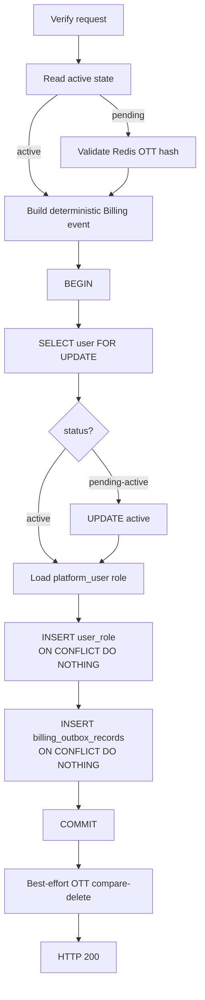
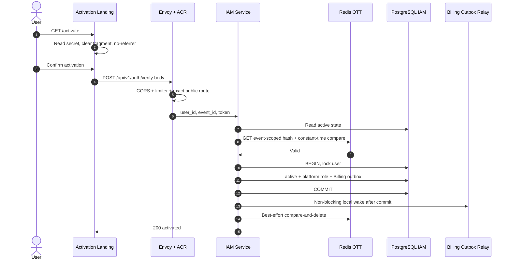
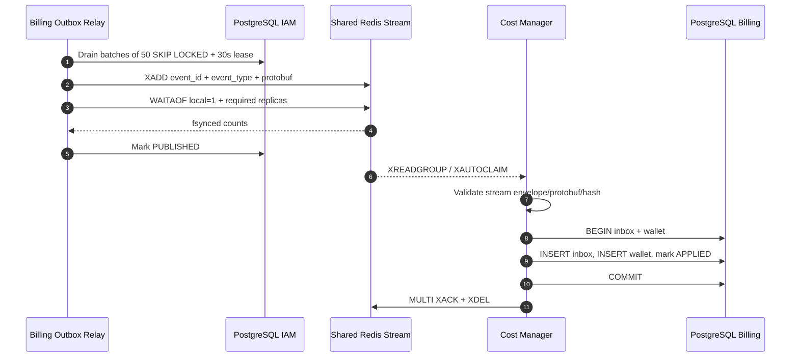
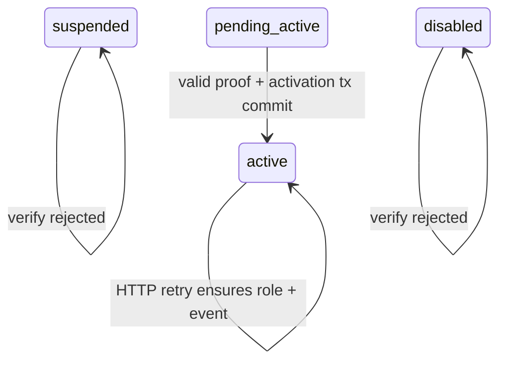
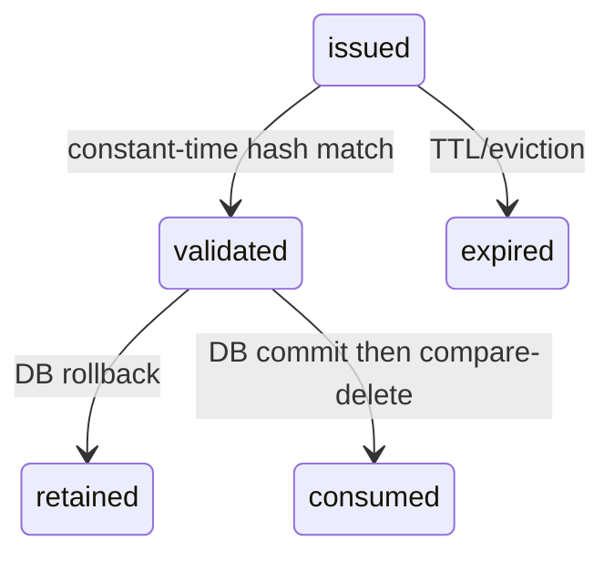
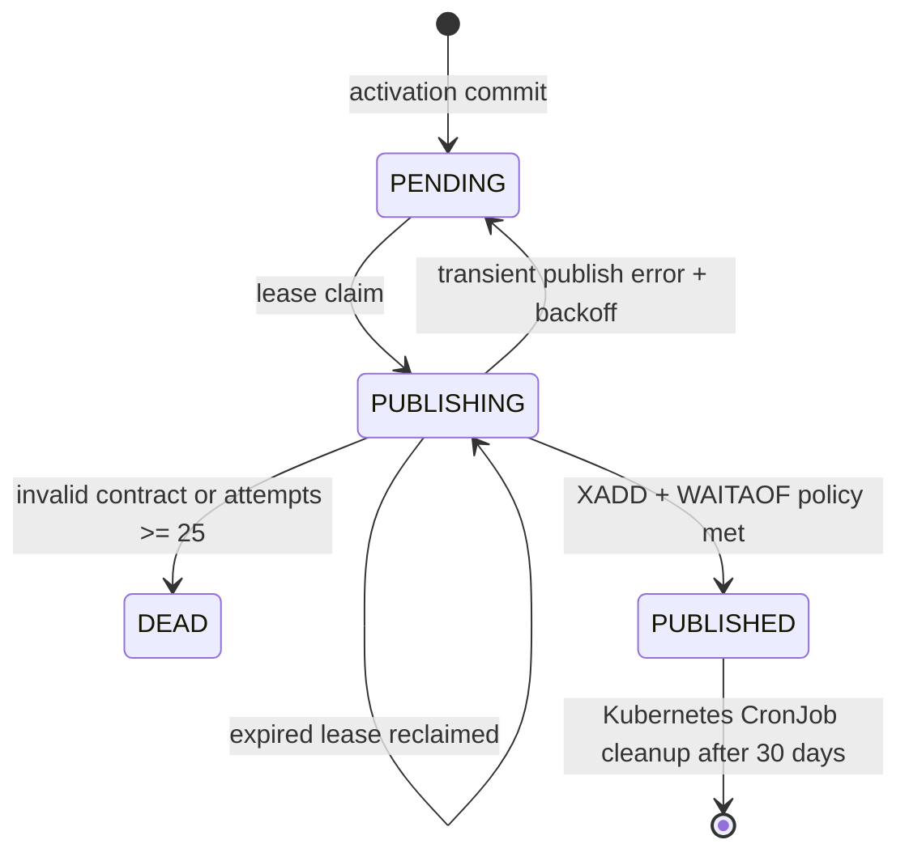
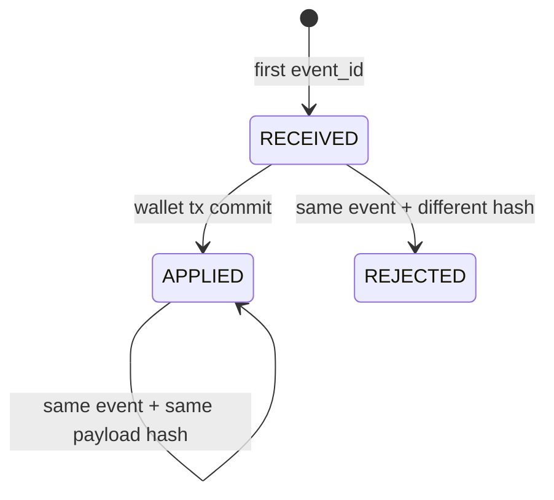

# Account Verification & Personal Wallet Provisioning — God View (Master SoT)

> **SINGLE SOURCE OF TRUTH**
> Tài liệu này sở hữu workflow từ activation link đến account `active`, platform role và personal Billing wallet. Việc tạo pending account, issue OTT và gửi mail thuộc [`user_registration_god_view_workflow.md`](user_registration_god_view_workflow.md).

## 0. Control header

| Thuộc tính | Contract |
|---|---|
| Domain | IAM Account Verification + Billing Wallet Provisioning |
| UI landing | `GET /activate#user_id=...&event_id=...&token=...` |
| Mutation endpoint | `POST /api/v1/auth/verify` |
| Authentication proof | Event-scoped Redis OTT |
| Activation SoT | PostgreSQL IAM transaction |
| Billing event SoT | `iam.billing_outbox_records` |
| Central transport | Shared Redis Stream `billing:wallet:personal:provision-requests` |
| Consumer | Cost Manager group `cost-personal-wallet-provision-v1` |
| Billing result | Wallet `(owner_id, PERSONAL, USD)` balance `0` |
| Input/handoff owner | Registration God View |
| Hierarchy | Không tạo/chọn Zone hoặc Workspace |

## 1. Boundary và invariant

### 1.1 In scope

- Activation fragment landing và explicit user confirmation.
- Exact public Verify route, CORS và abuse limiter.
- OTT validate, dependency taxonomy và consume-after-commit.
- Concurrent verify, response loss và active retry.
- Atomic `active + platform_user + Billing outbox` invariant.
- Generic Billing outbox relay, Shared Redis `XADD + WAITAOF` và retry/DEAD.
- Cost Manager inbox/hash validation và wallet idempotency.
- Failure recovery, DLQ, retention và diagnostics.

### 1.2 Out of scope

- Registration/password hashing/mail delivery.
- Promotional credit hoặc Free Tier enrollment.
- Usage metering, charging hoặc wallet ledger posting.
- Tenant wallet provisioning.
- Workspace/Zone provisioning.

### 1.3 Non-negotiable invariants

| Invariant | Hệ quả |
|---|---|
| Landing GET không mutate | Mail scanner/prefetch không activate account |
| OTT chỉ đi qua URL fragment rồi POST body | Secret không xuất hiện trong edge query/access log |
| Validate trước DB, consume sau commit | DB rollback không làm mất retry proof |
| User row được `FOR UPDATE` | Concurrent verifies serialize tại IAM SoT |
| Active status, platform role và Billing event cùng transaction | Không có active account mới thiếu role/event |
| Active retry ensure lại role/event | Response loss và legacy partial state tự repair idempotently |
| Billing event ID deterministic theo user | Concurrent/retry không sinh logical wallet command mới |
| Outbox relay chờ `WAITAOF` | Chỉ mark `PUBLISHED` sau local AOF và replica fsync policy |
| Cost Manager inbox + wallet cùng transaction | ACK không xảy ra trước durable apply |
| `owner_id/owner_type` tách khỏi actor | Wallet được gán đúng personal/tenant owner |
| Activation không ghi Hierarchy | Zone/Workspace failure không rollback verification |

## 2. Public contract

### 2.1 Activation link and landing

```text
https://cloud.aurora.local/activate#user_id=<uuid>&event_id=<uuid>&token=<plaintext-ott>
```

Browser contract:

1. Fragment không được gửi trong HTTP request tới Envoy.
2. `/activate` đọc fragment một lần khi mount.
3. UI gọi `history.replaceState` để xóa fragment khỏi address bar/history.
4. Landing đặt `Referrer-Policy: no-referrer`.
5. Không tải third-party analytics/assets trước khi xóa fragment.
6. User phải bấm Confirm trước khi POST.

### 2.2 Verify API

```http
POST /api/v1/auth/verify
Content-Type: application/json
```

```json
{
  "user_id": "019...",
  "event_id": "019...",
  "token": "plaintext-ott"
}
```

| Field | Validation | Meaning |
|---|---|---|
| `user_id` | Required UUID, non-nil | Account cần activate |
| `event_id` | Required UUID, non-nil | Mail/challenge identity |
| `token` | Required, trim, length 32–256 | Bearer proof |

Route chỉ public cho exact `POST /api/v1/auth/verify`, sau CORS và AuthPublic limiter. Không yêu cầu session, tenant hoặc zone.

### 2.3 Response taxonomy

| Condition | HTTP/domain meaning | Retry |
|---|---|---|
| Invalid UUID/body | `400 Invalid activation request` | Sửa link/body |
| OTT missing/wrong/expired | `400 invalid_or_expired` | Pending-login resend |
| Redis unavailable khi user pending | Dependency failure | Retry sau recovery |
| User missing | Not found taxonomy | Không tạo state |
| User suspended/disabled | Invalid transition | Operator policy |
| Role/Billing event DB failure | Transaction rollback | OTT còn để retry |
| Pending activation commit | `200` | Complete |
| User đã active | `200` sau idempotent role/event ensure | Safe retry |

Success:

```json
{"message":"account activated successfully"}
```

## 3. Activation transaction

### 3.1 Deterministic event

```text
billing_event_id = UUID-SHA1(
  namespace OID,
  "billing.wallet.personal.provision:" + user_id
)
```

Logical event payload:

```text
PersonalWalletProvisionRequestedV1
  event_id       deterministic UUID bytes
  schema_version 1
  owner_id       user UUID bytes
  owner_type     PERSONAL
  currency       USD
  occurred_at    RFC3339Nano UTC
```

Retry có thể build timestamp mới nhưng `ON CONFLICT(event_id) DO NOTHING` giữ immutable payload thắng đầu tiên.

### 3.2 Repository transaction



Role lookup/marshal, role assignment và Billing event đều nằm trong transaction. Không có activation trigger tạo Workspace/Zone.

### 3.3 Generic Billing outbox row

| Field | Contract |
|---|---|
| `event_id` | Deterministic per personal user |
| `event_type` | `billing.wallet.personal.provision.requested.v1` |
| `schema_version` | `1` |
| `aggregate_type` | `IAM_USER` |
| `aggregate_id` | User UUID |
| `aggregate_version` | `1` |
| `owner_id` | User UUID |
| `owner_type` | PostgreSQL enum `PERSONAL` |
| `actor_user_id` | User UUID |
| `payload` | Protobuf bytes |
| `occurred_at` | UTC |
| initial status | `PENDING` |

Table là generic cho các event IAM → Billing; event type mới phải được thêm vào publisher allowlist và consumer contract, không tạo bảng outbox mới.

## 4. End-to-end sequence

### 4.1 Phase 1: Synchronous Verification & IAM Activation



### 4.2 Phase 2: Asynchronous Billing Outbox Relay & Wallet Provisioning




## 5. State machines

### 5.1 Account



### 5.2 OTT



Consume là cleanup, không phải transaction commit proof. Nếu Redis lỗi sau commit, account vẫn active và key tự hết TTL.

### 5.3 Billing outbox



Publisher validates row metadata bằng payload protobuf và chỉ chọn Stream từ compile-time allowlist. `XADD` và `WAITAOF` chạy trên cùng dedicated Redis connection vì durability fence chỉ áp dụng cho các write trước đó của chính connection đó. Production yêu cầu local AOF, ít nhất một replica AOF ACK và eviction policy không xóa pending Stream; Docker Compose đơn node override replica ACK về `0` rõ ràng. DEAD được giữ để điều tra/replay có audit. Relay không poll mỗi 500ms: local wake được coalesce trong buffered channel, startup drain chạy ngay, và reconciliation fallback chỉ chạy sau 30 giây cộng jitter. Wake bị mất không làm mất event vì PostgreSQL outbox vẫn là SoT trước khi transport đạt durability policy.

### 5.4 Billing inbox/wallet



## 6. Concurrency và retry

### 6.1 Concurrent Verify

Hai request có thể cùng đọc `pending`:

1. Cả hai có thể validate trước consume.
2. Request thắng khóa user row, commit active + role + event.
3. Request sau nối đuôi lock, thấy active và chạy idempotent ensure.
4. Nếu request sau gặp OTT đã bị xóa giữa state read và Validate, service re-read PostgreSQL.
5. Chỉ bỏ lỗi OTT khi durable state đã là `active`.
6. Role unique key và deterministic event ID ngăn duplicate logical state.

### 6.2 Commit/consume matrix

| Scenario | Result |
|---|---|
| Validate success, DB rollback | OTT còn; retry được |
| DB commit, process crash trước consume | Active + role + outbox durable; OTT còn tới TTL |
| DB commit, consume success, response mất | Retry active path trả stable success |
| Redis unavailable trước activation | Dependency error; DB không mutate |
| Redis unavailable sau commit | Consume bỏ qua; không biến committed activation thành `500` |

### 6.3 Billing delivery

| Failure boundary | Control |
|---|---|
| Publisher crash after claim | Lease expiry reclaims row |
| Pod crash after activation commit before wake | Startup drain hoặc 30s+jitter fallback claim row |
| Wake channel đầy/mất signal | Signal chỉ là hint; fallback reconciliation đọc durable outbox |
| Nhiều Controlplane pod idle | Jitter lệch nhịp fallback, tránh query herd |
| XADD/WAITAOF đạt policy, mark DB fails | Republish at-least-once; inbox event ID + payload hash dedupe |
| Shared Redis restart/failover | AOF + replica fsync policy; outbox giữ retry nếu fence chưa đạt |
| Shared Redis memory pressure | `volatile-lru` chỉ evict TTL cache; Stream write fail thay vì mất pending âm thầm |
| Duplicate Stream delivery | Inbox event ID + payload hash |
| Different event IDs same wallet | Unique `(owner_id, owner_type, currency)` |
| Consumer DB failure | Không `XACK`; `XAUTOCLAIM` sau 30 giây |
| Cost pod chết giữa delivery | Consumer identity riêng; pod khác `XAUTOCLAIM` pending |
| Retry exhausted | Atomic `XADD` DLQ + `XACK` + `XDEL` original |

## 7. Security and trust boundaries

| Boundary | Control |
|---|---|
| Browser → Edge | Fragment isolation, explicit POST, no-referrer |
| Edge public route | Exact method/path, CORS, IP/device limiter |
| OTT at rest | SHA-256 hash, TTL, constant-time compare |
| IAM → Shared Redis | TLS/ACL, Stream allowlist, same-connection `XADD + WAITAOF` |
| Shared Redis → Cost | Consumer group, strict protobuf/envelope validation, explicit `XACK` |
| Cost → Billing DB | Inbox + wallet atomic transaction |

Shared Redis ACL phải chỉ cho IAM relay `XADD/WAITAOF` vào request Stream và Cost Manager consume/ACK/DLQ đúng namespace. Certificate nằm trong Kubernetes Secret và được rotate. Password, OTT và email không thuộc Billing payload.

## 8. Hierarchy isolation

Activation không:

- query active Zone;
- seed default Zone;
- tạo Personal Workspace;
- derive workspace code từ username;
- gán workspace-scoped role.

Workspace provisioning là workflow explicit sau login và phải có God View/authorization/idempotency riêng. Hierarchy outage không ảnh hưởng verify transaction.

## 9. Failure matrix và runbook

| Symptom | Evidence | Owner/action |
|---|---|---|
| Landing invalid | Missing fragment values | UI: dẫn sang Sign In/resend |
| Verify `403` | ACR method/path/origin log | Edge config exact POST route |
| Expired hàng loạt | Redis health/replica/TTL | IAM/Redis dependency incident |
| Pending sau `500` | Role seed, Billing migration, DB error | IAM; OTT còn để retry |
| Active thiếu role/event | Read IAM rows | Retry verify/self-heal; audit legacy source |
| Billing outbox PENDING | attempts/available_at/last_error | Relay/Shared Redis AOF/replica health |
| Billing outbox DEAD | `last_error`, payload metadata | Fix contract/dependency; audited replay |
| PUBLISHED nhưng không inbox | Stream group pending/lag/DLQ | Cost Manager/Shared Redis |
| Inbox APPLIED thiếu wallet | Same DB transaction violated | Billing integrity incident |

IAM state:

```sql
SELECT u.id, u.status, ur.role_id, ur.role_name, ur.workspace_id
FROM iam.users u
LEFT JOIN iam.user_role ur
  ON ur.user_id = u.id
 AND ur.workspace_id = '00000000-0000-0000-0000-000000000000'
WHERE u.id = $1;
```

Billing outbox:

```sql
SELECT id, event_id, event_type, owner_id, owner_type,
       status, attempts, available_at, lease_until,
       published_at, last_error, created_at
FROM iam.billing_outbox_records
WHERE owner_id = $1
ORDER BY id DESC;
```

Inbox and wallet:

```sql
SELECT i.event_id, i.status AS inbox_status, i.payload_hash,
       w.id AS wallet_id, w.owner_type, w.currency,
       w.cash_balance, w.promotional_balance, w.status AS wallet_status
FROM billing.personal_wallet_provision_inbox i
LEFT JOIN billing.wallets w
  ON w.owner_id = i.user_id
 AND w.owner_type = 'PERSONAL'
 AND w.currency = 'USD'
WHERE i.user_id = $1;
```

Không sửa balance hoặc status trực tiếp. DLQ replay phải giữ nguyên event ID/payload/event type, xác minh inbox trước và ghi operator/reason/timestamp.

## 10. Observability

Controlplane dùng low-cardinality metric contract chung:

| Metric | Labels |
|---|---|
| `aurora_controlplane_workflow_calls_total` | `module=iam`, `op=iam.auth.verify`, `result`, `reason` |
| `aurora_controlplane_workflow_duration_seconds` | cùng workflow labels |
| `aurora_controlplane_dependency_calls_total` | `module`, `op`, `system`, `operation`, `result`, `reason` |
| `aurora_controlplane_dependency_duration_seconds` | cùng dependency labels |

JO và Billing sở hữu outbox lag, consumer lag và DLQ metrics của chính chúng; Controlplane
không định nghĩa lại các metric đó. Không dùng user/event/email/error message làm label.
Trace correlation dùng trace ID và event ID trong structured logs, không ghi payload secret.

## 11. Acceptance gates

- [ ] GET landing không mutate account.
- [ ] Fragment không xuất hiện trong Envoy/ACR logs hoặc referrer.
- [ ] Exact Verify POST hoạt động không cần session/zone.
- [ ] Invalid/expired và Redis unavailable có taxonomy khác nhau.
- [ ] DB rollback giữ OTT.
- [ ] Concurrent verify tạo một role và một logical Billing event.
- [ ] Active retry repair role + event và trả stable success.
- [ ] Hierarchy unavailable không ảnh hưởng activation.
- [ ] Shared Redis down/WAITAOF thiếu ACK không rollback active state; outbox retry được.
- [ ] Relay chỉ mark PUBLISHED sau local AOF và required replica ACK.
- [ ] XADD và WAITAOF chạy trên cùng Redis connection.
- [ ] `allkeys-*` eviction bị cấm trên Shared Redis có pending Stream.
- [ ] Duplicate delivery tạo một inbox logical event và một wallet.
- [ ] Same event/different payload bị reject/DLQ.
- [ ] Wallet ban đầu có cash/promotional balance bằng `0`.
- [ ] Không tự cấp Free Tier/100 USD trong verification.
- [ ] Runtime readiness phản ánh consumer group/Billing DB/Shared Redis health.

## 12. Residual risks

| Severity | Risk | Required follow-up |
|---|---|---|
| P1 | Producer và consumer giữ hai proto source wire-compatible riêng | Canonical Billing proto module + descriptor CI |
| P1 | Runtime readiness sau startup chưa chứng minh dependency luôn healthy | Aggregate DB/Shared Redis group/AOF replica probe |
| P1 | Docker Compose chỉ có một Shared Redis node | Production deploy HA replica, ACL, TLS và giữ `REDIS_DURABLE_REPLICA_ACKS>=1` |
| P2 | Public active retry có thể tạo read/repair load theo UUID | Rate limit, audit và cân nhắc durable activation receipt |
| P2 | DEAD replay chưa có operator API/tool chuẩn | Audited replay tooling |
| P2 | Thiếu outbox age/lag/DLQ metrics đầy đủ | Implement metrics/alerts mục 10 |

## 13. Source map

| Concern | Canonical source |
|---|---|
| Activation landing | `cloud-console/src/app/activate/page.tsx` |
| Verify API client | `cloud-console/src/lib/api/auth.ts` |
| ACR exact route/limiter | `acr/src/config.rs`, `gateway/ext_authz.rs`, `gateway/ratelimit.rs` |
| Verify DTO/handler/route | `controlplane/internal/iam/transport/http/dto/req/auth_request.go`, `handler/auth_handler.go`, `route.go` |
| Verify orchestration | `controlplane/internal/iam/service/auth_service.go` |
| OTT validation/consume | `controlplane/internal/iam/service/one_time_token_service.go` |
| Activation transaction | `controlplane/internal/iam/repository/auth_repo.go` |
| Billing outbox schema | `controlplane/internal/iam/migrations/000007_billing_outbox.up.sql` |
| Billing relay/repository | `controlplane/internal/iam/service/billing_outbox_relay.go`, `repository/billing_outbox_repo.go` |
| Billing outbox retention | `k8s/outbox-retention-cronjob.yaml` |
| Billing protobuf producer | `proto/controlplane/iam/personal_wallet_provision.proto` |
| Cost Manager consumer | `cost-manager/api/internal/transport/redis/handler/personal_wallet_provision_handler.go` |
| Billing inbox/wallet transaction | `cost-manager/api/internal/repository/personal_account_repo.go` |
| Billing schema | `cost-manager/api/migrations/000002_tables.up.sql` |
| Upstream registration | `god_view/iam/user_registration_god_view_workflow.md` |
