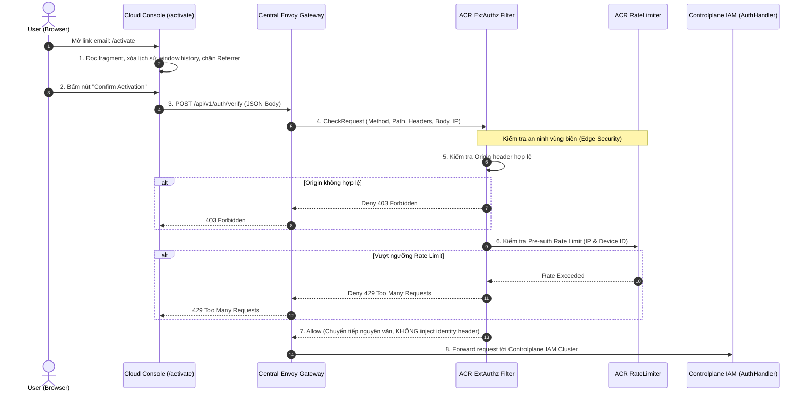
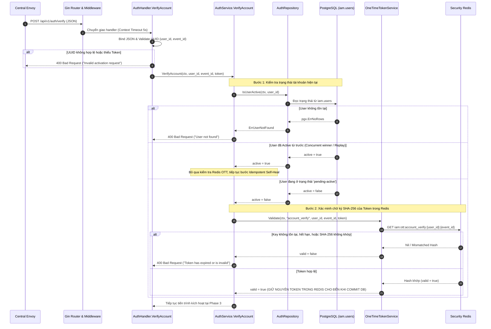
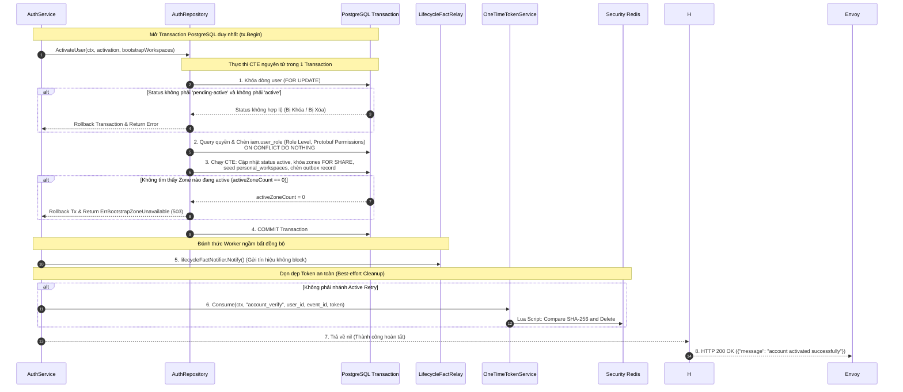
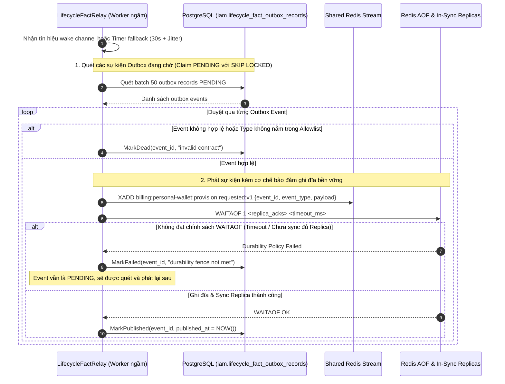
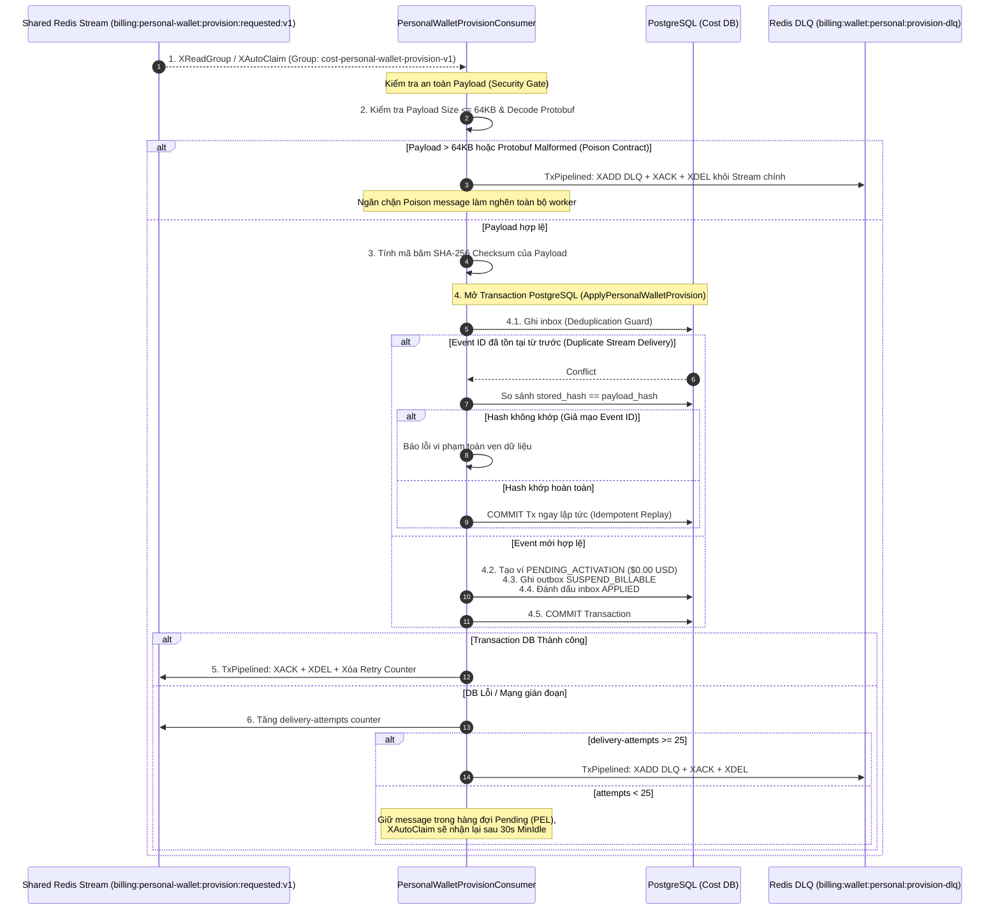

# Account Verification and Personal Wallet Provisioning — God View (Master SoT)

Workflow này là **Source of Truth (SoT) duy nhất** quản lý toàn bộ vòng đời kích hoạt tài khoản người dùng cá nhân (Personal Account Verification) trong hệ thống Aurora:
- Chuyển đổi trạng thái tài khoản từ `pending-active` sang `active`.
- Tự động gán vai trò nền tảng mặc định `platform_user` (kèm danh sách quyền 5 phần nhị phân Protobuf).
- Khởi tạo tự động không gian làm việc cá nhân (`personal_workspaces`) cho tất cả các Active Zones hiện hành.
- Xuất sự kiện bất biến `PersonalWalletProvisionRequestedV1` qua cơ chế Transactional Outbox sang Cost Manager để tự động khởi tạo Ví tiền cá nhân (`billing.wallets` trạng thái `PENDING_ACTIVATION`, `0 USD`).

---

## 🏛️ API-Scope Contract & Boundary Matrix

Người dùng tương tác qua giao diện web bằng liên kết chứa mã xác thực dạng **URL Fragment** (`#user_id=...&event_id=...&token=...`). Trình duyệt giải mã fragment tại chỗ và gửi payload JSON lên route công khai `POST /api/v1/auth/verify`.
Hệ thống Gateway/ACR thực thi ranh giới bảo mật vùng biên, không bao giờ tin tưởng hay gắn thêm context danh tính giả lập, và chuyển tiếp nguyên vẹn payload tới phân hệ IAM Controlplane.

| Ranh giới (Boundary) | Thẩm quyền xác thực (Authority) | Trạng thái bền vững (Durable State) |
|---|---|---|
| **Client Browser (UI)** | Trích xuất Fragment URL, xóa lịch sử trình duyệt, gửi REST confirmation | Không lưu trữ (Ephemeral in-memory) |
| **Envoy / ACR ExtAuthz** | Kiểm tra Origin CORS, Pre-auth IP/Device Rate Limit | Redis Rate Limit Sliding Window |
| **Controlplane IAM Service** | So sánh SHA-256 One-Time Token (OTT), Kiểm tra trạng thái User | Security Redis (`iam:ott:account_verify:{user_id}:{event_id}`) |
| **PostgreSQL (IAM DB)** | Transaction kích hoạt User, cấp role, seed workspaces, ghi Outbox | `iam.users`, `iam.user_role`, `hierarchy.personal_workspaces`, `iam.lifecycle_fact_outbox_records` |
| **Shared Redis Stream** | Vận chuyển sự kiện vòng đời bất đồng bộ có bảo đảm ghi đĩa bền vững | `billing:personal-wallet:provision:requested:v1` (kèm chính sách `WAITAOF`) |
| **Cost Manager (Billing)** | Nhận diện sự kiện, chống trùng lặp Transactional Inbox, khởi tạo ví | `billing.personal_wallet_provision_inbox`, `billing.wallets`, `billing.wallet_admission_outbox` |

---

## 🔑 Key & Transport Contract Table

| Khóa / Bảng / Stream | Vị trí lưu trữ | Thao tác (Operation) | Chủ sở hữu & Ràng buộc bất biến (Owner & Invariant) |
|---|---|---|---|
| `iam:ott:account_verify:{user_id}:{event_id}` | Security Redis | `GET` (kiểm tra hash) & `EVAL` (compare-and-delete) | Lưu mã SHA-256 OTT; chỉ xóa sau khi DB commit thành công. |
| `iam.users` | PostgreSQL (IAM) | `UPDATE status = 'active'` | Ranh giới thẩm quyền tài khoản (`pending-active` $\to$ `active`). |
| `iam.platform_roles` / `iam.user_role` | PostgreSQL (IAM) | `INSERT ON CONFLICT DO NOTHING` | Cấp role `platform_user` mặc định kèm binary Protobuf quyền hạn. |
| `hierarchy.zones` | PostgreSQL | `SELECT id FOR SHARE` | Khóa chia sẻ danh sách Zone đang hoạt động để seed Workspace. |
| `hierarchy.personal_workspaces` | PostgreSQL | `INSERT ON CONFLICT (owner_id, code) DO NOTHING` | Khởi tạo 1 workspace cá nhân cho mỗi active Zone (`personal-{zone_id}`). |
| `iam.lifecycle_fact_outbox_records` | PostgreSQL (IAM) | `INSERT (event_id, status='PENDING')` | Lưu trữ sự kiện Outbox bền vững trước khi stream sang Billing. |
| `billing:personal-wallet:provision:requested:v1` | Shared Redis Stream | `XADD` kèm `WAITAOF(1, replica_acks)` | Kênh truyền thông điệp Protobuf bất đồng bộ `PersonalWalletProvisionRequestedV1`. |
| `billing.personal_wallet_provision_inbox`| PostgreSQL (Cost DB) | `INSERT ON CONFLICT (event_id) DO NOTHING` | Transactional Inbox chống trùng lặp sự kiện tạo ví (Idempotency). |
| `billing.wallets` | PostgreSQL (Cost DB) | `INSERT ON CONFLICT (owner_id, owner_type, currency)` | Ví tiền cá nhân mới với số dư `$0.00 USD`, trạng thái `PENDING_ACTIVATION`. |
| `billing.wallet_admission_outbox` | PostgreSQL (Cost DB) | `INSERT (admission_mode='SUSPEND_BILLABLE')` | Phát tín hiệu chặn dùng tài nguyên tính phí cho đến khi hoàn tất Top-up. |
| `billing:wallet:personal:provision-dlq` | Shared Redis Stream | `XADD` (Gói tin lỗi / Quá 25 lần retry) | Hàng đợi thư chết để kỹ sư vận hành điều tra và replay thủ công. |

---

## 🌐 Phase 1 — Client → Central Envoy → ACR ExtAuthz Admission

### 1. Phase 1 Input Contract

#### URL Fragment Input (Landing Page)
- **Cơ chế An toàn**: Mã token được truyền qua **URL Fragment (`#`)** thay vì Query Parameter (`?`). Fragment không bao giờ được gửi lên Web Server trong HTTP Request Header $\to$ Ngăn chặn hoàn toàn việc rò rỉ token vào access log của proxy, CDN, hoặc header `Referer`.
- **URL Format**: `https://console.aurora.local/activate#user_id=0194f83a-8b1e-7d34-92c1-382a1d820001&event_id=0194f83a-8b1e-7d34-92c1-382a1d820002&token=a8f5c9e2b1d407639184562098712345a8f5c9e2b1d407639184562098712345`

#### HTTP Request Payload (Client $\to$ Envoy)
- **Method & Path**: `POST /api/v1/auth/verify`
- **Request Headers**:
  - `Content-Type: application/json`
  - `Origin: https://console.aurora.local`
  - `X-Forwarded-For: <client_ip>`
  - `X-Client-Device-ID: <device_uuid>` (Optional)
- **JSON Request Body**:
  ```json
  {
    "user_id": "0194f83a-8b1e-7d34-92c1-382a1d820001",
    "event_id": "0194f83a-8b1e-7d34-92c1-382a1d820002",
    "token": "a8f5c9e2b1d407639184562098712345a8f5c9e2b1d407639184562098712345"
  }
  ```

### 2. Phase 1 Processing & Local Output Contract

- **Envoy $\to$ ACR**: Envoy gửi `CheckRequest` chứa đầy đủ method, path, headers và JSON body sang ACR ExtAuthz Service.
- **ACR Kiểm tra Vùng biên**:
  1. So khớp `Origin` với danh sách trắng `AllowedOrigins`. Nếu vi phạm $\to$ ACR trả về **Local 403 Forbidden** (`{"message": "Forbidden origin"}`).
  2. So khớp hạn mức Pre-auth Rate Limit theo Client IP và Device ID. Nếu vượt ngưỡng $\to$ ACR trả về **Local 429 Too Many Requests** (`{"message": "Rate limit exceeded"}`).
- **ACR $\to$ Upstream Forward**: Chuyển tiếp nguyên vẹn method `POST`, path `/api/v1/auth/verify`, `Content-Type` và JSON Body sang Controlplane IAM.
- **Ràng buộc bảo mật (Zero Identity Injection)**: Do đây là public activation endpoint, ACR **tuyệt đối không tiêm** các header danh tính (`x-user-id`, `x-tenant-id`, `x-workspace-id`) sang upstream.



---

## 🔐 Phase 2 — IAM Proof Verification & Active State Pre-check

### 1. Phase 2 Input Contract
- **Input tiếp nhận**: Request từ Envoy tới `AuthHandler.VerifyAccount` với Context Timeout 5 giây.
- **Validated Parameters**: `user_id` (UUID), `event_id` (UUID), `token` (string 32–256 ký tự).

### 2. Phase 2 Processing & Output Contract
- **Bước 1 — Pre-check Active State**: Đọc trạng thái tài khoản từ `iam.users`.
  - Nếu User không tồn tại $\to$ Trả về `400 Bad Request ("User not found")`.
  - Nếu User đã ở trạng thái `active` $\to$ Bỏ qua bước kiểm tra Redis OTT, chuyển thẳng sang Phase 3 (Idempotent self-heal).
- **Bước 2 — Xác minh SHA-256 trong Security Redis**: Đọc key `iam:ott:account_verify:{user_id}:{event_id}`.
  - Nếu Key không tồn tại, hết hạn, hoặc `SHA-256(token)` không khớp $\to$ Trả về `400 Bad Request ("Token has expired or is invalid")`.
  - Nếu Token khớp $\to$ Giữ nguyên Token trong Redis và chuyển sang Phase 3.
- **Security Invariant**: **Tuyệt đối không xóa token trước khi DB commit**. Token chỉ được dọn dẹp sau khi Transaction ở Phase 3 hoàn tất để bảo đảm khả năng thử lại nếu có sự cố mạng.



---

## ⚡ Phase 3 — Atomic Activation, Role Grant, Workspace Seeding & Outbox Commit

### 1. Phase 3 Input Contract
- **Struct `AccountActivation`**:
  - `UserID`: UUID
  - `RoleCode`: `"platform_user"`
  - `LifecycleEventID`: Deterministic UUIDv5 sinh từ `UUID-SHA1(OID, "billing.personal_wallet.provision.requested:" + user_id)`
  - `LifecycleEventPayload`: Protobuf `PersonalWalletProvisionRequestedV1` (binary)
- **Struct `BootstrapPersonalWorkspaces`**:
  - `OwnerID`: `UserID`
  - `Name`: `"Personal"`
  - `CodePrefix`: `"personal"`

### 2. Phase 3 Processing & Single Transaction Execution
- **Khóa User (`FOR UPDATE`)**: Khóa dòng user trong `iam.users` để ngăn chặn race condition khi người dùng nhấn kích hoạt nhiều lần đồng thời.
- **Cấp Quyền Nền tảng**: Đọc quyền của `platform_user`, đóng gói thành binary Protobuf `RoleEntry` (định dạng 5 phần `<username>:00000000-0000-0000-0000-000000000000:<mod>:<obj>:<beh>`) và chèn vào `iam.user_role` (`ON CONFLICT (user_id, workspace_id, role_id) DO NOTHING`).
- **Thực thi CTE Nguyên tử**:
  1. Cập nhật `iam.users.status = 'active'` cho các user đang ở trạng thái `pending-active`.
  2. Khóa chia sẻ (`FOR SHARE`) danh mục các Zone đang hoạt động từ bảng `hierarchy.zones`.
  3. Khởi tạo không gian làm việc cá nhân (`hierarchy.personal_workspaces`) tương ứng với từng Zone theo mã `personal-{zone_id}` (`ON CONFLICT (owner_id, code) DO NOTHING`).
  4. Chèn sự kiện vào bảng Outbox `iam.lifecycle_fact_outbox_records` với `event_id` cố định sinh theo thuật toán SHA-1 UUID (`ON CONFLICT (event_id) DO NOTHING`).
- **Failsafe Rollback**: Nếu không tìm thấy Zone nào đang active (`activeZoneCount == 0`), toàn bộ Transaction bị `ROLLBACK` và trả về `503 Service Unavailable`.
- **Post-Commit Non-blocking Signal**: Gọi `r.lifecycleFactNotifier.Notify()` để đánh thức worker phát Outbox.
- **Best-Effort Token Cleanup**: Chạy Lua script so khớp và xóa token trong Security Redis. Nếu Redis lỗi, transaction DB đã commit vẫn thành công.

### 3. Phase 3 REST Output Contract

| Status Code | Response Body | Ý nghĩa nghiệp vụ |
|---|---|---|
| `200 OK` | `{"message": "account activated successfully"}` | Kích hoạt tài khoản thành công (hoặc Idempotent Retry thành công). |
| `400 Bad Request` | `{"message": "Token has expired or is invalid"}` | Token không hợp lệ khi kiểm tra ở Phase 2. |
| `500 Internal Error` | `{"message": "Internal server error"}` | Lỗi nội bộ trong quá trình thực thi Transaction cơ sở dữ liệu. |
| `503 Service Unavailable`| `{"message": "Bootstrap zone unavailable"}` | Không tìm thấy bất kỳ Zone nào đang `active` trong hệ thống. |



---

## 🚀 Phase 4 — IAM Lifecycle Fact Relay & Redis Stream Publication

### 1. Phase 4 Input Contract
- **Trigger**: Tín hiệu từ channel `wake` hoặc Timer dự phòng (`30s + Jitter 0-10s`).
- **Database Fetch**: Quét tối đa 50 bản ghi outbox đang ở trạng thái `PENDING` trong `iam.lifecycle_fact_outbox_records` theo thứ tự thời gian tăng dần (`occurred_at ASC`), sử dụng cơ chế `FOR UPDATE SKIP LOCKED` để các replica worker không tranh chấp nhau.

### 2. Phase 4 Processing & Output Contract
- **Xác thực Hợp đồng**: IAM relay chỉ phát `billing.personal_wallet.provision.requested.v1`; tenant wallet command thuộc Hierarchy relay và không nằm trong IAM allowlist.
- **Ghi sự kiện lên Redis Stream**:
  - Tên Stream: `billing:personal-wallet:provision:requested:v1`
  - Values: `map[string]any{"event_id": event_id, "event_type": event_type, "payload": payload}`.
- **Hàng rào Bền vững Dữ liệu (`WAITAOF`)**:
  - Thực thi lệnh `WAITAOF 1 <replica_acks> <timeout_ms>` trên dedicated connection.
  - Nếu thỏa mãn điều kiện bền vững $\to$ Cập nhật outbox trong PostgreSQL thành `status = 'PUBLISHED'`, gán `published_at = NOW()`.
  - Nếu thất bại $\to$ Giữ nguyên `status = 'PENDING'` để tiến trình quét tiếp theo phát bù lại.



---

## 💳 Phase 5 — Cost Manager Wallet Provisioning & Admission Control

### 1. Phase 5 Input Contract
- **Consumer Group**: `cost-personal-wallet-provision-v1`
- **Consumer ID**: `config.GetNodeHostname() + "-" + uuid.NewString()`
- **Định dạng Message tiếp nhận**:
  - `event_id`: UUID
  - `event_type`: `"billing.personal_wallet.provision.requested.v1"`
  - `payload`: Mảng byte Protobuf `PersonalWalletProvisionRequestedV1` ($\le 64\text{KB}$)

### 2. Phase 5 Processing & Output Contract
- **Kiểm tra An toàn Payload**:
  - Nếu payload $> 64\text{KB}$ hoặc giải mã Protobuf thất bại $\to$ Đẩy ngay sang DLQ `billing:wallet:personal:provision-dlq` kèm `reason = "invalid_contract"`, gửi `XACK + XDEL` để loại bỏ khỏi stream chính.
- **Thực thi PostgreSQL Transaction ([`personal_account_repo.go`](file:///C:/Users/phuc/Desktop/aurora/cost-manager/api/internal/repository/personal_account_repo.go#L28-L100))**:
  1. Ghi nhận `event_id` và `payload_hash` vào `billing.personal_wallet_provision_inbox` (nếu trùng `event_id`, kiểm tra hash khớp để xử lý Idempotent replay an toàn; nếu lệch hash báo lỗi vi phạm tính toàn vẹn).
  2. Khởi tạo ví cá nhân `billing.wallets` với số dư `$0.00 USD`, trạng thái `PENDING_ACTIVATION`.
  3. Ghi sự kiện vào `billing.wallet_admission_outbox` với chế độ `SUSPEND_BILLABLE` để chặn các dịch vụ đám mây tính phí trước khi người dùng hoàn tất nạp tiền.
  4. Đánh dấu bản ghi inbox thành `status = 'APPLIED'`.
- **Hậu Commit**: Thực thi `TxPipelined` trên Redis: `XACK` + `XDEL` + `DEL delivery-attempts`.
- **Cơ chế Retry & DLQ**: Nếu DB lỗi tạm thời, không gửi ACK để tin nhắn nằm trong PEL cho `XAutoClaim` nhận lại sau 30 giây. Nếu thử lại quá 25 lần thất bại $\to$ Chuyển vào DLQ với `reason = "apply_retries_exhausted"`.



---

## 🛡️ Exhaustive Failure and Security Rules Matrix

| Tình huống ngoại lệ (Failure Condition) | Hành vi thực tế của hệ thống (Actual System Behavior) | Cơ chế phục hồi (Recovery Mechanism) |
|---|---|---|
| **User mở link sai, token bị sửa đổi** | Security Redis so khớp SHA-256 thất bại $\to$ Trả về `400 Bad Request ("Token has expired or is invalid")`. | Người dùng phải yêu cầu gửi lại email kích hoạt mới từ trang đăng nhập. |
| **Token đã được sử dụng trước đó** | Security Redis không tìm thấy key (đã bị xóa sau khi commit) $\to$ Trả về `400 Bad Request`. | Nếu tài khoản đã active, request tiếp theo sẽ được xử lý idempotent thành công `200 OK`. |
| **Người dùng bấm kích hoạt đồng thời ở 2 tab** | PostgreSQL dùng `SELECT ... FOR UPDATE` trên dòng user. Request đầu tiên kích hoạt thành công; request thứ hai thấy user đã `active` $\to$ Chạy nhánh idempotent self-heal và trả về `200 OK`. | Cả 2 tab đều nhận thông báo thành công, không tạo trùng dữ liệu hay lỗi 500. |
| **Không có Zone nào Active trong hạ tầng** | Transaction phát hiện `activeZoneCount == 0` $\to$ Tự động `ROLLBACK` và trả về `503 Service Unavailable ("Bootstrap zone unavailable")`. | Token trong Security Redis vẫn được giữ nguyên để người dùng thử lại sau khi Zone phục hồi. |
| **Sập cơ sở dữ liệu IAM trong lúc kích hoạt** | Transaction bị hủy bỏ (`ROLLBACK`). Token trong Security Redis **chưa bị xóa**. | Người dùng có thể nhấn thử lại ngay khi cơ sở dữ liệu kết nối trở lại. |
| **Lỗi xóa Token trong Redis sau khi DB đã commit** | Lỗi xóa token trong Redis được catch và bỏ qua (`best-effort cleanup`). Response vẫn trả về `200 OK`. | Không ảnh hưởng đến người dùng; token trong Redis sẽ tự động tiêu hủy khi hết hạn TTL. |
| **Mạng Shared Redis bị ngắt khi phát Outbox** | Lệnh `XADD` hoặc `WAITAOF` thất bại $\to$ Bản ghi trong `iam.lifecycle_fact_outbox_records` giữ nguyên trạng thái `PENDING`. | `LifecycleFactRelay` chạy ngầm sẽ tự động quét và phát bù lại sự kiện khi Redis online. |
| **Gói tin Stream bị lỗi định dạng (Poison Event)** | Kích thước $> 64\text{KB}$ hoặc giải mã Protobuf thất bại $\to$ Chuyển thẳng sang DLQ `billing:wallet:personal:provision-dlq` kèm lý do `"invalid_contract"`. | Gửi `XACK` + `XDEL` để loại bỏ khỏi stream chính, tránh làm nghẽn các event hợp lệ phía sau. |
| **Cơ sở dữ liệu Cost Manager bị khóa hoặc quá tải** | Transaction tạo ví thất bại $\to$ Không gửi `XACK`. Tăng biến đếm `delivery-attempts`. | Message được giữ trong hàng đợi Pending; worker khác sẽ tự động claim lại sau 30 giây. |
| **Sự kiện tạo ví bị lỗi thử lại quá 25 lần** | Biến đếm `delivery-attempts >= 25` $\to$ Đẩy toàn bộ message sang DLQ kèm lý do `"apply_retries_exhausted"`. | Kỹ sư vận hành hệ thống kiểm tra nhật ký log và thực hiện replay thủ công từ DLQ. |
| **Sự kiện Stream bị gửi lặp lại nhiều lần (Replay)** | `billing.personal_wallet_provision_inbox` phát hiện trùng `event_id` $\to$ Kiểm tra SHA-256 khớp và `COMMIT` ngay lập tức. | Hoàn toàn Idempotent; không bao giờ tạo 2 ví cá nhân cho cùng 1 người dùng. |

---

## Code map

### Phase 1 — Client Entry, Central Envoy & ACR ExtAuthz
- **Client Web UI (Next.js)**: `cloud-console/src/app/activate/page.tsx`
- **ACR ExtAuthz Filter**: `acr/src/gateway/ext_authz.rs`
- **ACR Pre-auth Rate Limiter**: `acr/src/gateway/ratelimit.rs`

### Phase 2 — IAM Proof Verification & Active Pre-check
- **HTTP Route Mapping**: `controlplane/internal/iam/route.go` (`POST /api/v1/auth/verify`)
- **HTTP Handler**: `controlplane/internal/iam/transport/http/handler/auth_handler.go` (`VerifyAccount`)
- **IAM Domain Service**: `controlplane/internal/iam/service/auth_service.go` (`VerifyAccount`)
- **One-Time Token (OTT) Service**: `controlplane/internal/iam/service/one_time_token_service.go` (`Validate`, `Consume`)
- **IAM SQL Repository**: `controlplane/internal/iam/repository/auth_repo.go` (`IsUserActive`)

### Phase 3 — Atomic Activation & Personal Workspace Seeding
- **SQL Transaction & CTEs**: `controlplane/internal/iam/repository/auth_repo.go` (`ActivateUser`)
- **Protobuf Definitions**: `controlplane/internal/iam/transport/proto/` (`RoleEntry`, `PersonalWalletProvisionRequestedV1`)

### Phase 4 — Lifecycle Fact Outbox Relay & Redis Stream
- **Outbox Background Relay Worker**: `controlplane/internal/iam/service/lifecycle_fact_relay.go` (`Start`, `run`, `drain`, `publish`)
- **Outbox SQL Repository**: `controlplane/internal/iam/repository/lifecycle_fact_outbox_repo.go` (`Claim`, `MarkPublished`, `MarkFailed`, `MarkDead`)

### Phase 5 — Cost Manager Wallet Provisioning
- **Redis Stream Consumer**: `cost-manager/api/internal/transport/redis/handler/personal_wallet_provision_handler.go` (`NewPersonalWalletProvisionConsumer`, `run`, `process`, `deadLetter`)
- **Billing Domain Service**: `cost-manager/api/internal/service/personal_account_service.go` (`ProvisionPersonalWallet`)
- **Billing SQL Repository**: `cost-manager/api/internal/repository/personal_account_repo.go` (`ApplyPersonalWalletProvision`)
- **Protobuf Wire Schema**: `cost-manager/api/internal/genproto/iam/lifecycle/v1/` (`PersonalWalletProvisionRequestedV1`)
