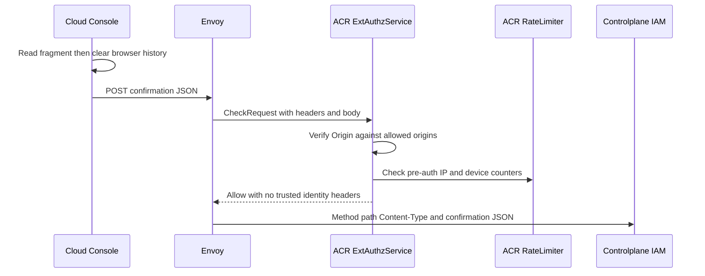
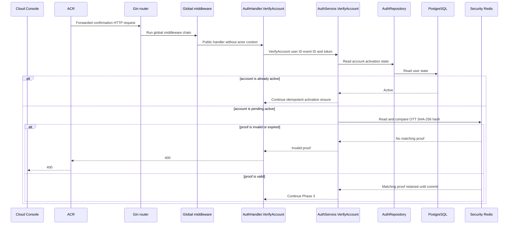
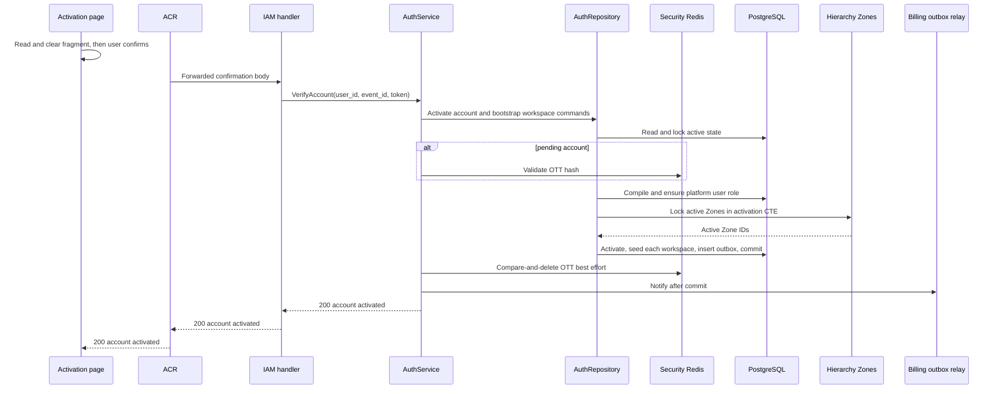
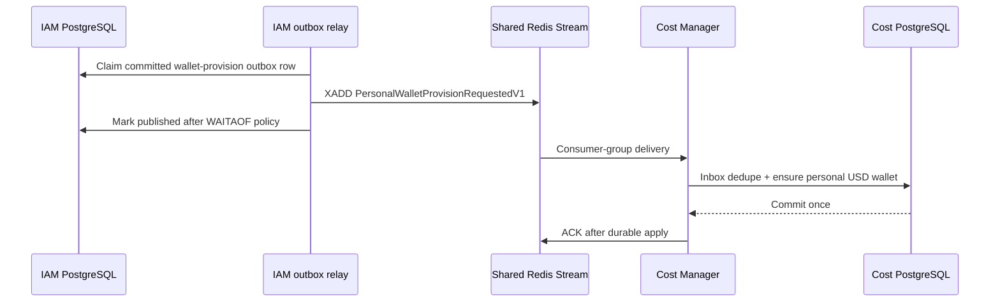

# Account Verification and Personal Wallet Provisioning — God View (Master SoT)

Workflow này bắt đầu khi user mở verification link của pending account. Nó là
owner duy nhất của transition `pending-active → active`, default `platform_user`
role và durable request tạo personal USD wallet. Registration không thực hiện
những side effect này.

| Phase | Owner | Input | Output |
|---|---|---|---|
| 1. ACR admits public confirmation | User → Cloud Console → Envoy/ACR | Fragment OTT then REST confirmation | Public edge decision and exact body forwarding |
| 2. IAM validates event-scoped proof | ACR → IAM → Security Redis | Forwarded confirmation or already-active retry | Validated activation proof |
| 3. IAM activates atomically | IAM → PostgreSQL | Valid proof or already-active retry | Active user, platform role, one personal workspace per active Zone, and Billing outbox record commit together |
| 4. Provision wallet | IAM outbox relay → Shared Redis Stream → Cost Manager | Committed personal-wallet event | Idempotent `(user_id, PERSONAL, USD)` wallet at balance zero |

## Phase 1 — ACR admits public activation confirmation

The mail link is intentionally a browser fragment: mailbox scanners and network
proxies cannot activate an account, and plaintext OTT does not enter request URL
logs. The landing page clears it before an explicit user confirmation.

### REST input

| Part | Contract |
|---|---|
| Landing | `GET /activate#user_id=<uuid>&event_id=<uuid>&token=<plaintext-ott>` |
| Method/path | `POST /api/v1/auth/verify` |
| Headers used | `Content-Type: application/json`; no session, tenant or Zone |

```json
{
  "user_id": "019f...",
  "event_id": "019f...",
  "token": "plaintext-ott"
}
```

| Field | Contract |
|---|---|
| `user_id`, `event_id` | Required non-nil UUIDs |
| `token` | Trimmed bearer proof, 32–256 chars |

### Browser and ACR processing/output

1. `/activate` reads fragment once, sets `Referrer-Policy: no-referrer`, clears
   history and waits for user confirmation.
2. ACR applies allowed-origin and pre-auth IP/device rate-limit policy, then
   forwards the exact bounded confirmation body. It does not interpret, store
   or log the plaintext OTT.

| Result | Output |
|---|---|
| Edge accepted | Continue Phase 2 |
| Edge policy rejected | No IAM call or durable mutation |

### Client → Envoy → ACR processing and forward

| Boundary | What it receives or does |
|---|---|
| Client → Envoy | Public verify path, `Content-Type`, fragment-derived `user_id`, `event_id` and plaintext OTT JSON. No session or client identity header is authoritative. |
| Envoy → ACR | ExtAuthz `CheckRequest` with method, path, bounded body, headers and `X-Forwarded-For`. |
| ACR local | Enforces allowed origin and pre-auth IP/device rate limit. It neither parses nor logs the OTT, and cannot activate the account. |
| ACR → Envoy/IAM | Forwards original method/path, `Content-Type` and confirmation JSON unchanged. ACR injects no verified identity/tenant/Zone/device/proof header; client copies are non-authoritative and public IAM handler ignores them. |



## Phase 2 — IAM validates event-scoped activation proof

IAM first reads durable active state. Already active is a safe retry branch.
For a pending user it validates the SHA-256 OTT in Security Redis but does not
consume it yet. If a concurrent verify wins, IAM rereads active state and
returns success.

### Controlplane processing

Gin matches the public verify route and runs global middleware. No ACR identity
header is present or trusted. `AuthHandler.VerifyAccount` applies its request
budget, parses UUIDs/body and calls `AuthService.VerifyAccount`; the service
reads durable activation state through `AuthRepository` and validates the OTT
through the One-Time Token service before entering the activation transaction.

### Processing output

| Result | Output |
|---|---|
| Valid pending proof or already active | Continue Phase 3 |
| Invalid UUID/body or wrong/missing/expired OTT while pending | `400`; pending-login resend is recovery |
| Redis unavailable before activation | Dependency error; no durable mutation |

### Key contract

| Key | Store | Operation | Owner / purpose |
|---|---|---|---|
| `iam:ott:account_verify:{user_id}:{event_id}` | Security Redis | Hash comparison before DB transaction; compare-and-delete only after commit | Event replay/expiry fence |
| `iam.users.status` | PostgreSQL | Read before OTT validation and in activation transaction | Durable idempotency authority |



## Phase 3 — Commit activation, baseline role and outbox together

The durable boundary is one IAM PostgreSQL transaction. No active user can
commit without the baseline role, one personal workspace per active Zone, and
the corresponding wallet-provision event.

### IAM processing and REST output

1. Service derives deterministic `billing_event_id = UUID-SHA1(OID,
   "billing.wallet.personal.provision:" + user_id)`, creates separate
   `AccountActivation` and `BootstrapPersonalWorkspaces` commands, and marshals
   `PersonalWalletProvisionRequestedV1`.
2. Repository locks user. Pending row becomes `active`; active retry repairs
   the same role, workspace set, and event rather than creating a second
   logical activation.
3. One CTE locks every active `hierarchy.zones` row and inserts a personal
   workspace for each using deterministic code `personal-<zone UUID>`. It also
   inserts one `iam.billing_outbox_records` row with `ON CONFLICT DO NOTHING`
   under the deterministic event ID. If no active Zone exists, the entire
   transaction rolls back and leaves the account pending for retry.
4. The transaction ensures `platform_user` with global workspace
   `create/read/delete` capabilities. After commit IAM wakes relay. Redis OTT
   consume is cleanup; its failure never changes committed activation into an
   HTTP failure.

#### Response headers and payload

| Result | Headers / payload |
|---|---|
| Success | `200`, `Content-Type: application/json`, `{"message":"account activated successfully"}` |
| Role/outbox/activation transaction failure | Dependency error; OTT remains valid for retry if user is still pending |

### Key contract

| Durable record | Store | Operation | Owner / purpose |
|---|---|---|---|
| `iam.users.status` | PostgreSQL | `pending-active → active` | Account authority |
| platform role mapping / `iam.user_role` | PostgreSQL | Ensure `platform_user` in same transaction | Minimum post-activation authorization |
| `hierarchy.personal_workspaces` | PostgreSQL | Seed one row per active Zone, owner = activated user | Immediate Zone-local workspace context |
| `iam.billing_outbox_records` | PostgreSQL | Insert deterministic event with `PENDING` status | Durable handoff to Billing |
| `billing_event_id` | UUID-SHA1 | Same user always produces same ID | Retry/concurrency idempotency |



## Phase 4 — Apply personal wallet provisioning event

Outbox delivery is asynchronous and at-least-once. Account activation is already
durable and successful before Cost Manager sees the event; wallet projection must
therefore be idempotent rather than feeding failure back into the verify request.

### Transport and processing

1. Relay claims committed `PENDING` IAM outbox rows and writes the protobuf to
   `billing:wallet:personal:provision-requests`, observing configured `WAITAOF`
   durability before marking row `PUBLISHED`.
2. Cost Manager consumer validates envelope/inbox hash and runs one transaction:
   record inbox delivery and ensure wallet `(owner_id=user_id, owner_type=PERSONAL,
   currency=USD)` with zero balance.
3. Duplicate stream delivery or relay retry sees existing inbox/event/wallet and
   is an idempotent success. Failure remains retryable through outbox/inbox flow.

### Key contract

| Record / transport | Store | Operation | Owner / purpose |
|---|---|---|---|
| `iam.billing_outbox_records` | PostgreSQL IAM | Claim/retry/mark `PUBLISHED` after transport durability | IAM durable producer evidence |
| `billing:wallet:personal:provision-requests` | Shared Redis Stream | Protobuf event append | IAM → Cost Manager transport |
| Cost inbox record | Cost PostgreSQL | Event/hash dedupe in wallet transaction | At-least-once consumer fence |
| Personal wallet `(owner_id, PERSONAL, USD)` | Cost PostgreSQL | Create-if-absent, balance `0` | Personal wallet SoT |



## Security and code map

- Fragment OTT never appears in HTTP query/referrer; raw token and hash are not
  logged, persisted in browser storage or emitted to Billing.
- Validate-before-commit and consume-after-commit preserve retry after database
  failure; active-state reread makes race/response-loss verification idempotent.
- Activation creates no tenant or Zone. It creates one personal workspace for
  every currently active Zone inside the activation transaction. Cost receives
  only the committed personal-wallet event and cannot alter IAM user/role state.

| Responsibility | Source |
|---|---|
| Activation page | `cloud-console/src/app/activate/page.tsx` |
| Verify route/handler | `controlplane/internal/iam/route.go`, `transport/http/handler/auth_handler.go` |
| Verify orchestration | `controlplane/internal/iam/service/auth_service.go` |
| OTT validation/consume | `controlplane/internal/iam/service/one_time_token_service.go` |
| Activation/outbox transaction | `controlplane/internal/iam/repository/auth_repo.go` |
| IAM outbox relay | `controlplane/internal/iam/service/billing_outbox_relay.go` |
| Cost wallet consumer | `cost-manager/api/internal/transport/redis/handler/personal_wallet_provision_handler.go` |
