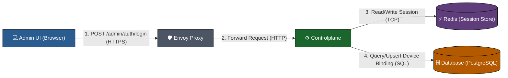
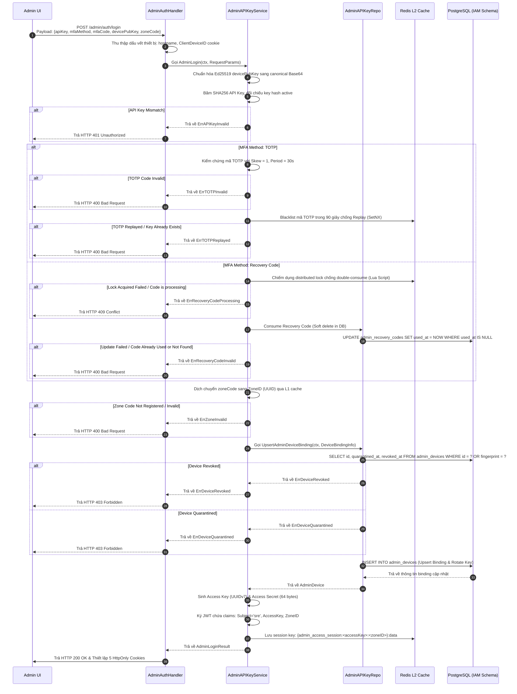
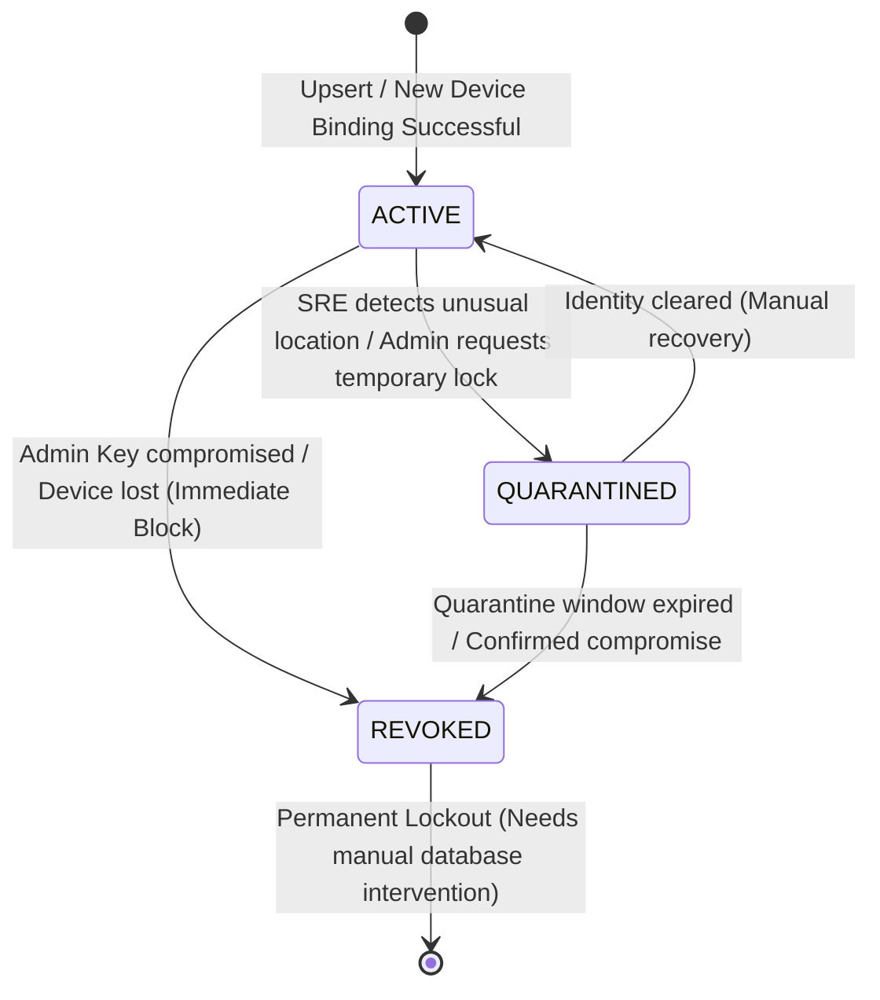
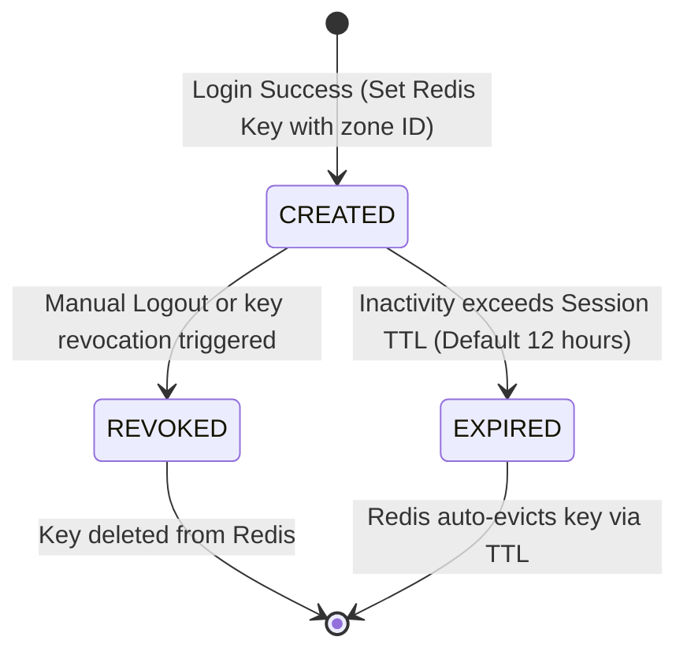

# SRE Admin Authentication - Login Workflow God View

> [!NOTE]
> Tài liệu này đóng vai trò là **Source of Truth (SoT) / God View** cho duy nhất luồng Đăng Nhập (Login Workflow) của SRE Admin.
> Tất cả mã nguồn thực thi luồng đăng nhập phải tuân thủ nghiêm ngặt theo đặc tả trong tài liệu này.

---

## 🗺️ 1. Giới Thiệu

### 👥 Tài Liệu Này Dành Cho Ai?

Tài liệu này được biên soạn cho **USA (Ultimate System Administrator)** và SRE (Site Reliability Engineer) chịu trách nhiệm vận hành, giám sát, và bảo mật phân hệ Đăng nhập của Admin ở môi trường Cloud-Native & HA (High Availability).

### ❓ Luồng Admin Login là gì?

Đây là cơ chế xác thực đa yếu tố (MFA) kết hợp với ràng buộc thiết bị vật lý (Zero-Trust Device Binding) và cơ chế khởi tạo phiên kết hợp (Trinity Token Pattern) được phân vùng theo vùng địa lý (Zone-scoped Isolation) nhằm ngăn chặn tối đa các cuộc tấn công đánh cắp phiên (Session Hijacking) hoặc thay đổi quyền phân vùng trái phép (Zone Bypass) ngay tại thời điểm đăng nhập.

### 🎯 Quy Trình Này Thực Hiện Những Gì?

- **Xác thực đa yếu tố chặt chẽ**: SRE Admin đăng nhập bằng API Key, lựa chọn phương thức xác thực MFA là TOTP hoặc mã khôi phục sử dụng một lần (Recovery Code).
- **Ràng buộc thiết bị vật lý**: Trình duyệt sinh cặp khóa mật mã Ed25519 cục bộ và gửi Khóa công khai (`device_public_key`) lên để Controlplane đối chiếu hoặc cập nhật luân phiên khóa (Self-Healing Key Rotation).
- **Phân vùng phiên (Zone-scoped Redis Key)**: Phiên làm việc được lưu trữ tại Redis L2 Cache dưới cấu trúc có gắn suffix `:zoneID` (`admin_access_session:<accessKey>:<zoneID>`). Nếu hacker giả mạo chữ ký JWT để thay đổi trường `zone_id` trong claims, Redis L2 sẽ phát sinh **Cache Miss** và block yêu cầu ngay lập tức.

### 📍 Các Biên Công Nghệ Hoạt Động

1. **Frontend (Browser Client)**: `admin-ui/src/pages/auth/Login.tsx` (Thu thập thông tin, sinh khóa Ed25519, gửi request).
2. **Controlplane HTTP Gateway (Go)**: `controlplane/internal/iam/transport/http/handler/admin_auth_handler.go` (Phục vụ API endpoint `/admin/auth/login`).
3. **IAM Business Logic & Session Service**: `controlplane/internal/iam/service/admin_api_key_service.go` (Quản lý luồng login, kiểm tra MFA, ghi nhận session L2).
4. **Database (PostgreSQL)**: Các bảng `admin_device_bindings`, `admin_recovery_codes` trong schema `iam`.
5. **Session Store L2 (Redis Cluster)**: Khởi tạo dữ liệu phiên và quản lý khóa phân tán chống Race Condition.

---

### 📂 Mục Lục (Table of Contents)

- [1. Giới Thiệu & Mục Lục](#intro)
- [2. Sơ Đồ Hệ Thống & Ranh Giới Phase (Topology & Phase Boundaries)](#topology)
- [3. Chi Tiết Thực Thi Nghiệp Vụ & Ánh Xạ (Implementation Details)](#details)
- [4. State Machine Của Thiết Bị & Phiên Chạy (Device & Session State Machine)](#state-machine)
- [5. Xử Lý Concurrency & Race Condition (Concurrency Mitigation)](#race-condition)
- [6. Giám Sát Và Truy Vết - Grafana Runbook (Telemetry & Grafana Queries)](#telemetry)

---

## <a id="topology"></a>🏛️ 2. Sơ Đồ Hệ Thống & Ranh Giới Phase (Topology & Phase Boundaries)

### 🗺️ High-Level System Topology



---

### 🚧 Ranh Giới Và Ràng Buộc Nghiệp Vụ (System Boundaries & Constraints)

- **Ranh giới (Boundary)**: Từ giao diện người dùng Admin UI (Browser), truyền qua lớp biên mạng Envoy Proxy và Controlplane HTTP Gateway, đến tầng IAM Service xác thực và lưu trữ phiên, cuối cùng trả phản hồi thiết lập cookie về lại Browser.
- **Đầu vào (Inputs)**:
  - JSON payload: `admin_api_key` (API key thô), `mfa_method` (`totp` hoặc `recovery_code`), `mfa_code`, `device_public_key` (Base64), và `zone_code`.
  - Header: `X-Device-Hostname` / `X-Device-Name` (hostname hint) và `X-Client-Device-Id` (UUID định danh thiết bị thô từ cookie client).
- **Đầu ra (Outputs)**:
  - HTTP Status `200 OK` kèm theo 5 Cookies bảo mật cao thiết lập trên client (`admin_api_token`, `access_key`, `access_secret`, `zone_code`, `client_device_id`).
- **Ràng buộc & Giới hạn (Controls & Limits)**:
  - **API Key Match**: Khớp băm SHA256 trực tiếp của API Key thô.
  - **MFA Validation**:
    - TOTP: Validate skew=1, period=30s, đồng thời đánh dấu mã đã dùng vào Redis L2 trong 90 giây chống Replay.
    - Recovery Code: Lock distributed chống double-consume (NX PX 5s qua LUA Script) và cập nhật soft-delete code trong PostgreSQL.
  - **Self-Healing Key Rotation**: Nếu ClientDeviceID đã tồn tại nhưng gửi khóa công khai Ed25519 khác (do browser dọn dẹp IndexedDB), ghi đè (luân chuyển) khóa công khai mới trực tiếp vào dòng cũ bằng SQL `ON CONFLICT DO UPDATE` thay vì block đăng nhập.
  - **Zone-scoped Isolation**: Session key lưu Redis bắt buộc dạng `admin_access_session:<accessKey>:<zoneID>`. Bất kỳ sự thay đổi trái phép zoneID nào trong token JWT đều dẫn đến cache miss trên Redis L2.
  - **Secure Cookie**: Tất cả các cookies (trừ `zone_code`) bắt buộc có thuộc tính `Secure`, `HttpOnly`, `SameSite=Lax` và giới hạn Path `/admin`.
- **Mã nguồn thực thi (Code Callsites)**:
  - **Trang Login UI**: [Login.tsx](file:///home/phucle/Desktop/New/admin-ui/src/pages/auth/Login.tsx) $\rightarrow$ Hàm `onSubmit` (~L75-L137).
  - **HTTP Handler**: [admin_auth_handler.go](file:///home/phucle/Desktop/New/controlplane/internal/iam/transport/http/handler/admin_auth_handler.go) $\rightarrow$ Phương thức `Login` (~L53-L184).
  - **Service Authenticate**: [admin_api_key_service.go](file:///home/phucle/Desktop/New/controlplane/internal/iam/service/admin_api_key_service.go) $\rightarrow$ Hàm `AdminLogin` (~L512-L848).
  - **Repository Database**: [admin_api_key_repo.go](file:///home/phucle/Desktop/New/controlplane/internal/iam/repository/admin_api_key_repo.go) $\rightarrow$ Phương thức `UpsertAdminDeviceBinding` (~L457-L509) và `ConsumeRecoveryCode` (~L407-L455).

---

## <a id="details"></a>🔍 3. Chi Tiết Thực Thi Nghiệp Vụ & Ánh Xạ (Implementation Details)

### 🛡️ Middleware Chain & Context Injections (Controlplane)

📌 **Mã nguồn kiểm soát tại:** [app.go](file:///home/phucle/Desktop/New/controlplane/internal/app/app.go) & [route.go](file:///home/phucle/Desktop/New/controlplane/internal/iam/route.go)

Trước khi tiếp cận HTTP Handler `Login` của Admin, một request đăng nhập phải vượt qua chuỗi kiểm soát và tiêm ngữ cảnh (Context Injections) đa lớp:

#### 1. Global Middleware (Định nghĩa tại `controlplane/internal/app/app.go`)

| Middleware | Mục đích / Hành động | Ngữ cảnh được tiêm (Context Injections) |
| :--- | :--- | :--- |
| **`gin.Recovery()`** | Bắt toàn bộ panic runtime để tránh sập máy chủ, trả về `500 Internal Server Error`. | Không có |
| **`middleware.RequestID()`** | Trích xuất hoặc khởi tạo mã định danh duy nhất (Correlation ID) cho request. | **Gin Context**: `c.Set("request_id", reqID)` <br/> **HTTP Response Header**: `X-Request-ID: reqID` |
| **`middleware.OTelTraceContext()`** | Trích xuất Span Context từ headers (W3C `traceparent`) hoặc tạo mới trace ID phục vụ Distributed Tracing. | **Go Context (`context.Context`)**: `trace.ContextWithSpanContext` |
| **`middleware.OTelHTTPMetrics()`** | Thu thập tần suất request, latency và trạng thái response code đẩy lên Prometheus. | Không có |
| **`middleware.CookieOriginGuard()`** | Kiểm tra trường `Origin` của CORS request để bảo vệ cookie, ngăn chặn tấn công CSRF. | Không có |
| **`middleware.RateLimitPreAuth()`** | Giới hạn tần suất chung (Rate Limiting) dựa trên IP của client thô (KeyIP) trước khi xác thực. | Không có |
| **`middleware.AccessLog()`** | Ghi log toàn bộ request với thông tin: IP, Method, Path, HTTP Status, Latency, RequestID. | Không có |

#### 2. Route Middleware (Định nghĩa tại `controlplane/internal/iam/route.go`)

| Middleware | Mục đích / Hành động | Ngữ cảnh được tiêm (Context Injections) |
| :--- | :--- | :--- |
| **`middleware.AdminCIDR()`** | Kiểm tra IP Client so với whitelist CIDR quản trị cấu hình sẵn. Nếu không khớp $\rightarrow$ Block lập tức (403 Forbidden). | Không có |
| **`middleware.RateLimitPostAuth()`** | Giới hạn tần suất đăng nhập nâng cao theo Path và IP Client để chống brute-force tấn công API key. | Không có |

---

### 🔄 End-to-End Sequence

📌 **Kích hoạt từ:** [Login.tsx](file:///home/phucle/Desktop/New/admin-ui/src/pages/auth/Login.tsx) $\rightarrow$ [admin_auth_handler.go](file:///home/phucle/Desktop/New/controlplane/internal/iam/transport/http/handler/admin_auth_handler.go) $\rightarrow$ [admin_api_key_service.go](file:///home/phucle/Desktop/New/controlplane/internal/iam/service/admin_api_key_service.go) $\rightarrow$ [admin_api_key_repo.go](file:///home/phucle/Desktop/New/controlplane/internal/iam/repository/admin_api_key_repo.go)



---

### 📋 3.5 Đặc Tả Hợp Đồng (Contract, DTO, Entity, Header, Cookie & Database)

#### 1. DTO (Data Transfer Objects)

📌 **Mã nguồn định nghĩa tại:** [admin_auth_request.go](file:///home/phucle/Desktop/New/controlplane/internal/iam/transport/http/dto/req/admin_auth_request.go)

##### Request DTO: `iamReq.AdminLoginRequest`
```go
type AdminLoginRequest struct {
	AdminAPIKey     string `json:"admin_api_key" binding:"required,min=16"`
	MFAMethod       string `json:"mfa_method" binding:"required,oneof=totp recovery_code"`
	MFACode         string `json:"mfa_code" binding:"required,min=6"`
	DevicePublicKey string `json:"device_public_key" binding:"required,min=16"`
	ZoneCode        string `json:"zone_code" binding:"required,min=3"`
}
```

##### Response DTO: `apires.RespondSuccess` (JSON)
*   HTTP Status: `200 OK`
*   Payload: `{"message": "Admin login successful", "data": null}`

---

#### 2. Domain Entities

📌 **Mã nguồn định nghĩa tại:** [admin.go](file:///home/phucle/Desktop/New/controlplane/internal/iam/domain/entity/admin.go)

##### Input Entity: `iamEntity.AdminLoginRequest`
```go
type AdminLoginRequest struct {
	RawAPIKey       string
	MFAMethod       MFAType // totp | recovery_code
	MFACode         string
	DevicePublicKey string
	DeviceName      string
	ClientDeviceID  uuid.UUID
	ZoneCode        string
}
```

##### Output Entity: `iamEntity.AdminLoginResult`
```go
type AdminLoginResult struct {
	AdminAPIToken            string    // JWT Token (Mảnh 1)
	AccessKey                string    // UUIDv7 Access Key (Mảnh 2)
	AccessSecret             string    // 64-byte plaintext Access Secret (Mảnh 3)
	ClientDeviceID           uuid.UUID // UUID định danh thiết bị
	ClientDeviceIDProvenance string    // "client" hoặc "server-bootstrap"
	ExpiresAt                time.Time // Thời điểm hết hạn phiên
}
```

---

#### 3. Headers & Cookies

##### Đọc từ Client Request (Headers & Cookies):
*   **Header `X-Device-Hostname` / `X-Device-Name`**: Dùng để lấy tên máy tính của SRE Admin (Device Name).
*   **Header `X-Client-Device-Id`** hoặc **Cookie `client_device_id`**: Định danh thiết bị thô gửi từ client.
*   **Cookie `zone_code`** (trong middleware): Đọc thông tin phân vùng hiện tại.

##### Thiết lập ở Server Response (Cookies Set-Cookie):
Tất cả các cookies (ngoại trừ `zone_code`) đều được thiết lập với các cờ bảo mật: `HttpOnly = true`, `Secure = true` (nếu HTTPS/Proxy), `SameSite = Lax`, và giới hạn truy cập tại đường dẫn `Path = "/admin"`.

| Tên Cookie | Giá Trị Lưu Trữ | Thời Gian Hết Hạn (Expires) |
| :--- | :--- | :--- |
| `admin_api_token` | JWT Token (`AdminAPIToken`) | Theo thời hạn Session TTL (ví dụ: 12h) |
| `access_key` | UUIDv7 Key (`AccessKey`) | Theo thời hạn Session TTL (ví dụ: 12h) |
| `access_secret` | Plaintext Secret (`AccessSecret`) | Theo thời hạn Session TTL (ví dụ: 12h) |
| `zone_code` | Tên Code vùng (ví dụ: `"global"`, `"vn-hn-1"`) | Theo thời hạn Session TTL (ví dụ: 12h) |
| `client_device_id` | UUID thiết bị (`ClientDeviceID`) | 365 ngày (Dài hạn cho Device Binding) |

---

#### 4. Cấu Trúc Bảng Database (PostgreSQL Schemas)

📌 **Mã nguồn tương tác tại:** [admin_api_key_repo.go](file:///home/phucle/Desktop/New/controlplane/internal/iam/repository/admin_api_key_repo.go)

##### A. Bảng `iam.admin_devices` (Lưu trữ và binding thiết bị vật lý Ed25519)
```sql
CREATE TABLE iam.admin_devices (
    id UUID PRIMARY KEY,
    device_name VARCHAR(255) NOT NULL,
    device_type VARCHAR(50),
    os_name VARCHAR(50),
    browser_name VARCHAR(50),
    public_key TEXT NOT NULL,
    public_key_fingerprint VARCHAR(64) UNIQUE NOT NULL,
    quarantined_at TIMESTAMPTZ,
    revoked_at TIMESTAMPTZ,
    last_seen_ip VARCHAR(45),
    last_seen_user_agent TEXT,
    last_seen_at TIMESTAMPTZ,
    created_at TIMESTAMPTZ NOT NULL,
    updated_at TIMESTAMPTZ NOT NULL
);
```

##### B. Bảng `iam.admin_recovery_codes` (Mã khôi phục MFA khẩn cấp một lần)
```sql
CREATE TABLE iam.admin_recovery_codes (
    id UUID PRIMARY KEY,
    code_hash VARCHAR(64) UNIQUE NOT NULL, -- SHA256 Hash của mã khôi phục thô
    used_at TIMESTAMPTZ,                   -- NULL nghĩa là CHƯA TIÊU THỤ, có mốc giờ nghĩa là ĐÃ TIÊU THỤ
    created_at TIMESTAMPTZ NOT NULL
);
```

##### C. Bảng `iam.admin_api_keys` (Danh sách API Keys hợp lệ)
```sql
CREATE TABLE iam.admin_api_keys (
    id UUID PRIMARY KEY,
    key_hash VARCHAR(64) UNIQUE NOT NULL, -- SHA256 Hash của API Key thô
    created_by VARCHAR(255) NOT NULL,
    created_at TIMESTAMPTZ NOT NULL,
    expires_at TIMESTAMPTZ NOT NULL
);
```

##### D. Bảng `iam.admin_2fa_settings` (Cấu hình khóa bí mật TOTP Admin)
```sql
CREATE TABLE iam.admin_2fa_settings (
    id UUID PRIMARY KEY,                  -- Thường là uuid.Nil
    secret_ciphertext TEXT NOT NULL,       -- Khóa bí mật TOTP được mã hóa AES-256 qua MasterKey
    created_at TIMESTAMPTZ NOT NULL,
    updated_at TIMESTAMPTZ NOT NULL
);
```

---

## <a id="state-machine"></a>📊 4. State Machine Của Thiết Bị & Phiên Chạy (Device & Session State Machine)

### ⚙️ Trạng Thái Ràng Buộc Thiết Bị (Device Binding State Machine)



### ⚙️ Trạng Thái Phiên Chạy Admin (Admin Session State Machine)



---

## <a id="race-condition"></a>⚡ 5. Xử Lý Concurrency & Race Condition (Concurrency Mitigation)

Để bảo đảm tính bền vững của dữ liệu và an toàn bảo mật ở môi trường Cloud Native & HA, hệ thống áp dụng các chốt chặn concurrency sau:

### 1. Luồng Tiêu Thụ Mã Khôi Phục (Recovery Code Double-Consume Attack)

- **Rủi ro**: Admin bấm đăng nhập nhiều lần liên tục hoặc hacker gửi hai yêu cầu đồng thời dùng chung một mã khôi phục để vượt qua kiểm tra trước khi DB cập nhật trạng thái đã dùng (`consumed_at`).
- **Giải pháp**:
  - Sử dụng **Distributed Lock ngắn hạn** trên Redis L2 thông qua LUA script trước khi gọi xuống Repository.
  - Lua script đảm bảo chỉ có duy nhất một yêu cầu đăng ký chiếm giữ khóa `iam:admin_recovery_consume_lock:<code_hash>` thành công (NX, PX 5000ms).
  - Tầng Repository PostgreSQL sử dụng câu lệnh UPDATE có điều kiện cứng để đánh dấu và vô hiệu hóa mã:
    `UPDATE admin_recovery_codes SET consumed_at = $1 WHERE code_hash = $2 AND consumed_at IS NULL`.
    Nếu bản ghi đã có `consumed_at`, lệnh trả về `0 rows affected` $\rightarrow$ ErrRecoveryCodeInvalid.

### 2. Chống Tấn Công Replay TOTP (TOTP Replay Attack Prevention)

- **Rủi ro**: Hacker sniff hoặc chặn mã TOTP vừa gửi và gửi lại nhanh chóng trước khi chu kỳ 30 giây tiếp theo bắt đầu.
- **Giải pháp**:
  - Sử dụng Redis L2 để thiết lập key khóa tạm thời: `iam:admin_totp_consumed:<code_hash>`.
  - Sử dụng phương thức `SetNX` với TTL 90 giây. Nếu key đã tồn tại, chặn ngay yêu cầu đăng nhập thứ hai.

### 3. Tự Phục Hồi Khi Mất Khóa Thiết Bị (Self-Healing Overwrite)

- **Rủi ro**: Thiết bị của Admin bị dọn dẹp bộ nhớ (Private mode, cleared IndexedDB) làm mất Private/Public Key mật mã Ed25519, nhưng Cookies `ClientDeviceID` HttpOnly vẫn còn. Nếu kiểm tra cứng nhắc so khớp khóa, Admin sẽ bị treo vĩnh viễn (Lockout) không thể đăng nhập lại.
- **Giải pháp**:
  - Do đăng nhập bắt buộc phải đi qua xác thực API Key và TOTP (hai yếu tố độ tin cậy cao), nếu hai yếu tố trên đúng, danh tính Admin đã được xác minh.
  - Hệ thống cho phép cập nhật đè (Rotate) khóa công khai mới trực tiếp vào dòng của `ClientDeviceID` hiện có bằng mệnh đề SQL:
    `ON CONFLICT (id) DO UPDATE SET public_key = EXCLUDED.public_key, public_key_fingerprint = EXCLUDED.public_key_fingerprint`.
    Điều này giải quyết triệt để lockout mà không sinh thêm rác thiết bị trong DB.

---

## <a id="telemetry"></a>📊 6. Giám Sát Và Truy Vết - Grafana Runbook (Telemetry & Grafana Queries)

Để đảm bảo tính bền vững và khả năng tự phục hồi của mặt phẳng quản trị trong môi trường High-Availability (HA) Cloud Native, toàn bộ các cuộc gọi đến downstream (Database và Redis Cache) đều được đo đạc kỹ lưỡng.

### 1. Prometheus Metrics Đặc Tả Đo Đạc Downstream

#### A. Đo Đạc Tầng Cơ Sở Dữ Liệu (PostgreSQL Downstream)
*   **`go_db_queries_total{db_instance="iam", table="admin_devices" | "admin_recovery_codes" | "admin_api_keys", operation="select" | "insert" | "update"}`**: Tổng số truy vấn SQL gửi xuống database phân theo bảng và loại thao tác.
*   **`go_db_query_duration_seconds_bucket{db_instance="iam", table="..."}`**: Histogram đo độ trễ (latency RTT) của các truy vấn SQL xuống PostgreSQL.
*   **`go_db_errors_total{db_instance="iam", table="...", error_code="unique_violation" | "connection_timeout" | "foreign_key_violation"}`**: Tổng số lỗi phát sinh từ database downstream.

#### B. Đo Đạc Tầng Bộ Nhớ Đệm (Redis L2 Downstream)
*   **`redis_commands_total{cache_instance="l2", command="set" | "setnx" | "evalsha" | "get"}`**: Tổng số lệnh Redis được gọi.
*   **`redis_command_duration_seconds_bucket{cache_instance="l2", command="..."}`**: Histogram đo độ trễ RTT của các lệnh Redis downstream (đặc biệt quan trọng với LUA locks và SetNX replay).
*   **`redis_command_errors_total{cache_instance="l2", command="..."}`**: Tổng số lỗi kết nối hoặc thực thi lệnh trên Redis Cluster.

---

### 2. Thư Viện Truy Vấn PromQL Giám Sát Sức Khỏe Downstream

#### 📈 Đo tỷ lệ lỗi (Error Rate) của Database Downstream (bảng `admin_devices` & `admin_recovery_codes`)
```promql
sum(rate(go_db_errors_total{db_instance="iam"}[5m])) 
/ 
sum(rate(go_db_queries_total{db_instance="iam"}[5m])) * 100
```
*   *Mức cảnh báo (Warning)*: $> 1\%$ trong 2 phút liên tiếp.
*   *Mức nghiêm trọng (Critical)*: $> 5\%$ trong 1 phút liên tiếp (nguy cơ mất kết nối PostgreSQL DB).

#### 📈 Độ trễ P99 của truy vấn Database Upsert Device Binding
```promql
histogram_quantile(0.99, sum(rate(go_db_query_duration_seconds_bucket{db_instance="iam", table="admin_devices", operation="insert"}[5m])) by (le))
```
*   *Ngưỡng tối ưu (SLA)*: $< 50\text{ms}$ ở môi trường HA.

#### 📈 Độ trễ P99 của lệnh Redis LUA Lock (`evalsha` chống double-consume)
```promql
histogram_quantile(0.99, sum(rate(redis_command_duration_seconds_bucket{cache_instance="l2", command="evalsha"}[5m])) by (le))
```
*   *Ngưỡng tối ưu (SLA)*: $< 10\text{ms}$.

#### 📈 Tỷ lệ lỗi (Error Rate) kết nối Redis L2 Cluster
```promql
sum(rate(redis_command_errors_total{cache_instance="l2"}[5m])) 
/ 
sum(rate(redis_commands_total{cache_instance="l2"}[5m])) * 100
```
*   *Mức nghiêm trọng (Critical)*: $> 2\%$ trong 1 phút (Redis Cluster failover hoặc network partition).

---

### 3. Truy Vấn Logs Phát Hiện Lỗi & Cảnh Báo Giao Dịch (VictoriaLogs - LogsQL)

Do hệ thống sử dụng VictoriaLogs làm kho lưu trữ log hiệu năng cao thay vì Grafana Loki, cú pháp truy vấn tuân thủ **LogsQL**:

```logsql
# Tìm kiếm log cảnh báo đăng nhập thất bại do thông tin API Key hoặc MFA không hợp lệ
_stream:{app="controlplane"} AND "admin login" AND ("unauthorized" OR "invalid" OR "incorrect")

# Phát hiện lỗi kết nối PostgreSQL Database trong lúc thực hiện Upsert Device hoặc Validate Key
_stream:{app="controlplane"} AND "database" AND ("connection refused" OR "timeout" OR "deadlock")

# Phát hiện lỗi Redis Cache không khả dụng trong hot path (Replay check / Session write)
_stream:{app="controlplane"} AND "redis" AND ("connection refused" OR "redis: nil" OR "cluster down")
```

---

### 4. Truy Vết Phân Tán (Distributed Tracing via VictoriaTraces / Jaeger)

Toàn bộ các Span trong vòng đời request đăng nhập được liên kết chặt chẽ thông qua OpenTelemetry (OTel).

#### A. Cấu Trúc Cây Span (Span Tree Hierarchy)
```
POST /admin/auth/login [Root Span - Gin OTel Middleware]
 ├── Check Active API Key [Child Span - Service]
 ├── Verify MFA (TOTP / Recovery Code) [Child Span - Service]
 │    └── evalsha / setnx [Sub-Child Span - Redis Client]
 ├── Resolve Zone Code [Child Span - L1 Cache]
 ├── Upsert Admin Device [Child Span - Repository]
 │    └── db.QueryRow (PostgreSQL) [Sub-Child Span - pgx driver]
 └── Set Redis Session [Child Span - Cache Engine]
      └── set {admin_access_session:...}:data [Sub-Child Span - Redis Client]
```

#### B. Phục Hồi & Liên Kết Trực Quan (Logs-to-Traces Correlation)
1. **Trace context propagation**: Context trace được truyền qua header tiêu chuẩn W3C `traceparent` (ví dụ: `00-4bf92f3577b34da6a3ce929d0e0e4736-00f067aa0ba902b7-01`).
2. **Derived Fields (VictoriaLogs -> Jaeger)**:
   - Các dòng logs ghi nhận từ `controlplane` bắt buộc serialize kèm trường `trace_id`.
   - VictoriaLogs tự động nhận dạng mã băm 32 ký tự qua regex:
     `matcherRegex: "(?:trace_id|traceID|traceId|trace)[=:\s\"]+([a-fA-F0-9]{32})"`
   - Trên giao diện Grafana, người dùng có thể nhấp chuột trực tiếp vào TraceID trên log để mở Gantt chart của trace tương ứng trên Jaeger UI nhằm xác định nguyên nhân nghẽn/lỗi downstream.
