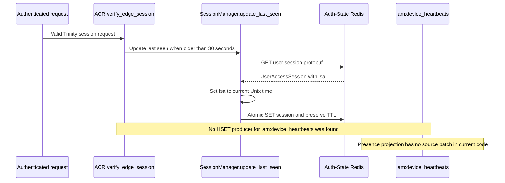
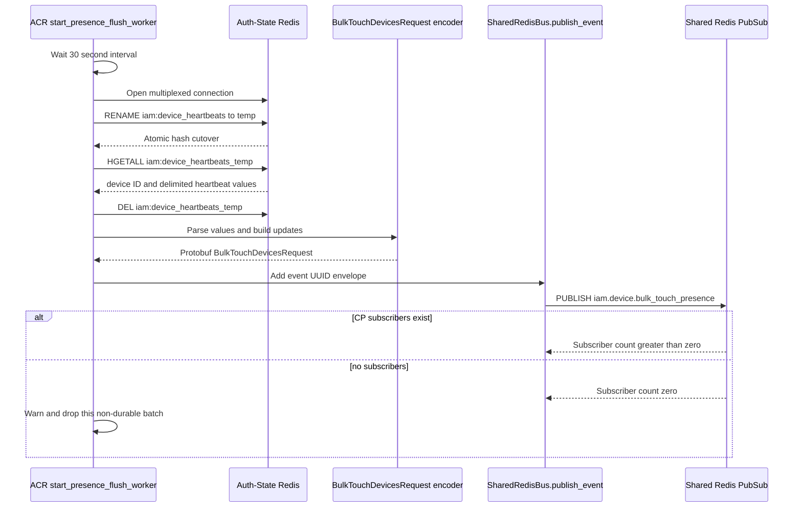
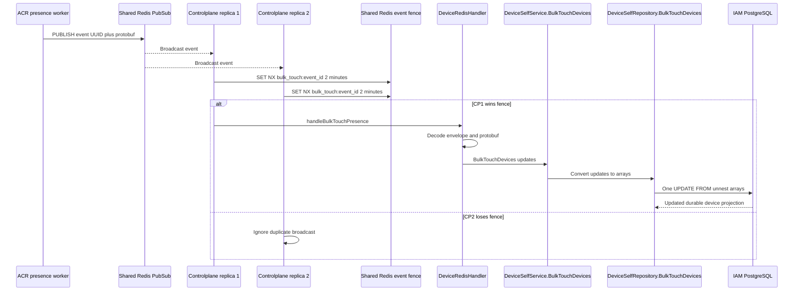
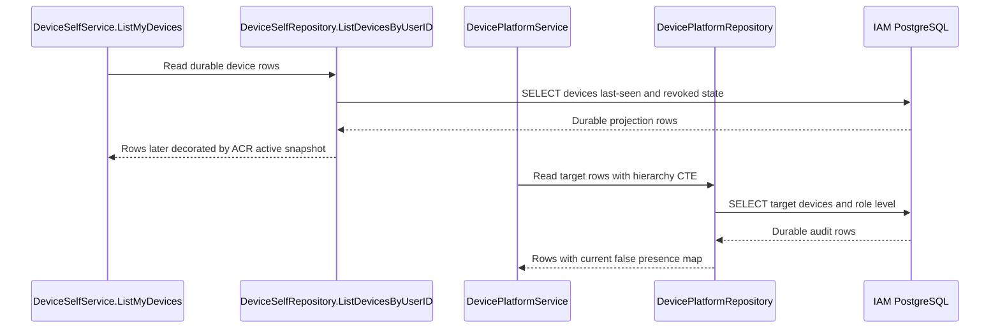

# Device Presence Projection — God View

This document describes the runtime-to-durable presence projection for device
management. It is not a public HTTP API. ACR owns short-lived session activity
in Auth-State Redis; Controlplane owns the durable `last_seen_*` projection in
IAM PostgreSQL. The projection is advisory and is never an authorization input.

## Workflow-scope contract

| Property | Contract |
|---|---|
| Trigger | ACR runtime activity and the periodic presence flush worker |
| Source state | ACR Auth-State Redis session records and the heartbeat staging hash |
| Transport | Shared Redis Pub/Sub event `iam.device.bulk_touch_presence` |
| Consumer | Controlplane `DeviceRedisHandler` |
| Durable sink | `DeviceSelfService.BulkTouchDevices` → IAM PostgreSQL |
| Fan-out behavior | Every CP replica receives Pub/Sub, then a two-minute event-ID `SET NX` fence selects one writer |
| Cadence | ACR worker interval is 30 seconds after its first interval tick |
| Delivery | At-most-once at Pub/Sub boundary; no durable replay if the event is missed |
| Authorization use | None. Presence cannot grant access or approve revoke. |
| Current status | The flush worker exists, but no `HSET iam:device_heartbeats` producer was found in the ACR source. The projection is therefore dormant unless another component writes that exact key. |

## Data contracts

### Auth-State session record

| Key | Value |
|---|---|
| `iam:user_session:{zone}:{tenant}:{user}:{access_key}` | Protobuf `UserAccessSession` |
| `UserAccessSession.tdid` | Canonical client device ID |
| `UserAccessSession.lsa` | Unix last-seen timestamp |
| `iam:user_access_index:{user_id}` | Set of full session keys |
| `iam:device_access_index:{client_device_id}` | Reverse set of session keys |

### Heartbeat staging and event

| Field | Contract |
|---|---|
| `iam:device_heartbeats` | Redis hash `device_id → last_seen_at|ip|user_agent` |
| `iam:device_heartbeats_temp` | Atomic rename target while the worker drains a batch |
| `BulkTouchDevicesRequest.updates[]` | `device_id`, Unix `last_seen_at`, `last_seen_ip`, `last_seen_user_agent` |
| Event envelope | 16 raw event UUID bytes followed by protobuf bytes |
| Event channel | `iam.device.bulk_touch_presence` |

## Phase 1 — ACR session activity and heartbeat staging

### Actual session activity path

For each authenticated request, `verify_edge_session` can call
`SessionManager.update_last_seen`. The method is throttled to one write per 30
seconds per session. It reads the existing protobuf, updates `lsa`, preserves
the current Redis TTL, and atomically writes the record back. This path does
not write `iam:device_heartbeats`.

### Intended heartbeat staging path

The presence flush worker expects some ACR activity path to execute an `HSET`:

```text
HSET iam:device_heartbeats <client_device_id> <unix_ts>|<ip>|<user_agent>
```

The current ACR tree contains the reader/flush worker but no writer for this
key. This is a concrete implementation discrepancy. Until a producer is added,
the 30-second worker sees a missing key and publishes no event; PostgreSQL
`last_seen_*` values will not be updated by this projection.



### Security boundary

The staging value must be generated from verified ACR session metadata. A
browser-provided device ID, IP, or user agent must not be accepted as a direct
heartbeat command. The worker must not log access secrets or full session keys.

## Phase 2 — ACR flush worker to Shared Redis Pub/Sub

When the staging hash exists, `start_presence_flush_worker` performs a bounded
batch handoff:

1. ACR waits for its 30-second interval. The first `interval.tick()` is
   intentionally consumed before entering the loop.
2. It opens a multiplexed Auth-State Redis connection. Connection failure logs
   and skips this cycle; no partial event is published.
3. It executes `RENAME iam:device_heartbeats iam:device_heartbeats_temp`. RENAME
   is the batch cutover: writers after the rename would target a fresh source.
4. It reads the full temporary hash with `HGETALL`, then deletes the temporary
   key. Each value is split into at most three parts. Invalid timestamps become
   zero and missing IP/user-agent fields become empty strings under the current
   parser.
5. It encodes `BulkTouchDevicesRequest` with one update per hash entry.
6. `SharedRedisBus.publish_event` creates a fresh event UUID, prefixes the 16
   UUID bytes, and publishes the protobuf to the Shared Redis channel.
7. A zero subscriber count is logged as a warning. Pub/Sub has no durable
   buffer, so a cycle with no CP subscriber is lost and must be regenerated by a
   later heartbeat.



## Phase 3 — Controlplane event consumer and PostgreSQL projection

Each Controlplane replica subscribes to the same Pub/Sub channel. The handler
uses an event ID fence so the broadcast does not produce one database write per
replica.

1. `DeviceRedisHandler.Start` subscribes to
   `iam.device.bulk_touch_presence` and allocates up to 64 concurrent dispatch
   slots. If all slots are occupied, a replica skips the message rather than
   blocking its Pub/Sub reader.
2. `handleBulkTouchPresence` gives the operation a ten-second timeout and
   validates that the payload is longer than the 16-byte UUID envelope.
3. It parses a non-nil UUID and performs
   `SET NX iam:device:dispatch:bulk_touch:{event_id}` with a two-minute TTL.
   A failed or already-held fence means this replica does no database work.
4. It unmarshals `BulkTouchDevicesRequest`. Malformed protobuf or an empty update
   list is logged/ignored. The current handler does not have a durable dead
   letter queue for malformed Pub/Sub events.
5. It maps each protobuf update into `DevicePresenceUpdate` and calls
   `DeviceSelfService.BulkTouchDevices`.
6. `DeviceSelfRepository.BulkTouchDevices` constructs four arrays and executes
   one PostgreSQL `UPDATE ... FROM unnest(...)`. A row matches either its
   numeric `id::text` through the client-device lookup or its
   `client_device_id` directly.
7. The repository writes `last_seen_at`, nullable IP, user agent, and
   `updated_at`. There is no user-owner field in the event; therefore the
   repository must only accept IDs emitted by trusted ACR and should be
   monitored for unknown-ID updates.



## Phase 4 — Read-side consumption

The self-device list reads PostgreSQL first and then asks ACR directly for an
active-session snapshot through a separate request/reply Pub/Sub workflow. The
presence projection described here is therefore a durable history update, not
the source of the self-list `is_online` flag. Platform audit currently uses
neither source for live presence.

| Consumer | Source of online state |
|---|---|
| Self device list | ACR `get_active_sessions` reply, soft decoration |
| Platform user audit | Current service map is empty, so `is_online=false` |
| Device revoke/logout | Never uses presence for authorization |



## Failure and recovery semantics

| Failure | Current behavior |
|---|---|
| Auth Redis connection failure | Skip flush cycle; existing hash remains unless the failure occurs after rename |
| Missing heartbeat hash | Skip cycle; no Shared Redis event |
| HGETALL/DEL failure after rename | Log and skip; inspect temp-key retention before retry policy is changed |
| Protobuf encode failure | Log and drop current batch |
| No CP Pub/Sub subscribers | Warn and drop event; Pub/Sub has no replay |
| CP event fence collision | Duplicate consumer does no work |
| CP protobuf decode failure | Log and drop event, no durable retry |
| PostgreSQL bulk update failure | Log and return; Pub/Sub event is already consumed and is not replayed |

The current transport is at-most-once for the projection. If durable presence
delivery is required, this boundary needs a stream/outbox or a replayable source;
that is an architecture change, not something this God View silently assumes.

## Key and contract inventory

| Key/record | Store | Purpose |
|---|---|---|
| `iam:user_session:{zone}:{tenant}:{user}:{access_key}` | Auth-State Redis | Runtime session and throttled `lsa` |
| `iam:device_heartbeats` | Auth-State Redis hash | Expected heartbeat staging source |
| `iam:device_heartbeats_temp` | Auth-State Redis hash | Rename-and-drain batch |
| `iam.device.bulk_touch_presence` | Shared Redis PubSub | Presence event channel |
| `iam:device:dispatch:bulk_touch:{event_id}` | Shared Redis | Two-minute CP single-writer fence |
| `BulkTouchDevicesRequest` | Protobuf | Batch wire contract |
| `iam.devices.last_seen_at` | IAM PostgreSQL | Durable projection |

## Code map

| Boundary | Source |
|---|---|
| Session last-seen update | `acr/src/user/session.rs` |
| Session verifier caller | `acr/src/user/verify.rs` |
| Flush worker | `acr/src/user/device.rs` |
| Shared event envelope | `acr/src/infra/shared_redis.rs` |
| CP Pub/Sub consumer | `controlplane/internal/iam/transport/pubsub/handler/device.go` |
| Service | `controlplane/internal/iam/service/device_self_service.go` |
| Bulk update repository | `controlplane/internal/iam/repository/device_self_repo.go` |

## Open contract decision

Before treating this workflow as production-complete, the implementation must
choose one explicit owner for writing `iam:device_heartbeats`, or remove the
dormant worker and rely solely on the active-session query. The current code
contains both concepts but only the session-record writer is wired.
