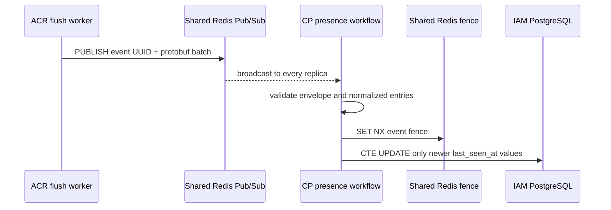

# Device Presence Projection — God View

ACR owns runtime heartbeat staging. Controlplane owns the advisory durable
device-presence projection. Presence never grants authorization and is separate
from the durable device session-capacity eviction workflow.

## Contract

| Property | Value |
|---|---|
| Source | ACR Auth Redis heartbeat staging hash |
| Transport | Shared Redis Pub/Sub `iam.device.bulk_touch_presence` |
| Delivery | Best-effort / at-most-once |
| Consumer | `DevicePresenceProjectionRedisHandler` |
| Durable sink | IAM PostgreSQL device `last_seen_*` columns |
| Fan-out fence | `SET NX iam:device:dispatch:presence:{event_id}` for two minutes |
| Authorization use | Never |
| Canonical protobuf | `proto/iam/device_presence/v1/device_presence.proto` |

## Payload boundary

ACR sends a 16-byte event UUID envelope followed by protobuf
`BulkTouchDevicesRequest`. Before calling its service, Controlplane transport
validates:

- envelope and client device IDs are non-nil UUIDs;
- payload is at most 256 KiB and a batch contains at most 1,024 entries;
- timestamps are positive, at most five minutes in the future and no older
  than 366 days;
- non-empty IP addresses parse as IPs;
- user agents are valid UTF-8 and at most 1,024 bytes.

Invalid entries are dropped individually. If no valid updates remain, the whole
best-effort batch is ignored.

## Projection rule

The repository uses one CTE. It normalizes duplicate device IDs to their newest
timestamp and updates a row only when the incoming timestamp is not older than
the durable `last_seen_at`. Reordered Pub/Sub messages therefore cannot regress
presence history.

`SelfDeviceService.ApplyDevicePresenceProjection` records one workflow
observation under `iam.device.presence.apply`. It returns the repository error
unchanged to `DevicePresenceProjectionRedisHandler`; the handler logs the real
cause and keeps the existing best-effort, at-most-once settlement rule. A
database failure is therefore observable but the Pub/Sub batch is not retried.

Overloaded local dispatch slots can intentionally drop a presence batch; that
loss is observable and acceptable because a future ACR heartbeat refreshes the
advisory projection.

## Code map

| Owner | Source |
|---|---|
| ACR batch producer | `acr/src/user/device.rs` |
| CP Pub/Sub transport | `controlplane/internal/iam/transport/pubsub/handler/self_device_handler.go` |
| CP service | `controlplane/internal/iam/service/self_device_service.go` |
| CP CTE repository | `controlplane/internal/iam/repository/self_device_repo.go` |
