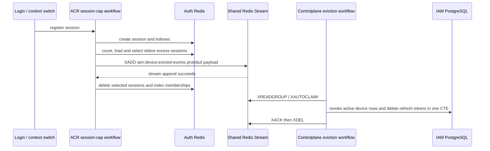

# Device Session Capacity Eviction — God View

ACR owns the runtime session-cap decision. Controlplane owns the durable IAM
device and refresh-token projection. The workflow has no HTTP endpoint of its
own; login and context-switch issuance call it after a new Auth Redis session
has been registered.

## Contract

| Property | Value |
|---|---|
| Trigger | ACR `SessionManager.register_session` after creating a runtime session |
| Capacity | 50 sessions per `iam:user_access_index:{user_id}` |
| Selection | Oldest `UserAccessSession.lsa` first |
| Runtime authority | Auth Redis session records and indexes |
| Transport | Direct Shared Redis Stream `iam:device:evicted-events` |
| Consumer group | `controlplane-device-eviction-v1` |
| Durable effect | IAM device `revoked_at` and device-bound refresh-token deletion |
| Delivery | At-least-once; Controlplane CTE is idempotent |
| Local ACR outbox | None |
| Canonical protobuf | `proto/iam/device_presence/v1/device_presence.proto` |

## State and payload

| Boundary | State / payload |
|---|---|
| Auth Redis | `iam:user_session:{zone}:{tenant}:{user}:{access_key}` stores `UserAccessSession` |
| Auth Redis | `iam:user_access_index:{user_id}` indexes session keys |
| Auth Redis | `iam:device_access_index:{client_device_id}` indexes session keys by device |
| Shared Redis | Stream field `payload` contains protobuf `EvictedDevicesNotification` |
| Payload fields | Verified `user_id` and canonical `client_device_ids` from session records |
| IAM PostgreSQL | `devices` and `refresh_tokens` |

There is deliberately no `iam:device:eviction-outbox`, relay consumer group, or
relay lock in ACR. The Shared Stream is the only durable cross-service handoff.

## Write sequence

ACR appends before source cleanup. Auth Redis and Shared Redis are distinct
durable boundaries, so no cross-store atomic transaction is claimed. If XADD
fails, ACR aborts the destructive cleanup. If a process fails after XADD, a
retry can produce a duplicate event; the Controlplane CTE only changes devices
whose `revoked_at IS NULL`, so duplicate delivery has no extra durable effect.

## Controlplane consumer rules

1. Every replica generates its own Redis Stream consumer ID.
2. It reads fresh entries with `XREADGROUP ... >` and reclaims stale pending
   entries with `XAUTOCLAIM` after 30 seconds.
3. Transport rejects malformed protobuf, oversized payloads, invalid UUIDs and
   invalid/oversized device batches as poison events.
4. A dependency or PostgreSQL failure leaves the entry pending for retry.
5. A successful CTE is acknowledged first; failed `XDEL` is observable
   retention debt but cannot re-run the durable state transition.

## Code map

| Owner | Source |
|---|---|
| ACR producer and source cleanup | `acr/src/user/session.rs` |
| Shared Stream adapter | `acr/src/infra/shared_redis.rs` |
| CP stream transport | `controlplane/internal/iam/transport/pubsub/handler/device_session_capacity_eviction.go` |
| CP service | `controlplane/internal/iam/service/device_session_capacity_eviction_service.go` |
| CP CTE repository | `controlplane/internal/iam/repository/device_session_capacity_eviction_repo.go` |
