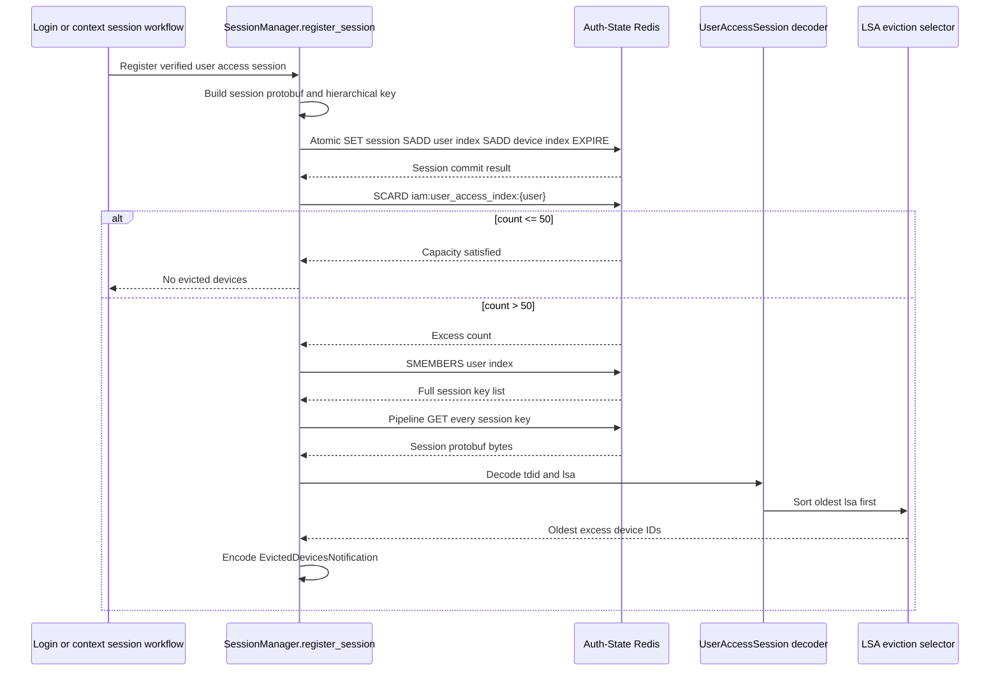
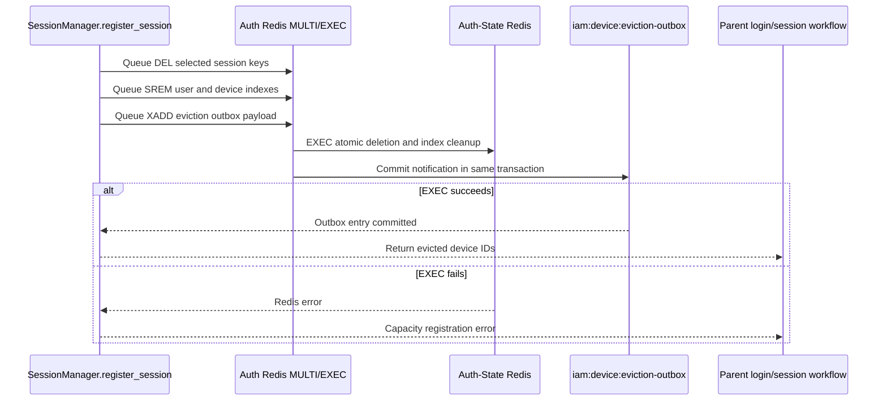
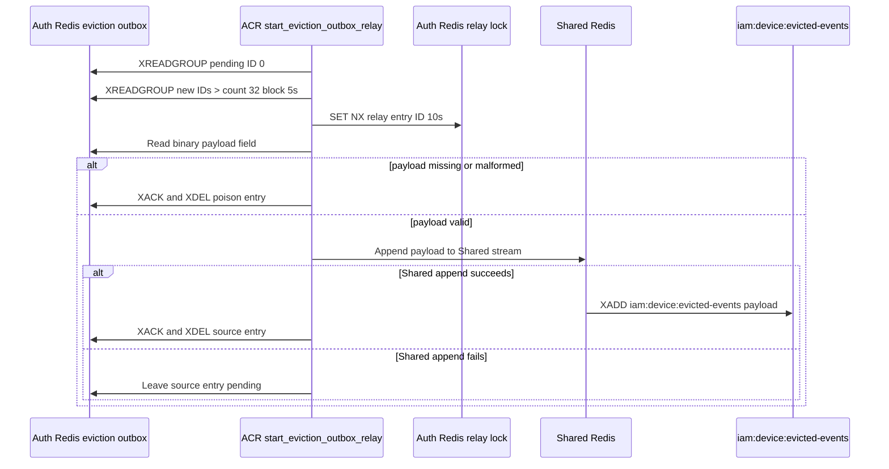
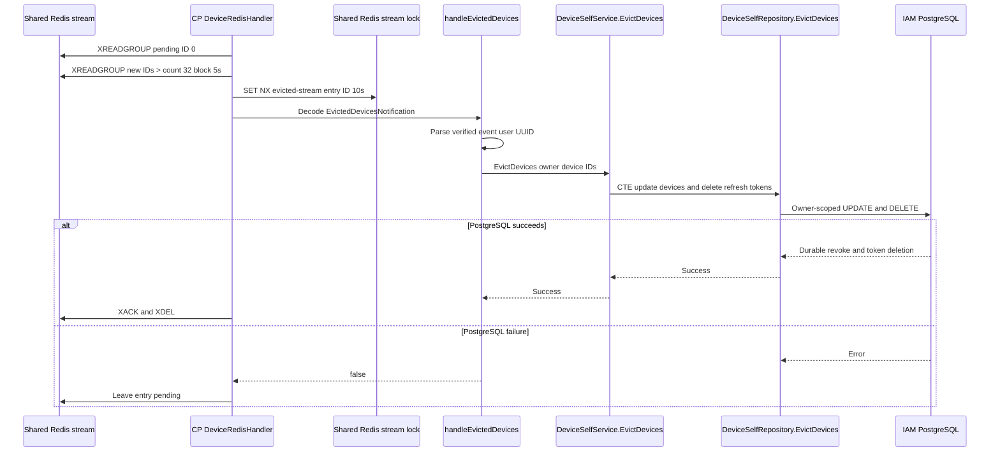

# Device Session Capacity Eviction — God View

This document is the end-to-end Source of Truth for ACR enforcing the per-user
runtime session/device cap. It starts when ACR successfully registers a new
session and ends when Controlplane marks the evicted device rows revoked and
deletes their durable refresh credentials.

There is no standalone HTTP route for this workflow. Login and context/session
issuance workflows call `SessionManager.register_session`; this document owns
only the capacity transition and its downstream cleanup. Device creation
metadata remains documented in the login God Views.

## Workflow-scope contract

| Property | Contract |
|---|---|
| Trigger | ACR `SessionManager.register_session` after a successful session issuance |
| Capacity | `USER_DEVICE_CAP = 50` session records in `iam:user_access_index:{user_id}` |
| Eviction order | Oldest `UserAccessSession.lsa` first |
| Runtime source of truth | Auth-State Redis |
| Durable bridge | Auth Redis `iam:device:eviction-outbox` then Shared Redis `iam:device:evicted-events` |
| Durable business sink | IAM PostgreSQL devices and refresh tokens |
| Delivery | Atomic local eviction plus outbox, then at-least-once relay and CP consumer |
| User interaction | No direct response body beyond the parent login/session workflow |
| Security | Only ACR can create the eviction notification from verified session records |

## State and wire contracts

### Auth-State Redis session state

| Key | Operation |
|---|---|
| `iam:user_session:{zone}:{tenant}:{user}:{access_key}` | Stores `UserAccessSession` protobuf with `tdid` and `lsa` |
| `iam:user_access_index:{user_id}` | Set of full session keys for cap counting and cleanup |
| `iam:device_access_index:{client_device_id}` | Set of full session keys for a device |
| Session TTL | Configured session TTL; user/device indexes expire at three times the session TTL |

### Eviction notification

| Field | Contract |
|---|---|
| Protobuf | `EvictedDevicesNotification` |
| `user_id` | Verified user UUID string |
| `client_device_ids` | Canonical device IDs selected as oldest excess sessions |
| Auth outbox | `iam:device:eviction-outbox`, field `payload` |
| Shared stream | `iam:device:evicted-events`, field `payload` |

## Phase 1 — ACR registers session and computes excess

This phase runs inside ACR after the parent login/context-switch flow has
validated credentials and obtained an access key, device ID, and proof key.

1. `register_session` builds the session key and a `UserAccessSession` protobuf
   containing the SHA-256 access-secret hash, tracked device ID, current Unix
   `lsa`, and client proof public key.
2. One atomic Redis pipeline writes the session, sets its TTL, adds the full
   session key to the user index and device index, and sets index TTLs.
3. ACR reads `SCARD iam:user_access_index:{user_id}`. A Redis error fails the
   parent session registration; it must not be treated as zero and must not
   bypass the capacity limit.
4. At or below 50, the function returns an empty eviction list and the parent
   workflow continues.
5. Above 50, ACR reads all user-index members and GETs each session in one
   pipeline. Missing or malformed records are errors because silently treating
   them as old sessions could evict the wrong device.
6. ACR decodes each `UserAccessSession`, sorts by ascending `lsa`, and selects
   `session_count - 50` oldest records. Multiple sessions may map to one device;
   the notification carries the selected device IDs as returned by the session
   records.
7. ACR encodes `EvictedDevicesNotification` before any deletion. Encode failure
   aborts the capacity transition and leaves the inserted session state for the
   parent error/recovery path.

## Phase 2 — Atomic Auth Redis eviction and outbox commit

The critical boundary is one Redis `MULTI/EXEC` pipeline. Session deletion and
the notification append must commit together so a process crash cannot delete
runtime sessions without leaving a durable handoff for Controlplane.

1. For every selected `(session_key, device_id)`, ACR queues `DEL session_key`,
   `SREM iam:user_access_index:{user_id} session_key`, and
   `SREM iam:device_access_index:{device_id} session_key`.
2. The pipeline queues `XADD iam:device:eviction-outbox * payload <protobuf>`.
3. `MULTI/EXEC` commits all deletions and the outbox entry atomically.
4. If the transaction fails, ACR returns a Redis error to the parent workflow.
   It does not claim that the cap was enforced and does not emit a partial
   notification.
5. The parent login/context workflow decides whether it can surface the error;
   this device workflow does not fabricate an HTTP response.

## Phase 3 — ACR Auth outbox relay to Shared Redis

`start_eviction_outbox_relay` is a long-lived ACR worker. It bridges the local
Auth Redis outbox into the Central Shared Redis stream used by Controlplane.

1. ACR creates consumer group `acr-device-eviction-relay-v1` on
   `iam:device:eviction-outbox` with start ID `0`.
2. It reads pending entries first and then fresh entries with `COUNT 32` and a
   five-second block. A shared consumer identity allows another replica to
   continue pending work after a crash.
3. It obtains `SET NX PX 10000` at
   `iam:device:dispatch:eviction-outbox:{entry_id}`. A lock miss waits briefly
   and does not duplicate the append.
4. Missing payload is poison. ACR logs it and ACKs/deletes the local entry so a
   malformed producer cannot block the relay group.
5. A valid payload is appended to Shared Redis stream
   `iam:device:evicted-events`.
6. ACR ACKs and XDELs the Auth outbox entry only after the Shared append
   succeeds. If Shared Redis is unavailable, the Auth entry remains pending.

## Phase 4 — Controlplane durable eviction projection

Controlplane consumes the Shared stream and repairs durable PostgreSQL state for
the runtime-evicted devices.

1. `DeviceRedisHandler.Start` creates group
   `controlplane-device-eviction-v1` on `iam:device:evicted-events`.
2. The worker reads pending ID `0` before fresh `>` entries, in batches of 32
   with a five-second block. A ten-second stream-ID lock prevents duplicate DB
   work across CP replicas using the same consumer identity.
3. Missing payload is poison and is ACKed plus deleted. A malformed protobuf is
   also treated as poison by `handleEvictedDevices` and returns success to the
   stream loop.
4. The handler parses `user_id`. Invalid UUID is logged and ACKed because the
   event cannot be safely retried without a valid owner.
5. A valid event calls `DeviceSelfService.EvictDevices` with the owner UUID and
   canonical IDs.
6. `DeviceSelfRepository.EvictDevices` executes one CTE: update matching,
   owner-scoped `client_device_id` rows to `revoked_at=now()`, then delete
   refresh tokens for updated rows.
7. If PostgreSQL fails, `handleEvictedDevices` returns false and the stream entry
   remains pending for retry. On success, CP issues `XACK` and `XDEL`.

## Failure, retry, and invariants

- The local Auth Redis transaction is the first durable handoff. A process crash
  after `EXEC` cannot lose the eviction notification.
- Auth outbox-to-Shared relay is at-least-once. Repeated append may produce
  duplicate Shared entries, but CP's short stream lock and idempotent SQL make
  repeated revocation safe.
- A transient Shared Redis or PostgreSQL failure leaves the source stream entry
  pending. Pending-first reads provide takeover after replica failure.
- A malformed payload is a producer contract bug, not a transient dependency
  error; it is ACKed/deleted to avoid poisoning the consumer group.
- The runtime session has already been deleted from Auth-State Redis before CP
  receives the event. The CP write closes durable device/refresh state later.
- The workflow does not promise exactly-once delivery or an immediate parent
  login response reflecting durable revocation.
- If `SCARD`/`SMEMBERS`/session decode fails, ACR fails closed rather than
  silently bypassing the 50-device cap.
- Device IDs and user IDs in notifications are generated from verified session
  records. A client cannot publish this stream directly through an HTTP route.

## Capacity and observability checks

| Signal | Expected invariant |
|---|---|
| `SCARD iam:user_access_index:{user}` | Never remains above 50 after a successful `register_session` transaction |
| Auth outbox pending age | Must be monitored; growth indicates Shared Redis relay failure |
| Shared eviction stream pending age | Must be monitored; growth indicates CP/PostgreSQL failure |
| Revoked device without CP row | Temporary split-brain only; reconciler/alert should detect prolonged age |
| Duplicate event IDs | Safe but should be observable through dispatch-lock misses |

## Code map

| Boundary | Source |
|---|---|
| Session registration and cap | `acr/src/user/session.rs` |
| Auth outbox relay | `acr/src/user/device.rs` |
| Shared stream constants/worker | `acr/src/transport/redis.rs` |
| CP Shared stream consumer | `controlplane/internal/iam/transport/pubsub/handler/device.go` |
| CP service | `controlplane/internal/iam/service/device_self_service.go` |
| Durable CTE | `controlplane/internal/iam/repository/device_self_repo.go` |
| Parent login/context workflows | `god_view/iam/username_login_god_view_workflow.md`, `god_view/iam/user_post_login_session_god_view_workflow.md` |
