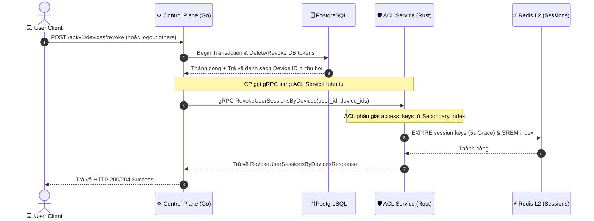

# Workflow God View: Device Session Revocation

## 📌 1. Tổng Quan Kiến Trúc (Architecture & Cloud-Native HA)

Nhằm đảm bảo an toàn bảo mật trong môi trường Cloud-Native và High Availability (HA), khi người dùng thực hiện thu hồi một thiết bị (qua `RevokeMyDevice`, `LogoutOtherDevices` hoặc tự động evict dung lượng thiết bị `EvictExcessDevicesIfNeeded`):

1. **Control Plane (Go)** cập nhật cơ sở dữ liệu bền vững (PostgreSQL) để xóa/vô hiệu hóa bản ghi thiết bị và Refresh Token.
2. **Control Plane (Go)** thực hiện cuộc gọi gRPC `RevokeUserSessionsByDevices` sang **ACL Service (Rust)**.
3. **ACL Service (Rust)** giải phóng/hạ TTL của các session L2 Redis liên quan đến thiết bị đó xuống còn 5 giây (Grace Period) và dọn dẹp các chỉ mục phụ (Secondary Index).

---

## ⚙️ 2. Trạng Thái Session Trong Redis L2

| Redis Key | Kiểu dữ liệu | Định dạng Value (Protobuf) | TTL (Thời gian sống) |
| :--- | :--- | :--- | :--- |
| `iam:user_access_session:<user_id>:<access_key>` | Protobuf Binary | `UserAccessSession { ash, tdid, lsa }` | `session_ttl_secs` (Mặc định: 30 phút) |
| `iam:user_access_index:<user_id>` | Set | `[access_key]` (Danh sách access keys của user) | `session_ttl_secs * 3` |
| `iam:device_access_index:<device_id>` | Set | `[access_key]` (Danh sách access keys của thiết bị) | `session_ttl_secs * 3` |

---

## 🔄 3. Chi Tiết Luồng Thực Thi (Sequence Diagram)

---

## 🛡️ 4. Phòng Chống Race Conditions & An Toàn Bảo Mật

1. **Thứ tự thực hiện (Strict Ordering)**:
   - Luôn cập nhật PostgreSQL (SSOT) thành công trước khi gọi gRPC sang ACL.
   - Không gọi gRPC bên trong DB transaction để tránh giữ khóa kết nối quá lâu.
2. **Grace Period (Thời gian ân hạn 5 giây)**:
   - Không xóa trực tiếp bằng lệnh `DEL` đối với active session mà chỉ giảm TTL về 5 giây.
   - Giúp tránh lỗi `401 Unauthorized` đột ngột cho các request song song đang được xử lý trên đường truyền.
3. **Secondary Indexing**:
   - Sử dụng `iam:device_access_index:<device_id>` chứa danh sách các `access_key` của thiết bị đó.
   - Giảm độ phức tạp từ $O(M)$ (phải quét và deserialize toàn bộ session của User) xuống còn $O(1)$ (chỉ lấy trực tiếp access key từ index của thiết bị cần xóa).
