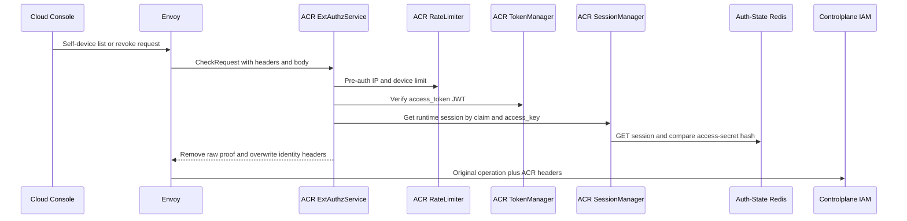
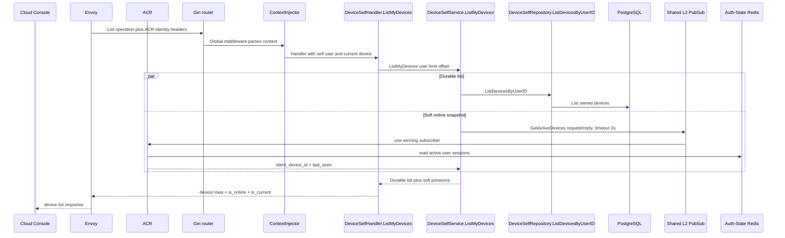
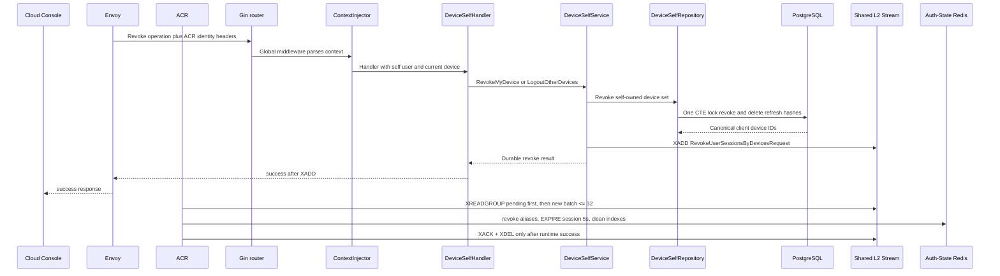

# Device Session Revocation — God View (Master SoT)

> Tài liệu này là Source of Truth cho self-device list/revocation và runtime session cleanup.
> PostgreSQL là durable owner của device/refresh state; Auth-State Redis là runtime session
> state; Shared L2 Redis Stream là bounded durable bridge nội vùng Central.

## API scope and edge-routing contract

All three routes are `/me` self-device APIs. ACR keeps `:path` unchanged, does
not set `x-original-path`, and never rewrites to `/personal` or `/tenant`.
`x-user-id` is the sole device owner and `x-client-device-id` is only the
current-device reference. Controlplane does not run permission/role-level
`Authorize`; repository ownership guards remain mandatory.

| Phase | Owner | Output |
|---|---|---|
| 1. ACR admits self-device request | Cloud Console → Envoy/ACR | Trusted self user and current-device context reach Controlplane |
| 2. Controlplane lists devices | Controlplane → PostgreSQL → ACR presence RPC | Durable owned list with best-effort online projection |
| 3. Controlplane revokes and ACR cleans runtime | Controlplane → PostgreSQL → Shared Redis Stream → ACR | Durable device/refresh revoke then at-least-once runtime cleanup |

## Phase 1 — ACR admits self-device request

| Method/path | Identity source | Kết quả |
|---|---|---|
| `GET /api/v1/me/iam/device/read` | User + current `client_device_id` từ ACR headers | Owned device list, `is_current`, best-effort online state |
| `POST /api/v1/me/iam/device/delete/:device_id` | Target path UUID + trusted current device | Idempotent revoke một non-current device |
| `POST /api/v1/me/iam/device/delete-others` | Trusted current device | Revoke mọi device khác |

Cloud Console không tự tạo owner/user/current-device claim. `is_current` là presentation field
do Controlplane so `DevicePresence.ID` (canonical `client_device_id`) với trusted
`X-Client-Device-ID`; authorization vẫn được repository enforce lại.

### Client → Envoy → ACR processing and forward

| Boundary | What it receives or does |
|---|---|
| Client → Envoy | Device list or revoke method/path, target UUID when applicable, body and browser cookies. Client identity/proof headers are untrusted. |
| Envoy → ACR | ExtAuthz `CheckRequest` with method, path, bounded body, headers and edge address. |
| ACR local | Applies CORS/rate limit and verifies JWT, key/secret and Auth-State session. Invalid session returns local denial. |
| ACR → Controlplane | Preserves the operation/path/body, removes raw proof headers, and overwrites `x-user-id`, `x-user-name`, `x-user-level`, `x-tenant-id`, `x-zone-id`, `x-client-device-id`, optional `x-workspace-id`, and `x-session-proof-verified=false`. |

`x-user-id` is the only owner input. `x-client-device-id` is only the current
device reference; the repository reauthorizes every requested target.

## Durable và runtime state

| State | Store | Durability |
|---|---|---|
| Device row, `revoked_at`, refresh-token hash | Controlplane PostgreSQL | Durable business SoT |
| `iam:user_session:{zone}:{tenant}:{user}:{access_key}` | Auth-State Redis DB0 | Runtime session |
| `iam:user_access_index:{user_id}` | Auth-State Redis DB0 Set | Rebuildable session index |
| `iam:device_access_index:{client_device_id}` | Auth-State Redis DB0 Set | Rebuildable device index |
| `iam:device:revoke-requests` | Shared L2 Redis Stream | Bounded durable Central command bridge |

Shared Redis Stream phải bật persistence/replica và eviction policy không xóa pending entries.
Nó không thay PostgreSQL business SoT.

## Phase 2 — Controlplane lists owned devices

Gin global middleware parses the ACR `x-user-id` and `x-client-device-id`.
`DeviceSelfHandler.ListMyDevices` applies its five-second budget, obtains both
values from Gin context and calls `DeviceSelfService.ListMyDevices`. The service
runs `DeviceSelfRepository.ListDevicesByUserID` and the bounded
`iam.device.get_active_sessions` ACR RPC in parallel; PostgreSQL failure fails
the request, while the presence RPC failure becomes `is_online=false`.

Auth-State Redis/PubSub lỗi không làm durable list fail: `is_online=false` là soft-state fallback.
PostgreSQL lỗi làm whole request fail. Online snapshot không được dùng để authorize revoke.

## Phase 3 — Controlplane revokes device and ACR cleans runtime

Gin global middleware yields trusted self/current-device context.
`DeviceSelfHandler.RevokeMyDevice` or `LogoutOtherDevices` validates path input
then calls the matching `DeviceSelfService` workflow. The service calls one
`DeviceSelfRepository` CTE transaction to revoke device rows/delete refresh
hashes, then writes `RevokeUserSessionsByDevicesRequest` to the Redis Stream.
An `XADD` failure after commit returns an error; retry is desired-state safe.

Single-device repository compares target and current by the canonical
`COALESCE(client_device_id, id::text)` value, never by primary key `devices.id` alone. This
keeps older rows with a missing client identifier revocable while new rows still use the
trusted `client_device_id`. Logout-others excludes `COALESCE(client_device_id, id::text)` equal to the trusted
current client ID. Both repository workflows are one CTE statement: row lock, device revoke và
refresh-token delete share a transaction boundary.

## 5. Ordering, retry và failure semantics

1. PostgreSQL revoke commits before `XADD`; runtime session may remain briefly, nhưng refresh
   credential và durable device đã bị thu hồi.
2. Nếu `XADD` lỗi sau DB commit, HTTP trả lỗi. Repository desired-state idempotent và trả lại
   target IDs kể cả đã revoked, nên client retry có thể enqueue lại runtime command an toàn.
3. ACR consumer group đọc pending trước new entries. Shared consumer identity cho replica takeover;
   short `SET NX` lock chặn duplicate Auth Redis work.
4. Auth Redis lỗi không ACK Stream entry. Replica sống khác retry; duplicate EXPIRE/SREM/DEL an toàn.
5. Payload thiếu/hỏng là poison message: log taxonomy rồi ACK+DEL để không chặn toàn partition.
   Không log session secret hoặc access key.
6. Session key được hạ TTL còn 5 giây để request đang inflight có grace period; device/user indexes
   bị dọn sau alias revoke.
7. Không tuyên bố exactly-once. Boundary là PostgreSQL durable + Shared Redis at-least-once runtime
   cleanup; reconciler/retention phải theo dõi pending age và stream length.

## 6. Scale-out và graceful shutdown

- Mỗi ACR replica có thể consume cùng group; pending entry được replica khác tiếp quản sau crash.
- Worker block tối đa 5 giây và không busy-poll khi pending rỗng.
- Batch tối đa 32 giới hạn work/round; Auth Redis error giữ pending thay vì ACK partial.
- Deployment shutdown phải cho worker task kết thúc trong termination grace; unacked entry vẫn
  tồn tại cho replica khác.

## 7. Code map

- HTTP: `controlplane/internal/iam/transport/http/handler/device_self_handler.go`
- Service: `controlplane/internal/iam/service/device_self_service.go`
- Repository: `controlplane/internal/iam/repository/device_self_repo.go`
- Shared Redis worker: `acr/src/transport/redis.rs`
- Auth Redis execution: `acr/src/user/revoke.rs`
- UI: `cloud-console/src/features/settings/devices-screen.tsx`
