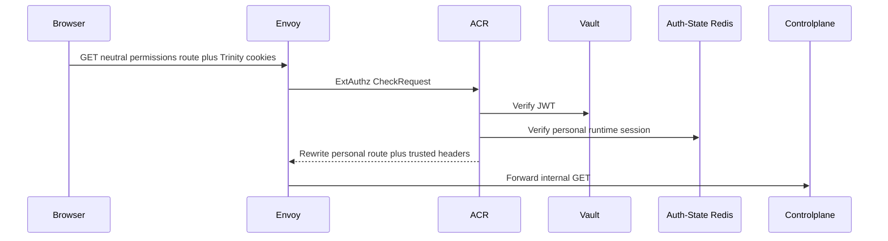
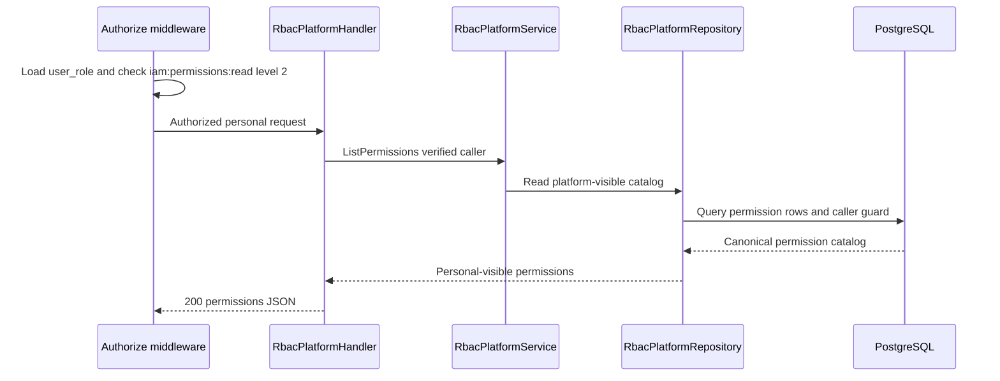

# Personal Permission Catalog List — God View

Workflow này trả permission catalog cho platform actor đang cấu hình personal
platform role. Đây là personal owner flow, không phải tenant branch hay `/me`.

## API scope and contract

| Part | Contract |
|---|---|
| Browser API | `GET /api/v1/iam/rbac/permissions` |
| Payload | None |
| ACR | With verified personal session, rewrite to `/api/v1/personal/iam/rbac/permissions`, overwrite `:path`, set `x-original-path`, inject trusted identity/context headers |
| Authorization | `Authorize("iam:permissions:read", L1Registry, "2")` loads `user_role`; repository rechecks durable caller guard |

Direct personal internal paths are denied. A concrete tenant session belongs to
a different tenant catalog workflow, never fallback authority.

## Phase 1 — Client → Envoy → ACR

## Phase 2 — Controlplane authorizes personal actor and reads catalog

| Result | Response |
|---|---|
| Authorized | `200 {"permissions":[...]}` |
| Missing personal permission/level | `403` |
| Dependency failure | `500` |

