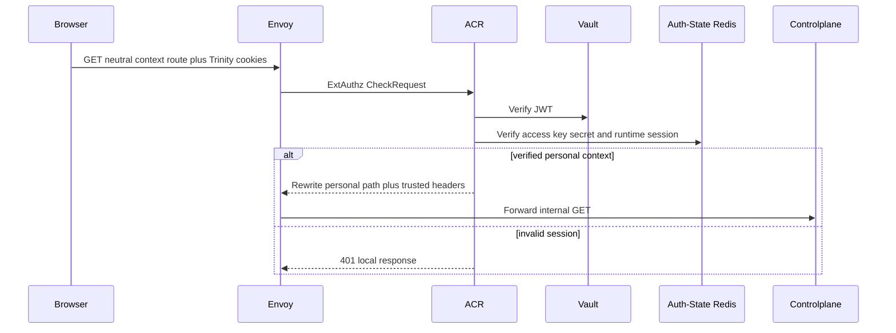
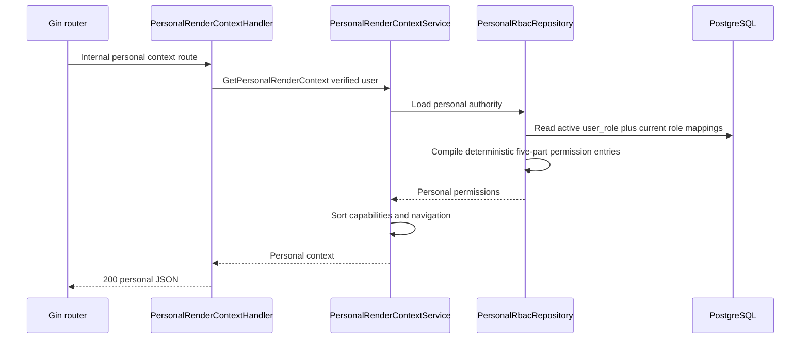

# Personal Render Context Read — God View

Workflow này trả personal composition root và capability presentation cho
platform-owned session. Đây không phải `/me`: browser gọi route neutral, ACR
chọn personal owner context rồi rewrite internal `/personal` route.

## API scope and contract

| Part | Contract |
|---|---|
| Browser request | `GET /api/v1/iam/context/read` |
| Input | Trinity cookies hoặc Bearer access token; browser không gửi trusted identity, role hay permission header |
| Payload | None |
| ACR output | `GET /api/v1/personal/iam/context/read`; overwrite `:path`, set `x-original-path`, inject `x-user-id`, `x-user-name`, `x-user-level`, `x-tenant-id=platform`, `x-zone-id`, `x-client-device-id` |
| Authorization | Personal `user_role` loads permission and required level, then repository rechecks active assignment |

Direct `/personal/**` browser paths are denied. A concrete tenant session is a
different tenant workflow, not a fallback result here.

The route intentionally does not add a second generic `middleware.Authorize`:
this workflow returns the caller's capability projection itself. The repository
still rechecks the active durable assignment and compiles its current role
mappings JIT; missing or stale authority fails closed.

## Phase 1 — Client → Envoy → ACR

## Phase 2 — Controlplane reads personal authority and compiles its projection JIT

| Result | Response |
|---|---|
| Success | `200 {"kind":"personal","navigation":[...],"capabilities":{...}}` |
| Missing/stale assignment | `403`; never tenant result |
| Cache/PostgreSQL failure | `503`; never empty-context success |

## Key contract

| Key / record | Purpose |
|---|---|
| L1 `user_role:{user_id}` | Sensitive in-process JIT-compiled personal `RoleEntry` |
| PostgreSQL `user_role` + role mappings | Durable personal authorization SoT |
