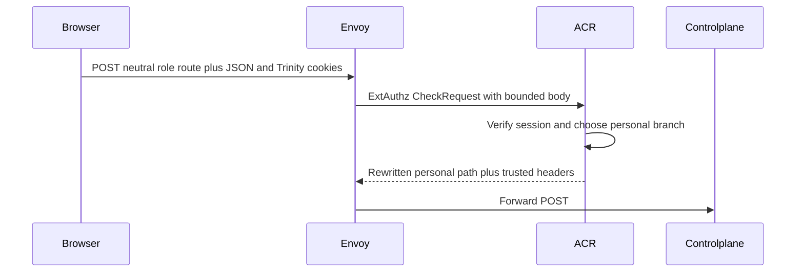
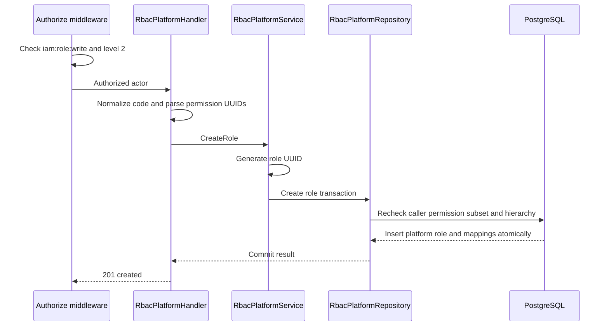

# Platform Role Create — God View

Workflow này tạo một platform role definition và permission mapping. Đây là
platform-owned mutation; valid workflow input cần verified personal context,
và direct internal path luôn bị ACR từ chối.

## API scope and contract

| Part | Contract |
|---|---|
| Browser API | `POST /api/v1/iam/rbac/role` |
| Payload | `code`, `name`, `description`, `role_level`, `scope`, `permission_ids` UUID list |
| ACR | Verify personal session, rewrite `/api/v1/personal/iam/rbac/role`, set `x-original-path`, inject trusted identity and level |
| Authorization | `Authorize("iam:role:write", L1Registry, "2")`; handler rejects a requested stronger level and repository rechecks caller permission subset before commit |

## Phase 1 — Client → Envoy → ACR

## Phase 2 — Controlplane authorizes and commits definition

| Result | Response |
|---|---|
| Created | `201` |
| Invalid JSON/code/permission UUID | `400` |
| Unauthorized permission subset or hierarchy | `403` |
| Database error | `500`; no partial mapping |
