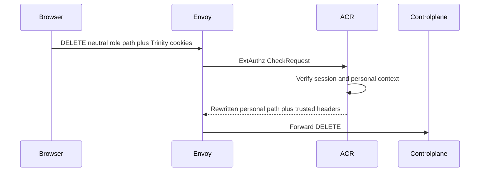
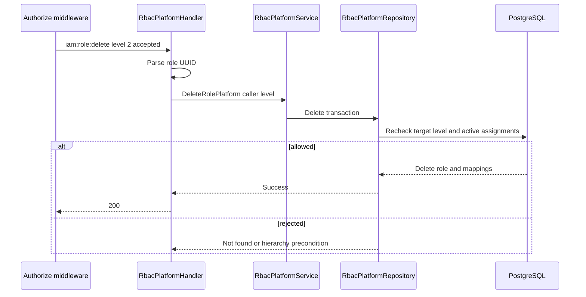

# Platform Role Delete — God View

Workflow này xóa một platform role definition only when caller hierarchy allows
it and the role has no active assignment that would make deletion unsafe.

## API scope and contract

| Part | Contract |
|---|---|
| Browser API | `DELETE /api/v1/iam/rbac/role/:role_id` |
| Payload | None |
| ACR | Verify personal session, rewrite `/api/v1/personal/iam/rbac/role/:role_id`, set `x-original-path`, inject trusted headers |
| Authorization | `Authorize("iam:role:delete", L1Registry, "2")`; repository rechecks target hierarchy and assignment precondition |

## Phase 1 — Client → Envoy → ACR

## Phase 2 — Controlplane authorizes and removes the role

| Result | Response |
|---|---|
| Deleted | `200` |
| Invalid UUID | `400` |
| Role absent | `404` |
| Stronger/equal role or role still assigned | `403` |
| Store failure | `500` |

